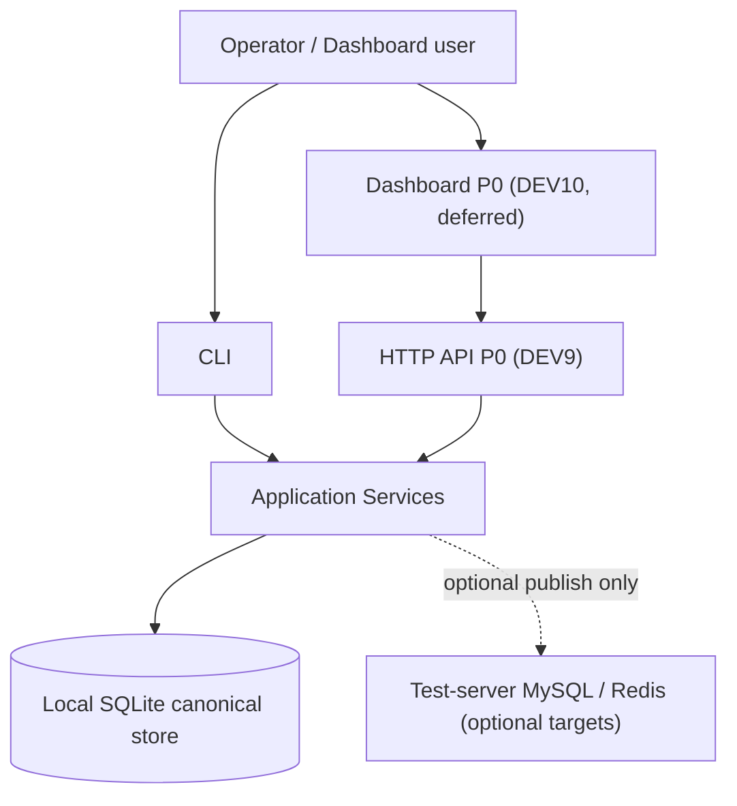
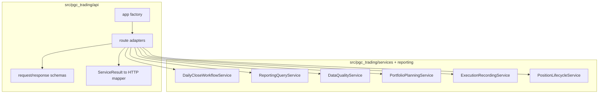

# DEV9 HTTP API P0 Boundary

Date: 2026-05-07

Status: ready for DEV9 implementation after dependency decision.

## Current State

- DEV2A through DEV8 are complete on branch `codex-cpb-v2-strategy-integration`.
- Final local gate passed before this boundary note: `unittest discover` 118 tests OK; `pytest` 118 passed and 8 subtests passed; `compileall` passed; secret scan had no matches.
- The repository has no `pyproject.toml`, `requirements.txt`, `setup.py`, or existing web framework dependency.
- Local imports show `fastapi`, `flask`, `starlette`, and `uvicorn` are not installed in the current Python environment.
- The existing application service layer is the source of business behavior. API routes must remain thin adapters.

## Architecture

## Decision

DEV9 should be split into three checkpoints:

1. `DEV9A API Technology ADR and app skeleton`
2. `DEV9B Read-only API endpoints`
3. `DEV9C Controlled write API endpoints`

Preferred framework is FastAPI because it gives typed request/response schemas and OpenAPI with less custom code. That choice requires an explicit dependency-management change first because the repo currently has no dependency file and the local runtime does not have FastAPI installed.

Alternatives considered:

- FastAPI: best OpenAPI and validation fit, but needs dependency management.
- Flask: simpler runtime, but no built-in OpenAPI and also not installed.
- Standard library HTTP server: no new dependency, but poor schema validation and weak contract documentation.

The first DEV9 implementation step should therefore be an ADR plus dependency decision, not business route work.

## P0 Endpoint Boundary

| Endpoint | Service boundary | Mutates local SQLite | P0 rule |
| --- | --- | --- | --- |
| `GET /api/health` | app/config only | no | Always available; no DB write. |
| `GET /api/daily-reviews/{as_of_date}` | `ReportingQueryService.get_daily_report` | no | Return JSON shape derived from `DailyReport`. |
| `GET /api/data-quality` | `DataQualityService.list_events` | no | Filters only; no resolving events in P0 read slice. |
| `GET /api/accounts/{account_id}/positions` | `PositionLifecycleService.list_positions` | no | Account id must be explicit. |
| `GET /api/trade-plans` | add read-only query method before route | no | Route must not query SQLite directly. |
| `POST /api/review-runs` | `DailyCloseWorkflowService.run_daily_close` | yes when not dry-run | Requires idempotency key and operator for non-dry writes. |
| `POST /api/trade-plans/{id}/publish` | `PortfolioPlanningService.publish_plan` | yes | Requires operator and account selector. |
| `POST /api/trade-plans/{id}/cancel` | `PortfolioPlanningService.cancel_plan` | yes | Include cancel reason; useful for Dashboard P0. |
| `POST /api/trades` | `ExecutionRecordingService.record_trade` or `record_position_sell` | yes | No direct order placement; records execution facts only. |
| `POST /api/exits/evaluate` | `PositionLifecycleService.evaluate_exits` | yes when not dry-run | Generates exit decisions and optional sell plans; never records sell execution. |

## Guardrails

- API routes must not import `sqlite3`, call `connect`, or write tables directly.
- Every API write request must create `RequestContext(source="api")`.
- Non-dry write requests must require `operator`; live-account writes must reject missing operator.
- Write endpoints should remain disabled by default until DEV9C, for example via `PGC_API_ENABLE_WRITES=1`.
- Tests must use temporary SQLite databases or fake services. They must not modify `data/pgc_trading.db`.
- API logs and responses must not include tokens, MySQL passwords, Redis passwords, broker credentials, or raw environment dumps.
- Dashboard remains deferred until DEV9B read endpoints and DEV9C write endpoint tests pass.

## DEV9 Acceptance Gate

- ADR records framework choice and dependency approach.
- API app can be imported and smoke tested locally.
- Read endpoints return stable JSON envelopes and never mutate SQLite.
- Write endpoints call only application services and preserve existing error codes.
- Account isolation is covered by API tests.
- Idempotency behavior is covered for write endpoints.
- Full suite, compile check, and secret scan pass.
- Branch has a remote configured before push, or push remains an explicit handoff blocker.
