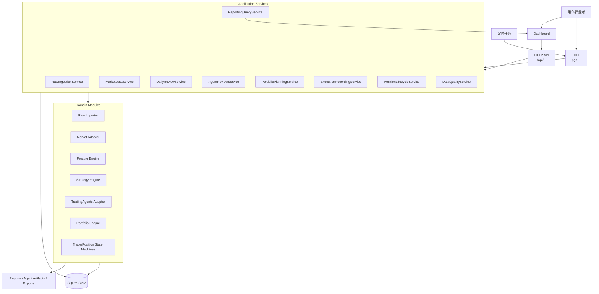
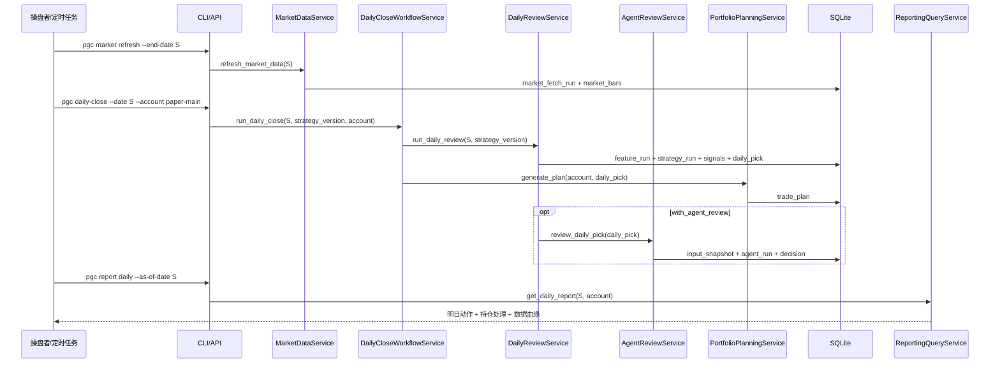
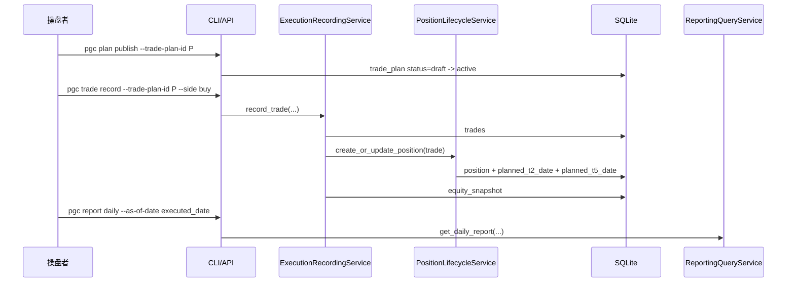
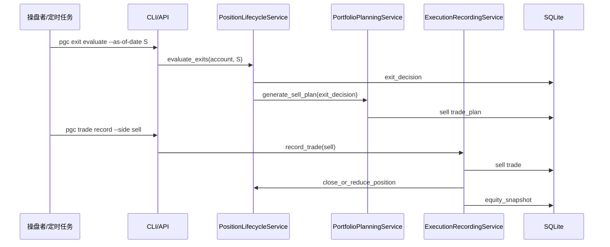

# PGC 系统 API 与 CLI 契约设计

日期：2026-05-03

## 1. 设计目标

API 和 CLI 的核心任务不是“多做几个命令”，而是把系统的操作入口固定下来，避免未来出现三套互相打架的逻辑：

1. 研究脚本一套逻辑；
2. 每日实盘复盘一套逻辑；
3. Dashboard 页面又一套逻辑。

本系统采用统一的 Application Service 契约：

- CLI 调用 Application Service；
- Web API 调用 Application Service；
- 定时任务调用 Application Service；
- Dashboard 只读查询 Application Service；
- 任何入口都不直接绕过领域规则写数据库。

核心原则：

- 所有写入操作必须返回 `run_id`、`created_ids`、`lineage`。
- 涉及账户的操作必须显式传 `account_id` 或 `account_key`。
- 涉及策略的操作必须显式传 `strategy_version`。
- 涉及日期的操作必须显式传 `as_of_date`、`review_date` 或 `executed_date`。
- 不允许用模糊的 `latest` 写入事实表；可以在查询层解析“最新”，但写入时必须落成具体日期和版本。
- CLI/API 只负责输入校验、调用服务、展示结果，不直接计算策略。

## 2. 总体架构



## 3. Application Service 边界

### RawIngestionService

职责：

- 导入 PGC 原始入池事件；
- 计算源文件 hash；
- 标记脏数据；
- 生成 `raw_import_batch`。

禁止：

- 计算未来收益；
- 写策略评分；
- 写交易计划。

### MarketDataService

职责：

- 按股票池和日期范围补齐 Tushare 行情；
- 写入 `market_fetch_runs`；
- 写入 `market_bars`、`daily_basic`、`adj_factor`、`trade_calendar`。

禁止：

- 根据策略需要临时改行情；
- 把缺失行情静默填成 0。

### DailyReviewService

职责：

- 按 `as_of_date` 运行特征、策略、每日唯一 pick；
- 生成 `feature_run`、`strategy_run`、`strategy_signals`、`daily_picks`；
- 输出候选解释和数据血缘。

禁止：

- 创建真实成交；
- 创建持仓；
- 把 Agent 意见写入 Signal。

### AgentReviewService

职责：

- 为 `daily_pick` 构造 `input_snapshot`；
- 调用 TradingAgents；
- 保存 `agent_run`、`agent_artifacts`、`agent_decision`。

禁止：

- 覆盖策略信号；
- 自动取消交易计划；
- 读取全库或敏感账户信息。

### PortfolioPlanningService

职责：

- 根据账户、持仓、每日 pick 生成交易计划；
- 判断是否有空闲仓位；
- 生成次日买入计划、T+2/T+5 卖出计划。

禁止：

- 把计划当作成交；
- 用回测价格替代实盘成交价；
- 让 Agent 输出直接改变计划，除非策略版本已声明 Agent filter。

### ExecutionRecordingService

职责：

- 录入人工或券商导入成交；
- 校验计划状态；
- 创建或更新持仓；
- 触发资金快照。

禁止：

- 没有成交就创建持仓；
- 覆盖旧成交记录；
- 对不同账户共用同一笔成交。

### PositionLifecycleService

职责：

- 计算 T+2/T+5 日期；
- 生成退出判断；
- 推进持仓状态；
- 生成卖出计划。

禁止：

- 用自然日代替交易日；
- 用策略回测收益替代真实持仓收益。

### ReportingQueryService

职责：

- 查询日报、交易计划、持仓、资金、Agent 复核；
- 组合多个只读视图；
- 输出 Markdown、JSON 或 Dashboard 数据。

禁止：

- 写事实表；
- 把查询结果作为后续事实源。

## 4. 通用请求与响应格式

### 请求通用字段

所有写操作都应该支持：

```json
{
  "request_id": "req_20260503_000001",
  "idempotency_key": "daily-review:paper-main:20260430:cpb_6157@2026-05-03",
  "dry_run": false,
  "operator": "azboo"
}
```

字段说明：

| 字段 | 必填 | 说明 |
| --- | --- | --- |
| `request_id` | 否 | 调用方生成的请求编号，便于日志追踪 |
| `idempotency_key` | 写操作建议必填 | 防止重复点击或重复定时任务写出两份计划 |
| `dry_run` | 否 | 只校验和预览，不落库 |
| `operator` | 实盘写操作必填 | 人工操作人或任务名 |

### 响应通用信封

```json
{
  "status": "success",
  "request_id": "req_20260503_000001",
  "run_id": 82,
  "data": {},
  "created_ids": {
    "strategy_run_id": 82,
    "daily_pick_id": 41,
    "trade_plan_id": 29
  },
  "warnings": [],
  "errors": [],
  "lineage": {
    "raw_import_batch_id": 7,
    "market_fetch_run_id": 15,
    "feature_run_id": 80,
    "strategy_run_id": 82,
    "account_id": 2
  }
}
```

`status` 枚举：

- `success`
- `partial_success`
- `skipped`
- `failed`
- `validation_failed`

## 5. 错误码

| 错误码 | 含义 | 处理方式 |
| --- | --- | --- |
| `VALIDATION_ERROR` | 参数格式不合法 | 修正输入 |
| `DATA_QUALITY_BLOCKED` | 数据质量阻断 | 先处理数据质量 |
| `MARKET_DATA_NOT_READY` | 行情未更新到复盘日 | 刷新行情 |
| `TRADE_CALENDAR_MISSING` | 缺少交易日历 | 刷新交易日历 |
| `STRATEGY_VERSION_NOT_FOUND` | 策略版本不存在 | 检查策略治理表 |
| `ACCOUNT_NOT_FOUND` | 账户不存在 | 创建或选择账户 |
| `ACCOUNT_TYPE_MISMATCH` | 账户类型不匹配 | 禁止混用 backtest/paper/live |
| `NO_FREE_POSITION_SLOT` | 仓位已满 | 生成跳过计划 |
| `PLAN_ALREADY_EXECUTED` | 计划已执行 | 禁止重复成交 |
| `PLAN_EXPIRED` | 计划已过期 | 生成过期事件或人工处理 |
| `POSITION_NOT_FOUND` | 持仓不存在 | 检查成交是否录入 |
| `AGENT_RUN_FAILED` | Agent 调用失败 | 保留确定性计划，提示人工复核 |
| `FUTURE_DATA_DETECTED` | 输入包含复盘日之后数据 | 阻断运行 |

## 6. CLI 命令设计

### 6.1 导入 PGC 原始事件

```bash
pgc raw import \
  --file data/pgc_raw_events.json \
  --source pgc_pool \
  --operator azboo
```

输出重点：

- `raw_import_batch_id`
- 导入条数；
- 有效条数；
- 脏数据条数；
- 被标记无效的股票清单。

对应服务：`RawIngestionService.import_raw_events`

### 6.2 刷新行情

```bash
pgc market refresh \
  --scope raw-events \
  --end-date 20260430 \
  --provider tushare
```

输出重点：

- `market_fetch_run_id`
- 股票数量；
- 行情覆盖区间；
- 缺失股票；
- 缺失交易日。

对应服务：`MarketDataService.refresh_market_data`

### 6.3 运行每日复盘

```bash
pgc daily-close --date 20260430 --db-path data/pgc_trading.db --account paper-main
```

输出重点：

- `workflow_status`
- `readiness`
- `feature_run_id`
- `strategy_run_id`
- 信号数量；
- `daily_pick_id`
- 是否生成交易计划；
- 是否被仓位约束跳过。

默认是 dry-run preview，不写入事实表。确认后显式 apply：

```bash
pgc daily-close --date 20260430 --db-path data/pgc_trading.db --account paper-main --apply --operator azboo
```

对应服务：`DailyCloseWorkflowService.run_daily_close`

### 6.4 运行 Agent 复核

```bash
pgc agent review \
  --daily-pick-id 41 \
  --agent-system tradingagents \
  --mode local_snapshot_mode
```

输出重点：

- `input_snapshot_id`
- `agent_run_id`
- `agent_decision_id`
- `action`
- `risk_level`
- artifact 路径。

对应服务：`AgentReviewService.review_daily_pick`

### 6.5 生成或发布交易计划

```bash
pgc plan generate \
  --review-date 20260430 \
  --planned-date 20260506 \
  --strategy-run-id 82 \
  --account paper-main
```

```bash
pgc plan publish \
  --trade-plan-id 29 \
  --operator azboo
```

输出重点：

- `trade_plan_id`
- `action`
- `status`
- `reason`
- 账户空闲仓位。

对应服务：`PortfolioPlanningService.generate_plan`、`PortfolioPlanningService.publish_plan`

### 6.6 录入买入成交

```bash
pgc trade record \
  --trade-plan-id 29 \
  --account paper-main \
  --side buy \
  --executed-date 20260506 \
  --executed-price 23.40 \
  --shares 2800 \
  --fee 5.00 \
  --source manual \
  --operator azboo
```

输出重点：

- `trade_id`
- `position_id`
- `planned_t2_date`
- `planned_t5_date`
- `equity_snapshot_id`

对应服务：`ExecutionRecordingService.record_trade`

### 6.7 评估 T+2/T+5 退出

```bash
pgc exit evaluate \
  --as-of-date 20260508 \
  --account paper-main
```

输出重点：

- 需要 T+2 判断的持仓；
- 需要 T+5 退出的持仓；
- 新生成的 `exit_id`；
- 新生成的卖出 `trade_plan_id`。

对应服务：`PositionLifecycleService.evaluate_exits`

### 6.8 录入卖出成交

```bash
pgc trade record \
  --trade-plan-id 35 \
  --account paper-main \
  --side sell \
  --executed-date 20260508 \
  --executed-price 24.20 \
  --shares 2800 \
  --fee 5.00 \
  --tax 67.76 \
  --source manual \
  --operator azboo
```

输出重点：

- `trade_id`
- 平仓收益；
- 持仓状态；
- 资金快照。

对应服务：`ExecutionRecordingService.record_trade`

### 6.9 查询日报

```bash
pgc report daily \
  --as-of-date 20260430 \
  --account paper-main \
  --format markdown
```

输出内容：

- 数据状态；
- 策略版本；
- 每日 pick；
- Agent 复核；
- 明日交易计划；
- 当前持仓处理；
- 账户资金摘要。

对应服务：`ReportingQueryService.get_daily_report`

### 6.10 纸面验收与 live 演练

纸面账户进入 live 准备前必须通过 readiness gate：

```bash
pgc paper-readiness --date 20260430 --db-path data/pgc_trading.db --account paper-main --min-trades 10
```

输出重点：

- `readiness`
- 已执行 paper trades 数量；
- 已平仓/退出流程覆盖；
- 数据质量 blocker 数量；
- 阻断原因或 warning。

对应服务：`OperationalReadinessService.check_paper_readiness`

live 账户只能做 dry-run 演练：

```bash
pgc daily-close --date 20260430 --db-path data/pgc_trading.db --account live-main --run-type live
```

不要在 M10 记录 `live-main --apply` 示例。首个 live 落库路径必须等人工批准和后续 live enablement 任务明确放行。

## 7. HTTP API 设计

首版可以先不开发 Web API，但契约先按 REST 风格固定，未来 Dashboard 直接复用。

| 方法 | 路径 | 用途 | 写入层 |
| --- | --- | --- | --- |
| `POST` | `/api/raw/import-batches` | 导入 PGC 原始事件 | Raw |
| `POST` | `/api/market/fetch-runs` | 刷新行情 | Market |
| `POST` | `/api/review-runs` | 运行每日复盘 | Feature/Signal |
| `GET` | `/api/review-runs/{id}` | 查询复盘运行结果 | 只读 |
| `GET` | `/api/daily-reviews/{as_of_date}` | 查询每日复盘页 | 只读 |
| `POST` | `/api/agent-runs` | 运行 Agent 复核 | Agent |
| `GET` | `/api/agent-runs/{id}` | 查询 Agent 运行 | 只读 |
| `POST` | `/api/trade-plans` | 生成交易计划 | Portfolio |
| `POST` | `/api/trade-plans/{id}/publish` | 发布交易计划 | Portfolio |
| `POST` | `/api/trade-plans/{id}/cancel` | 取消交易计划 | Portfolio |
| `POST` | `/api/trades` | 录入成交 | Portfolio |
| `POST` | `/api/exits/evaluate` | 评估退出 | Portfolio |
| `GET` | `/api/accounts/{id}/positions` | 当前持仓 | 只读 |
| `GET` | `/api/accounts/{id}/equity` | 资金曲线 | 只读 |
| `GET` | `/api/data-quality` | 数据质量 | 只读 |

## 8. 关键 API 请求示例

### POST /api/review-runs

```json
{
  "as_of_date": "20260430",
  "strategy_version": "cpb_6157@2026-05-03",
  "account_key": "paper-main",
  "max_daily_picks": 1,
  "generate_trade_plan": true,
  "with_agent_review": false,
  "dry_run": false,
  "idempotency_key": "review:paper-main:20260430:cpb_6157@2026-05-03"
}
```

响应：

```json
{
  "status": "success",
  "data": {
    "as_of_date": "20260430",
    "strategy_version": "cpb_6157@2026-05-03",
    "signals_count": 3,
    "daily_pick": {
      "daily_pick_id": 41,
      "signal_id": 123,
      "ts_code": "300077.SZ",
      "name": "国民技术",
      "score": 130.5935,
      "planned_buy_date": "20260506"
    },
    "trade_plan": {
      "trade_plan_id": 29,
      "action": "buy_next_open",
      "status": "draft",
      "reason": "daily_pick_with_free_slot"
    }
  },
  "created_ids": {
    "feature_run_id": 80,
    "strategy_run_id": 82,
    "daily_pick_id": 41,
    "trade_plan_id": 29
  },
  "warnings": [],
  "errors": [],
  "lineage": {
    "raw_import_batch_id": 7,
    "market_fetch_run_id": 15,
    "feature_run_id": 80,
    "strategy_run_id": 82,
    "account_id": 2
  }
}
```

### POST /api/trades

```json
{
  "account_key": "paper-main",
  "trade_plan_id": 29,
  "side": "buy",
  "executed_date": "20260506",
  "executed_price": 23.4,
  "shares": 2800,
  "fee": 5.0,
  "tax": 0.0,
  "source": "manual",
  "operator": "azboo",
  "idempotency_key": "trade:paper-main:plan-29:buy"
}
```

响应：

```json
{
  "status": "success",
  "data": {
    "trade_id": 51,
    "position_id": 18,
    "position_status": "waiting_t2",
    "planned_t2_date": "20260508",
    "planned_t5_date": "20260513",
    "cash_after": 134475.0
  },
  "created_ids": {
    "trade_id": 51,
    "position_id": 18,
    "equity_snapshot_id": 91
  },
  "warnings": [],
  "errors": [],
  "lineage": {
    "account_id": 2,
    "trade_plan_id": 29,
    "signal_id": 123
  }
}
```

### POST /api/exits/evaluate

```json
{
  "account_key": "paper-main",
  "as_of_date": "20260508",
  "dry_run": false,
  "idempotency_key": "exit-eval:paper-main:20260508"
}
```

响应：

```json
{
  "status": "success",
  "data": {
    "evaluated_positions": 2,
    "exit_decisions": [
      {
        "exit_id": 12,
        "position_id": 18,
        "ts_code": "300077.SZ",
        "decision": "take_profit",
        "ret": 0.0342,
        "generated_trade_plan_id": 35
      }
    ]
  },
  "created_ids": {
    "exit_ids": [12],
    "trade_plan_ids": [35]
  },
  "warnings": [],
  "errors": [],
  "lineage": {
    "account_id": 2,
    "as_of_date": "20260508"
  }
}
```

## 9. 每日收盘流程契约



收盘流程的硬性阻断：

- `market_bars` 未覆盖 `as_of_date`；
- `trade_calendar` 缺失 S+1；
- 策略版本不存在；
- 输入快照检测到未来数据；
- 账户不存在。

非阻断警告：

- Agent 运行失败；
- 当日无信号；
- 仓位已满；
- 个别非候选股票行情缺失。

## 10. 次日开盘成交流程契约



关键保护：

- `trade_plan.account_id` 必须等于请求账户；
- `trade_plan.status` 必须是 `active`；
- `executed_date` 必须是交易日；
- 买入成交只能创建 `open` 持仓；
- 重复提交同一 `idempotency_key` 返回同一结果，不重复建仓。

## 11. T+2/T+5 退出流程契约



关键保护：

- T+2/T+5 日期来自交易日历；
- 收益计算使用真实或模拟成交价，不使用策略计划价；
- 只有卖出成交后，持仓才能变为 `closed`；
- T+2 中间态只生成 `hold_to_t5`，不平仓。

## 12. 幂等与并发规则

### 幂等键建议

| 操作 | `idempotency_key` |
| --- | --- |
| 导入原始事件 | `raw-import:{source_hash}` |
| 刷新行情 | `market:{provider}:{start_date}:{end_date}:{scope_hash}` |
| 每日复盘 | `review:{account_key}:{as_of_date}:{strategy_version}` |
| Agent 复核 | `agent:{daily_pick_id}:{config_hash}` |
| 生成交易计划 | `plan:{account_key}:{daily_pick_id}` |
| 录入成交 | `trade:{account_key}:{trade_plan_id}:{side}:{executed_date}` |
| 退出评估 | `exit-eval:{account_key}:{as_of_date}` |

### 并发规则

- 同一账户同一复盘日只允许一个 `plan generate` 写入成功；
- 同一 `trade_plan_id` 只能有一笔完整买入成交，部分成交必须走 `partial` 状态；
- 同一持仓同一 T+2/T+5 日期只允许一个有效 `exit_decision`；
- Agent 可以重跑，但每次必须生成新的 `agent_run_id`，不能覆盖旧结论。

## 13. 权限与安全

首版本地系统也要保留权限模型，便于以后上 Dashboard。

| 角色 | 允许操作 |
| --- | --- |
| `researcher` | 导入数据、跑回测、跑研究、看报告 |
| `operator` | 每日复盘、发布计划、录入成交、评估退出 |
| `auditor` | 只读查询、查看血缘、查看日志 |
| `admin` | 创建账户、启停策略版本、系统设置 |

敏感信息规则：

- Tushare token 只从环境变量读取，不进数据库、不进报告；
- 券商账户信息不进入 Agent 输入快照；
- 实盘成交导出要脱敏后才能进入 Agent；
- API 日志不得记录 token、密码、完整券商流水。

## 14. 数据质量门禁

写操作前统一经过 `DataQualityService`。

### 每日复盘前检查

- 原始入池事件是否为空；
- `raw_events` 是否存在 `is_valid = 0` 的新增异常；
- 行情是否覆盖所有有效入池股票；
- `as_of_date` 是否为交易日；
- `as_of_date` 之后数据是否被误传入特征计算；
- 策略版本和参数 hash 是否存在。

### 成交录入前检查

- 账户是否存在；
- 计划是否属于账户；
- 计划是否仍有效；
- 成交日是否为交易日；
- 买入金额是否超过可用现金；
- 买入后是否超过最大持仓数；
- 卖出股数是否超过持仓股数。

### Agent 复核前检查

- `daily_pick` 是否存在；
- `input_snapshot` 是否不含未来字段；
- `source_refs` 是否可追溯；
- Agent 配置 hash 是否生成；
- artifact 目录是否可写。

## 15. 查询视图契约

Dashboard 和 CLI 报告不直接拼表，应走查询视图。

### DailyReviewView

字段：

- `as_of_date`
- `latest_market_date`
- `strategy_version`
- `account_key`
- `data_quality_status`
- `daily_pick`
- `trade_plan`
- `agent_decision`
- `open_positions`
- `exit_actions`
- `lineage`

### TradePlanView

字段：

- `trade_plan_id`
- `account_key`
- `as_of_date`
- `planned_date`
- `action`
- `status`
- `signal_ref`
- `agent_ref`
- `execution_ref`
- `reason`

### PositionView

字段：

- `position_id`
- `account_key`
- `ts_code`
- `name`
- `buy_trade_id`
- `buy_date`
- `buy_price`
- `shares`
- `cost`
- `latest_close`
- `unrealized_ret`
- `planned_t2_date`
- `planned_t5_date`
- `next_action`
- `source_signal_id`

### AgentReviewView

字段：

- `agent_run_id`
- `agent_decision_id`
- `signal_id`
- `as_of_date`
- `action`
- `risk_level`
- `confidence`
- `summary`
- `supporting_points`
- `risk_points`
- `artifact_refs`
- `input_snapshot_id`

## 16. ADR

### ADR-API-001: CLI 与 Web API 共用 Application Service

Context：系统会先从本地脚本起步，后续扩展 Dashboard 和定时任务。如果 CLI、页面、脚本各自实现业务逻辑，数据一定会串。

Options：

- CLI 直接操作数据库；
- Web API 直接操作数据库；
- CLI/API/任务统一调用 Application Service。

Decision：采用统一 Application Service。

Consequences：

- 好处：业务规则集中、测试简单、UI 不会绕过状态机。
- 代价：首版需要先定义清楚服务边界。
- 风险：服务层过胖，需要按领域拆分服务。

### ADR-API-002: 所有写操作必须支持幂等键

Context：每日复盘、定时任务、页面按钮都可能重复触发。

Options：

- 不处理重复写入，靠人工清理；
- 每张表手工查重；
- 统一引入 `idempotency_key`。

Decision：统一引入 `idempotency_key`，关键写操作必须使用。

Consequences：

- 好处：避免重复计划、重复成交、重复 Agent 结论覆盖。
- 代价：需要一张 `operation_requests` 或等价日志表。
- 风险：幂等键设计错误会导致该重跑的任务被跳过，因此幂等键必须包含账户、日期、版本和配置 hash。

### ADR-API-003: 写接口禁用模糊 latest

Context：研究和实盘最怕“最新数据”在不同时间指向不同内容，导致结果无法复现。

Options：

- 允许所有接口使用 `latest`；
- 查询可用 `latest`，写入必须解析成具体日期；
- 完全禁用 `latest`。

Decision：查询层可以用 `latest` 作为便利参数；写入层禁止保存 `latest`，必须保存具体日期、策略版本和 run id。

Consequences：

- 好处：回放稳定，审计清楚。
- 代价：调用方要多传日期。
- 风险：用户体验略麻烦，可以在 UI 中自动解析并展示“将使用 20260430”。

## 17. MVP 落地顺序

第一阶段只需要 CLI，不急着做 HTTP API：

1. `pgc raw import`
2. `pgc market refresh`
3. `pgc daily-close`
4. `pgc plan generate`
5. `pgc trade record`
6. `pgc exit evaluate`
7. `pgc report daily`
8. `pgc paper-readiness`

第二阶段补：

1. `pgc agent review`
2. `pgc report positions`
3. `pgc report equity`
4. `pgc data-quality check`

第三阶段再把同一套 Application Service 包成 HTTP API，供 Dashboard 调用。

## 18. 验收标准

API/CLI 设计实现后必须满足：

1. 不通过 CLI/API 也能从数据库追溯所有 run 和 lineage。
2. 同一每日复盘命令重复执行不会重复生成有效计划。
3. 录入成交后才会创建持仓。
4. Agent 失败不会阻断确定性交易计划。
5. Dashboard 查询不直接写数据库。
6. 回测、模拟盘、实盘所有查询必须带账户。
7. 所有写接口都能 `dry_run`。
8. 所有交易日期都来自交易日历。
9. 所有异常都返回结构化错误码。
10. Tushare token 不出现在日志、报告、Agent 输入和 API 响应中。
