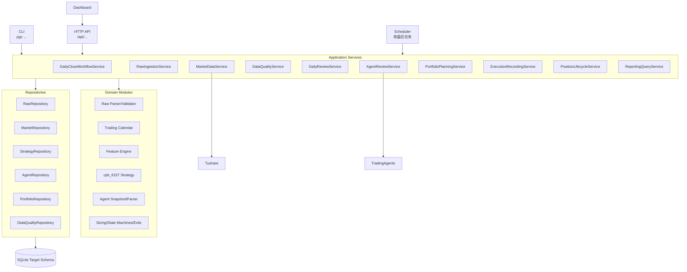
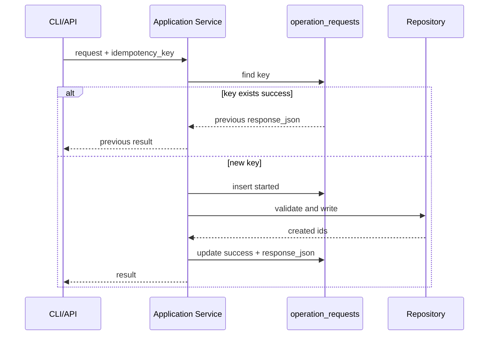

# PGC Application Service 接口设计

日期：2026-05-03

## 1. 设计目标

这份文档定义 PGC 系统的 Application Service 层接口。

Application Service 是系统的业务入口层，后续 CLI、HTTP API、定时任务、Dashboard 都只能调用它，不能绕过它直接写数据库或调用底层策略脚本。

核心目标：

1. 把 raw、market、feature、signal、agent、portfolio 的写入边界固定下来；
2. 让每个写操作都有统一请求、响应、幂等、事务和错误处理；
3. 保证策略信号、Agent 意见、交易计划、真实成交、持仓资金不串层；
4. 让后续 CLI/API/Dashboard 不重复业务逻辑；
5. 为 M2-M7 开发提供可直接落地的方法签名。

核心原则：

- Service 负责业务流程、事务边界和状态推进；
- Repository 只负责目标表读写，不做业务决策；
- Domain module 只做纯计算，不直接读写数据库；
- Adapter 负责外部系统，例如 Tushare 和 TradingAgents；
- CLI/API 只做参数解析、权限校验、调用 service、格式化输出；
- Dashboard 只通过 API 查询或触发 service，不直接访问 SQLite。

## 2. 服务层位置



## 3. 服务分类

| 类型 | 服务 | 是否写库 | 说明 |
| --- | --- | --- | --- |
| Workflow | `DailyCloseWorkflowService` | 是 | 编排收盘后完整流程 |
| Command | `RawIngestionService` | 是 | 导入 PGC 原始事实 |
| Command | `MarketDataService` | 是 | 刷新行情和交易日历 |
| Command | `DailyReviewService` | 是 | 计算特征、策略信号、daily pick |
| Command | `AgentReviewService` | 是 | 生成 Agent snapshot 和 advisory |
| Command | `PortfolioPlanningService` | 是 | 生成/发布/取消交易计划 |
| Command | `ExecutionRecordingService` | 是 | 录入真实或模拟成交 |
| Command | `PositionLifecycleService` | 是 | T+2/T+5 退出判断 |
| Query | `DataQualityService` | 读/写 | 检查并记录质量事件 |
| Query | `ReportingQueryService` | 只读 | 查询日报、持仓、资金、Agent |

说明：

- `DailyReviewService` 不直接创建 trade plan；
- 如果 CLI 提供“一键复盘并生成计划”，应由 `DailyCloseWorkflowService` 编排 `DailyReviewService` 和 `PortfolioPlanningService`；
- Agent advisory 可以被 workflow 调用，但不能改变 signal；
- portfolio service 可以引用 Agent decision，但首版 advisory 模式不允许 Agent 自动取消计划。

## 4. 通用 DTO

### RequestContext

所有写操作都带上下文。

```python
@dataclass(frozen=True)
class RequestContext:
    request_id: str | None = None
    idempotency_key: str | None = None
    dry_run: bool = False
    operator: str | None = None
    source: str = "cli"  # cli/api/scheduler/manual/migration
```

规则：

- paper 写操作建议提供 `operator`；
- live 写操作必须提供 `operator`；
- `dry_run=True` 时不落事实表；
- `idempotency_key` 用于写操作防重复。

### ServiceResult

所有 service 返回统一信封。

```python
@dataclass(frozen=True)
class ServiceResult[T]:
    status: str
    request_id: str | None
    data: T | None = None
    created_ids: dict[str, int | list[int]] = field(default_factory=dict)
    warnings: list[ServiceWarning] = field(default_factory=list)
    errors: list[ServiceError] = field(default_factory=list)
    lineage: dict[str, int | str | None] = field(default_factory=dict)
```

`status` 枚举：

```text
success
partial_success
skipped
validation_failed
blocked
failed
```

### ServiceError

```python
@dataclass(frozen=True)
class ServiceError:
    code: str
    message: str
    entity_type: str | None = None
    entity_id: int | None = None
    severity: str = "error"
```

核心错误码沿用 `api_cli_contract_design.md`：

- `VALIDATION_ERROR`
- `DATA_QUALITY_BLOCKED`
- `MARKET_DATA_NOT_READY`
- `TRADE_CALENDAR_MISSING`
- `STRATEGY_VERSION_NOT_FOUND`
- `ACCOUNT_NOT_FOUND`
- `ACCOUNT_TYPE_MISMATCH`
- `NO_FREE_POSITION_SLOT`
- `PLAN_ALREADY_EXECUTED`
- `PLAN_EXPIRED`
- `POSITION_NOT_FOUND`
- `AGENT_RUN_FAILED`
- `FUTURE_DATA_DETECTED`

### Lineage

响应中的 `lineage` 只放 ID 和版本，不放大块 JSON。

常见字段：

```text
raw_import_batch_id
market_fetch_run_id
feature_run_id
strategy_run_id
daily_pick_id
input_snapshot_id
agent_run_id
agent_decision_id
account_id
trade_plan_id
trade_id
position_id
exit_decision_id
equity_snapshot_id
strategy_version
as_of_date
```

## 5. 幂等协议

所有写操作遵循同一个模式。



规则：

- `idempotency_key` 相同且已成功，返回旧结果；
- `idempotency_key` 相同但状态 failed，允许显式 retry；
- dry-run 不写 `operation_requests` 成功记录；
- 没有 idempotency key 的写操作只允许本地开发或一次性迁移，paper/live 禁止。

## 6. 事务边界

### 单事务写操作

这些操作应在一个数据库事务内完成：

- raw import batch + raw events + quality events；
- feature run + feature snapshots + strategy run + signals + daily pick；
- plan generate；
- plan publish/cancel；
- trade record + position update + equity snapshot；
- exit evaluate + exit decisions + sell plans；
- agent run status + artifacts + decision。

### 外部调用事务规则

外部调用不应该长时间占用数据库事务。

| 服务 | 外部调用 | 事务规则 |
| --- | --- | --- |
| `MarketDataService` | Tushare | 先拉数据到内存/缓存，再开启事务写入 |
| `AgentReviewService` | TradingAgents | 先创建 planned/running run，释放事务，调用 Agent，再开事务写结果 |
| `RawIngestionService` | 读取本地文件 | 文件解析在事务外，写库在事务内 |

### dry-run 规则

dry-run 必须执行：

- 输入校验；
- 数据质量检查；
- 账户约束检查；
- 计划 sizing 预览；
- 将要创建的 ids 类型说明。

dry-run 不允许：

- 插入事实表；
- 更新状态；
- 写 domain event；
- 写 operation success。

## 7. Unit of Work

建议引入轻量 `UnitOfWork`。

```python
class UnitOfWork(Protocol):
    conn: sqlite3.Connection
    raw: RawRepository
    market: MarketRepository
    strategy: StrategyRepository
    agent: AgentRepository
    portfolio: PortfolioRepository
    quality: DataQualityRepository
    operations: OperationRequestRepository

    def begin(self) -> None: ...
    def commit(self) -> None: ...
    def rollback(self) -> None: ...
```

使用规则：

- Service 控制事务；
- Repository 不提交事务；
- Domain module 不接收 `conn`；
- Adapter 不接收 `conn`，只返回外部数据；
- Query service 可以只读连接，不开启写事务。

## 8. RawIngestionService

### 职责

- 导入 PGC 原始入池事实；
- 执行字段白名单；
- 计算 source hash；
- 标记脏数据；
- 写入 `raw_import_batches` 和 `raw_events`。

### 接口

```python
class RawIngestionService:
    def import_raw_events(
        self,
        request: ImportRawEventsRequest,
        ctx: RequestContext,
    ) -> ServiceResult[ImportRawEventsResult]: ...
```

```python
@dataclass(frozen=True)
class ImportRawEventsRequest:
    source_file: Path
    source_type: str = "pgc_pool"
    encoding: str = "utf-8"
    allow_dirty: bool = True
```

```python
@dataclass(frozen=True)
class ImportRawEventsResult:
    raw_import_batch_id: int | None
    row_count: int
    valid_count: int
    dirty_count: int
    duplicate_count: int
    invalid_events: list[InvalidRawEvent]
```

### 写入表

- `raw_import_batches`
- `raw_events`
- `data_quality_events`
- `operation_requests`
- `domain_events`

### 禁止

- 不写 `market_bars`；
- 不写 `feature_snapshots`；
- 不写 `strategy_signals`；
- 不计算 T+1/T+2/T+5 收益；
- 不保留 `bull_prob/bull_reason/latest_ret/max_high/status`。

### 事务边界

1. 事务外读取文件并解析；
2. 事务外计算 source hash；
3. 事务内检查幂等；
4. 事务内写 import batch、raw events、quality events；
5. 提交后返回 batch id。

### 验收

- 重复 source hash 不重复导入；
- 隆化科技脏数据被标记 invalid；
- 禁止字段触发 blocker；
- dry-run 不写库。

## 9. MarketDataService

### 职责

- 按有效 raw events 刷新行情；
- 刷新交易日历；
- 写入 market fetch run；
- upsert market bars 和 daily basic。

### 接口

```python
class MarketDataService:
    def refresh_market_data(
        self,
        request: RefreshMarketDataRequest,
        ctx: RequestContext,
    ) -> ServiceResult[RefreshMarketDataResult]: ...

    def refresh_trade_calendar(
        self,
        request: RefreshTradeCalendarRequest,
        ctx: RequestContext,
    ) -> ServiceResult[RefreshTradeCalendarResult]: ...
```

```python
@dataclass(frozen=True)
class RefreshMarketDataRequest:
    start_date: str | None
    end_date: str
    scope: str = "valid_raw_events"
    ts_codes: list[str] | None = None
    provider: str = "tushare"
    include_daily_basic: bool = True
```

```python
@dataclass(frozen=True)
class RefreshMarketDataResult:
    market_fetch_run_id: int | None
    ts_code_count: int
    bars_upserted: int
    daily_basic_upserted: int
    missing_ts_codes: list[str]
    coverage_start_date: str | None
    coverage_end_date: str | None
```

### 写入表

- `market_fetch_runs`
- `trade_calendar`
- `market_bars`
- `daily_basic_snapshots`
- `data_quality_events`
- `operation_requests`
- `domain_events`

### 禁止

- 不写 raw；
- 不写 feature；
- 不写 signal；
- 不填充假行情；
- 不在日志和报告输出 Tushare token。

### 事务边界

1. 事务外确定股票范围；
2. 事务外调用 Tushare；
3. 事务内写 fetch run 和行情；
4. 事务内写缺失行情 warning/blocker；
5. 提交后返回覆盖情况。

### 验收

- `market_bars` upsert 幂等；
- 缺候选行情写 blocker；
- trade calendar 缺 S+1/T+2/T+5 写 blocker；
- token 不进数据库。

## 10. DataQualityService

### 职责

- 在策略运行前检查数据可用性；
- 记录和查询 data quality events；
- 输出 readiness summary。

### 接口

```python
class DataQualityService:
    def check_daily_review_readiness(
        self,
        request: DailyReviewReadinessRequest,
        ctx: RequestContext,
    ) -> ServiceResult[DailyReviewReadinessResult]: ...

    def list_events(
        self,
        request: ListDataQualityEventsRequest,
    ) -> ServiceResult[list[DataQualityEventDTO]]: ...

    def resolve_event(
        self,
        request: ResolveDataQualityEventRequest,
        ctx: RequestContext,
    ) -> ServiceResult[ResolveDataQualityEventResult]: ...
```

```python
@dataclass(frozen=True)
class DailyReviewReadinessRequest:
    as_of_date: str
    strategy_version: str
    account_key: str | None = None
    account_id: int | None = None
```

```python
@dataclass(frozen=True)
class DailyReviewReadinessResult:
    readiness: str  # pass/warning/blocker
    blocker_count: int
    warning_count: int
    valid_raw_count: int
    market_coverage_ok: bool
    trade_calendar_ok: bool
    strategy_version_ok: bool
    account_ok: bool
```

### 写入表

- `data_quality_events`
- `operation_requests`
- `domain_events`

### 禁止

- 不自动修复 raw；
- 不自动补行情；
- 不运行策略；
- 不生成 trade plan。

### 验收

- blocker 会阻断 `DailyReviewService`；
- warning 可进入日报；
- readiness 可以被 CLI/API/Dashboard 共用。

## 11. DailyReviewService

### 职责

- 对一个复盘日运行特征和策略；
- 生成 strategy signals；
- 每日最多选择一只 daily pick；
- 返回策略血缘。

### 接口

```python
class DailyReviewService:
    def run_daily_review(
        self,
        request: RunDailyReviewRequest,
        ctx: RequestContext,
    ) -> ServiceResult[RunDailyReviewResult]: ...
```

```python
@dataclass(frozen=True)
class RunDailyReviewRequest:
    as_of_date: str
    strategy_version: str = "cpb_6157@2026-05-03"
    max_daily_picks: int = 1
    run_type: str = "paper"  # research/backtest/validation/paper/live
    force_new_run: bool = True
```

```python
@dataclass(frozen=True)
class RunDailyReviewResult:
    feature_run_id: int | None
    strategy_run_id: int | None
    signals_count: int
    daily_pick_id: int | None
    daily_pick: DailyPickDTO | None
    skipped_reason: str | None = None
```

### 写入表

- `feature_runs`
- `feature_snapshots`
- `strategy_runs`
- `strategy_signals`
- `daily_picks`
- `data_quality_events`
- `operation_requests`
- `domain_events`

### 禁止

- 不写 `trade_plans`；
- 不写 `trades`；
- 不写 `positions`；
- 不调用 TradingAgents；
- 不读取 `as_of_date` 之后行情。

### 事务边界

1. 事务内检查幂等；
2. 事务内读取 readiness；
3. 如有 blocker，写 operation failed/blocked；
4. 事务内创建 feature run 和 strategy run；
5. 纯计算模块计算 feature/signal；
6. 事务内批量写 snapshots/signals/pick；
7. 提交后返回 lineage。

### 设计说明

这里有意不让 `DailyReviewService` 生成交易计划。

原因：

- strategy/signal 属于确定性策略层；
- trade plan 属于 portfolio 层；
- 账户约束、资金、持仓数量不能污染策略运行结果；
- 同一个 strategy run 可以服务 backtest、paper、live 不同账户。

## 12. DailyCloseWorkflowService

### 职责

编排收盘后一键流程。

它可以调用：

1. `DataQualityService`;
2. `DailyReviewService`;
3. `AgentReviewService`，可选；
4. `PortfolioPlanningService`;
5. `ReportingQueryService`。

### 接口

```python
class DailyCloseWorkflowService:
    def run_after_close(
        self,
        request: RunAfterCloseRequest,
        ctx: RequestContext,
    ) -> ServiceResult[RunAfterCloseResult]: ...
```

```python
@dataclass(frozen=True)
class RunAfterCloseRequest:
    as_of_date: str
    account_key: str
    strategy_version: str = "cpb_6157@2026-05-03"
    max_daily_picks: int = 1
    with_agent_review: bool = False
    generate_trade_plan: bool = True
```

```python
@dataclass(frozen=True)
class RunAfterCloseResult:
    readiness: DailyReviewReadinessResult
    review: RunDailyReviewResult | None
    agent_review: AgentReviewResult | None
    trade_plan: GenerateTradePlanResult | None
    report_summary: DailyReportSummary | None
```

### 写入表

Workflow 自身不直接写业务表，只通过下游 service 写入。

可以写：

- `operation_requests`
- `domain_events`

### 禁止

- 不直接调用 repository 写业务事实；
- 不绕过下游 service；
- 不把 Agent reject 自动变成 skip，除非策略版本 `agent_policy = filter`。

## 13. AgentReviewService

### 职责

- 为 daily pick 构造受控 input snapshot；
- 调用 TradingAgents；
- 保存 advisory 结果；
- 保存 artifact 路径和解析结果。

### 接口

```python
class AgentReviewService:
    def review_daily_pick(
        self,
        request: ReviewDailyPickRequest,
        ctx: RequestContext,
    ) -> ServiceResult[AgentReviewResult]: ...
```

```python
@dataclass(frozen=True)
class ReviewDailyPickRequest:
    daily_pick_id: int
    agent_system: str = "tradingagents"
    agent_version: str | None = None
    mode: str = "local_snapshot_mode"
    config_json: dict[str, Any] = field(default_factory=dict)
```

```python
@dataclass(frozen=True)
class AgentReviewResult:
    input_snapshot_id: int | None
    agent_run_id: int | None
    agent_decision_id: int | None
    action: str | None
    confidence: float | None
    risk_level: str | None
    summary: str | None
    artifact_paths: list[str]
```

### 写入表

- `input_snapshots`
- `agent_runs`
- `agent_artifacts`
- `agent_decisions`
- `data_quality_events`
- `operation_requests`
- `domain_events`

### 禁止

- 不写 `strategy_signals`；
- 不写 `daily_picks`；
- 不写 `trade_plans`，除非由 portfolio service 引用 decision；
- 不读取全库；
- 不把实盘敏感信息交给 Agent。

### 事务边界

1. 事务内构造并保存 input snapshot；
2. 事务内创建 `agent_run(status='running')`；
3. 事务外调用 TradingAgents；
4. 事务内写 artifact 和 decision；
5. 失败时事务内更新 `agent_run(status='failed')`。

### 验收

- Agent 失败不阻断 trade plan；
- Agent 输出 JSON 异常写 failed run；
- input snapshot 不含未来收益字段；
- artifact 路径在项目目录下。

## 14. PortfolioPlanningService

### 职责

- 根据 daily pick 和账户约束生成买入计划；
- 发布、取消、过期计划；
- 根据 exit decision 生成卖出计划。

### 接口

```python
class PortfolioPlanningService:
    def generate_buy_plan(
        self,
        request: GenerateBuyPlanRequest,
        ctx: RequestContext,
    ) -> ServiceResult[GenerateTradePlanResult]: ...

    def generate_sell_plan(
        self,
        request: GenerateSellPlanRequest,
        ctx: RequestContext,
    ) -> ServiceResult[GenerateTradePlanResult]: ...

    def publish_plan(
        self,
        request: PublishTradePlanRequest,
        ctx: RequestContext,
    ) -> ServiceResult[TradePlanDTO]: ...

    def cancel_plan(
        self,
        request: CancelTradePlanRequest,
        ctx: RequestContext,
    ) -> ServiceResult[TradePlanDTO]: ...
```

```python
@dataclass(frozen=True)
class GenerateBuyPlanRequest:
    account_key: str | None = None
    account_id: int | None = None
    daily_pick_id: int | None = None
    review_date: str | None = None
    planned_trade_date: str | None = None
    agent_decision_id: int | None = None
```

```python
@dataclass(frozen=True)
class GenerateTradePlanResult:
    trade_plan_id: int | None
    action: str
    status: str
    reason: str
    planned_trade_date: str | None
    planned_cash: float | None
    planned_shares: int | None
    free_position_slots: int
```

### 写入表

- `trade_plans`
- `operation_requests`
- `domain_events`
- `data_quality_events`

### 禁止

- 不写 `trades`；
- 不写 `positions`；
- 不把 plan 当成交；
- 不使用回测价格替代实盘计划；
- advisory 模式下不让 Agent 自动阻断计划。

### 事务边界

- 计划生成、发布、取消各自一个事务；
- 同一账户同一 daily pick 的 active buy plan 幂等；
- 满仓时可以返回 skipped，不创建 active buy plan。

### 验收

- 仓位满返回 `skip_max_positions`；
- 有空仓位生成 `buy_next_open`；
- 发布只允许 `draft -> active`；
- 取消必须记录 operator 和 cancel reason。

## 15. ExecutionRecordingService

### 职责

- 录入买入/卖出成交；
- 校验 trade plan；
- 创建或关闭 position；
- 触发 equity snapshot；
- 记录 correction/reversal。

### 接口

```python
class ExecutionRecordingService:
    def record_trade(
        self,
        request: RecordTradeRequest,
        ctx: RequestContext,
    ) -> ServiceResult[RecordTradeResult]: ...

    def correct_trade(
        self,
        request: CorrectTradeRequest,
        ctx: RequestContext,
    ) -> ServiceResult[CorrectTradeResult]: ...

    def reverse_trade(
        self,
        request: ReverseTradeRequest,
        ctx: RequestContext,
    ) -> ServiceResult[ReverseTradeResult]: ...
```

```python
@dataclass(frozen=True)
class RecordTradeRequest:
    account_key: str | None = None
    account_id: int | None = None
    trade_plan_id: int
    side: str  # buy/sell
    executed_date: str
    executed_price: float
    shares: int
    fee: float = 0.0
    tax: float = 0.0
    source: str = "manual"
    slippage: float | None = None
```

```python
@dataclass(frozen=True)
class RecordTradeResult:
    trade_id: int
    position_id: int | None
    equity_snapshot_id: int | None
    position_status: str | None
    cash_after: float | None
    planned_t2_date: str | None = None
    planned_t5_date: str | None = None
```

### 写入表

- `trades`
- `positions`
- `trade_plans`
- `exit_decisions`
- `equity_snapshots`
- `operation_requests`
- `domain_events`
- `data_quality_events`

### 禁止

- 不修改 strategy signal；
- 不修改 raw/market；
- 不覆盖旧成交；
- 不用 planned price 当 executed price；
- 不创建没有成交支撑的 position。

### 验收

- `buy` 成交创建 position；
- `sell` 成交关闭或减少 position；
- 重复提交不重复建仓；
- live source 只能是 manual 或 broker_import；
- shares 符合 A 股 100 股整数倍。

## 16. PositionLifecycleService

### 职责

- 计算持仓 T+2/T+5；
- 按收盘价评估退出；
- 生成 exit decision；
- 请求 planning service 生成卖出计划。

### 接口

```python
class PositionLifecycleService:
    def evaluate_exits(
        self,
        request: EvaluateExitsRequest,
        ctx: RequestContext,
    ) -> ServiceResult[EvaluateExitsResult]: ...

    def mark_positions_due(
        self,
        request: MarkPositionsDueRequest,
        ctx: RequestContext,
    ) -> ServiceResult[MarkPositionsDueResult]: ...
```

```python
@dataclass(frozen=True)
class EvaluateExitsRequest:
    account_key: str | None = None
    account_id: int | None = None
    as_of_date: str = ""
    generate_sell_plans: bool = True
```

```python
@dataclass(frozen=True)
class EvaluateExitsResult:
    evaluated_positions: int
    exit_decision_ids: list[int]
    generated_trade_plan_ids: list[int]
    skipped_positions: list[SkippedPositionDTO]
```

### 写入表

- `positions`
- `exit_decisions`
- `trade_plans`，通过 `PortfolioPlanningService`；
- `operation_requests`
- `domain_events`
- `data_quality_events`

### 禁止

- 不录入 sell trade；
- 不关闭 position；
- 不用自然日计算 T+2/T+5；
- 不用回测收益判断真实持仓。

### 验收

- T+2 `ret >= 3%` 生成止盈卖出计划；
- T+2 `ret <= -3%` 生成止损卖出计划；
- 中间态进入 holding_to_t5；
- T+5 生成 timeout exit；
- 停牌或缺行情写 blocker。

## 17. ReportingQueryService

### 职责

- 提供只读报表数据；
- 为 CLI/API/Dashboard 输出统一视图；
- 不作为事实源。

### 接口

```python
class ReportingQueryService:
    def get_daily_report(
        self,
        request: DailyReportRequest,
    ) -> ServiceResult[DailyReportDTO]: ...

    def get_trade_plans(
        self,
        request: TradePlansQuery,
    ) -> ServiceResult[list[TradePlanDTO]]: ...

    def get_positions(
        self,
        request: PositionsQuery,
    ) -> ServiceResult[list[PositionDTO]]: ...

    def get_equity_curve(
        self,
        request: EquityCurveQuery,
    ) -> ServiceResult[EquityCurveDTO]: ...

    def get_lineage(
        self,
        request: LineageQuery,
    ) -> ServiceResult[LineageGraphDTO]: ...
```

### 读取表/视图

- `v_daily_review`
- `v_open_positions`
- `data_quality_events`
- `trade_plans`
- `trades`
- `positions`
- `equity_snapshots`
- `agent_decisions`
- `domain_events`

### 禁止

- 不写事实表；
- 不更新状态；
- 不把查询结果写回业务表；
- 不把 Agent advisory 展示成交易指令。

### 验收

- daily report 能显示数据 blocker；
- 持仓页能置顶 T+2/T+5；
- 所有查询必须显式 account；
- lineage 能追到 raw event、strategy run、trade plan、trade。

## 18. Repository 边界

建议 repository 拆分：

```text
storage/repositories/
  raw_repository.py
  market_repository.py
  strategy_repository.py
  agent_repository.py
  portfolio_repository.py
  quality_repository.py
  operation_repository.py
```

### RawRepository

允许：

- insert import batch；
- upsert raw events；
- mark raw invalid；
- query valid raw events。

禁止：

- query signal；
- query trade；
- compute returns。

### MarketRepository

允许：

- insert market fetch run；
- upsert market bars；
- query bars up to review date；
- query trade calendar。

禁止：

- write feature；
- fill fake bars。

### StrategyRepository

允许：

- query strategy version；
- insert feature run/snapshot；
- insert strategy run/signal；
- insert daily pick。

禁止：

- write trade plan；
- write Agent decision；
- write position。

### AgentRepository

允许：

- insert input snapshot；
- insert/update agent run；
- insert artifacts；
- insert decision。

禁止：

- update signal；
- update plan。

### PortfolioRepository

允许：

- query account；
- insert/update trade plan；
- insert trade；
- insert/update position；
- insert exit decision；
- insert equity snapshot。

禁止：

- update raw/market/signal。

## 19. Service 到表写入矩阵

| Service | Raw | Market | Feature | Signal | Agent | Portfolio | Report |
| --- | --- | --- | --- | --- | --- | --- | --- |
| `RawIngestionService` | W | - | - | - | - | - | - |
| `MarketDataService` | - | W | - | - | - | - | - |
| `DataQualityService` | R | R | R | R | R | R | - |
| `DailyReviewService` | R | R | W | W | - | - | - |
| `AgentReviewService` | - | R | R | R | W | - | - |
| `PortfolioPlanningService` | - | R | - | R | R | W | - |
| `ExecutionRecordingService` | - | R | - | R | R | W | - |
| `PositionLifecycleService` | - | R | - | R | - | W | - |
| `ReportingQueryService` | R | R | R | R | R | R | R |
| `DailyCloseWorkflowService` | via svc | via svc | via svc | via svc | via svc | via svc | via svc |

说明：

- `W` 表示可以写该层；
- `R` 表示只读；
- `via svc` 表示只能通过下游 service，不直接写。

## 20. CLI/API 映射

| CLI/API | Service |
| --- | --- |
| `pgc raw import` | `RawIngestionService.import_raw_events` |
| `pgc market refresh` | `MarketDataService.refresh_market_data` |
| `pgc data-quality check` | `DataQualityService.check_daily_review_readiness` |
| `pgc review run` | `DailyReviewService.run_daily_review` |
| `pgc after-close run` | `DailyCloseWorkflowService.run_after_close` |
| `pgc agent review` | `AgentReviewService.review_daily_pick` |
| `pgc plan` | `PortfolioPlanningService.generate_buy_plan` |
| `POST /api/trade-plans/{id}/publish` | `PortfolioPlanningService.publish_plan` |
| `POST /api/trade-plans/{id}/cancel` | `PortfolioPlanningService.cancel_plan` |
| `pgc record-buy` | `ExecutionRecordingService.record_trade` |
| `pgc record-sell` | `ExecutionRecordingService.record_position_sell` |
| `pgc exits-evaluate` | `PositionLifecycleService.evaluate_exits` |
| `pgc report daily` | `ReportingQueryService.get_daily_report` |

API 同理只做 HTTP wrapper。

## 21. 测试要求

### Unit Tests

- DTO validation；
- raw forbidden fields；
- strategy no-future boundary；
- sizing；
- T+2/T+5 calendar；
- state transition。

### Integration Tests

- raw import -> market refresh -> readiness；
- review run -> daily pick；
- daily pick -> trade plan；
- active plan -> buy trade -> position；
- position -> exit decision -> sell plan；
- sell trade -> closed position -> equity。

### Invariant Tests

- raw 不含未来字段；
- signal 不含 Agent 字段；
- trade plan 不创建 position；
- position 必须有 entry trade；
- live trade 不能 source=model；
- account 查询不串；
- Agent failed 不阻断计划。

## 22. 实现顺序

建议服务层开发顺序：

```text
1. Common DTO + ServiceResult + RequestContext
2. UnitOfWork + Repository Protocols
3. RawIngestionService
4. DataQualityService
5. MarketDataService
6. DailyReviewService
7. PortfolioPlanningService
8. ExecutionRecordingService
9. PositionLifecycleService
10. ReportingQueryService
11. DailyCloseWorkflowService
12. AgentReviewService
```

原因：

- raw/quality/market 是策略运行前置条件；
- review 只产生信号；
- portfolio 账本闭环优先于 Agent；
- reporting 和 workflow 在服务稳定后再接；
- Agent advisory 后置，避免过早影响核心交易链路。

## 23. ADR

### ADR-SVC-001: 引入 DailyCloseWorkflowService，而不是让 DailyReviewService 写计划

Context：用户希望收盘后一键复盘并选出明日买入股票，但策略复盘和账户计划属于不同边界。

Options：

- `DailyReviewService` 同时写 signal 和 trade plan；
- CLI 命令手动串多个 service；
- 引入 `DailyCloseWorkflowService` 编排多个 service。

Decision：引入 `DailyCloseWorkflowService`。

Consequences：

- 好处：策略层和组合层保持隔离；
- 好处：CLI/API 可以一键执行完整流程；
- 代价：多一个编排服务；
- 风险：workflow 不能绕过下游 service 直接写库。

### ADR-SVC-002: Service 控制事务，Repository 不提交事务

Context：一次业务操作经常涉及多张表，例如录入成交要写 trade、position、equity、domain event。

Options：

- 每个 repository 自己提交；
- Service 控制事务；
- 全部使用 autocommit。

Decision：Service 控制事务。

Consequences：

- 好处：业务操作原子性清晰；
- 好处：失败可以整体回滚；
- 代价：service 需要显式管理 UnitOfWork；
- 风险：repository 实现必须遵守不提交规则。

### ADR-SVC-003: 外部调用不长期占用数据库事务

Context：Tushare 和 TradingAgents 可能耗时或失败，长事务会锁住 SQLite。

Options：

- 外部调用包在同一个数据库事务里；
- 外部调用完全不记录状态；
- 外部调用前后分段记录状态。

Decision：外部调用前后分段记录状态。

Consequences：

- 好处：减少 SQLite 锁；
- 好处：失败可追踪；
- 代价：服务实现稍复杂；
- 风险：需要处理 running 状态恢复。

## 24. 下一步

如果继续设计，下一份建议细化：

```text
CLI Command Spec 详细设计
```

重点定义：

- 每个 `pgc ...` 命令的参数；
- 参数校验；
- 输出 JSON/Markdown 示例；
- exit code；
- 和 Application Service 的一一映射。
