# PGC Dashboard 页面与交互详细设计

日期：2026-05-03

## 1. 设计边界

Dashboard 是每日操作台，不是研究报告页。首版围绕 6 个高频页面展开：

1. 每日复盘
2. 交易计划
3. 成交录入
4. 当前持仓
5. 数据质量
6. Agent 复核

核心约束：

- 页面只调用查询视图或 Application Service，不直接拼 SQL。
- 所有“今日/明日”都显示明确交易日，如 `20260430`、`20260506`，不只写自然语言。
- 策略信号、交易计划、真实成交、持仓状态、Agent 意见必须分区展示。
- `trade_plans` 是计划；只有 `trades.status in ('executed', 'partial')` 才能展示为成交。
- `positions` 只能由买入成交创建；没有成交价和股数时不能出现持仓。
- Agent 首版是 `advisory`，默认不改写计划；只有策略版本声明 `agent_policy = filter` 时才允许生成 `skip_agent_risk`。

### 现有枚举差异处理

`product_information_architecture.md` 曾使用 `skip_no_signal` 作为页面文案；当前目标 DDL 的 `trade_plans.action` 不包含该枚举。首版处理：

- “无信号”作为日级空状态展示，不写入 `trade_plans.action`。
- 如果需要留痕，写 `domain_events.event_type = daily_no_signal` 或后续扩展 DDL。
- 页面不得把“无信号”伪装成一条已跳过的交易计划。

## 2. 全局 Dashboard Shell

### 顶部结构

| 区域 | 字段 | 来源 | 交互 |
| --- | --- | --- | --- |
| 账户选择 | `account_key`、`name`、`account_type` | `portfolio_accounts` | 下拉切换，切换后刷新所有页面 |
| 复盘日 | `review_date` | `DailyReviewView.as_of_date` / 交易日历 | 默认最近已收盘交易日，可切历史 |
| 最新行情 | `latest_market_date` | `market_fetch_runs` / `market_bars` | 点击进入数据质量筛选 `layer=market` |
| 策略版本 | `strategy_version` | `strategy_runs` / `strategy_versions` | 点击打开策略版本详情 |
| 数据质量 | `data_quality_status` | `data_quality_events` | blocker 红色、warning 黄色；点击进入数据质量页 |
| 仓位容量 | `open_positions / max_positions / free_slots` | `positions` + `portfolio_accounts` | 点击进入当前持仓页 |

### 全局状态 Chip

| 状态 | 文案 | 使用位置 |
| --- | --- | --- |
| `blocker` | 阻断 | 顶部状态、每日复盘、交易计划发布按钮 |
| `warning` | 警告 | 数据质量、Agent 失败、行情非关键缺失 |
| `draft` | 草稿计划 | 交易计划列表 |
| `active` | 有效计划 | 交易计划、成交录入 |
| `executed` | 已成交 | 交易计划、成交录入、持仓 |
| `expired` | 已过期 | 交易计划 |
| `advisory` | 仅供复核 | Agent 复核 |

### 全局页面跳转

| 来源页面 | 目标页面 | 携带上下文 |
| --- | --- | --- |
| 每日复盘 | 交易计划 | `account_id`、`as_of_date`、`daily_pick_id` |
| 每日复盘 | Agent 复核 | `daily_pick_id`、`signal_id` |
| 每日复盘 | 当前持仓 | `account_id`、`due_only=true` |
| 交易计划 | 成交录入 | `trade_plan_id`、`side` |
| 当前持仓 | 成交录入 | `position_id`、`exit_plan_id`、`side=sell` |
| 数据质量 | 对应业务页 | `entity_type`、`entity_id`、`trade_date` |
| Agent 复核 | 每日复盘/交易计划 | `agent_decision_id` |

## 3. 每日复盘页

### 页面任务

在收盘后回答：

1. 复盘日 `S` 是否数据完整？
2. `cpb_6157` 当日有没有候选？
3. 明确下一交易日是否有买入计划？
4. 当前持仓是否有 T+2/T+5 动作？
5. Agent 是否给出复核意见，且它是否只是意见？

### 页面布局

```text
每日复盘
├── 顶部状态条
├── 明日动作主卡
├── 当日最高分候选
├── 当前持仓待处理
├── AI 复核意见
└── 数据血缘抽屉
```

### 顶部状态条字段

| UI 字段 | 数据字段 | 来源 | 展示规则 |
| --- | --- | --- | --- |
| 复盘日 | `review_date` | `DailyReviewView.as_of_date` | 固定格式 `YYYYMMDD` |
| 下一交易日 | `next_trade_date` | `trade_calendar` | 缺失时显示 blocker |
| 最新行情日 | `latest_market_date` | `market_bars` | 小于复盘日时显示 blocker |
| 策略版本 | `strategy_version` | `strategy_runs` | 显示 `cpb_6157@2026-05-03` |
| 账户 | `account_key`、`account_type` | `portfolio_accounts` | `paper` / `live` 必须显式露出 |
| 当前持仓 | `open_positions` | `positions` | `0/3`、`1/3`、`3/3` |
| 数据质量 | `data_quality_status` | `data_quality_events` | blocker 禁用生成计划 |

### 明日动作主卡字段

| UI 字段 | 数据字段 | 来源 | 可为空 | 备注 |
| --- | --- | --- | --- | --- |
| 动作类型 | `trade_plan.action` / 页面空状态 | `trade_plans` | 否 | 买入、跳过、卖出、持有、无信号 |
| 计划状态 | `trade_plan.status` | `trade_plans` | 是 | 无信号时不展示计划状态 |
| 股票 | `ts_code`、`name` | `daily_picks` / `strategy_signals` | 是 | 无候选时为空 |
| 复盘日 | `review_date` | `daily_picks` | 否 | 与页面复盘日一致 |
| 计划交易日 | `planned_trade_date`、`planned_buy_date` | `trade_plans` | 是 | 买入计划显示 `planned_buy_date` |
| 计划原因 | `reason` | `trade_plans` | 是 | 例：`highest_score_with_free_slot` |
| 账户容量 | `free_slots` | 组合服务 | 否 | 为 0 时显示 `skip_max_positions` |
| Agent 意见 | `agent_action`、`risk_level` | `agent_decisions` | 是 | 标题必须是“AI 复核意见” |
| 数据阻断 | blocker 列表 | `data_quality_events` | 是 | 有 blocker 时替代主按钮 |

### 候选明细字段

| UI 字段 | 数据字段 | 来源 | 展示 |
| --- | --- | --- | --- |
| 排名 | `rank` | 查询服务计算 | 当日候选按 `score desc, ts_code asc` |
| 股票 | `ts_code`、`name` | `strategy_signals` / CSV 迁移 | 链接到信号详情 |
| 评分 | `score` | `strategy_signals.score` | 2 位小数 |
| 入池日 | `entry_date` | `raw_events` / feature payload | `YYYYMMDD` |
| 入池价 | `entry_price` | `raw_events` | 2 位小数 |
| 复盘日收盘 | `trigger_close` | feature payload | 2 位小数 |
| 入池后涨幅 | `entry_runup` | feature payload | 百分比，必须是复盘日前可见 |
| 回撤幅度 | `drawdown_from_peak` | feature payload | 百分比 |
| 回调天数 | `pullback_days` | feature payload | 整数 |
| 缩量比 | `amount_contract_ratio` | feature payload | 小于 1 越缩量 |
| 回调均额/10日均额 | `avg_amount_to_ma10` | feature payload | 2 位小数 |
| 阳线实体 | `bull_body` | feature payload | 百分比 |
| 确认日成交额/10日均额 | `trigger_amount_to_ma10` | feature payload | 高于 1.3 时不应命中 |
| 评分原因 | `score_reasons` | `strategy_signals.reason_json` / CSV | 折叠标签 |

### 当前持仓待处理字段

| UI 字段 | 数据字段 | 来源 | 展示规则 |
| --- | --- | --- | --- |
| 股票 | `ts_code`、`name` | `PositionView` | 链接到持仓详情 |
| 状态 | `status` | `positions` | `need_t2_decision`、`need_t5_exit` 优先置顶 |
| 买入日/价 | `buy_date`、`buy_price` | `positions` | 买入价来自真实/模拟成交 |
| 当前价 | `latest_close`、`latest_trade_date` | `market_bars` | 行情日期必须展示 |
| 当前收益 | `unrealized_ret` | 查询服务计算 | 绿色/红色，不引用回测收益 |
| T+2/T+5 | `planned_t2_date`、`planned_t5_date` | `positions` | 来自交易日历 |
| 下一动作 | `next_action` | 退出服务 | 止盈、止损、持有到 T+5、到期退出 |
| 退出计划 | `generated_trade_plan_id` | `exit_decisions` | 有计划时可跳转到成交录入 |

### AI 复核意见字段

| UI 字段 | 数据字段 | 来源 | 备注 |
| --- | --- | --- | --- |
| 运行状态 | `agent_runs.status` | `agent_runs` | `failed` 不阻断复盘 |
| 意见 | `agent_decisions.action` | `agent_decisions` | support/caution/reject 等 |
| 风险等级 | `risk_level` | `agent_decisions` | low/medium/high/unknown |
| 置信度 | `confidence` | `agent_decisions` | 0-1，可为空 |
| 摘要 | `summary` | `agent_decisions` | 最多显示 2 行 |
| 风险点 | `risk_points_json` | `agent_decisions` | 折叠显示 |
| 人工检查项 | `suggested_human_checks` | `raw_decision_json` | 首版只读 |
| 输入快照 | `input_snapshot_id`、`content_hash` | `input_snapshots` | 链接到快照详情 |

### 主操作

| 操作 | 按钮 | 前置条件 | 写入/副作用 |
| --- | --- | --- | --- |
| 刷新行情 | 刷新行情 | 有 Tushare 配置 | `market_fetch_runs`、`market_bars`、事件 |
| 运行质量检查 | 质量检查 | 选择复盘日和账户 | `data_quality_events` |
| 运行复盘 | 运行复盘 | 无 blocker，行情覆盖 `S` | `feature_runs`、`strategy_runs`、`strategy_signals`、`daily_picks` |
| 请求 Agent 复核 | AI 复核 | 有 `daily_pick` | `input_snapshots`、`agent_runs`、`agent_decisions` |
| 生成计划 | 生成计划 | 有复盘结果，无组合 blocker | `trade_plans.status=draft/skipped` |
| 发布计划 | 发布计划 | `trade_plan.status=draft` | `trade_plans.status=active`，写事件 |
| 录入成交 | 录入成交 | `trade_plan.status=active` | 跳转成交录入页 |
| 查看血缘 | 数据血缘 | 任意状态 | 打开只读抽屉 |

### 操作流：有信号且有空闲仓位

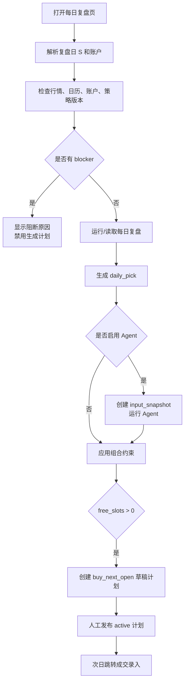

### 操作流：有信号但仓位已满

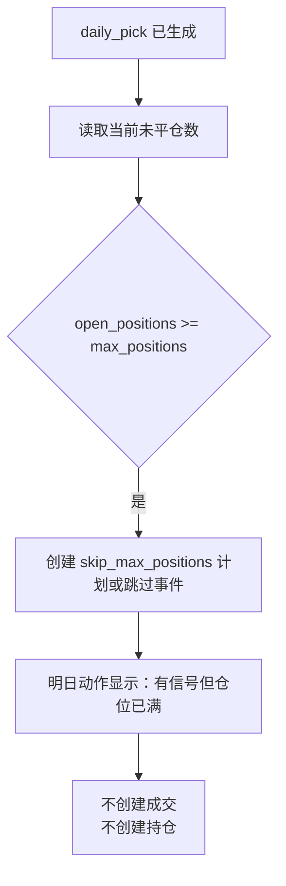

### 操作流：无信号

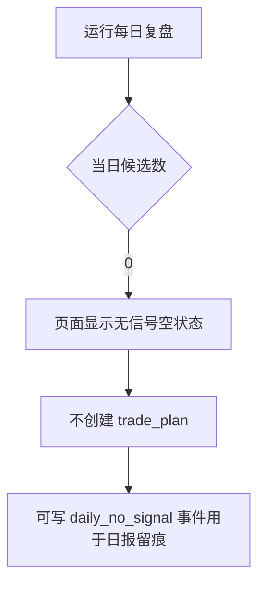

## 4. 交易计划页

### 页面任务

交易计划页是计划生命周期管理页，回答：

- 哪些计划今天有效？
- 哪些已经执行、取消或过期？
- 计划来自哪个信号、哪个 Agent 意见、哪个账户？
- 计划与真实成交是否已经对上？

### 列表筛选

| 筛选 | 默认值 | 来源 |
| --- | --- | --- |
| 账户 | 当前全局账户 | `portfolio_accounts` |
| 日期范围 | 最近 20 个交易日 | `trade_plans.as_of_date` |
| 计划状态 | `draft`、`active` 优先 | `trade_plans.status` |
| 动作类型 | 全部 | `trade_plans.action` |
| 只看待处理 | 开启 | `status in ('draft','active')` |
| Agent 风险 | 全部 | `agent_decisions.risk_level` |

### 列表字段

| UI 字段 | 数据字段 | 来源 | 交互 |
| --- | --- | --- | --- |
| 计划 ID | `trade_plan_id` | `TradePlanView` | 点击打开详情抽屉 |
| 账户 | `account_key` | `TradePlanView` | 只读 |
| 生成日 | `as_of_date` | `trade_plans` | 可排序 |
| 计划交易日 | `planned_date` | `trade_plans.planned_trade_date/planned_buy_date` | 可排序 |
| 动作 | `action` | `trade_plans` | Chip |
| 状态 | `status` | `trade_plans` | Chip |
| 股票 | `signal_ref.ts_code/name` | `strategy_signals` | 链接信号 |
| 计划数量 | `plan_json.suggested_shares` | `plan_json` | 无则显示待人工 |
| 计划价格口径 | `plan_json.price_basis` | `plan_json` | 例：次日开盘，非成交价 |
| 原因 | `reason` | `trade_plans` | 单行截断 |
| Agent | `agent_ref.action/risk_level` | `agent_decisions` | 点击 Agent 详情 |
| 成交 | `execution_ref` | `trades` | 已成交显示成交价/股数 |
| 操作者 | `operator` | `trade_plans` | 审计用 |
| 更新时间 | `updated_at` | `trade_plans` | 可排序 |

### 详情抽屉

| Tab | 字段 |
| --- | --- |
| 计划 | `action`、`status`、`reason`、`plan_json`、`cancel_reason`、`operator` |
| 策略信号 | `signal_id`、`daily_pick_id`、`score`、核心特征、策略版本 |
| Agent | `agent_decision_id`、`action`、`risk_level`、`summary`、artifact 链接 |
| 成交 | 关联 `trades` 列表，显示成交事实 |
| 事件 | `domain_events` 时间线 |

### 行级操作

| 状态 | 可用操作 | 规则 |
| --- | --- | --- |
| `draft` | 发布、取消、查看信号、请求 Agent | 发布前必须无 blocker |
| `active` | 录入成交、取消、过期、查看信号 | 买入计划只在 `planned_buy_date` 有效 |
| `executed` | 查看成交、查看持仓 | 只读 |
| `skipped` | 查看原因 | 只读 |
| `cancelled` | 查看取消原因 | 只读 |
| `expired` | 查看过期原因 | 只读 |
| `superseded` | 查看替代计划 | 只读 |

### 操作流：发布计划

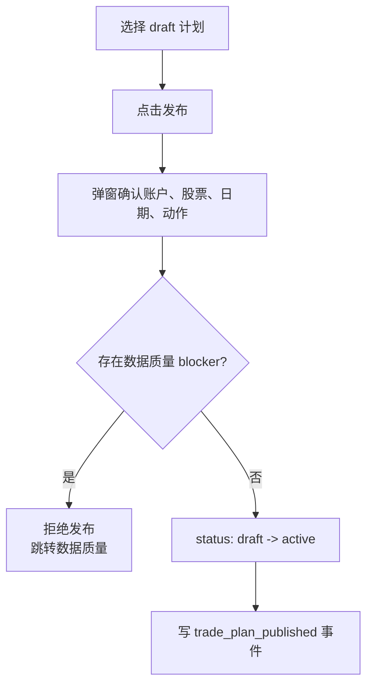

### 操作流：取消计划

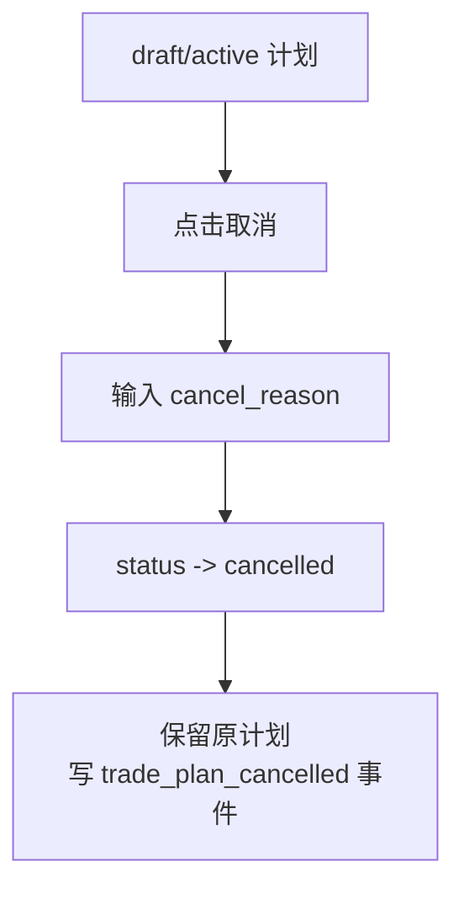

### 操作流：过期计划

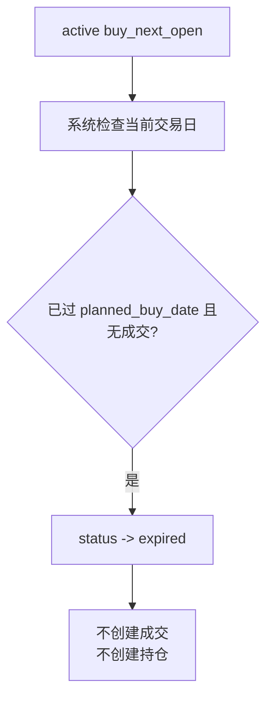

## 5. 成交录入页

### 页面任务

把人工执行或券商导入结果写成事实，并触发持仓、资金、事件更新。

### 页面布局

```text
成交录入
├── 待录入计划队列
├── 买入/卖出表单
├── 计算预览
├── 校验与风险提示
└── 最近成交
```

### 待录入计划队列字段

| UI 字段 | 数据字段 | 来源 |
| --- | --- | --- |
| 计划 ID | `trade_plan_id` | `trade_plans` |
| 动作 | `action` | `trade_plans` |
| 计划交易日 | `planned_trade_date/planned_buy_date` | `trade_plans` |
| 股票 | `ts_code`、`name` | `strategy_signals` / `positions` |
| 状态 | `status` | `trade_plans` |
| 账户 | `account_key` | `portfolio_accounts` |
| 计划说明 | `reason` | `trade_plans` |
| 已录入 | 关联成交数 | `trades` |

### 买入录入字段

| UI 字段 | 写入字段 | 来源/默认值 | 必填 | 校验 |
| --- | --- | --- | --- | --- |
| 计划 | `trade_plan_id` | 从 active 计划带入 | 是 | `status=active`，`action=buy_next_open` |
| 账户 | `account_id` | 计划带入 | 是 | 与全局账户一致 |
| 股票 | `ts_code`、`name` | 计划带入 | 是 | 只读 |
| 方向 | `side=buy` | 固定 | 是 | 只读 |
| 计划日期 | `planned_date` | `planned_buy_date` | 是 | 只读 |
| 成交日期 | `executed_date` | 默认当前交易日 | 是 | 必须是交易日 |
| 成交价 | `executed_price` | 手工输入 | 是 | `> 0` |
| 股数 | `shares` | 手工输入 | 是 | `> 0`；A 股买入建议 100 股整数 |
| 手续费 | `fee` | 默认 0 | 是 | `>= 0` |
| 税费 | `tax` | 默认 0 | 是 | 买入通常为 0 |
| 来源 | `source` | `manual` | 是 | live 只能 `manual/broker_import` |
| 操作者 | `operator` | 当前用户 | 是 | 写审计 |
| 备注 | `notes` | 表单字段，进入事件 payload | 否 | 不覆盖事实字段 |

### 买入自动计算

| 计算项 | 公式/来源 | 写入 |
| --- | --- | --- |
| 成交额 | `executed_price * shares` | `trades.amount` |
| 成本 | `amount + fee + tax` | `positions.cost` |
| 滑点 | `executed_price / plan_price - 1` | `trades.slippage`，有计划价时 |
| T+2 日期 | 交易日历从 `executed_date` 后推 2 个开市日 | `positions.planned_t2_date` |
| T+5 日期 | 交易日历从 `executed_date` 后推 5 个开市日 | `positions.planned_t5_date` |
| 持仓 | 买入成交创建 | `positions` |
| 资金快照 | 成交后账户估值 | `equity_snapshots(snapshot_type=after_trade)` |

### 卖出录入字段

| UI 字段 | 写入字段 | 来源/默认值 | 必填 | 校验 |
| --- | --- | --- | --- | --- |
| 持仓 | `position_id` | 从当前持仓或卖出计划带入 | 是 | `status not in ('closed','cancelled')` |
| 卖出计划 | `trade_plan_id` | 可选，来自退出计划 | 否 | 有计划时 `action` 必须为卖出类 |
| 账户 | `account_id` | 持仓带入 | 是 | 与持仓一致 |
| 股票 | `ts_code`、`name` | 持仓带入 | 是 | 只读 |
| 方向 | `side=sell` | 固定 | 是 | 只读 |
| 成交日期 | `executed_date` | 默认当前交易日 | 是 | 必须是交易日 |
| 成交价 | `executed_price` | 手工输入 | 是 | `> 0` |
| 卖出股数 | `shares` | 默认剩余股数 | 是 | `0 < shares <= 当前持仓股数` |
| 手续费 | `fee` | 默认 0 | 是 | `>= 0` |
| 税费 | `tax` | 默认 0 | 是 | `>= 0` |
| 来源 | `source` | `manual` | 是 | live 只能 `manual/broker_import` |
| 操作者 | `operator` | 当前用户 | 是 | 写审计 |
| 备注 | `notes` | 进入事件 payload | 否 | 用于人工说明 |

### 卖出自动计算

| 计算项 | 公式/来源 | 写入 |
| --- | --- | --- |
| 卖出成交额 | `executed_price * shares` | `trades.amount` |
| 实现盈亏 | `(sell_price - buy_price) * shares - fee - tax` | 查询服务/资金快照 |
| 持仓状态 | 全卖为 `closed`，部分卖为 `partially_closed` | `positions.status` |
| 退出成交 | 卖出完成后引用 | `positions.exit_trade_id` |
| 退出判断执行 | 有 `exit_decision` 时标记执行成交 | `exit_decisions.executed_exit_trade_id` |
| 资金快照 | 成交后账户估值 | `equity_snapshots(snapshot_type=after_trade)` |

### 表单按钮状态

| 按钮 | 启用条件 |
| --- | --- |
| 保存买入成交 | active 买入计划 + 成交日期 + 成交价 + 股数 + 无账户 blocker |
| 保存卖出成交 | 可卖持仓 + 成交日期 + 成交价 + 股数不超过持仓 |
| 保存为部分成交 | 股数小于计划股数或小于持仓股数 |
| 冲销成交 | 已成交记录 + 输入冲销原因 |
| 修正成交 | 已成交记录 + 输入修正原因 + 创建 correction 记录 |

### 操作流：买入成交

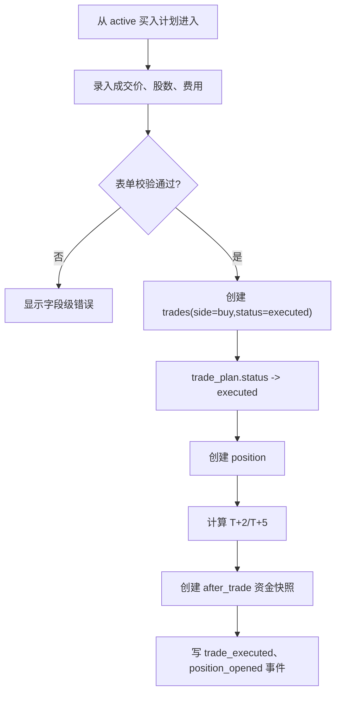

### 操作流：卖出成交

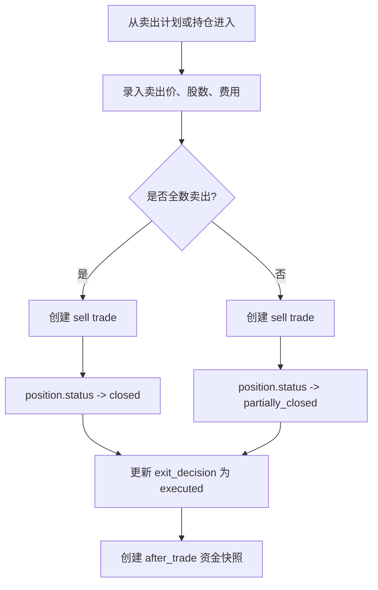

### 操作流：成交修正

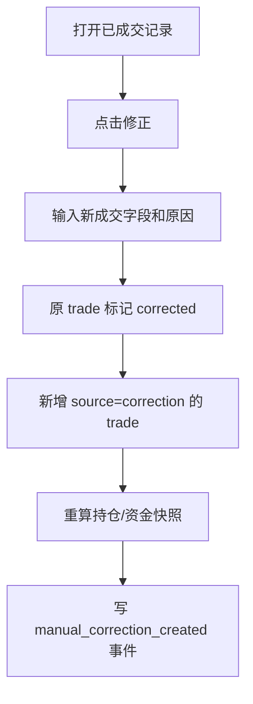

## 6. 当前持仓页

### 页面任务

当前持仓页是 T+2/T+5 退出工作台，回答：

- 当前账户真实持有哪些票？
- 每只票当前收益和风险如何？
- 今天是否必须做 T+2 或 T+5 决策？
- 是否已经生成卖出计划，是否已成交？

### 顶部指标

| UI 字段 | 数据字段 | 来源 |
| --- | --- | --- |
| 未平仓数 | `open_position_count` | `positions` |
| 仓位容量 | `open_positions / max_positions` | `positions` + `portfolio_accounts` |
| 持仓市值 | `market_value` | `latest_close * shares` |
| 未实现盈亏 | `unrealized_pnl` | 查询服务 |
| 今日待 T+2 | `need_t2_count` | `positions.status` / 日期计算 |
| 今日待 T+5 | `need_t5_count` | `positions.status` / 日期计算 |

### 列表字段

| UI 字段 | 数据字段 | 来源 | 展示规则 |
| --- | --- | --- | --- |
| 持仓 ID | `position_id` | `PositionView` | 点击打开详情 |
| 股票 | `ts_code`、`name` | `positions` | 链接原始信号 |
| 状态 | `status` | `positions` | 需要处理状态置顶 |
| 买入成交 | `entry_trade_id` | `positions` | 链接成交 |
| 买入日 | `buy_date` | `positions` | `YYYYMMDD` |
| 买入价 | `buy_price` | `positions` | 2 位小数 |
| 股数 | `shares` | `positions` | 整数 |
| 成本 | `cost` | `positions` | 金额 |
| 最新价 | `latest_close` | `market_bars` | 必须显示行情日期 |
| 未实现收益 | `unrealized_ret` | 查询服务 | `(latest_close / buy_price - 1)` |
| 未实现盈亏 | `unrealized_pnl` | 查询服务 | `(latest_close - buy_price) * shares` |
| T+2 日期 | `planned_t2_date` | `positions` | 来自交易日历 |
| T+5 日期 | `planned_t5_date` | `positions` | 来自交易日历 |
| 下一动作 | `next_action` | 退出服务 | 只显示计划/判断，不显示成交流水 |
| 卖出计划 | `generated_trade_plan_id` | `exit_decisions` | 有计划时显示按钮 |
| 来源信号 | `signal_id` | `positions` | 链接信号详情 |

### 详情抽屉

| 区域 | 字段 |
| --- | --- |
| 持仓事实 | 买入成交、股数、成本、状态、账户 |
| 实时估值 | 最新行情日、最新价、未实现收益 |
| T+2/T+5 | 计划日期、退出阈值、已生成 exit_decision |
| 来源链路 | raw event、feature snapshot、strategy signal、daily pick、trade plan |
| 成交链路 | entry trade、exit trade、correction/reversal |

### 操作

| 操作 | 前置条件 | 结果 |
| --- | --- | --- |
| 运行退出评估 | 行情覆盖当前复盘日 | 生成或更新 `exit_decisions` |
| 生成卖出计划 | `need_t2_decision` 或 `need_t5_exit` | 创建 sell 类 `trade_plan` |
| 继续持有到 T+5 | T+2 收益在 -3% 到 +3% 之间 | `position.status -> holding_to_t5` |
| 人工覆盖退出 | 输入原因 | `exit_decision.decision=manual_override` |
| 录入卖出成交 | 有卖出计划或人工卖出 | 跳转成交录入 |
| 查看来源 | 任意持仓 | 打开血缘抽屉 |

### 操作流：T+2 判断

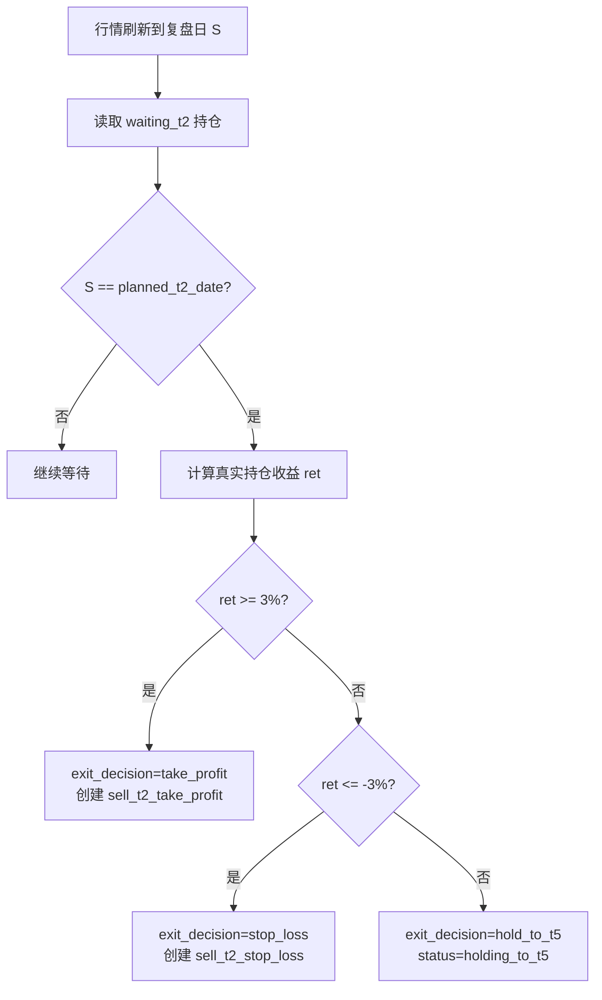

### 操作流：T+5 到期

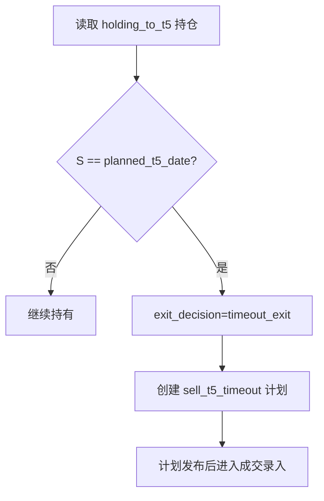

## 7. 数据质量页

### 页面任务

数据质量页是运行门禁和修复队列，回答：

- 哪些问题阻断复盘或交易计划？
- 问题属于 raw、market、feature、signal、agent、portfolio 还是 report？
- 是否已确认、忽略或解决？
- 修复后是否可以重新运行被阻断流程？

### 顶部摘要

| UI 字段 | 数据字段 | 来源 |
| --- | --- | --- |
| 总问题数 | `count(*)` | `data_quality_events` |
| blocker 数 | `severity=blocker,status=open` | `data_quality_events` |
| warning 数 | `severity=warning,status=open` | `data_quality_events` |
| 影响复盘日 | `trade_date` | `data_quality_events` |
| 最近检查时间 | `created_at max` | `data_quality_events` |
| 发布门禁 | 聚合状态 | 有 open blocker 则禁用发布 |

### 列表字段

| UI 字段 | 数据字段 | 展示/交互 |
| --- | --- | --- |
| 事件 ID | `id` | 点击打开详情 |
| 严重性 | `severity` | Chip：info/warning/error/blocker |
| 层级 | `layer` | raw/market/feature/signal/agent/portfolio/report |
| 错误码 | `event_code` | 可筛选 |
| 股票 | `ts_code` | 可为空 |
| 交易日 | `trade_date` | 可为空 |
| 实体 | `entity_type`、`entity_id` | 点击跳转业务页 |
| 消息 | `message` | 主文本 |
| 详情 | `payload_json` | 抽屉 JSON viewer |
| 状态 | `status` | open/acknowledged/resolved/ignored |
| 创建时间 | `created_at` | 可排序 |
| 解决时间 | `resolved_at` | 已解决才显示 |

### 检查项分组

| 分组 | 检查 | 默认级别 | 阻断页面 |
| --- | --- | --- | --- |
| Raw | PGC 原始事件重复 | warning | 不阻断历史查看 |
| Raw | 原始事件含未来字段 | blocker | 每日复盘 |
| Market | 复盘日行情缺失 | blocker | 每日复盘、交易计划 |
| Market | 交易日历缺少下一交易日 | blocker | 交易计划、成交录入 |
| Market | 复权因子缺失 | blocker | 每日复盘 |
| Feature | 特征读取 `S` 后行情 | blocker | 每日复盘、Agent |
| Signal | 同一策略运行同日多 pick | error | 每日复盘 |
| Portfolio | 当前持仓超过最大仓位 | blocker | 交易计划发布 |
| Portfolio | live 成交缺少价格/股数 | blocker | 当前持仓、账户资金 |
| Agent | Agent 运行失败 | warning | 不阻断计划 |
| Report | Dashboard 视图缺字段 | error | 对应页面 |

### 操作

| 操作 | 前置条件 | 写入/副作用 |
| --- | --- | --- |
| 运行检查 | 选择复盘日、账户 | 新增或更新 `data_quality_events` |
| 确认已知问题 | `status=open` | `status=acknowledged`，写 operator |
| 标记解决 | 修复完成 | `status=resolved`、`resolved_at` |
| 忽略 | 输入原因 | `status=ignored`，原因进入 payload |
| 打开实体 | 有 `entity_type/entity_id` | 跳转对应页面 |
| 重新运行阻断步骤 | blocker 已解决 | 调用复盘/计划/Agent 流程 |

### 操作流：blocker 阻断发布

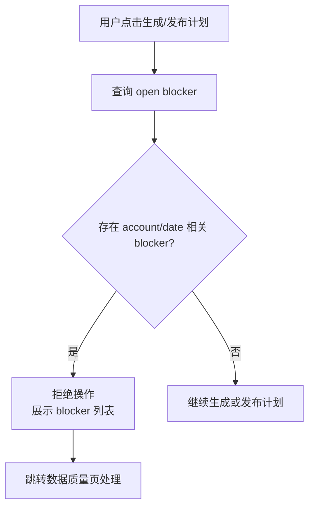

### 操作流：修复并恢复

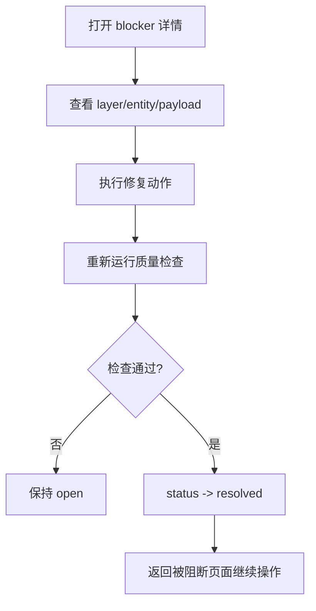

## 8. Agent 复核页

### 页面任务

Agent 复核页展示 TradingAgents 对候选信号的外部研究意见，并证明：

- Agent 看到了什么输入；
- Agent 用了什么配置；
- Agent 输出了什么；
- 这个输出有没有参与交易计划；
- Agent 失败时没有污染策略信号。

### 筛选

| 筛选 | 默认值 | 来源 |
| --- | --- | --- |
| 复盘日 | 最近 20 个交易日 | `agent_runs.as_of_date` |
| 运行状态 | 全部，失败置顶 | `agent_runs.status` |
| 意见 | 全部 | `agent_decisions.action` |
| 风险等级 | 全部 | `agent_decisions.risk_level` |
| 策略信号 | 可输入股票/信号 ID | `signal_id`、`ts_code` |
| 是否绑定计划 | 全部 | `trade_plans.agent_decision_id` |

### 列表字段

| UI 字段 | 数据字段 | 来源 | 展示 |
| --- | --- | --- | --- |
| Agent Run | `agent_run_id` | `agent_runs` | 点击详情 |
| 状态 | `status` | `agent_runs` | planned/running/completed/failed/skipped |
| 复盘日 | `as_of_date` | `agent_runs` | `YYYYMMDD` |
| 股票 | `ts_code/name` | 关联 `strategy_signals` | 链接信号 |
| Daily Pick | `daily_pick_id` | `agent_runs` | 链接每日复盘 |
| 输入快照 | `input_snapshot_id`、`content_hash` | `input_snapshots` | 点击查看 |
| 配置 hash | `config_hash` | `agent_runs` | 折叠显示 |
| 意见 | `agent_decisions.action` | `agent_decisions` | Chip |
| 风险 | `risk_level` | `agent_decisions` | Chip |
| 置信度 | `confidence` | `agent_decisions` | 0-1 |
| 摘要 | `summary` | `agent_decisions` | 2 行截断 |
| 绑定计划 | `trade_plan_id` | `trade_plans` | 有则链接 |
| Artifact | `artifact_refs` | `agent_artifacts` | final_report、raw_state、trace |

### 详情字段

| 区域 | 字段 |
| --- | --- |
| 输入快照 | `snapshot_type`、`as_of_date`、`source_refs_json`、`payload_json`、`content_hash` |
| 运行配置 | `agent_system`、`agent_version`、`config_json`、`config_hash` |
| 输出决策 | `action`、`risk_level`、`confidence`、`summary` |
| 支持因素 | `supporting_points_json` |
| 风险因素 | `risk_points_json` |
| 人工检查项 | `raw_decision_json.suggested_human_checks` |
| Artifacts | `raw_state`、`final_report`、`debug_log`、`tool_trace`、`decision_json` |
| 计划引用 | 关联 `trade_plan`，显示 Agent 是否只是 advisory |

### 操作

| 操作 | 前置条件 | 结果 |
| --- | --- | --- |
| 请求复核 | 有 `daily_pick`，无相同 content_hash 完成运行 | 创建 `input_snapshot`、`agent_run` |
| 重试失败 | `agent_runs.status=failed` | 新建 run，不覆盖旧 run |
| 查看输入 | 有 `input_snapshot_id` | 打开只读 JSON |
| 查看报告 | 有 `final_report` artifact | 打开只读内容 |
| 绑定到计划 | 有 completed decision 和 draft/active plan | 写 `trade_plans.agent_decision_id` |
| 人工确认已读 | 需要人工复核 | 写 `domain_events.agent_review_acknowledged` |

### 操作流：Agent advisory 复核

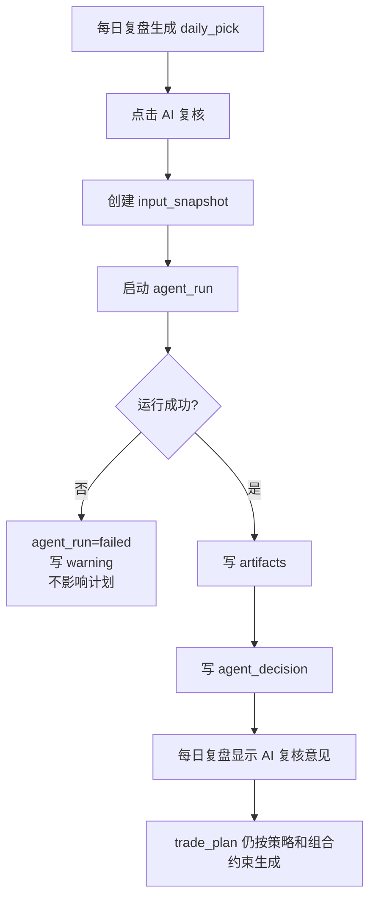

### 操作流：Agent filter 模式

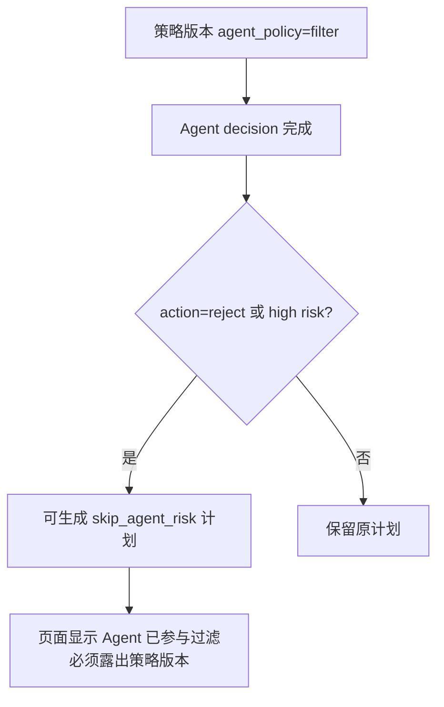

## 9. 端到端操作流

### 收盘后复盘到明日计划

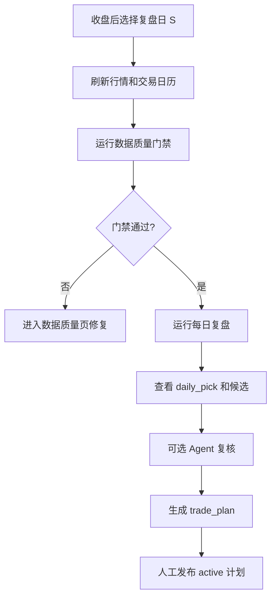

### 次日开盘执行到持仓

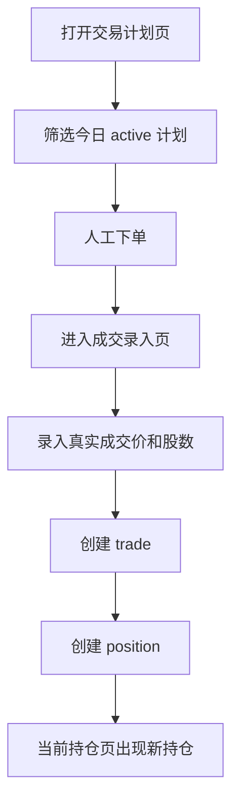

### 退出判断到平仓

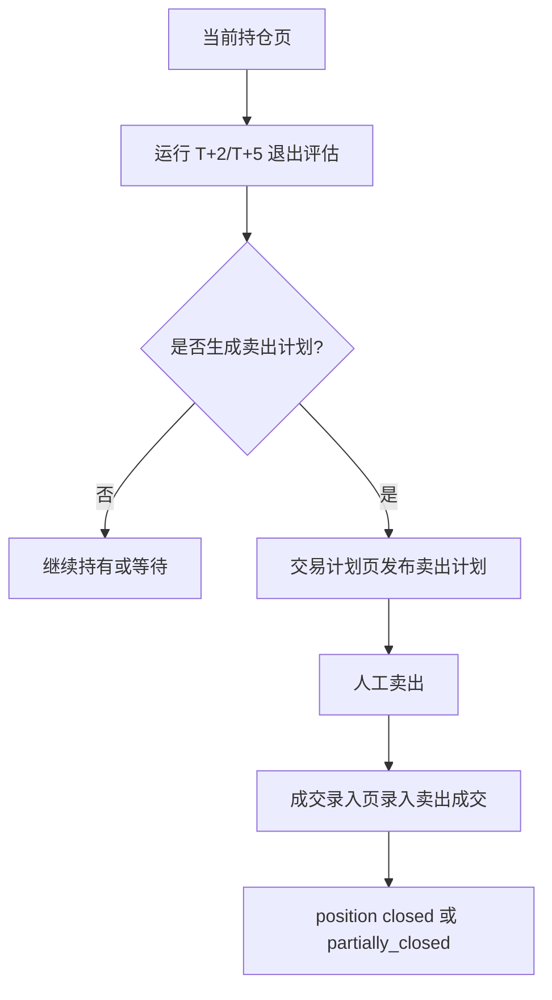

## 10. 空状态与异常状态

| 页面 | 状态 | 文案/行为 |
| --- | --- | --- |
| 每日复盘 | 无候选 | 显示“该复盘日无策略信号”，不显示交易计划卡 |
| 每日复盘 | 行情缺失 | 显示 blocker，主按钮变为“处理数据质量” |
| 交易计划 | 无待处理 | 显示最近已完成计划入口 |
| 成交录入 | 无 active 计划 | 允许从当前持仓发起卖出录入，不允许无计划买入 live |
| 当前持仓 | 无持仓 | 显示账户容量和最近成交，不显示收益曲线 |
| 数据质量 | 无 open 问题 | 显示最近一次检查时间和“门禁通过” |
| Agent 复核 | 无运行 | 显示从每日复盘发起复核的入口 |
| Agent 复核 | 运行失败 | 显示错误摘要和重试按钮，不修改策略信号 |

## 11. 验收清单

首版 Dashboard 设计落地时必须通过：

1. 每日复盘页能显示复盘日、下一交易日、最高分候选、明日动作、仓位容量、数据质量。
2. 有信号且有仓位时，只生成计划，不生成持仓。
3. 成交录入后才出现持仓，并且持仓引用 `entry_trade_id`。
4. 当前持仓收益使用真实/模拟成交价，不使用回测收益。
5. T+2/T+5 日期全部来自交易日历。
6. Agent 复核页面能追溯 `input_snapshot_id`、`agent_run_id`、artifact 和决策。
7. Agent advisory 模式下，`reject` 也不能自动取消计划。
8. open blocker 存在时，生成/发布计划按钮不可用。
9. 取消、过期、修正、冲销都保留原记录并写事件。
10. 回测账户、模拟盘账户、实盘账户切换后数据不串。
