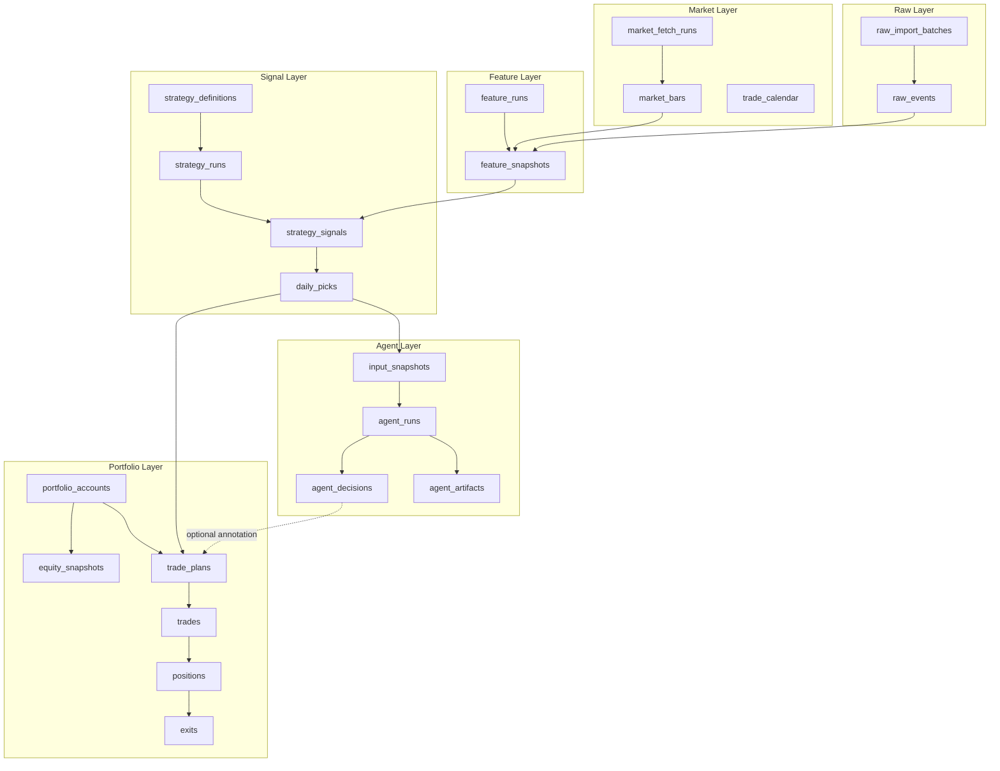

# PGC 数据库与数据血缘设计

日期：2026-05-03

## 1. 设计目标

数据库不是单纯存表，而是保证三件事：

1. 任何信号都能追溯到原始入池事件和当时可见行情。
2. 任何交易都能追溯到策略信号、账户、计划和真实成交。
3. 回测、模拟盘、实盘互不污染。

核心原则：

- Raw 不被修改。
- Market 不被策略写入。
- Feature 可复算但必须有版本。
- Signal 只由策略运行生成。
- Agent 只做旁路研究。
- Portfolio 只记录计划、成交、持仓和资金。
- Report 不作为事实源。

## 2. 分层表设计



## 3. 表级职责

### raw_import_batches

记录一次 PGC 文件导入。

关键字段：

- `id`
- `source_file`
- `source_hash`
- `imported_at`
- `row_count`
- `valid_count`
- `dirty_count`
- `notes`

写入者：PGC Importer  
读取者：审计、回放、数据质量报告

约束：

- 相同 `source_hash` 默认不重复导入。
- 脏数据只记录在质量报告，不从历史中物理删除，除非明确标记为 `invalidated`。

### raw_events

原始入池事实。

关键字段：

- `id`
- `import_batch_id`
- `ts_code`
- `code`
- `name`
- `entry_date`
- `entry_time`
- `entry_price`
- `source`
- `is_valid`
- `invalid_reason`
- `created_at`

唯一键：

- `ts_code + entry_date + entry_time + entry_price`

禁止：

- 不保存收益字段。
- 不保存策略评分。
- 不保存 Agent 意见。
- 不保存交易状态。

### market_fetch_runs

记录一次行情拉取。

关键字段：

- `id`
- `provider`
- `start_date`
- `end_date`
- `ts_code_count`
- `status`
- `fetched_at`
- `manifest_json`

用途：

- 判断行情缓存是否完整。
- 追溯回测使用的行情版本。

### market_bars

日线行情。

关键字段：

- `ts_code`
- `trade_date`
- `open`
- `high`
- `low`
- `close`
- `amount`
- `vol`
- `adj_factor`
- `adj_open`
- `adj_high`
- `adj_low`
- `adj_close`
- `provider`
- `fetch_run_id`
- `updated_at`

主键：

- `ts_code + trade_date`

写入规则：

- 只由 Market Adapter 写入。
- 同一 provider 同一交易日可以覆盖刷新，但必须保留 `fetch_run_id`。

### trade_calendar

交易日历。

关键字段：

- `exchange`
- `cal_date`
- `is_open`
- `pretrade_date`
- `provider`
- `updated_at`

用途：

- 计算 S+1、T+2、T+5。
- 避免节假日手算错误。

### feature_runs

一次特征计算运行。

关键字段：

- `id`
- `feature_version`
- `as_of_date`
- `input_market_fetch_run_id`
- `created_at`
- `status`

### feature_snapshots

某只股票、某个入池事件、某个复盘日的特征快照。

关键字段：

- `id`
- `feature_run_id`
- `raw_event_id`
- `ts_code`
- `review_date`
- `feature_version`
- `features_json`
- `input_hash`
- `created_at`

重要特征：

- `pullback_days`
- `amount_contract_ratio`
- `avg_amount_to_ma10`
- `pullback_close_ret`
- `drawdown_from_peak`
- `bull_body`
- `close_recover`
- `trigger_pct_chg`
- `trigger_amount_to_ma10`
- `entry_runup`

约束：

- `features_json` 只能来自 `review_date` 收盘前可见数据。
- `input_hash` 必须覆盖 raw event、market bars、feature code version。

### strategy_definitions

策略定义。

关键字段：

- `id`
- `strategy_id`
- `strategy_name`
- `description`
- `created_at`
- `status`

示例：

- `cpb_6157`

### strategy_runs

一次策略运行。

关键字段：

- `id`
- `strategy_id`
- `strategy_version`
- `as_of_date`
- `params_json`
- `params_hash`
- `feature_run_id`
- `created_at`
- `status`

约束：

- 同一策略同一日期可以多次运行，但每次必须保留独立 run。
- 报告引用 `strategy_run_id`，不引用“最新结果”。

### strategy_signals

策略候选信号。

关键字段：

- `id`
- `strategy_run_id`
- `feature_snapshot_id`
- `raw_event_id`
- `ts_code`
- `name`
- `review_date`
- `planned_buy_date`
- `score`
- `signal_rank`
- `signal_status`
- `features_json`
- `created_at`

`signal_status`：

- `candidate`
- `daily_pick`
- `skipped_duplicate`
- `skipped_low_score`
- `invalid_insufficient_data`

### daily_picks

每日唯一候选。

关键字段：

- `id`
- `strategy_run_id`
- `signal_id`
- `review_date`
- `planned_buy_date`
- `score`
- `selection_reason`
- `created_at`

说明：

- `strategy_signals` 可以有多个。
- `daily_picks` 每个策略每个复盘日最多一条。

### input_snapshots

传给 TradingAgents 或其他 Agent 的输入快照。

关键字段：

- `id`
- `snapshot_type`
- `as_of_date`
- `signal_id`
- `source_refs_json`
- `payload_json`
- `content_hash`
- `created_at`

约束：

- Agent 只能读取 `payload_json`。
- `payload_json` 必须是脱敏、受控、可复现的内容。

### agent_runs

一次 Agent 运行。

关键字段：

- `id`
- `agent_system`
- `agent_version`
- `signal_id`
- `input_snapshot_id`
- `as_of_date`
- `config_json`
- `config_hash`
- `status`
- `started_at`
- `finished_at`
- `error_message`

状态：

- `planned`
- `running`
- `completed`
- `failed`
- `skipped`

### agent_artifacts

Agent 运行产物。

关键字段：

- `id`
- `agent_run_id`
- `artifact_type`
- `path`
- `content_hash`
- `created_at`

产物类型：

- `raw_state`
- `final_report`
- `debug_log`
- `memory_delta`
- `tool_trace`

### agent_decisions

Agent 最终结构化意见。

关键字段：

- `id`
- `agent_run_id`
- `signal_id`
- `action`
- `confidence`
- `risk_level`
- `summary`
- `supporting_points_json`
- `risk_points_json`
- `raw_decision_json`
- `created_at`

`action`：

- `support`
- `caution`
- `reject`
- `review_required`
- `no_opinion`

注意：

- `agent_decisions` 不能改变 `strategy_signals`。
- 只能作为 `trade_plans` 的可选注释。

### portfolio_accounts

账户。

关键字段：

- `id`
- `name`
- `account_type`
- `initial_cash`
- `max_positions`
- `position_sizing`
- `created_at`

`account_type`：

- `backtest`
- `paper`
- `live`

### trade_plans

每日交易计划。

关键字段：

- `id`
- `account_id`
- `daily_pick_id`
- `signal_id`
- `agent_decision_id`
- `as_of_date`
- `planned_buy_date`
- `action`
- `reason`
- `plan_json`
- `status`
- `created_at`

`action`：

- `buy_next_open`
- `skip_no_cash`
- `skip_max_positions`
- `skip_agent_risk`
- `skip_manual`
- `hold`
- `sell_t2_take_profit`
- `sell_t2_stop_loss`
- `sell_t5_timeout`

首版中 `skip_agent_risk` 只用于人工复核，不自动触发。

### trades

真实或模拟成交。

关键字段：

- `id`
- `account_id`
- `trade_plan_id`
- `signal_id`
- `agent_decision_id`
- `ts_code`
- `name`
- `side`
- `planned_date`
- `executed_date`
- `executed_price`
- `amount`
- `shares`
- `fee`
- `tax`
- `slippage`
- `status`
- `source`
- `created_at`

`source`：

- `model`
- `manual`
- `broker_import`

约束：

- 实盘交易必须有 `executed_price`。
- 不能用 `planned_buy_date` 推导真实成交。

### positions

持仓生命周期。

关键字段：

- `id`
- `account_id`
- `signal_id`
- `entry_trade_id`
- `exit_trade_id`
- `ts_code`
- `name`
- `buy_date`
- `buy_price`
- `shares`
- `cost`
- `planned_t2_date`
- `planned_t5_date`
- `status`
- `created_at`
- `closed_at`

状态：

- `open`
- `planned_exit`
- `closed`
- `cancelled`

### exits

退出判断。

关键字段：

- `id`
- `position_id`
- `decision_date`
- `decision_stage`
- `ret`
- `reason`
- `planned_exit_date`
- `executed_exit_trade_id`
- `created_at`

`decision_stage`：

- `t2`
- `t5`
- `manual`

`reason`：

- `take_profit_ge3`
- `stop_loss_le_neg3`
- `hold_middle_to_t5`
- `timeout_t5`
- `manual_override`

### equity_snapshots

账户资产快照。

关键字段：

- `id`
- `account_id`
- `as_of_date`
- `cash`
- `market_value`
- `total_equity`
- `realized_pnl`
- `unrealized_pnl`
- `created_at`

唯一键：

- `account_id + as_of_date`

## 4. 数据血缘链路

### 信号血缘

```text
raw_events
  -> feature_snapshots
  -> strategy_signals
  -> daily_picks
```

每个 `daily_pick` 必须能回查：

- 原始入池事件；
- 当时行情；
- 特征版本；
- 策略参数；
- 策略运行 ID。

### Agent 血缘

```text
daily_picks
  -> input_snapshots
  -> agent_runs
  -> agent_artifacts
  -> agent_decisions
```

每个 `agent_decision` 必须能回查：

- 输入快照；
- Agent 配置；
- 模型版本；
- 原始输出；
- 结构化解析结果。

### 交易血缘

```text
daily_picks
  -> trade_plans
  -> trades
  -> positions
  -> exits
  -> equity_snapshots
```

每笔实盘交易必须能回查：

- 为什么买；
- 谁建议；
- 何时计划；
- 何时真实成交；
- T+2/T+5 如何判断；
- 对账户资金影响。

## 5. 不变量

系统必须长期满足以下不变量：

1. `raw_events` 不引用任何下游表。
2. `market_bars` 不引用策略或账户。
3. `strategy_signals` 不引用账户。
4. `agent_decisions` 不引用持仓。
5. `trade_plans` 必须引用账户。
6. `trades` 必须引用账户。
7. `positions` 必须引用账户。
8. `equity_snapshots` 必须引用账户。
9. `live` 账户不得读取 `backtest` 账户持仓作为当前状态。
10. Agent 输出不得更新 strategy signal 状态。

## 6. 查询边界

### 今日复盘查询

读：

- `raw_events`
- `market_bars`
- `feature_snapshots`
- `strategy_signals`
- `daily_picks`
- `portfolio_accounts`
- `positions`
- 可选 `agent_decisions`

写：

- `strategy_runs`
- `feature_runs`
- `feature_snapshots`
- `strategy_signals`
- `daily_picks`
- `trade_plans`
- `reports`

### 成交录入

读：

- `trade_plans`
- `portfolio_accounts`

写：

- `trades`
- `positions`
- `equity_snapshots`

### T+2 判断

读：

- `positions`
- `market_bars`
- `portfolio_accounts`

写：

- `exits`
- `trade_plans`
- `trades`
- `positions`
- `equity_snapshots`

## 7. 数据质量检查

每日复盘前必须检查：

1. PGC 原始事件是否有重复。
2. `entry_date` 是否为交易日或可映射到最近交易日。
3. 行情是否覆盖到最新复盘日。
4. 复权因子是否缺失。
5. T+2/T+5 交易日是否能通过交易日历推导。
6. 当前持仓是否超过最大持仓数。
7. 同一账户是否存在重复 open position。
8. 实盘账户是否有未录入成交价的计划。

## 8. 迁移策略

首版可以用 SQLite，但 schema 必须按迁移脚本演进。

迁移规则：

- 每次 schema 修改新增 migration 文件。
- migration 只前进，不回滚历史事实。
- 改表不直接删字段，先废弃字段。
- 重要枚举新增值必须同步文档。
- 数据修复必须写入 `data_quality_events`，不要静默修。

可选新增表：

### data_quality_events

- `id`
- `layer`
- `entity_type`
- `entity_id`
- `severity`
- `issue_type`
- `description`
- `resolution`
- `created_at`

## 9. 最小可用 schema 范围

MVP 必须先有：

- `raw_import_batches`
- `raw_events`
- `market_fetch_runs`
- `market_bars`
- `trade_calendar`
- `feature_runs`
- `feature_snapshots`
- `strategy_definitions`
- `strategy_runs`
- `strategy_signals`
- `daily_picks`
- `portfolio_accounts`
- `trade_plans`
- `trades`
- `positions`
- `exits`
- `equity_snapshots`

TradingAgents 接入前再加：

- `input_snapshots`
- `agent_runs`
- `agent_artifacts`
- `agent_decisions`

## 10. 设计裁剪

为了首版快速落地，可以先不做：

- 分钟线；
- 自动下单；
- 多策略资金分配；
- PostgreSQL；
- 多用户权限；
- WebSocket 实时推送。

但不能裁剪：

- 账户隔离；
- 输入快照；
- 策略运行版本；
- 实盘成交价；
- T+2/T+5 退出判断记录。
