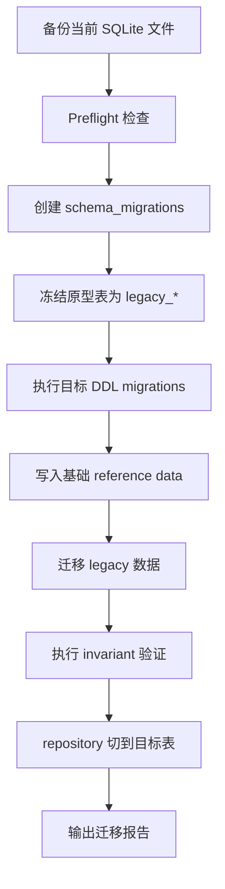

# PGC 数据库迁移执行方案设计

日期：2026-05-03

## 1. 设计目标

这份文档专门细化 M1 阶段：如何从当前原型 SQLite schema 迁移到目标分层 schema。

目标不是立刻写代码，而是先把迁移执行规则定死，避免开发时出现三类风险：

1. 新旧同名表混用，读错数据；
2. 迁移时覆盖或删除已有研究资产；
3. 目标 schema 虽然建出来，但 lineage、account、state machine 约束不完整。

核心结论：

- 迁移 runner 先落地，再做任何结构迁移；
- 当前原型表先冻结为 `legacy_*`，再创建 canonical 目标表；
- DDL migration 只做结构，legacy data migration 单独执行；
- 旧数据无法补齐血缘时，不硬编假数据，写 `data_quality_events`；
- 回测、paper、live 数据迁移时必须显式 `account_id`；
- P0 不做 destructive down migration，回滚方式是迁移前数据库备份。

## 2. 当前状态判断

当前代码状态：

| 文件 | 当前职责 | 迁移后定位 |
| --- | --- | --- |
| `src/pgc_trading/storage/schema.sql` | 原型全量建表 | 保留为 legacy 参考，后续不作为生产迁移源 |
| `src/pgc_trading/storage/database.py` | connect/init_db/简单 `_migrate` | 改为调用 migration runner |
| `data/pgc_trading.db` | 当前原型库 | 迁移前必须备份 |
| `scripts/init_trading_db.py` | 原型初始化入口 | 后续改为 CLI 或 migration runner wrapper |

当前原型表包括：

```text
raw_events
market_bars
strategy_runs
signals
input_snapshots
agent_runs
agent_artifacts
agent_decisions
portfolio_accounts
trades
trade_plans
positions
exits
equity_snapshots
```

目标 schema 中大量表与这些原型表同名，但字段、外键和约束不同。因此不能直接在原库上执行 `CREATE TABLE IF NOT EXISTS`。

## 3. 迁移执行总流程



执行顺序必须是：

1. 备份数据库；
2. 检查当前库是否是原型 schema、目标 schema 或混合 schema；
3. 创建 `schema_migrations`；
4. 如果检测到原型同名表，冻结为 `legacy_*`；
5. 创建目标表；
6. 写入必要 reference data；
7. 从 legacy 表迁移可用数据；
8. 运行不变量检查；
9. 生产 repository 只读目标表；
10. 输出迁移报告。

## 4. 迁移目录设计

目标目录：

```text
src/pgc_trading/storage/
  database.py
  migrations/
    001_schema_quality.sql
    002_raw_market.sql
    003_accounts.sql
    004_meta.sql
    005_strategy_governance.sql
    006_feature_signal.sql
    007_agent.sql
    008_portfolio.sql
    009_research_views.sql
    010_legacy_compat_views.sql
  migrators/
    legacy_detector.py
    legacy_freezer.py
    legacy_raw_market_migrator.py
    legacy_strategy_migrator.py
    legacy_agent_migrator.py
    legacy_portfolio_migrator.py
    invariant_checks.py
```

规则：

- `migrations/*.sql` 只包含结构 DDL 和视图；
- `migrators/*.py` 处理条件判断、表重命名、旧数据搬迁；
- migration runner 负责事务、版本记录、错误处理；
- 数据迁移必须能 dry-run；
- 所有迁移报告写到 `reports/migrations/` 或 stdout，不写 token。

## 5. Migration Runner 设计

### M1-001 范围

`MigrationRunner` 负责：

- 连接数据库并启用 `PRAGMA foreign_keys = ON`；
- bootstrap `schema_migrations`；
- 按文件名排序执行未应用 migration；
- 每个 migration 独立事务；
- 成功后写入 `schema_migrations`；
- 失败时回滚当前 migration；
- 输出 applied/skipped/failed summary。

### schema_migrations

P0 结构沿用目标 DDL：

```sql
CREATE TABLE IF NOT EXISTS schema_migrations (
  version TEXT PRIMARY KEY,
  name TEXT NOT NULL,
  applied_at TEXT NOT NULL DEFAULT CURRENT_TIMESTAMP
);
```

版本解析：

| 文件 | version | name |
| --- | --- | --- |
| `001_schema_quality.sql` | `001` | `schema_quality` |
| `002_raw_market.sql` | `002` | `raw_market` |
| `010_legacy_compat_views.sql` | `010` | `legacy_compat_views` |

### 事务规则

- 每个 SQL migration 用一个事务；
- migration 内不允许使用会隐式提交的外部 shell 操作；
- DDL 失败必须不记录 `schema_migrations`；
- data migration 也要通过 `operation_requests` 或独立迁移报告实现幂等。

### 执行命令设计

后续 CLI 可以暴露：

```bash
pgc db migrate --db-path data/pgc_trading.db
pgc db migrate --dry-run
pgc db verify
pgc db legacy-freeze --dry-run
pgc db legacy-migrate --dry-run
```

P0 如果 CLI 还未完成，可以先用脚本入口：

```bash
python -m pgc_trading.storage.migrate --db-path data/pgc_trading.db
```

## 6. Legacy Freeze 设计

### 为什么需要 freeze

当前原型表与目标表同名，但结构不同。例如：

| 表 | 原型问题 | 目标要求 |
| --- | --- | --- |
| `raw_events` | 无 `import_batch_id/is_valid/invalid_reason` | 需要导入批次和脏数据状态 |
| `market_bars` | 无 `fetch_run_id/vol/provider` | 需要行情拉取血缘 |
| `signals` | 混合 feature 与 signal，daily pick 用字段表示 | 需要拆成 `strategy_signals` 和 `daily_picks` |
| `trades` | `price` 字段语义不清 | 需要 `executed_price`、费用、来源和状态机 |
| `positions` | 无 `entry_trade_id` | 必须由成交创建 |
| `exits` | 退出和卖出成交混合 | 拆成 `exit_decisions` 和 sell trade |

如果不 freeze，目标 migration 会因为同名表存在而跳过，系统表面上“迁移成功”，实际仍在用原型 schema。

### Freeze 策略

检测到原型表时，将其重命名：

| 原型表 | 冻结后 |
| --- | --- |
| `raw_events` | `legacy_raw_events` |
| `market_bars` | `legacy_market_bars` |
| `strategy_runs` | `legacy_strategy_runs` |
| `signals` | `legacy_signals` |
| `input_snapshots` | `legacy_input_snapshots` |
| `agent_runs` | `legacy_agent_runs` |
| `agent_artifacts` | `legacy_agent_artifacts` |
| `agent_decisions` | `legacy_agent_decisions` |
| `portfolio_accounts` | `legacy_portfolio_accounts` |
| `trades` | `legacy_trades` |
| `trade_plans` | `legacy_trade_plans` |
| `positions` | `legacy_positions` |
| `exits` | `legacy_exits` |
| `equity_snapshots` | `legacy_equity_snapshots` |

Freeze 规则：

- 只在检测到“原型 schema”时执行；
- 如果目标表已存在，不执行 freeze；
- 如果 `legacy_*` 已存在，不能覆盖，必须停止并提示人工处理；
- freeze 前必须备份；
- freeze 后旧表只读，不再作为生产入口。

### 原型 schema 检测

以字段差异判断，而不是仅判断表名：

| 表 | 原型特征 |
| --- | --- |
| `raw_events` | 缺少 `import_batch_id` |
| `market_bars` | 缺少 `fetch_run_id` |
| `signals` | 表名为 `signals`，目标应为 `strategy_signals` |
| `trades` | 存在 `price`，缺少 `executed_price` |
| `positions` | 缺少 `entry_trade_id` |
| `exits` | 表名为 `exits`，目标应为 `exit_decisions` |

状态分类：

| 状态 | 判断 | 动作 |
| --- | --- | --- |
| empty | 无核心表 | 直接跑 DDL |
| legacy | 有原型表，无目标表 | freeze + DDL + data migration |
| target | 目标表完整 | 只执行未应用 migration |
| mixed | 同时有原型同名表和部分目标表 | 停止，人工检查 |

## 7. SQL Migration 文件顺序

### 001_schema_quality.sql

职责：

- `data_quality_events`

不包含：

- `schema_migrations`，由 runner bootstrap；
- `operation_requests`，它需要 account 外键，放到 004。

验收：

- 可以写入 blocker；
- status/severity/layer CHECK 生效。

### 002_raw_market.sql

职责：

- `raw_import_batches`
- `raw_events`
- `market_fetch_runs`
- `trade_calendar`
- `market_bars`
- `daily_basic_snapshots`

不包含：

- feature 计算；
- legacy 数据搬迁；
- Tushare 拉取。

验收：

- raw 层只保存入池事实；
- market 层能追溯 `fetch_run_id`；
- `market_bars(ts_code, trade_date)` 主键生效；
- `trade_calendar(exchange, cal_date)` 主键生效。

### 003_accounts.sql

职责：

- `portfolio_accounts`

不包含：

- 默认实盘账户；
- 默认 paper 资金写死；
- trades/positions。

验收：

- `account_key` 唯一；
- `account_type` 只能是 `backtest/paper/live`；
- `position_sizing` 枚举生效。

### 004_meta.sql

职责：

- `operation_requests`
- `domain_events`

不包含：

- 具体业务事件写入；
- CLI/API 入口。

验收：

- `operation_requests.idempotency_key` 唯一；
- `domain_events.account_id` 可引用账户；
- source 枚举生效。

### 005_strategy_governance.sql

职责：

- `strategy_families`
- `strategy_versions`
- `parameter_sets`
- `strategy_deployments`

不包含：

- 策略运行结果；
- 参数调优结果；
- 自动部署 live。

验收：

- `strategy_version` 唯一；
- `agent_policy` 默认为 `advisory`；
- strategy deployment 必须绑定 account。

### 006_feature_signal.sql

职责：

- `feature_runs`
- `feature_snapshots`
- `strategy_runs`
- `strategy_signals`
- `daily_picks`

不包含：

- Agent；
- trade plan；
- backtest trade。

验收：

- feature snapshot 绑定 raw event；
- strategy signal 绑定 strategy run；
- daily pick 每个 strategy run + review date 最多一条；
- signal 表不含成交和持仓字段。

### 007_agent.sql

职责：

- `input_snapshots`
- `agent_runs`
- `agent_artifacts`
- `agent_decisions`

不包含：

- 调用 TradingAgents；
- 让 Agent 改 signal；
- 让 Agent 改 plan。

验收：

- input snapshot 可绑定 daily pick；
- Agent action/risk 枚举生效；
- agent decision 每个 run 最多一条；
- artifact 有唯一约束。

### 008_portfolio.sql

职责：

- `trade_plans`
- `trades`
- `positions`
- `exit_decisions`
- `equity_snapshots`

不包含：

- 自动下单；
- 成交导入；
- 资金重算。

验收：

- plan/trade/position/exit/equity 分表；
- `positions.entry_trade_id` 必填；
- `trades.executed_price` 语义清晰；
- `equity_snapshots(account_id, as_of_date, snapshot_type)` 唯一。

### 009_research_views.sql

职责：

- `research_experiments`
- `backtest_runs`
- `backtest_trades`
- `v_daily_review`
- `v_open_positions`

不包含：

- 回测结果迁移；
- Dashboard 业务逻辑。

验收：

- 回测交易不写 `trades`；
- views 只读展示；
- daily review view 可串联 strategy、plan、agent。

### 010_legacy_compat_views.sql

职责：

- 为过渡期创建只读兼容视图；
- 方便旧报告或人工查询。

建议视图：

```text
signals_legacy_view
exits_legacy_view
trades_legacy_view
```

不包含：

- 让 production repository 继续读取 legacy；
- 更新 legacy 表。

验收：

- 旧查询可临时查看；
- 新服务不依赖这些 view；
- 文档明确这些 view 将来可删除。

## 8. Reference Data Bootstrap

DDL 完成后，需要写入基础 reference data，但这不应该混在 DDL 里。

### 必要 reference data

| 数据 | 写入表 | 来源 |
| --- | --- | --- |
| `cpb` strategy family | `strategy_families` | 当前系统设计 |
| `cpb_6157@2026-05-03` | `strategy_versions` | 当前最优策略版本 |
| 参数 JSON/hash | `parameter_sets` | 当前研究结果 |
| paper main account | `portfolio_accounts` | 用户配置 |

### 写入规则

- 通过 `BootstrapService` 或 `seed_reference_data.py`；
- 使用唯一键幂等 upsert；
- 不写真实 token；
- 不自动创建 live account；
- paper account 初始资金从配置读取，不在 migration SQL 写死。

### cpb_6157 reference 说明

`cpb_6157@2026-05-03` 应保存：

- strategy family: `contracting_pullback`;
- strategy key: `cpb_6157`;
- strategy version: `cpb_6157@2026-05-03`;
- agent policy: `advisory`;
- status: 初始建议 `paper` 或 `candidate`；
- params hash；
- params JSON。

## 9. Legacy Data Migration 设计

Legacy 数据迁移分为结构迁移之后的单独步骤。

### legacy_raw_market_migrator.py

输入：

- `legacy_raw_events`
- `legacy_market_bars`

输出：

- `raw_import_batches`
- `raw_events`
- `market_fetch_runs`
- `market_bars`

规则：

- 创建一条 `raw_import_batches(source_file='legacy_schema')`；
- raw events 默认 `is_valid = 1`；
- 已知脏数据，例如隆化科技，标记 `is_valid = 0`；
- market bars 创建一条 `market_fetch_runs(provider='legacy_cache')`；
- 旧 market 的 `amount/adj_*` 原样迁移；
- 旧表没有 `vol` 时写 NULL；
- 缺失 `fetch_run_id` 的数据统一指向 legacy fetch run。

验收：

- raw 行数对账；
- market 行数对账；
- 脏数据不参与 valid raw 查询；
- 迁移报告列出 invalid rows。

### legacy_strategy_migrator.py

输入：

- `legacy_strategy_runs`
- `legacy_signals`

输出：

- `strategy_runs`
- `strategy_signals`
- `daily_picks`

规则：

- legacy strategy run 映射到 `cpb_6157@2026-05-03`；
- 原 `signals.run_id` 映射到新 `strategy_runs.id`；
- 原 `signals.event_id` 映射到新 `raw_events.id`；
- 原 `signals.buy_date` 映射为 `planned_buy_date`；
- 原 `signals.features_json` 原样进入 `strategy_signals.features_json`；
- `is_daily_pick = 1` 生成 `daily_picks`；
- 如果无法找到 raw event，写 `data_quality_events`，该 signal 不迁移或标记 invalid。

验收：

- legacy signal 数与迁移数/跳过数对账；
- daily pick 数等于 legacy `is_daily_pick=1` 可迁移数；
- strategy signal 不写成交字段。

### legacy_agent_migrator.py

输入：

- `legacy_input_snapshots`
- `legacy_agent_runs`
- `legacy_agent_artifacts`
- `legacy_agent_decisions`

输出：

- `input_snapshots`
- `agent_runs`
- `agent_artifacts`
- `agent_decisions`

规则：

- 能通过 legacy signal 找到新 signal/daily pick 时建立引用；
- 旧 snapshot 没有 `payload_json` 时，把原内容放到受控字段并记录 data quality warning；
- Agent 原始输出不改写；
- 如果 action 不在目标枚举中，写 `no_opinion` 并记录 warning；
- artifact path 必须检查是否在项目目录。

验收：

- Agent 迁移不修改 strategy_signals；
- Agent 迁移不生成 trade plan；
- invalid JSON 不阻断整体迁移，但要写 warning。

### legacy_portfolio_migrator.py

输入：

- `legacy_portfolio_accounts`
- `legacy_trade_plans`
- `legacy_trades`
- `legacy_positions`
- `legacy_exits`
- `legacy_equity_snapshots`

输出：

- `portfolio_accounts`
- `trade_plans`
- `trades`
- `positions`
- `exit_decisions`
- `equity_snapshots`

规则：

- legacy account 缺 `account_key` 时生成稳定 key，例如 `paper-main-legacy`；
- `trades.price` 映射为 `trades.executed_price`；
- legacy trade 没有 `trade_plan_id` 时允许为空，但写 data quality warning；
- position 必须补 `entry_trade_id`，如果无法补齐，则不迁移为正式 open position，写 blocker；
- legacy exits 不直接当作卖出成交；
- legacy exits 如果有 `executed_exit_date/executed_price` 但无 sell trade，写 blocker，待人工补录；
- equity snapshots 可以迁移，但应允许后续重算。

验收：

- 任何 migrated position 都有 entry trade；
- live/paper/backtest account type 不混；
- sell trade 与 exit decision 不硬编；
- 迁移报告列出需要人工处理的 position/exit。

## 10. 数据质量事件规范

迁移过程中遇到无法可靠补齐的数据，不允许“猜一个值”。

### 事件代码

| event_code | severity | 场景 |
| --- | --- | --- |
| `LEGACY_RAW_DIRTY_EVENT` | warning/error | legacy raw 中存在已知脏数据 |
| `LEGACY_SIGNAL_MISSING_RAW` | error | signal 找不到 raw event |
| `LEGACY_POSITION_MISSING_ENTRY_TRADE` | blocker | position 找不到买入成交 |
| `LEGACY_EXIT_MISSING_SELL_TRADE` | blocker | exit 有卖出结果但无卖出成交 |
| `LEGACY_AGENT_INVALID_ACTION` | warning | Agent action 不在枚举 |
| `LEGACY_ARTIFACT_OUTSIDE_PROJECT` | warning/error | Agent artifact 路径不在项目目录 |
| `LEGACY_ACCOUNT_TYPE_UNKNOWN` | blocker | 无法判断账户类型 |

### 处理原则

- warning 可以迁移，但报告提示；
- error 可以跳过该实体；
- blocker 阻断进入 paper/live；
- 所有 skipped row 必须有原因。

## 11. Invariant 验证

迁移后必须执行这些检查。

### SQLite 内置检查

```sql
PRAGMA foreign_key_check;
PRAGMA integrity_check;
```

验收：

- `foreign_key_check` 返回 0 行；
- `integrity_check` 返回 `ok`。

### Raw 边界检查

```sql
PRAGMA table_info(raw_events);
```

验收：

- 不存在 `bull_prob`;
- 不存在 `bull_reason`;
- 不存在 `latest_ret`;
- 不存在 `max_high`;
- 不存在 `status`。

### 每日唯一 pick

```sql
SELECT strategy_run_id, review_date, COUNT(*) AS cnt
FROM daily_picks
GROUP BY strategy_run_id, review_date
HAVING cnt > 1;
```

验收：返回 0 行。

### Position 必须有 entry trade

```sql
SELECT p.id
FROM positions p
LEFT JOIN trades t ON t.id = p.entry_trade_id
WHERE t.id IS NULL;
```

验收：返回 0 行。

### 成交与持仓账户一致

```sql
SELECT p.id AS position_id, p.account_id AS position_account, t.account_id AS trade_account
FROM positions p
JOIN trades t ON t.id = p.entry_trade_id
WHERE p.account_id <> t.account_id;
```

验收：返回 0 行。

### Backtest 不进入实盘 trades

```sql
SELECT id
FROM trades
WHERE source = 'model'
  AND account_id IN (
    SELECT id FROM portfolio_accounts WHERE account_type = 'live'
  );
```

验收：返回 0 行。

### Agent 不污染 signal

检查方式：

- `strategy_signals` 表不含 agent 字段；
- `agent_decisions` 只通过 `agent_decision_id` 被 trade plan 可选引用。

验收：

- `PRAGMA table_info(strategy_signals)` 中不存在 `agent_action/agent_reason/agent_confidence`。

## 12. 迁移报告设计

每次迁移输出一份报告。

建议路径：

```text
reports/migrations/
  20260503_230000_migration_report.md
```

报告内容：

- 数据库路径；
- 备份路径；
- schema state: empty/legacy/target/mixed；
- applied migrations；
- skipped migrations；
- legacy tables frozen；
- row count before/after；
- data quality events summary；
- invariant check results；
- next manual actions。

### Row count 对账

报告应包含：

| legacy table | legacy rows | target table | migrated rows | skipped rows |
| --- | ---: | --- | ---: | ---: |
| `legacy_raw_events` | n | `raw_events` | n | n |
| `legacy_market_bars` | n | `market_bars` | n | n |
| `legacy_signals` | n | `strategy_signals` | n | n |
| `legacy_trades` | n | `trades` | n | n |
| `legacy_positions` | n | `positions` | n | n |

## 13. 回滚方案

P0 不实现逐条 down migration。

原因：

- SQLite DDL 回滚复杂；
- 当前核心诉求是保护研究资产；
- restore backup 比反向 DDL 更可靠。

### 回滚方式

| 阶段 | 回滚 |
| --- | --- |
| freeze 前失败 | 不修改库，直接退出 |
| freeze 后 DDL 前失败 | restore backup |
| DDL 后 data migration 前失败 | restore backup |
| data migration 后 invariant 失败 | restore backup 或保留库做诊断 |
| paper/live 已开始后 | 不 restore live 库，使用 correction/reversal |

### 备份规则

迁移前复制：

```text
data/pgc_trading.db
-> data/backups/pgc_trading_YYYYMMDD_HHMMSS_before_migration.db
```

要求：

- 备份文件存在才允许继续；
- 备份路径进入迁移报告；
- 不覆盖已有备份。

## 14. 开发落地顺序

推荐按下面顺序实现 M1：

```text
M1-A: MigrationRunner bootstrap schema_migrations
M1-B: legacy detector dry-run
M1-C: database backup helper
M1-D: legacy freezer
M1-E: 001-004 基础 DDL
M1-F: 005-009 业务 DDL
M1-G: 010 legacy compat views
M1-H: invariant checks
M1-I: legacy raw/market data migrator
M1-J: legacy strategy migrator
M1-K: legacy portfolio migrator
```

最小可交付切片：

```text
MigrationRunner + Backup + LegacyDetector + 001_schema_quality.sql
```

这个切片完成后，才能继续创建大量目标表。

## 15. M1 验收清单

M1 完成时必须满足：

- 空库可以完整初始化；
- 原型库可以被识别为 legacy；
- 原型库迁移前自动备份；
- legacy 表被冻结，不覆盖；
- 目标 canonical 表创建成功；
- `schema_migrations` 记录完整；
- `PRAGMA foreign_keys = ON`；
- `PRAGMA foreign_key_check` 返回 0 行；
- `PRAGMA integrity_check` 返回 `ok`；
- raw 表不含未来表现字段；
- position 表要求 `entry_trade_id`；
- legacy 数据迁移报告列出所有 skipped/blocker；
- 新 repository 后续只读目标表。

## 16. 关键 ADR

### ADR-MIG-001: 原型表先 freeze，再创建 canonical 目标表

Context：当前原型表和目标表大量同名，但字段与约束不同。SQLite 的 `CREATE TABLE IF NOT EXISTS` 无法升级已有表结构。

Options：

- 原地 `ALTER TABLE`；
- 新建 `_v2` 表并长期使用；
- freeze 原型表为 `legacy_*`，再创建 canonical 目标表。

Decision：选择 freeze 原型表，再创建 canonical 目标表。

Consequences：

- 好处：生产代码始终面对目标表名；
- 好处：旧数据完整保留；
- 代价：需要 legacy data migrator；
- 风险：如果 freeze 中断，需要依赖备份恢复。

### ADR-MIG-002: DDL migration 与 data migration 分离

Context：结构迁移和旧数据搬迁的失败模式不同。DDL 可以事务回滚，旧数据搬迁需要对账、跳过和人工处理。

Options：

- SQL 文件里同时建表和搬数据；
- 全部用 Python 动态建表；
- SQL DDL 和 Python data migrator 分离。

Decision：SQL DDL 和 Python data migrator 分离。

Consequences：

- 好处：结构清晰，便于 review；
- 好处：数据迁移可以 dry-run 和输出报告；
- 代价：实现文件更多；
- 风险：需要严格文档避免漏跑 data migration。

### ADR-MIG-003: P0 不做 down migration，依赖数据库备份回滚

Context：SQLite 表结构回滚容易在外键、视图、索引和数据迁移之间产生二次风险。

Options：

- 每个 migration 写 down SQL；
- 只前进，不提供回滚；
- 迁移前强制备份，失败 restore backup。

Decision：P0 使用强制备份作为回滚机制。

Consequences：

- 好处：保护当前研究资产；
- 好处：实现简单可靠；
- 代价：不能细粒度回滚某一张表；
- 风险：迁移后如果继续写入 paper/live，不能再用旧备份覆盖，需要 correction/reversal。

## 17. 下一步

如果继续设计，下一份应该细化：

```text
Application Service 接口设计
```

重点定义：

- Python class method signatures；
- DTO/request/response；
- transaction boundaries；
- repository 调用规则；
- CLI/API 如何复用同一服务。

如果进入开发，第一张实现票仍然是：

```text
M1-001: 实现 migration runner 和 schema_migrations
```
