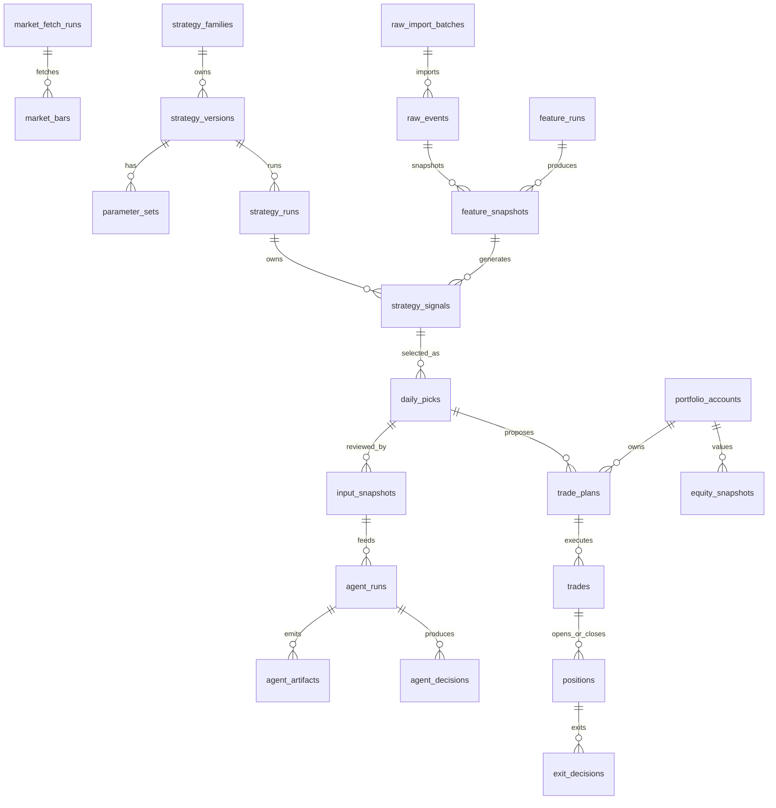

# PGC 数据库详细 DDL 设计

日期：2026-05-03

## 1. 设计目标

这份文档把前面的数据血缘、状态机、策略治理和 API 契约落成目标 SQLite schema。

目标不是一次性把所有表都开发完，而是先把表边界、主键、外键、唯一约束、索引、状态枚举和迁移路线定清楚。后续开发时，只能从这份目标 schema 里拆阶段实施，不能临时把字段塞进不属于它的表。

核心原则：

- Raw、Market、Feature、Signal、Agent、Portfolio、Report 分层存储。
- 写入事实表必须能追溯到 run、account、strategy_version 或 input snapshot。
- 回测、模拟盘、实盘必须通过 `account_id` 隔离。
- 策略信号不能直接生成持仓；持仓只能由成交生成。
- Agent 输出不能覆盖策略信号。
- 所有可重复触发的写操作必须通过 `operation_requests` 支持幂等。
- 所有人工修正必须留痕，不允许静默覆盖。

## 2. 当前原型与目标 schema 的关系

当前已有 `src/pgc_trading/storage/schema.sql`，它适合作为 MVP 原型，但不是最终目标 schema。

主要差异：

| 当前原型表 | 目标表 | 处理方式 |
| --- | --- | --- |
| `raw_events` | `raw_import_batches` + `raw_events` | 补导入批次、有效性字段 |
| `market_bars` | `market_fetch_runs` + `trade_calendar` + `market_bars` | 补 fetch run 和交易日历 |
| `strategy_runs` | `strategy_families` + `strategy_versions` + `strategy_runs` | 补策略治理 |
| `signals` | `strategy_signals` + `daily_picks` | 拆候选信号和每日唯一 pick |
| `input_snapshots` | `input_snapshots` | 补 `signal_id` 和 `payload_json` |
| `agent_runs` | `agent_runs` | 补错误信息和状态约束 |
| `agent_artifacts` | `agent_artifacts` | 保留 |
| `agent_decisions` | `agent_decisions` | 补 supporting/risk points |
| `trade_plans` | `trade_plans` | 补 `daily_pick_id`、计划日期和状态机字段 |
| `trades` | `trades` | 字段更名：`price` -> `executed_price` |
| `positions` | `positions` | 补 entry/exit trade 引用和状态 |
| `exits` | `exit_decisions` | 更名并强化状态机 |
| `equity_snapshots` | `equity_snapshots` | 补 snapshot type |

迁移原则：

- 当前原型表不直接删。
- 先创建目标表。
- 再用迁移脚本从旧表补数据。
- 最后建立兼容视图，例如 `signals_legacy_view`。
- 等业务完全切到目标表后，再冻结旧表。

## 3. 通用约定

### 日期格式

| 字段类型 | 格式 | 示例 |
| --- | --- | --- |
| 交易日 | `YYYYMMDD` | `20260430` |
| 时间戳 | ISO-like text | `2026-05-03T21:30:00+08:00` |
| 月份 | `YYYYMM` | `202604` |

交易日期统一用 Tushare 风格 `YYYYMMDD`，便于和行情文件、交易日历对齐。

### 金额与价格

SQLite 首版使用 `REAL` 保存价格、收益率和金额。

约束：

- 金额字段不能为负，除非明确是 PnL。
- 股数使用 `INTEGER`。
- A 股买入股数校验在服务层按 100 股整数倍处理，数据库只做基础非负校验。

### JSON 字段

SQLite 首版用 `TEXT` 保存 JSON：

- `params_json`
- `features_json`
- `payload_json`
- `config_json`
- `plan_json`
- `raw_decision_json`

应用层必须保证：

- JSON key 排序后计算 hash；
- 不写入未来收益字段；
- 不写入 token、券商账号等敏感信息。

### Hash 字段

hash 使用 SHA-256 hex。

命名规则：

- 源文件：`source_hash`
- 特征输入：`input_hash`
- Agent 输入：`content_hash`
- 策略参数：`params_hash`
- Agent 配置：`config_hash`

## 4. 分层 ER 图



## 5. Meta 与审计层 DDL

说明：`operation_requests` 和 `domain_events` 逻辑上属于 Meta 层，但它们含有可选 `account_id` 外键。物理迁移时应先创建 `portfolio_accounts`，再创建这两张表，或者确认迁移工具允许 SQLite 的前向外键引用。

### schema_migrations

记录已执行迁移。

```sql
CREATE TABLE IF NOT EXISTS schema_migrations (
  version TEXT PRIMARY KEY,
  name TEXT NOT NULL,
  applied_at TEXT NOT NULL DEFAULT CURRENT_TIMESTAMP
);
```

### operation_requests

支持 CLI/API/定时任务幂等。

```sql
CREATE TABLE IF NOT EXISTS operation_requests (
  id INTEGER PRIMARY KEY AUTOINCREMENT,
  idempotency_key TEXT NOT NULL UNIQUE,
  request_id TEXT,
  operation_type TEXT NOT NULL,
  account_id INTEGER,
  as_of_date TEXT,
  status TEXT NOT NULL DEFAULT 'started'
    CHECK (status IN ('started', 'success', 'partial_success', 'skipped', 'failed')),
  request_json TEXT NOT NULL,
  response_json TEXT,
  error_code TEXT,
  error_message TEXT,
  operator TEXT,
  started_at TEXT NOT NULL DEFAULT CURRENT_TIMESTAMP,
  finished_at TEXT,
  FOREIGN KEY (account_id) REFERENCES portfolio_accounts(id)
);

CREATE INDEX IF NOT EXISTS idx_operation_requests_type_date
  ON operation_requests(operation_type, as_of_date);
```

### domain_events

记录状态变化与人工操作。

```sql
CREATE TABLE IF NOT EXISTS domain_events (
  id INTEGER PRIMARY KEY AUTOINCREMENT,
  event_type TEXT NOT NULL,
  entity_type TEXT NOT NULL,
  entity_id INTEGER NOT NULL,
  account_id INTEGER,
  occurred_at TEXT NOT NULL DEFAULT CURRENT_TIMESTAMP,
  payload_json TEXT NOT NULL,
  source TEXT NOT NULL DEFAULT 'system'
    CHECK (source IN ('system', 'manual', 'scheduler', 'broker_import', 'migration')),
  operator TEXT,
  created_at TEXT NOT NULL DEFAULT CURRENT_TIMESTAMP,
  FOREIGN KEY (account_id) REFERENCES portfolio_accounts(id)
);

CREATE INDEX IF NOT EXISTS idx_domain_events_entity
  ON domain_events(entity_type, entity_id);

CREATE INDEX IF NOT EXISTS idx_domain_events_account_time
  ON domain_events(account_id, occurred_at);
```

### data_quality_events

记录数据质量问题。

```sql
CREATE TABLE IF NOT EXISTS data_quality_events (
  id INTEGER PRIMARY KEY AUTOINCREMENT,
  layer TEXT NOT NULL
    CHECK (layer IN ('raw', 'market', 'feature', 'signal', 'agent', 'portfolio', 'report')),
  severity TEXT NOT NULL
    CHECK (severity IN ('info', 'warning', 'error', 'blocker')),
  event_code TEXT NOT NULL,
  entity_type TEXT,
  entity_id INTEGER,
  ts_code TEXT,
  trade_date TEXT,
  message TEXT NOT NULL,
  payload_json TEXT,
  status TEXT NOT NULL DEFAULT 'open'
    CHECK (status IN ('open', 'acknowledged', 'resolved', 'ignored')),
  created_at TEXT NOT NULL DEFAULT CURRENT_TIMESTAMP,
  resolved_at TEXT
);

CREATE INDEX IF NOT EXISTS idx_data_quality_status
  ON data_quality_events(status, severity, layer);
```

## 6. Raw Layer DDL

### raw_import_batches

```sql
CREATE TABLE IF NOT EXISTS raw_import_batches (
  id INTEGER PRIMARY KEY AUTOINCREMENT,
  source_file TEXT NOT NULL,
  source_hash TEXT NOT NULL UNIQUE,
  source_type TEXT NOT NULL DEFAULT 'pgc_pool',
  imported_at TEXT NOT NULL DEFAULT CURRENT_TIMESTAMP,
  row_count INTEGER NOT NULL DEFAULT 0 CHECK (row_count >= 0),
  valid_count INTEGER NOT NULL DEFAULT 0 CHECK (valid_count >= 0),
  dirty_count INTEGER NOT NULL DEFAULT 0 CHECK (dirty_count >= 0),
  status TEXT NOT NULL DEFAULT 'completed'
    CHECK (status IN ('started', 'completed', 'failed', 'invalidated')),
  notes TEXT
);
```

### raw_events

原始入池事实，只保存入池当时事实。

```sql
CREATE TABLE IF NOT EXISTS raw_events (
  id INTEGER PRIMARY KEY AUTOINCREMENT,
  import_batch_id INTEGER,
  ts_code TEXT NOT NULL,
  code TEXT,
  name TEXT NOT NULL,
  entry_date TEXT NOT NULL,
  entry_time TEXT,
  entry_price REAL NOT NULL CHECK (entry_price > 0),
  source TEXT NOT NULL DEFAULT 'pgc_pool',
  is_valid INTEGER NOT NULL DEFAULT 1 CHECK (is_valid IN (0, 1)),
  invalid_reason TEXT,
  created_at TEXT NOT NULL DEFAULT CURRENT_TIMESTAMP,
  updated_at TEXT,
  FOREIGN KEY (import_batch_id) REFERENCES raw_import_batches(id),
  UNIQUE(ts_code, entry_date, entry_time, entry_price)
);

CREATE INDEX IF NOT EXISTS idx_raw_events_entry_date
  ON raw_events(entry_date);

CREATE INDEX IF NOT EXISTS idx_raw_events_valid_ts_code
  ON raw_events(is_valid, ts_code);
```

禁止字段：

- `bull_prob`
- `bull_reason`
- `latest_ret`
- `max_high`
- `status`
- 任何未来表现字段

## 7. Market Layer DDL

### market_fetch_runs

```sql
CREATE TABLE IF NOT EXISTS market_fetch_runs (
  id INTEGER PRIMARY KEY AUTOINCREMENT,
  provider TEXT NOT NULL DEFAULT 'tushare',
  start_date TEXT,
  end_date TEXT NOT NULL,
  ts_code_count INTEGER NOT NULL DEFAULT 0 CHECK (ts_code_count >= 0),
  status TEXT NOT NULL DEFAULT 'completed'
    CHECK (status IN ('started', 'completed', 'partial_success', 'failed')),
  manifest_json TEXT,
  error_message TEXT,
  fetched_at TEXT NOT NULL DEFAULT CURRENT_TIMESTAMP
);

CREATE INDEX IF NOT EXISTS idx_market_fetch_runs_provider_end
  ON market_fetch_runs(provider, end_date);
```

### trade_calendar

```sql
CREATE TABLE IF NOT EXISTS trade_calendar (
  exchange TEXT NOT NULL DEFAULT 'SSE',
  cal_date TEXT NOT NULL,
  is_open INTEGER NOT NULL CHECK (is_open IN (0, 1)),
  pretrade_date TEXT,
  provider TEXT NOT NULL DEFAULT 'tushare',
  updated_at TEXT NOT NULL DEFAULT CURRENT_TIMESTAMP,
  PRIMARY KEY (exchange, cal_date)
);

CREATE INDEX IF NOT EXISTS idx_trade_calendar_open_date
  ON trade_calendar(is_open, cal_date);
```

### market_bars

日线行情，使用后复权或未复权字段时必须在特征层明确。

```sql
CREATE TABLE IF NOT EXISTS market_bars (
  ts_code TEXT NOT NULL,
  trade_date TEXT NOT NULL,
  open REAL CHECK (open >= 0),
  high REAL CHECK (high >= 0),
  low REAL CHECK (low >= 0),
  close REAL CHECK (close >= 0),
  vol REAL CHECK (vol >= 0),
  amount REAL CHECK (amount >= 0),
  adj_factor REAL,
  adj_open REAL,
  adj_high REAL,
  adj_low REAL,
  adj_close REAL,
  provider TEXT NOT NULL DEFAULT 'tushare',
  fetch_run_id INTEGER,
  updated_at TEXT NOT NULL DEFAULT CURRENT_TIMESTAMP,
  PRIMARY KEY (ts_code, trade_date),
  FOREIGN KEY (fetch_run_id) REFERENCES market_fetch_runs(id)
);

CREATE INDEX IF NOT EXISTS idx_market_bars_trade_date
  ON market_bars(trade_date);

CREATE INDEX IF NOT EXISTS idx_market_bars_fetch_run
  ON market_bars(fetch_run_id);
```

### daily_basic_snapshots

可选表，用于保存 Tushare `daily_basic`。首版策略不强依赖，但后续 Agent 风险过滤、流动性过滤会用到。

```sql
CREATE TABLE IF NOT EXISTS daily_basic_snapshots (
  ts_code TEXT NOT NULL,
  trade_date TEXT NOT NULL,
  turnover_rate REAL,
  turnover_rate_f REAL,
  volume_ratio REAL,
  pe REAL,
  pe_ttm REAL,
  pb REAL,
  ps REAL,
  ps_ttm REAL,
  dv_ratio REAL,
  total_share REAL,
  float_share REAL,
  free_share REAL,
  total_mv REAL,
  circ_mv REAL,
  provider TEXT NOT NULL DEFAULT 'tushare',
  fetch_run_id INTEGER,
  updated_at TEXT NOT NULL DEFAULT CURRENT_TIMESTAMP,
  PRIMARY KEY (ts_code, trade_date),
  FOREIGN KEY (fetch_run_id) REFERENCES market_fetch_runs(id)
);
```

## 8. Strategy Governance DDL

### strategy_families

```sql
CREATE TABLE IF NOT EXISTS strategy_families (
  id INTEGER PRIMARY KEY AUTOINCREMENT,
  family_key TEXT NOT NULL UNIQUE,
  name TEXT NOT NULL,
  description TEXT,
  owner TEXT,
  status TEXT NOT NULL DEFAULT 'researching'
    CHECK (status IN ('researching', 'active', 'paused', 'retired')),
  created_at TEXT NOT NULL DEFAULT CURRENT_TIMESTAMP
);
```

### strategy_versions

```sql
CREATE TABLE IF NOT EXISTS strategy_versions (
  id INTEGER PRIMARY KEY AUTOINCREMENT,
  strategy_family_id INTEGER NOT NULL,
  strategy_key TEXT NOT NULL,
  strategy_version TEXT NOT NULL UNIQUE,
  code_version TEXT,
  params_hash TEXT NOT NULL,
  entry_policy_id TEXT,
  exit_policy_id TEXT,
  position_policy_id TEXT,
  agent_policy TEXT NOT NULL DEFAULT 'advisory'
    CHECK (agent_policy IN ('none', 'advisory', 'filter', 'position_sizing')),
  status TEXT NOT NULL DEFAULT 'draft'
    CHECK (status IN ('draft', 'research', 'candidate', 'paper', 'live_candidate', 'live', 'paused', 'deprecated', 'rejected', 'archived')),
  created_at TEXT NOT NULL DEFAULT CURRENT_TIMESTAMP,
  promoted_at TEXT,
  deprecated_at TEXT,
  FOREIGN KEY (strategy_family_id) REFERENCES strategy_families(id)
);

CREATE INDEX IF NOT EXISTS idx_strategy_versions_status
  ON strategy_versions(status, strategy_key);
```

### parameter_sets

```sql
CREATE TABLE IF NOT EXISTS parameter_sets (
  id INTEGER PRIMARY KEY AUTOINCREMENT,
  strategy_version_id INTEGER NOT NULL,
  params_json TEXT NOT NULL,
  params_hash TEXT NOT NULL,
  created_at TEXT NOT NULL DEFAULT CURRENT_TIMESTAMP,
  FOREIGN KEY (strategy_version_id) REFERENCES strategy_versions(id),
  UNIQUE(strategy_version_id, params_hash)
);
```

### strategy_deployments

记录哪个账户启用了哪个策略版本。

```sql
CREATE TABLE IF NOT EXISTS strategy_deployments (
  id INTEGER PRIMARY KEY AUTOINCREMENT,
  strategy_version_id INTEGER NOT NULL,
  account_id INTEGER NOT NULL,
  deployment_type TEXT NOT NULL
    CHECK (deployment_type IN ('backtest', 'validation', 'paper', 'live')),
  status TEXT NOT NULL DEFAULT 'active'
    CHECK (status IN ('active', 'paused', 'retired')),
  start_date TEXT NOT NULL,
  end_date TEXT,
  max_daily_picks INTEGER NOT NULL DEFAULT 1 CHECK (max_daily_picks >= 0),
  created_at TEXT NOT NULL DEFAULT CURRENT_TIMESTAMP,
  approved_by TEXT,
  FOREIGN KEY (strategy_version_id) REFERENCES strategy_versions(id),
  FOREIGN KEY (account_id) REFERENCES portfolio_accounts(id),
  UNIQUE(strategy_version_id, account_id, deployment_type, start_date)
);
```

## 9. Feature 与 Signal Layer DDL

### feature_runs

```sql
CREATE TABLE IF NOT EXISTS feature_runs (
  id INTEGER PRIMARY KEY AUTOINCREMENT,
  feature_version TEXT NOT NULL,
  as_of_date TEXT NOT NULL,
  input_market_fetch_run_id INTEGER,
  status TEXT NOT NULL DEFAULT 'completed'
    CHECK (status IN ('started', 'completed', 'partial_success', 'failed')),
  created_at TEXT NOT NULL DEFAULT CURRENT_TIMESTAMP,
  error_message TEXT,
  FOREIGN KEY (input_market_fetch_run_id) REFERENCES market_fetch_runs(id)
);

CREATE INDEX IF NOT EXISTS idx_feature_runs_date_version
  ON feature_runs(as_of_date, feature_version);
```

### feature_snapshots

```sql
CREATE TABLE IF NOT EXISTS feature_snapshots (
  id INTEGER PRIMARY KEY AUTOINCREMENT,
  feature_run_id INTEGER NOT NULL,
  raw_event_id INTEGER NOT NULL,
  ts_code TEXT NOT NULL,
  review_date TEXT NOT NULL,
  feature_version TEXT NOT NULL,
  features_json TEXT NOT NULL,
  input_hash TEXT NOT NULL,
  created_at TEXT NOT NULL DEFAULT CURRENT_TIMESTAMP,
  FOREIGN KEY (feature_run_id) REFERENCES feature_runs(id),
  FOREIGN KEY (raw_event_id) REFERENCES raw_events(id),
  UNIQUE(feature_run_id, raw_event_id, review_date)
);

CREATE INDEX IF NOT EXISTS idx_feature_snapshots_event_date
  ON feature_snapshots(raw_event_id, review_date);

CREATE INDEX IF NOT EXISTS idx_feature_snapshots_ts_code_date
  ON feature_snapshots(ts_code, review_date);
```

### strategy_runs

```sql
CREATE TABLE IF NOT EXISTS strategy_runs (
  id INTEGER PRIMARY KEY AUTOINCREMENT,
  strategy_version_id INTEGER NOT NULL,
  strategy_key TEXT NOT NULL,
  strategy_version TEXT NOT NULL,
  as_of_date TEXT NOT NULL,
  params_json TEXT NOT NULL,
  params_hash TEXT NOT NULL,
  feature_run_id INTEGER,
  run_type TEXT NOT NULL DEFAULT 'paper'
    CHECK (run_type IN ('research', 'backtest', 'validation', 'paper', 'live')),
  status TEXT NOT NULL DEFAULT 'completed'
    CHECK (status IN ('started', 'completed', 'partial_success', 'failed')),
  created_at TEXT NOT NULL DEFAULT CURRENT_TIMESTAMP,
  error_message TEXT,
  FOREIGN KEY (strategy_version_id) REFERENCES strategy_versions(id),
  FOREIGN KEY (feature_run_id) REFERENCES feature_runs(id)
);

CREATE INDEX IF NOT EXISTS idx_strategy_runs_version_date
  ON strategy_runs(strategy_version, as_of_date);
```

### strategy_signals

```sql
CREATE TABLE IF NOT EXISTS strategy_signals (
  id INTEGER PRIMARY KEY AUTOINCREMENT,
  strategy_run_id INTEGER NOT NULL,
  feature_snapshot_id INTEGER,
  raw_event_id INTEGER,
  ts_code TEXT NOT NULL,
  name TEXT NOT NULL,
  review_date TEXT NOT NULL,
  planned_buy_date TEXT,
  score REAL NOT NULL,
  signal_rank INTEGER,
  signal_status TEXT NOT NULL DEFAULT 'candidate'
    CHECK (signal_status IN ('candidate', 'daily_pick', 'skipped_duplicate', 'skipped_low_score', 'invalid_insufficient_data')),
  features_json TEXT NOT NULL,
  created_at TEXT NOT NULL DEFAULT CURRENT_TIMESTAMP,
  FOREIGN KEY (strategy_run_id) REFERENCES strategy_runs(id),
  FOREIGN KEY (feature_snapshot_id) REFERENCES feature_snapshots(id),
  FOREIGN KEY (raw_event_id) REFERENCES raw_events(id)
);

CREATE INDEX IF NOT EXISTS idx_strategy_signals_review_date
  ON strategy_signals(review_date);

CREATE INDEX IF NOT EXISTS idx_strategy_signals_ts_code
  ON strategy_signals(ts_code);

CREATE INDEX IF NOT EXISTS idx_strategy_signals_run_rank
  ON strategy_signals(strategy_run_id, signal_rank);
```

### daily_picks

每日唯一 pick。每个策略运行最多一条 `daily_pick`。

```sql
CREATE TABLE IF NOT EXISTS daily_picks (
  id INTEGER PRIMARY KEY AUTOINCREMENT,
  strategy_run_id INTEGER NOT NULL,
  signal_id INTEGER NOT NULL,
  review_date TEXT NOT NULL,
  planned_buy_date TEXT,
  score REAL NOT NULL,
  selection_reason TEXT NOT NULL,
  created_at TEXT NOT NULL DEFAULT CURRENT_TIMESTAMP,
  FOREIGN KEY (strategy_run_id) REFERENCES strategy_runs(id),
  FOREIGN KEY (signal_id) REFERENCES strategy_signals(id),
  UNIQUE(strategy_run_id, review_date)
);

CREATE INDEX IF NOT EXISTS idx_daily_picks_review_date
  ON daily_picks(review_date);
```

## 10. Agent Layer DDL

### input_snapshots

```sql
CREATE TABLE IF NOT EXISTS input_snapshots (
  id INTEGER PRIMARY KEY AUTOINCREMENT,
  snapshot_type TEXT NOT NULL,
  as_of_date TEXT NOT NULL,
  signal_id INTEGER,
  daily_pick_id INTEGER,
  source_refs_json TEXT NOT NULL,
  payload_json TEXT NOT NULL,
  content_hash TEXT NOT NULL,
  created_at TEXT NOT NULL DEFAULT CURRENT_TIMESTAMP,
  FOREIGN KEY (signal_id) REFERENCES strategy_signals(id),
  FOREIGN KEY (daily_pick_id) REFERENCES daily_picks(id),
  UNIQUE(snapshot_type, content_hash)
);

CREATE INDEX IF NOT EXISTS idx_input_snapshots_signal
  ON input_snapshots(signal_id);
```

### agent_runs

```sql
CREATE TABLE IF NOT EXISTS agent_runs (
  id INTEGER PRIMARY KEY AUTOINCREMENT,
  agent_system TEXT NOT NULL,
  agent_version TEXT,
  signal_id INTEGER,
  daily_pick_id INTEGER,
  input_snapshot_id INTEGER NOT NULL,
  as_of_date TEXT NOT NULL,
  config_json TEXT NOT NULL,
  config_hash TEXT NOT NULL,
  status TEXT NOT NULL DEFAULT 'planned'
    CHECK (status IN ('planned', 'running', 'completed', 'failed', 'skipped')),
  started_at TEXT,
  finished_at TEXT,
  error_message TEXT,
  created_at TEXT NOT NULL DEFAULT CURRENT_TIMESTAMP,
  FOREIGN KEY (signal_id) REFERENCES strategy_signals(id),
  FOREIGN KEY (daily_pick_id) REFERENCES daily_picks(id),
  FOREIGN KEY (input_snapshot_id) REFERENCES input_snapshots(id)
);

CREATE INDEX IF NOT EXISTS idx_agent_runs_signal
  ON agent_runs(signal_id);

CREATE INDEX IF NOT EXISTS idx_agent_runs_as_of_date
  ON agent_runs(as_of_date);
```

### agent_artifacts

```sql
CREATE TABLE IF NOT EXISTS agent_artifacts (
  id INTEGER PRIMARY KEY AUTOINCREMENT,
  agent_run_id INTEGER NOT NULL,
  artifact_type TEXT NOT NULL
    CHECK (artifact_type IN ('raw_state', 'final_report', 'debug_log', 'memory_delta', 'tool_trace', 'decision_json')),
  path TEXT NOT NULL,
  content_hash TEXT,
  created_at TEXT NOT NULL DEFAULT CURRENT_TIMESTAMP,
  FOREIGN KEY (agent_run_id) REFERENCES agent_runs(id),
  UNIQUE(agent_run_id, artifact_type, path)
);
```

### agent_decisions

```sql
CREATE TABLE IF NOT EXISTS agent_decisions (
  id INTEGER PRIMARY KEY AUTOINCREMENT,
  agent_run_id INTEGER NOT NULL,
  signal_id INTEGER,
  daily_pick_id INTEGER,
  action TEXT NOT NULL DEFAULT 'no_opinion'
    CHECK (action IN ('support', 'caution', 'reject', 'review_required', 'no_opinion')),
  confidence REAL CHECK (confidence IS NULL OR (confidence >= 0 AND confidence <= 1)),
  risk_level TEXT NOT NULL DEFAULT 'unknown'
    CHECK (risk_level IN ('low', 'medium', 'high', 'unknown')),
  summary TEXT,
  supporting_points_json TEXT,
  risk_points_json TEXT,
  raw_decision_json TEXT NOT NULL,
  created_at TEXT NOT NULL DEFAULT CURRENT_TIMESTAMP,
  FOREIGN KEY (agent_run_id) REFERENCES agent_runs(id),
  FOREIGN KEY (signal_id) REFERENCES strategy_signals(id),
  FOREIGN KEY (daily_pick_id) REFERENCES daily_picks(id),
  UNIQUE(agent_run_id)
);
```

## 11. Portfolio Layer DDL

### portfolio_accounts

```sql
CREATE TABLE IF NOT EXISTS portfolio_accounts (
  id INTEGER PRIMARY KEY AUTOINCREMENT,
  account_key TEXT NOT NULL UNIQUE,
  name TEXT NOT NULL,
  account_type TEXT NOT NULL
    CHECK (account_type IN ('backtest', 'paper', 'live')),
  initial_cash REAL NOT NULL CHECK (initial_cash >= 0),
  max_positions INTEGER NOT NULL CHECK (max_positions >= 0),
  position_sizing TEXT NOT NULL DEFAULT 'equal_slots'
    CHECK (position_sizing IN ('equal_slots', 'fixed_cash', 'manual')),
  status TEXT NOT NULL DEFAULT 'active'
    CHECK (status IN ('active', 'paused', 'closed')),
  created_at TEXT NOT NULL DEFAULT CURRENT_TIMESTAMP
);

CREATE INDEX IF NOT EXISTS idx_portfolio_accounts_type
  ON portfolio_accounts(account_type, status);
```

### trade_plans

```sql
CREATE TABLE IF NOT EXISTS trade_plans (
  id INTEGER PRIMARY KEY AUTOINCREMENT,
  account_id INTEGER NOT NULL,
  daily_pick_id INTEGER,
  signal_id INTEGER,
  agent_decision_id INTEGER,
  as_of_date TEXT NOT NULL,
  planned_trade_date TEXT,
  planned_buy_date TEXT,
  action TEXT NOT NULL
    CHECK (action IN ('buy_next_open', 'skip_no_cash', 'skip_max_positions', 'skip_agent_risk', 'skip_manual', 'hold', 'sell_t2_take_profit', 'sell_t2_stop_loss', 'sell_t5_timeout', 'manual_review')),
  reason TEXT,
  plan_json TEXT NOT NULL,
  status TEXT NOT NULL DEFAULT 'draft'
    CHECK (status IN ('draft', 'active', 'executed', 'skipped', 'cancelled', 'expired', 'superseded')),
  cancel_reason TEXT,
  operator TEXT,
  created_at TEXT NOT NULL DEFAULT CURRENT_TIMESTAMP,
  updated_at TEXT,
  FOREIGN KEY (account_id) REFERENCES portfolio_accounts(id),
  FOREIGN KEY (daily_pick_id) REFERENCES daily_picks(id),
  FOREIGN KEY (signal_id) REFERENCES strategy_signals(id),
  FOREIGN KEY (agent_decision_id) REFERENCES agent_decisions(id)
);

CREATE INDEX IF NOT EXISTS idx_trade_plans_account_date
  ON trade_plans(account_id, as_of_date);

CREATE INDEX IF NOT EXISTS idx_trade_plans_status_date
  ON trade_plans(status, planned_trade_date);

CREATE UNIQUE INDEX IF NOT EXISTS uq_trade_plans_active_buy_signal
  ON trade_plans(account_id, signal_id, action)
  WHERE status IN ('draft', 'active') AND action = 'buy_next_open';
```

### trades

成交事实。实盘成交必须来自人工录入或券商导入。

```sql
CREATE TABLE IF NOT EXISTS trades (
  id INTEGER PRIMARY KEY AUTOINCREMENT,
  account_id INTEGER NOT NULL,
  trade_plan_id INTEGER,
  signal_id INTEGER,
  agent_decision_id INTEGER,
  ts_code TEXT NOT NULL,
  name TEXT NOT NULL,
  side TEXT NOT NULL CHECK (side IN ('buy', 'sell')),
  planned_date TEXT,
  executed_date TEXT,
  executed_price REAL CHECK (executed_price IS NULL OR executed_price > 0),
  amount REAL CHECK (amount IS NULL OR amount >= 0),
  shares INTEGER CHECK (shares IS NULL OR shares >= 0),
  fee REAL NOT NULL DEFAULT 0 CHECK (fee >= 0),
  tax REAL NOT NULL DEFAULT 0 CHECK (tax >= 0),
  slippage REAL,
  status TEXT NOT NULL DEFAULT 'planned'
    CHECK (status IN ('planned', 'executed', 'partial', 'cancelled', 'corrected', 'reversed')),
  source TEXT NOT NULL DEFAULT 'manual'
    CHECK (source IN ('model', 'paper_model', 'manual', 'broker_import', 'correction')),
  correction_of_trade_id INTEGER,
  operator TEXT,
  created_at TEXT NOT NULL DEFAULT CURRENT_TIMESTAMP,
  updated_at TEXT,
  FOREIGN KEY (account_id) REFERENCES portfolio_accounts(id),
  FOREIGN KEY (trade_plan_id) REFERENCES trade_plans(id),
  FOREIGN KEY (signal_id) REFERENCES strategy_signals(id),
  FOREIGN KEY (agent_decision_id) REFERENCES agent_decisions(id),
  FOREIGN KEY (correction_of_trade_id) REFERENCES trades(id)
);

CREATE INDEX IF NOT EXISTS idx_trades_account_date
  ON trades(account_id, executed_date);

CREATE INDEX IF NOT EXISTS idx_trades_plan
  ON trades(trade_plan_id);

CREATE INDEX IF NOT EXISTS idx_trades_signal
  ON trades(signal_id);
```

### positions

持仓生命周期，必须由买入成交创建。

```sql
CREATE TABLE IF NOT EXISTS positions (
  id INTEGER PRIMARY KEY AUTOINCREMENT,
  account_id INTEGER NOT NULL,
  signal_id INTEGER,
  entry_trade_id INTEGER NOT NULL,
  exit_trade_id INTEGER,
  ts_code TEXT NOT NULL,
  name TEXT NOT NULL,
  buy_date TEXT NOT NULL,
  buy_price REAL NOT NULL CHECK (buy_price > 0),
  shares INTEGER NOT NULL CHECK (shares >= 0),
  cost REAL NOT NULL CHECK (cost >= 0),
  planned_t2_date TEXT,
  planned_t5_date TEXT,
  status TEXT NOT NULL DEFAULT 'waiting_t2'
    CHECK (status IN ('open', 'waiting_t2', 'need_t2_decision', 'holding_to_t5', 'need_t5_exit', 'planned_exit', 'partially_closed', 'closed', 'cancelled')),
  created_at TEXT NOT NULL DEFAULT CURRENT_TIMESTAMP,
  closed_at TEXT,
  FOREIGN KEY (account_id) REFERENCES portfolio_accounts(id),
  FOREIGN KEY (signal_id) REFERENCES strategy_signals(id),
  FOREIGN KEY (entry_trade_id) REFERENCES trades(id),
  FOREIGN KEY (exit_trade_id) REFERENCES trades(id)
);

CREATE INDEX IF NOT EXISTS idx_positions_account_status
  ON positions(account_id, status);

CREATE INDEX IF NOT EXISTS idx_positions_t2_t5
  ON positions(planned_t2_date, planned_t5_date);
```

### exit_decisions

```sql
CREATE TABLE IF NOT EXISTS exit_decisions (
  id INTEGER PRIMARY KEY AUTOINCREMENT,
  position_id INTEGER NOT NULL,
  account_id INTEGER NOT NULL,
  decision_date TEXT NOT NULL,
  decision_stage TEXT NOT NULL
    CHECK (decision_stage IN ('t2', 't5', 'manual')),
  decision TEXT NOT NULL
    CHECK (decision IN ('pending', 'take_profit', 'stop_loss', 'hold_to_t5', 'timeout_exit', 'manual_override', 'executed')),
  ret REAL,
  reason TEXT NOT NULL
    CHECK (reason IN ('take_profit_ge3', 'stop_loss_le_neg3', 'hold_middle_to_t5', 'timeout_t5', 'manual_override', 'pending')),
  planned_exit_date TEXT,
  generated_trade_plan_id INTEGER,
  executed_exit_trade_id INTEGER,
  operator TEXT,
  created_at TEXT NOT NULL DEFAULT CURRENT_TIMESTAMP,
  FOREIGN KEY (position_id) REFERENCES positions(id),
  FOREIGN KEY (account_id) REFERENCES portfolio_accounts(id),
  FOREIGN KEY (generated_trade_plan_id) REFERENCES trade_plans(id),
  FOREIGN KEY (executed_exit_trade_id) REFERENCES trades(id)
);

CREATE INDEX IF NOT EXISTS idx_exit_decisions_account_date
  ON exit_decisions(account_id, decision_date);

CREATE UNIQUE INDEX IF NOT EXISTS uq_exit_decision_position_stage_date
  ON exit_decisions(position_id, decision_stage, decision_date)
  WHERE decision <> 'executed';
```

### equity_snapshots

```sql
CREATE TABLE IF NOT EXISTS equity_snapshots (
  id INTEGER PRIMARY KEY AUTOINCREMENT,
  account_id INTEGER NOT NULL,
  as_of_date TEXT NOT NULL,
  snapshot_type TEXT NOT NULL DEFAULT 'close'
    CHECK (snapshot_type IN ('open', 'intraday', 'close', 'after_trade', 'manual_adjustment')),
  cash REAL NOT NULL,
  market_value REAL NOT NULL,
  total_equity REAL NOT NULL,
  realized_pnl REAL,
  unrealized_pnl REAL,
  created_at TEXT NOT NULL DEFAULT CURRENT_TIMESTAMP,
  FOREIGN KEY (account_id) REFERENCES portfolio_accounts(id),
  UNIQUE(account_id, as_of_date, snapshot_type)
);

CREATE INDEX IF NOT EXISTS idx_equity_snapshots_account_date
  ON equity_snapshots(account_id, as_of_date);
```

## 12. Research 与 Backtest DDL

这些表用于保存研究结果，不能混入实盘账本。

### research_experiments

```sql
CREATE TABLE IF NOT EXISTS research_experiments (
  id INTEGER PRIMARY KEY AUTOINCREMENT,
  strategy_version_id INTEGER,
  experiment_key TEXT NOT NULL UNIQUE,
  name TEXT NOT NULL,
  sample_start_date TEXT,
  sample_end_date TEXT,
  validation_start_date TEXT,
  validation_end_date TEXT,
  objective TEXT,
  notes TEXT,
  status TEXT NOT NULL DEFAULT 'running'
    CHECK (status IN ('draft', 'running', 'completed', 'rejected', 'promoted')),
  created_at TEXT NOT NULL DEFAULT CURRENT_TIMESTAMP,
  FOREIGN KEY (strategy_version_id) REFERENCES strategy_versions(id)
);
```

### backtest_runs

```sql
CREATE TABLE IF NOT EXISTS backtest_runs (
  id INTEGER PRIMARY KEY AUTOINCREMENT,
  experiment_id INTEGER,
  strategy_version_id INTEGER NOT NULL,
  account_id INTEGER,
  run_key TEXT NOT NULL UNIQUE,
  sample_type TEXT NOT NULL
    CHECK (sample_type IN ('train', 'validation', 'full', 'walk_forward')),
  start_date TEXT NOT NULL,
  end_date TEXT NOT NULL,
  params_hash TEXT NOT NULL,
  input_hash TEXT NOT NULL,
  metrics_json TEXT NOT NULL,
  status TEXT NOT NULL DEFAULT 'completed'
    CHECK (status IN ('started', 'completed', 'failed')),
  created_at TEXT NOT NULL DEFAULT CURRENT_TIMESTAMP,
  FOREIGN KEY (experiment_id) REFERENCES research_experiments(id),
  FOREIGN KEY (strategy_version_id) REFERENCES strategy_versions(id),
  FOREIGN KEY (account_id) REFERENCES portfolio_accounts(id)
);

CREATE INDEX IF NOT EXISTS idx_backtest_runs_strategy_dates
  ON backtest_runs(strategy_version_id, start_date, end_date);
```

### backtest_trades

回测交易明细单独保存，不能写入 `trades`。

```sql
CREATE TABLE IF NOT EXISTS backtest_trades (
  id INTEGER PRIMARY KEY AUTOINCREMENT,
  backtest_run_id INTEGER NOT NULL,
  signal_id INTEGER,
  ts_code TEXT NOT NULL,
  name TEXT,
  buy_date TEXT NOT NULL,
  buy_price REAL NOT NULL,
  sell_date TEXT,
  sell_price REAL,
  shares INTEGER,
  ret REAL,
  holding_days INTEGER,
  exit_reason TEXT,
  created_at TEXT NOT NULL DEFAULT CURRENT_TIMESTAMP,
  FOREIGN KEY (backtest_run_id) REFERENCES backtest_runs(id),
  FOREIGN KEY (signal_id) REFERENCES strategy_signals(id)
);

CREATE INDEX IF NOT EXISTS idx_backtest_trades_run
  ON backtest_trades(backtest_run_id);
```

## 13. 视图设计

视图只读展示，不作为事实源。

### v_daily_review

用途：每日复盘页。

```sql
CREATE VIEW IF NOT EXISTS v_daily_review AS
SELECT
  dp.id AS daily_pick_id,
  sr.id AS strategy_run_id,
  sr.strategy_version,
  dp.review_date,
  dp.planned_buy_date,
  ss.id AS signal_id,
  ss.ts_code,
  ss.name,
  ss.score,
  tp.id AS trade_plan_id,
  tp.account_id,
  tp.action,
  tp.status AS trade_plan_status,
  ad.id AS agent_decision_id,
  ad.action AS agent_action,
  ad.risk_level AS agent_risk_level,
  ad.confidence AS agent_confidence
FROM daily_picks dp
JOIN strategy_runs sr ON sr.id = dp.strategy_run_id
JOIN strategy_signals ss ON ss.id = dp.signal_id
LEFT JOIN trade_plans tp ON tp.daily_pick_id = dp.id
LEFT JOIN agent_decisions ad ON ad.daily_pick_id = dp.id;
```

### v_open_positions

用途：当前持仓页。

```sql
CREATE VIEW IF NOT EXISTS v_open_positions AS
SELECT
  p.id AS position_id,
  p.account_id,
  p.signal_id,
  p.ts_code,
  p.name,
  p.buy_date,
  p.buy_price,
  p.shares,
  p.cost,
  p.planned_t2_date,
  p.planned_t5_date,
  p.status,
  mb.trade_date AS latest_trade_date,
  mb.close AS latest_close
FROM positions p
LEFT JOIN market_bars mb
  ON mb.ts_code = p.ts_code
 AND mb.trade_date = (
    SELECT MAX(mb2.trade_date)
    FROM market_bars mb2
    WHERE mb2.ts_code = p.ts_code
 )
WHERE p.status NOT IN ('closed', 'cancelled');
```

## 14. 约束无法完全靠 SQLite 表达的规则

以下规则必须在 Application Service 层校验：

- `features_json` 不含 `review_date` 之后行情。
- Agent `payload_json` 不含未来收益、token、券商账户。
- 实盘账户的交易 `source` 只能是 `manual` 或 `broker_import`。
- 买入股数必须符合 A 股 100 股整数倍。
- 买入后不能超过 `max_positions`。
- 买入金额不能超过可用现金。
- `planned_t2_date` 和 `planned_t5_date` 必须来自交易日历。
- `trade_plan.status = executed` 必须对应至少一笔成交。
- `position.status = closed` 必须引用卖出成交。
- Agent filter 只有在 `strategy_versions.agent_policy = filter` 时才能影响计划动作。

## 15. 推荐迁移顺序

### Migration 001: Schema and quality base

- `schema_migrations`
- `data_quality_events`

### Migration 002: Raw and Market

- `raw_import_batches`
- 扩展 `raw_events`
- `market_fetch_runs`
- `trade_calendar`
- 扩展 `market_bars`
- `daily_basic_snapshots`

### Migration 003: Account root

- `portfolio_accounts`

### Migration 004: Meta tables with account refs

- `operation_requests`
- `domain_events`

### Migration 005: Strategy governance

- `strategy_families`
- `strategy_versions`
- `parameter_sets`
- `strategy_deployments`

### Migration 006: Feature and Signal

- `feature_runs`
- `feature_snapshots`
- `strategy_runs`
- `strategy_signals`
- `daily_picks`

### Migration 007: Agent layer

- `input_snapshots`
- `agent_runs`
- `agent_artifacts`
- `agent_decisions`

### Migration 008: Portfolio operations

- `trade_plans`
- `trades`
- `positions`
- `exit_decisions`
- `equity_snapshots`

### Migration 009: Research and views

- `research_experiments`
- `backtest_runs`
- `backtest_trades`
- `v_daily_review`
- `v_open_positions`

## 16. 从当前原型迁移的具体映射

### raw_events

当前表已有：

- `ts_code`
- `code`
- `name`
- `entry_date`
- `entry_time`
- `entry_price`
- `source`
- `created_at`

迁移补充：

- 创建一条 `raw_import_batches`，`source_file = legacy_schema`。
- 旧数据 `import_batch_id` 指向该 batch。
- `is_valid = 1`，除已知脏数据外。
- 已删除或无效的脏数据要改为 `is_valid = 0`，不要物理删除历史事实。

### signals -> strategy_signals

当前 `signals` 迁移到 `strategy_signals`：

| 当前字段 | 目标字段 |
| --- | --- |
| `run_id` | `strategy_run_id` |
| `event_id` | `raw_event_id` |
| `buy_date` | `planned_buy_date` |
| `is_daily_pick` | `daily_picks` 独立记录 |

迁移后：

- `is_daily_pick = 1` 的行写入 `daily_picks`。
- 原 `signals` 可以保留为只读 legacy 表。

### trades

当前 `trades.price` 迁移为 `trades.executed_price`。

迁移规则：

- `status = executed` 且 `price` 不为空，写入 `executed_price`。
- 没有 `trade_plan_id` 的历史交易必须补 `source = migration` 或记录数据质量事件。

### exits -> exit_decisions

当前 `exits` 迁移为 `exit_decisions`：

| 当前字段 | 目标字段 |
| --- | --- |
| `decision_stage` | `decision_stage` |
| `reason` | `reason` |
| `executed_exit_date` + `executed_price` | 应拆成卖出 `trades` |

迁移时如果只有卖出价格而没有卖出 trade，应创建一条 `data_quality_events`，由人工确认是否补录成交。

## 17. 初始种子数据

### strategy_families

```sql
INSERT INTO strategy_families (family_key, name, description, owner, status)
VALUES
  ('contracting_pullback', '缩量回调后一根阳线', 'PGC 入池后缩量回调，再由阳线确认短线买点', 'azboo', 'active');
```

### strategy_versions

```sql
INSERT INTO strategy_versions (
  strategy_family_id,
  strategy_key,
  strategy_version,
  code_version,
  params_hash,
  entry_policy_id,
  exit_policy_id,
  position_policy_id,
  agent_policy,
  status
)
SELECT
  id,
  'cpb_6157',
  'cpb_6157@2026-05-03',
  'local',
  '<sha256-of-params>',
  'contracting_pullback_bull_confirm',
  't2_3pct_t5_timeout',
  'equal_slots_max3',
  'advisory',
  'paper'
FROM strategy_families
WHERE family_key = 'contracting_pullback';
```

### parameter_sets

```sql
INSERT INTO parameter_sets (strategy_version_id, params_json, params_hash)
VALUES (
  1,
  '{"avg_amount_max":0.95,"bull_body_min":0.012,"close_recover_min":0.0,"contract_max":0.95,"max_age_trading_days":20,"max_drawdown":0.14,"max_entry_runup":0.18,"min_drawdown":0.025,"min_entry_price":10.0,"pct_chg_min":0.0,"trigger_amount_max":1.3,"variant_id":"cpb_6157"}',
  '<sha256-of-params>'
);
```

### portfolio_accounts

```sql
INSERT INTO portfolio_accounts (
  account_key,
  name,
  account_type,
  initial_cash,
  max_positions,
  position_sizing,
  status
)
VALUES
  ('paper-main', 'PGC 模拟盘主账户', 'paper', 200000, 3, 'equal_slots', 'active');
```

## 18. ADR

### ADR-DB-001: 目标 schema 使用规范化分层表，而不是继续扩展单表

Context：当前原型可以跑策略，但 `signals`、`trades`、`positions` 已经承载了过多语义。继续加字段会导致策略、Agent、账本混在一起。

Options：

- 继续扩展当前表；
- 新建完全独立数据库；
- 在当前数据库中创建目标分层表并迁移。

Decision：在当前 SQLite 数据库中创建目标分层表并迁移。

Consequences：

- 好处：能复用当前数据和脚本，同时建立清晰边界。
- 代价：需要迁移脚本和兼容期。
- 风险：迁移期间同义表并存，必须明确读写入口只写目标表。

### ADR-DB-002: 回测交易不写入实盘 trades 表

Context：回测交易和真实/模拟成交的语义不同。回测成交来自模型价格，实盘成交来自实际执行。

Options：

- 全部写入 `trades`，用 `account_type` 区分；
- 回测写 `backtest_trades`，模拟/实盘写 `trades`；
- 回测只保存聚合指标。

Decision：回测写 `backtest_trades`，模拟/实盘写 `trades`。

Consequences：

- 好处：实盘账本干净，不会把模型成交误认为真实成交。
- 代价：研究报表需要读两套表。
- 风险：如果要做统一绩效页，需要查询层合并视图，但仍不能混写事实表。

### ADR-DB-003: 首版 JSON 字段使用 TEXT，不引入额外数据库能力

Context：SQLite 可用 JSON1，但不同本地环境支持情况可能不同。当前系统更需要稳定迁移，而不是复杂 JSON 查询。

Options：

- JSON 字段全部拆列；
- JSON 字段用 TEXT，应用层校验；
- 强依赖 SQLite JSON1 和 generated columns。

Decision：首版 JSON 字段用 TEXT，应用层校验和 hash。

Consequences：

- 好处：迁移简单，兼容性好。
- 代价：数据库层不能深度约束 JSON 内部结构。
- 风险：需要测试覆盖，防止未来字段混入不该有的数据。

## 19. 验收标准

目标 schema 实现后必须满足：

1. `raw_events` 不含任何未来表现字段。
2. `strategy_signals` 每条都能追溯到 `strategy_run_id`。
3. `daily_picks` 每个策略运行同一复盘日最多一条。
4. `agent_decisions` 只能引用信号或 daily pick，不能改信号。
5. `trade_plans` 不能被当成成交。
6. `positions` 必须有 `entry_trade_id`。
7. `exit_decisions` 必须引用 `position_id` 和 `account_id`。
8. 回测交易不进入 `trades`。
9. 所有账户查询都能按 `account_id` 隔离。
10. 所有重复写操作可以用 `operation_requests.idempotency_key` 防重。
11. 所有 T+2/T+5 日期都能通过 `trade_calendar` 复核。
12. 所有人工取消、修正、冲销都能在 `domain_events` 中查到。
