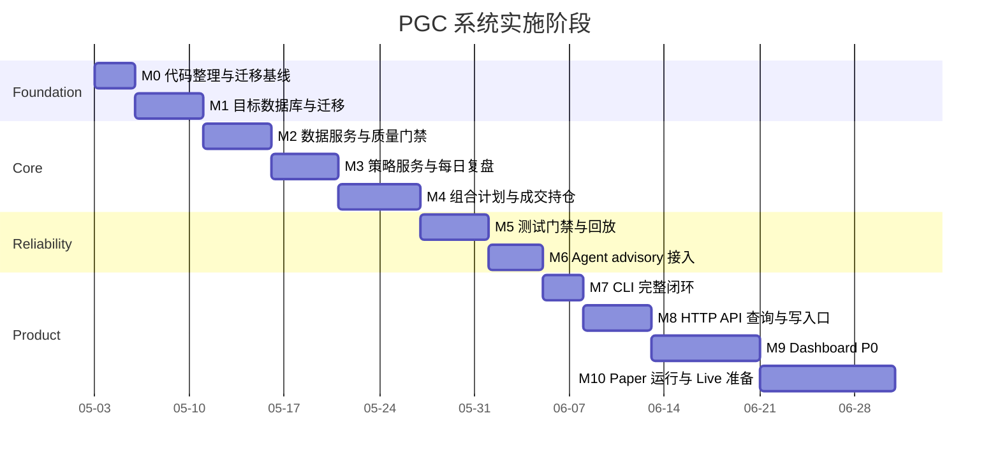
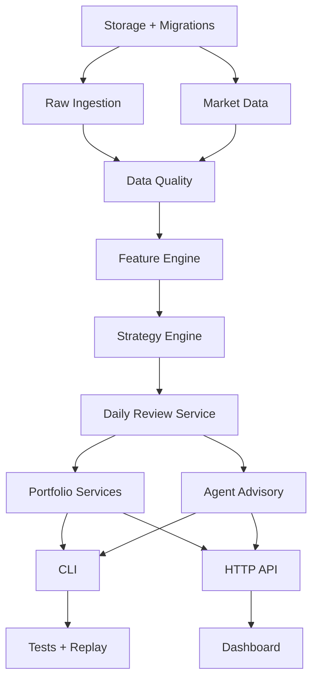

# PGC 系统开发实施路线图

日期：2026-05-03

## 1. 设计目标

这份路线图把现有系统设计拆成可开发、可验收、可回滚的阶段。

当前状态：

- 已有研究脚本和数据文件；
- 已有简单 SQLite schema；
- 已有 `cpb_6157` 策略原型；
- 已有 TradingAgents adapter 原型；
- 已有多份系统设计文档；
- 还没有完整 Application Service、CLI、目标 DDL、状态机、测试门禁和 Dashboard。

实施原则：

- 先把数据边界和账本闭环做稳，再做 Dashboard。
- 先本地 CLI 跑通，再封装 HTTP API。
- 先 paper 账户闭环，再考虑 live 账户。
- 先 advisory Agent，再考虑 Agent filter。
- 每个阶段都必须有验收标准和回滚方式。
- 不把研究脚本直接当生产入口，研究脚本应逐步沉淀到 `src/pgc_trading`。

## 2. 目标阶段总览



时间只是实施节奏参考，实际以验收通过为准。

## 3. 模块边界

目标代码结构：

```text
src/pgc_trading/
  config.py
  cli/
    main.py
    commands/
      raw.py
      market.py
      review.py
      plan.py
      trade.py
      exit.py
      report.py
      agent.py
      data_quality.py
  storage/
    database.py
    schema.sql
    migrations/
      001_schema_quality.sql
      002_raw_market.sql
      003_accounts.sql
      004_meta.sql
      005_strategy_governance.sql
      006_feature_signal.sql
      007_agent.sql
      008_portfolio.sql
      009_research_views.sql
    repositories/
      raw_repository.py
      market_repository.py
      strategy_repository.py
      portfolio_repository.py
      agent_repository.py
  ingestion/
    raw_importer.py
    validators.py
  market/
    tushare_adapter.py
    calendar.py
    completeness.py
  features/
    contracting_pullback.py
    snapshots.py
    hashing.py
  strategies/
    cpb_6157.py
    registry.py
    scoring.py
  services/
    raw_ingestion_service.py
    market_data_service.py
    daily_review_service.py
    portfolio_planning_service.py
    execution_recording_service.py
    position_lifecycle_service.py
    agent_review_service.py
    reporting_query_service.py
    data_quality_service.py
  portfolio/
    state_machines.py
    sizing.py
    exits.py
    equity.py
  agents/
    tradingagents_adapter.py
    input_snapshot_builder.py
    output_parser.py
  reporting/
    daily_report.py
    views.py
    serializers.py
  api/
    app.py
    routes/
  web/
    dashboard/
```

约束：

- `scripts/` 只保留研究和一次性迁移脚本；
- 生产逻辑必须进入 `src/pgc_trading`；
- CLI/API/Dashboard 只能调用 `services/`；
- repositories 只做数据读写，不做业务决策；
- services 负责事务和状态机；
- strategies 不读写数据库；
- agents 不能写 Signal 和 Portfolio 事实表。

## 4. 依赖关系



关键路径：

1. Storage；
2. Raw + Market；
3. Feature + Strategy；
4. Portfolio 状态机；
5. Tests；
6. CLI；
7. API；
8. Dashboard。

Agent 和 Dashboard 不应该阻塞核心账本闭环。

## 5. M0: 代码整理与迁移基线

### 目标

建立“当前可运行状态”的基线，避免后续重构时失去研究结果。

### 任务

- 梳理现有脚本职责；
- 标记哪些脚本是研究脚本，哪些逻辑要沉淀为生产服务；
- 固定当前 `cpb_6157@2026-05-03` 参数；
- 固定当前数据文件清单；
- 生成一次 baseline report；
- 补 `.env.example`，不写入真实 token；
- 建立 `tests/fixtures` 初始目录。

### 当前脚本归类

| 脚本 | 归类 | 后续去向 |
| --- | --- | --- |
| `analyze_pgc_raw_events.mjs` | 研究/清洗 | Raw importer fixture |
| `fetch_tushare_market_data.py` | 数据获取 | `market/tushare_adapter.py` |
| `analyze_pgc_event_backtest.py` | 研究回测 | `research/backtest` 或 tests replay |
| `analyze_pgc_buy_setups.py` | 研究分析 | 保留研究 |
| `analyze_daily_review_strategy.py` | 策略研究 | `daily_review_service` 参考 |
| `deep_dive_contracting_pullback.py` | 参数研究 | strategy governance artifact |
| `backtest_best_contracting_pullback_t1.py` | T+1 实验 | backtest module |
| `init_trading_db.py` | 初始化 | migration runner |
| `run_live_daily_review.py` | 原型入口 | CLI review command |

### 验收

- 可以列出所有生产逻辑的目标模块；
- 当前研究报告不丢；
- 当前策略参数有 hash；
- 当前目录中真实 token 不进入新配置文件。

### 回滚

- 不修改数据库结构；
- 不删除脚本；
- 只新增文档和 fixture。

## 6. M1: 目标数据库与迁移

### 目标

实现目标 SQLite schema，并从当前原型表迁移到分层表。

### 任务

- 建立 `storage/migrations/`；
- 实现 migration runner；
- 创建 meta、raw、market、account、strategy、feature、agent、portfolio、research 表；
- 添加 `schema_migrations`；
- 创建 `operation_requests`；
- 创建 `domain_events`；
- 创建 `data_quality_events`；
- 从旧 `signals` 迁移到 `strategy_signals`；
- 从旧 `exits` 迁移到 `exit_decisions`；
- 创建只读兼容视图；
- 添加基础 invariant SQL。

### 验收

- 空库可完整初始化；
- 旧库可迁移；
- `PRAGMA foreign_keys = ON`；
- 重复迁移无副作用；
- invariant query 返回 0 行；
- `raw_events` 不含未来表现字段；
- `positions` 目标表要求 `entry_trade_id`。

### 风险

- 旧原型表和目标表并存导致读错表；
- 外键前向引用顺序错误；
- 历史数据无法补齐 trade plan。

### 缓解

- repositories 只读目标表；
- legacy 表只读；
- 无法补齐的数据写 `data_quality_events`。

## 7. M2: 数据服务与质量门禁

### 目标

把 PGC 原始数据、Tushare 行情和交易日历做成可复用服务。

### 任务

- `RawIngestionService.import_raw_events`；
- raw 字段白名单校验；
- 脏数据标记；
- 隆化科技脏数据回归规则；
- `MarketDataService.refresh_market_data`；
- Tushare adapter 从环境变量读取 token；
- trade calendar 导入和查询；
- market completeness 检查；
- `DataQualityService.check_daily_review_readiness`；
- 数据质量事件写入和状态更新。

### 验收

- clean raw 文件导入成功；
- 含未来字段 raw 文件被阻断；
- 重复 raw import 幂等；
- 行情刷新生成 `market_fetch_run_id`；
- 缺候选行情时 blocker；
- 缺交易日历时 blocker；
- Tushare token 不进入日志和报告。

### 回滚

- 保留 CSV 文件缓存；
- 数据服务失败时不影响已有研究报告。

## 8. M3: 策略服务与每日复盘

### 目标

把 `cpb_6157` 从研究脚本固化为确定性策略服务。

### 任务

- `features/contracting_pullback.py`；
- feature snapshot 计算；
- input hash 计算；
- no-future 数据边界；
- `strategies/cpb_6157.py` 参数注册；
- strategy run 创建；
- strategy signal 写入；
- daily pick 选择；
- tie-breaker 规则；
- daily report 查询视图；
- 复盘 CLI。

### 验收

- `cpb_6157@2026-05-03` golden replay 通过；
- 每日最多一只 daily pick；
- 同一日期重复运行生成新 run，不覆盖旧 run；
- 报告引用具体 `strategy_run_id`；
- 无信号不创建 trade plan；
- 有信号只生成 signal/pick，不生成持仓。

### 风险

- 研究脚本中的临时字段误进入生产特征；
- feature hash 未覆盖输入；
- 评分排序不稳定。

### 缓解

- feature JSON 白名单；
- snapshot hash 测试；
- golden replay 测试。

## 9. M4: 组合计划、成交、持仓与退出

### 目标

完成 paper 账户的端到端账本闭环。

### 任务

- `PortfolioPlanningService.generate_plan`；
- 最大 3 只持仓约束；
- 等仓位 sizing；
- `trade_plans` 状态机；
- `ExecutionRecordingService.record_trade`；
- 买入成交创建 position；
- `PositionLifecycleService.evaluate_exits`；
- T+2/T+5 日期计算；
- T+2 止盈/止损/持有到 T+5；
- T+5 到期退出；
- equity snapshot；
- manual cancel / expire / correction / reversal 事件。

### 验收

- 计划不创建持仓；
- 买入成交后才创建 position；
- T+2/T+5 日期来自交易日历；
- T+2 `>= +3%` 生成止盈计划；
- T+2 `<= -3%` 生成止损计划；
- 中间态持有到 T+5；
- 卖出成交后 position 才能 closed；
- 重复 trade record 不重复建仓；
- paper/live/backtest 查询隔离。

### 风险

- 真实成交价和计划价混用；
- 卖出后资金快照计算错误；
- 部分成交状态复杂。

### 缓解

- 首版先支持完整成交；
- 部分成交进入 P1；
- 所有收益基于 `executed_price`。

## 10. M5: 测试门禁与回放

### 目标

建立进入 paper/live 前的安全网。

### 任务

- unit tests；
- integration tests；
- replay tests；
- database invariant tests；
- no-future tests；
- account isolation tests；
- state machine tests；
- Agent isolation mock tests；
- CLI idempotency tests。

### 测试命令

```bash
pytest tests/unit
pytest tests/integration
pytest tests/replay
pytest tests/invariants
```

### 验收

- 所有 P0/P1 测试通过；
- invariant query 返回 0 行；
- golden replay 可离线复跑；
- live 账户不能写 model trade；
- Agent reject 在 advisory 模式不自动跳过；
- 回测交易不进入 `trades`。

### 阻断

以下失败必须阻断：

- 未来函数；
- 账户串；
- 持仓无买入成交；
- live model trade；
- 重复建仓；
- T+2/T+5 自然日计算。

## 11. M6: TradingAgents Advisory 接入

### 目标

把 TradingAgents 接入为复核意见层，不影响确定性策略。

### 任务

- `InputSnapshotBuilder`；
- snapshot 字段白名单；
- future field detector；
- `AgentReviewService.review_daily_pick`；
- TradingAgents local snapshot mode；
- artifact 存储；
- decision parser；
- agent failure handling；
- Agent report 查询；
- Agent CLI。

### 验收

- daily pick 可生成 input snapshot；
- input snapshot 不含未来收益；
- Agent 成功生成 `agent_decision`；
- Agent 失败不影响 trade plan；
- artifact 可追溯；
- `strategy_signals` 无 agent 字段；
- `trades` 不因 Agent 自动产生。

### 风险

- A 股 ticker 识别失败；
- Agent 输出 JSON 不稳定；
- 外部工具访问不可控。

### 缓解

- 首版 `local_snapshot_mode`；
- 输出 parser 严格 schema；
- 失败写 `agent_runs.status=failed`。

## 12. M7: CLI 完整闭环

### 目标

让本地 CLI 支持完整 paper 流程。

### P0 命令

```bash
pgc raw import
pgc market refresh
pgc data-quality check
pgc review run
pgc plan generate
pgc plan publish
pgc trade record
pgc exit evaluate
pgc report daily
```

### P1 命令

```bash
pgc agent review
pgc report positions
pgc report equity
pgc plan cancel
pgc trade correct
```

### 验收

- 收盘后可以通过 CLI 跑完日报；
- 次日可以发布计划并录入成交；
- T+2/T+5 可以生成卖出计划；
- 所有写命令支持 `--dry-run`；
- 所有写命令支持幂等；
- 错误返回结构化错误码。

## 13. M8: HTTP API

### 目标

为 Dashboard 提供同一套 Application Service 包装，不复制业务逻辑。

### 任务

- 选择轻量 Web 框架；
- 实现只读查询 API；
- 实现写操作 API；
- 错误响应统一；
- idempotency 支持；
- role 权限；
- request logging 脱敏；
- API contract tests。

### P0 API

- `GET /api/daily-reviews/{as_of_date}`;
- `GET /api/trade-plans`;
- `GET /api/accounts/{id}/positions`;
- `GET /api/data-quality`;
- `POST /api/review-runs`;
- `POST /api/trade-plans/{id}/publish`;
- `POST /api/trades`;
- `POST /api/exits/evaluate`;

### 验收

- API 不直接写数据库；
- Dashboard 查询不作为事实源；
- live 写操作要求 operator；
- token 不进入日志；
- error code 和 CLI 一致。

### 技术选择 ADR 待定

候选：

- FastAPI；
- Flask；
- Litestar。

首版建议优先 FastAPI，理由是类型和 OpenAPI 契约更自然。但正式开发前仍需确认依赖和本地部署方式。

## 14. M9: Dashboard P0

### 目标

交付每日可用的操作台。

### P0 页面

1. 每日复盘；
2. 交易计划；
3. 成交录入；
4. 当前持仓；
5. 数据质量；
6. Agent 复核只读。

### P0 组件

- AppShell；
- DataStatusBar；
- ActionPanel；
- EntityTable；
- DetailDrawer；
- TradeRecordForm；
- StatusChip；
- ConfirmDialog；
- LineageTrail。

### 验收

- 首页 10 秒内判断是否有明日动作；
- blocker 禁用发布计划；
- active 计划才能录入成交；
- 成交后才显示持仓；
- T+2/T+5 在持仓页置顶；
- Agent advisory 不表现成交易指令；
- 账户切换不串数据；
- 移动端不隐藏 blocker 和 T+2/T+5。

### 风险

- 前端直接拼字段绕过服务；
- UI 把无信号伪装成 skipped plan；
- 过度卡片化导致密度不够。

### 缓解

- 只调用 API；
- 使用 Dashboard 交互和视觉规范；
- P0 页面保持工作台风格。

## 15. M10: Paper 运行与 Live 准备

### 目标

使用 `paper-main` 跑满最小样本，验证操作流程，再准备 `live-main`。

### Paper 验收

- 至少 10 笔 paper trades；
- 无重复建仓；
- 无未处理 T+2/T+5；
- 成交录入及时；
- 资金快照和交易流水一致；
- 数据质量 blocker 能被处理；
- Agent 失败不阻断确定性计划。

### Live 准备任务

- 创建 `live-main`；
- 配置初始资金；
- 配置最大持仓 3；
- 策略部署到 live candidate；
- live dry run；
- 手工成交录入演练；
- 停机与暂停演练；
- 人工批准。

### Live 禁止项

- 自动下单；
- Agent 自动过滤；
- 无成交创建持仓；
- 修改当前策略参数继续实盘；
- 用 paper 成交补 live 账本。

## 16. 跨阶段验收矩阵

| 能力 | M1 | M2 | M3 | M4 | M5 | M6 | M7 | M8 | M9 | M10 |
| --- | --- | --- | --- | --- | --- | --- | --- | --- | --- | --- |
| 目标 DDL | 完成 |  |  |  |  |  |  |  |  |  |
| Raw 导入 |  | 完成 |  |  | 测试 |  | CLI | API | UI |  |
| 行情刷新 |  | 完成 |  |  | 测试 |  | CLI | API | UI |  |
| 策略复盘 |  |  | 完成 |  | 测试 |  | CLI | API | UI | Paper |
| 交易计划 |  |  |  | 完成 | 测试 |  | CLI | API | UI | Paper |
| 成交持仓 |  |  |  | 完成 | 测试 |  | CLI | API | UI | Paper |
| T+2/T+5 |  |  |  | 完成 | 测试 |  | CLI | API | UI | Paper |
| Agent advisory |  |  |  |  | 测试 | 完成 | CLI | API | UI | Paper |
| Dashboard |  |  |  |  |  |  |  | API | 完成 | Paper |
| Live 准备 |  |  |  |  |  |  |  |  |  | 完成 |

## 17. 风险清单

### P0 风险

| 风险 | 影响 | 防线 |
| --- | --- | --- |
| 未来函数 | 回测失真，实盘亏损 | input hash + no-future tests |
| 账户串 | 实盘账本错误 | account_id 强制 + tests |
| 计划当成交 | 假持仓 | 状态机 + UI 文案 |
| Agent 污染信号 | 策略不可复现 | Agent layer isolation |
| 重复建仓 | 超仓 | idempotency + unique constraints |
| T+2/T+5 算错 | 错误卖出 | trade_calendar tests |

### P1 风险

| 风险 | 影响 | 防线 |
| --- | --- | --- |
| Tushare 失败 | 无法复盘 | market cache + blocker |
| Agent JSON 异常 | 复核缺失 | parser + failed run |
| Dashboard 误导 | 操作错误 | visual/component spec |
| 迁移损坏旧数据 | 研究丢失 | legacy tables + backup |

## 18. 推荐开发顺序

第一批开发：

1. migration runner；
2. target schema；
3. raw import service；
4. market service；
5. data quality service；
6. cpb_6157 feature/strategy service；
7. daily review CLI。

第二批开发：

1. portfolio account；
2. trade plan；
3. record buy trade；
4. position creation；
5. exit evaluate；
6. record sell trade；
7. equity snapshot。

第三批开发：

1. tests and replay；
2. agent advisory；
3. CLI full loop；
4. HTTP API；
5. Dashboard P0。

第四批开发：

1. paper operations；
2. weekly review；
3. live dry run；
4. live candidate approval。

## 19. Definition of Done

### 每个模块 DoD

- 有服务层接口；
- 有 repository 或 adapter；
- 有 CLI/API 契约；
- 有测试；
- 有 data quality 或错误处理；
- 有文档链接；
- 不写敏感信息到日志。

### 每个阶段 DoD

- 阶段任务全部完成；
- P0/P1 测试通过；
- 关键 Runbook 可执行；
- 失败能回滚或暂停；
- 总设计文档索引更新；
- 不引入跨层写入。

## 20. ADR

### ADR-IMPL-001: 先 CLI 闭环，再 Dashboard

Context：系统真正的风险在数据、策略、计划、成交、持仓闭环。Dashboard 如果先做，容易把未稳定的逻辑固化到前端。

Options：

- 先做 Dashboard；
- 先做 CLI 和服务层闭环；
- 同时做。

Decision：先做 CLI 和服务层闭环，再做 Dashboard。

Consequences：

- 好处：业务规则稳定，UI 只调用服务。
- 代价：早期没有漂亮界面。
- 风险：CLI 使用体验一般，但可以通过日报补足。

### ADR-IMPL-002: 生产逻辑从 scripts 沉淀到 src

Context：当前 scripts 已经承载了研究探索，但 scripts 容易共享临时变量、输出 CSV、缺少事务。

Options：

- 继续扩展 scripts；
- 一次性重写所有逻辑；
- 逐步把生产逻辑迁到 `src/pgc_trading`。

Decision：逐步迁移到 `src/pgc_trading`，scripts 保留研究用途。

Consequences：

- 好处：降低重写风险，保留研究成果。
- 代价：一段时间内脚本和服务并存。
- 风险：必须明确生产入口，避免用户继续用旧脚本实盘。

### ADR-IMPL-003: Agent 和 Dashboard 不在核心关键路径上

Context：Agent 和 Dashboard 都有额外复杂度。核心交易正确性来自确定性策略和账本。

Options：

- Agent 先行；
- Dashboard 先行；
- 核心服务闭环先行。

Decision：核心服务闭环先行，Agent 和 Dashboard 后置。

Consequences：

- 好处：降低实盘基础风险。
- 代价：AI 复核和 UI 延后。
- 风险：用户短期仍需 CLI/Markdown 操作。

## 21. 下一步建议

如果进入开发，建议第一张实施票是：

```text
M1-001: 实现 migration runner 和 schema_migrations
```

紧接着：

```text
M1-002: 创建目标 DDL 的 001-003 migration
M1-003: 创建 raw_events / market_bars legacy 迁移脚本
M2-001: 实现 RawIngestionService
M2-002: 实现 DataQualityService 的 raw 字段白名单检查
```

这几步完成后，系统就有了真正的地基。
