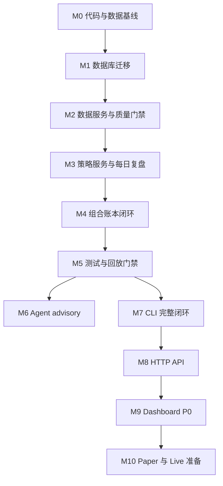

# PGC 系统工程票据拆解设计

日期：2026-05-03

## 1. 设计目标

这份文档把 `development_implementation_roadmap.md` 里的 M0-M10 阶段拆成可以直接进入开发队列的工程票据。

它解决三个问题：

1. 开发时先做哪张票，后做哪张票；
2. 每张票做到什么程度才算完成；
3. 哪些事情虽然看起来顺手，但当前票绝对不能做。

核心原则：

- 一张票只改变一个清晰边界；
- 每张写库票都必须有幂等和回滚思路；
- 数据层、策略层、Agent 层、组合账本层不能串；
- UI、API、CLI 只能在服务层稳定后接入；
- 任何开发票都不能把 Tushare token、券商信息或未来收益写进代码和 fixture。

## 2. 票据编号规则

编号格式：

```text
M{阶段号}-{三位序号}
```

示例：

- `M1-001`: M1 阶段第一张票；
- `M3-004`: M3 阶段第四张票；
- `M9-012`: Dashboard 阶段第十二张票。

优先级：

| 优先级 | 含义 |
| --- | --- |
| P0 | 不完成不能进入 paper 闭环 |
| P1 | paper 可运行后必须补齐 |
| P2 | 体验、扩展、自动化增强 |

票据状态：

| 状态 | 含义 |
| --- | --- |
| `todo` | 未开始 |
| `in_progress` | 开发中 |
| `blocked` | 被依赖、数据或设计阻断 |
| `ready_for_test` | 待验证 |
| `done` | 验收通过 |
| `deferred` | 明确延期 |

## 3. 每张票的标准模板

后续进入开发时，每张票都应该按这个模板落地：

```text
Ticket:
Priority:
Owner module:
Depends on:
Goal:
Scope:
Out of scope:
Implementation notes:
Acceptance criteria:
Tests:
Rollback:
Docs to update:
```

强制要求：

- `Owner module` 必须明确，避免多个服务抢同一职责；
- `Out of scope` 必须写，避免顺手扩范围；
- 写库票必须包含 `Rollback`；
- 策略票必须包含 no-future 验收；
- 账户票必须包含 account isolation 验收；
- Agent 票必须包含不污染 Signal/Portfolio 验收。

## 4. 关键路径



必须坚持：

- `M1-M4` 是系统地基；
- `M5` 是进入 paper 的门禁；
- `M6` 不能阻塞核心账本；
- `M9` 不能绕过 API/Application Service；
- `M10` 不能在测试门禁前启动。

## 5. M0 代码整理与迁移基线

### M0-001: 建立当前资产清单

Priority: P0

Owner module: `reports/`

Depends on: none

Goal: 固定当前脚本、数据、报告、策略参数和数据库状态，作为后续迁移前基线。

Scope:

- 列出 `scripts/` 中每个脚本的职责；
- 列出当前 `src/pgc_trading` 模块；
- 列出当前 `reports/` 研究报告；
- 记录当前 SQLite 数据库路径；
- 标记哪些内容是研究资产，哪些要进入生产模块。

Out of scope:

- 不改数据库结构；
- 不重写脚本；
- 不接入新依赖。

Acceptance criteria:

- 有一份 baseline 文档；
- 能回答“哪个脚本产出了哪个报告”；
- 能回答“生产入口未来应该迁到哪里”。

Tests:

- 人工检查资产清单完整；
- `rg --files` 输出和清单一致。

Rollback:

- 纯文档票，无数据回滚。

### M0-002: 建立配置样例与敏感信息规则

Priority: P0

Owner module: `config`

Depends on: `M0-001`

Goal: 明确环境变量和敏感信息边界。

Scope:

- 新增或更新 `.env.example`；
- 定义 `TUSHARE_TOKEN`、数据库路径、Agent artifact 路径；
- 文档说明真实 token 只从环境变量读取；
- 日志和报告禁止输出 token。

Out of scope:

- 不写真实 token；
- 不实现 Tushare adapter。

Acceptance criteria:

- `.env.example` 不含真实 token；
- 配置文档说明开发、paper、live 三类环境；
- 后续代码可按这个配置读取。

Tests:

- 静态检查 `.env.example`；
- 搜索仓库内是否出现真实 token 片段。

Rollback:

- 删除或还原样例配置即可。

### M0-003: 固定策略版本基线

Priority: P0

Owner module: `strategies`

Depends on: `M0-001`

Goal: 固定 `cpb_6157@2026-05-03` 参数和研究结果，避免后续重构改变含义。

Scope:

- 将当前最优参数整理成参数 JSON；
- 计算参数 hash；
- 记录 T+1/T+2 回测摘要；
- 记录全样本和 4 月验证表现；
- 标记该版本的输入字段白名单。

Out of scope:

- 不重新调参；
- 不引入新策略；
- 不用 Agent 改参数。

Acceptance criteria:

- 策略版本、参数、hash、样本范围可追溯；
- 明确 `bull_prob`、`bull_reason` 等字段禁止作为输入；
- 文档可支持 golden replay。

Tests:

- 参数 JSON 稳定 hash；
- 字段白名单人工检查。

Rollback:

- 保留旧研究报告，不覆盖。

## 6. M1 目标数据库与迁移

### M1-001: 实现 migration runner 和 schema_migrations

Priority: P0

Owner module: `storage`

Depends on: `M0-001`

Goal: 建立可重复、可追踪的 SQLite 迁移机制。

Scope:

- 新建 `src/pgc_trading/storage/migrations/`；
- 实现 migration runner；
- 创建 `schema_migrations`；
- 每次连接启用 `PRAGMA foreign_keys = ON`；
- 支持重复运行不重复执行已应用迁移。

Out of scope:

- 不迁移旧数据；
- 不实现业务表全部 DDL；
- 不做 CLI 完整命令。

Acceptance criteria:

- 空库运行迁移成功；
- 重复运行迁移无副作用；
- `schema_migrations` 记录版本、名称、应用时间；
- 迁移失败时事务回滚。

Tests:

- unit: 空库执行；
- unit: 重复执行；
- unit: 故意失败 migration 不留下半成品。

Rollback:

- 删除新建测试库；
- 生产库迁移前必须备份。

### M1-002: 创建 meta/account 基础迁移

Priority: P0

Owner module: `storage`

Depends on: `M1-001`

Goal: 创建后续幂等、审计和账户隔离需要的基础表。

Scope:

- `portfolio_accounts`;
- `operation_requests`;
- `domain_events`;
- `data_quality_events`;
- 基础索引和 CHECK 约束。

Out of scope:

- 不创建 trade、position；
- 不生成任何交易计划；
- 不接 API 幂等。

Acceptance criteria:

- 可以创建 `backtest`、`paper`、`live` 三类账户；
- `operation_requests.idempotency_key` 唯一；
- `data_quality_events` 支持 blocker；
- 外键和 CHECK 约束生效。

Tests:

- account type enum；
- 重复 idempotency key 报错；
- data quality 状态枚举测试。

Rollback:

- 新表无业务数据时可 drop；
- 有业务数据时只允许迁移回滚脚本处理。

### M1-003: 创建 raw/market 目标表

Priority: P0

Owner module: `storage`

Depends on: `M1-002`

Goal: 固定 PGC 入池事实和 Tushare 行情的目标表边界。

Scope:

- `raw_import_batches`;
- `raw_events`;
- `market_fetch_runs`;
- `trade_calendar`;
- `market_bars`;
- raw 字段白名单约束辅助列；
- market 唯一索引。

Out of scope:

- 不拉取 Tushare；
- 不计算特征；
- 不删除旧表。

Acceptance criteria:

- raw events 只包含入池事实；
- `ts_code + entry_date + entry_time + entry_price` 支持去重；
- market bars 支持按 `ts_code + trade_date` upsert；
- `trade_calendar` 可判断交易日。

Tests:

- raw 插入缺 entry_price 失败；
- market high/low 基础约束；
- 重复行情 upsert 行为。

Rollback:

- 保留旧表；
- 新目标表可重建。

### M1-004: 创建策略、特征、信号目标表

Priority: P0

Owner module: `storage`

Depends on: `M1-003`

Goal: 为策略治理和每日复盘建立事实表。

Scope:

- `strategy_families`;
- `strategy_versions`;
- `parameter_sets`;
- `feature_runs`;
- `feature_snapshots`;
- `strategy_runs`;
- `strategy_signals`;
- `daily_picks`;
- 对 `review_date`、`strategy_version_id`、`raw_event_id` 建索引。

Out of scope:

- 不实现策略计算；
- 不导入 Agent 结果；
- 不生成 trade plan。

Acceptance criteria:

- 一个 strategy run 可对应多个 signal；
- 一个 review date 每个策略版本最多一个 daily pick；
- feature snapshot 绑定 raw event 和 input hash；
- signal 不含成交、持仓、资金字段。

Tests:

- daily pick 唯一约束；
- strategy version 不存在时 signal 写入失败；
- feature snapshot JSON 可保存并计算 hash。

Rollback:

- 未迁移生产信号前可 drop；
- 已迁移后需生成反向备份。

### M1-005: 创建 Agent advisory 目标表

Priority: P1

Owner module: `storage`

Depends on: `M1-004`

Goal: 为 TradingAgents 复核结果建立隔离表。

Scope:

- `input_snapshots`;
- `agent_runs`;
- `agent_artifacts`;
- `agent_decisions`;
- Agent 状态枚举和 artifact 路径索引。

Out of scope:

- 不调用 TradingAgents；
- 不修改 signal；
- 不修改 trade plan。

Acceptance criteria:

- Agent decision 只能引用 input snapshot 或 daily pick；
- `action` 枚举为 `support/caution/reject/review_required`；
- Agent 失败可记录错误；
- artifact 路径留在项目目录下。

Tests:

- invalid action 写入失败；
- failed run 可保存 error message；
- agent_decision 不影响 daily_pick。

Rollback:

- Agent 表可独立清理；
- 不影响策略和组合账本。

### M1-006: 创建 Portfolio 目标表

Priority: P0

Owner module: `storage`

Depends on: `M1-004`

Goal: 建立交易计划、成交、持仓、退出、资金曲线表。

Scope:

- `trade_plans`;
- `trades`;
- `positions`;
- `exit_decisions`;
- `equity_snapshots`;
- 状态枚举；
- `account_id` 相关索引；
- `entry_trade_id`、`exit_trade_id` 外键。

Out of scope:

- 不实现状态机；
- 不录入真实成交；
- 不计算资金曲线。

Acceptance criteria:

- trade plan 不等于 trade；
- position 必须由 buy trade 创建；
- sell trade 才能关闭 position；
- 所有表都带 account_id 或能追溯到 account_id。

Tests:

- 无 entry trade 不能创建 position；
- 不同 account 查询隔离；
- position status 枚举生效。

Rollback:

- paper 数据可清理重跑；
- live 数据只允许 correction/reversal，不允许静默删除。

### M1-007: 原型表兼容视图与迁移脚本设计

Priority: P1

Owner module: `storage`

Depends on: `M1-006`

Goal: 让旧研究表和新目标表在过渡期可共存。

Scope:

- legacy 表只读策略；
- `signals_legacy_view`;
- `exits_legacy_view`;
- raw/market 迁移脚本；
- 无法补齐 lineage 的数据写 `data_quality_events`。

Out of scope:

- 不把旧表当生产入口；
- 不删除旧表；
- 不修改研究报告。

Acceptance criteria:

- 旧查询可以通过 view 临时读取；
- 新 repository 只读目标表；
- 迁移报告列出 skipped/invalid 数据。

Tests:

- migration dry run；
- migrated count 对账；
- legacy view 查询可用。

Rollback:

- 保留迁移前数据库备份；
- 重新生成目标表。

## 7. M2 数据服务与质量门禁

### M2-001: RawIngestionService

Priority: P0

Owner module: `ingestion/services`

Depends on: `M1-003`

Goal: 把 PGC 原始入池数据导入目标 raw 表。

Scope:

- 读取 raw JSON/CSV；
- 字段白名单；
- source hash；
- import batch；
- 重复数据幂等；
- 隆化科技脏数据标记。

Out of scope:

- 不拉行情；
- 不计算收益；
- 不生成信号。

Acceptance criteria:

- clean raw 导入成功；
- 含未来字段被阻断或标记 blocker；
- 重复导入不重复写 raw event；
- 脏数据 `is_valid = 0`，不参与后续策略。

Tests:

- clean fixture；
- future fields fixture；
- duplicate fixture；
- 隆化科技回归 fixture。

Rollback:

- 可以按 import batch invalidate；
- 不物理删除原始事实。

### M2-002: MarketDataService 与 TushareAdapter

Priority: P0

Owner module: `market/services`

Depends on: `M1-003`, `M2-001`

Goal: 按有效 raw events 补齐行情和交易日历。

Scope:

- Tushare token 从环境变量读取；
- 拉取日线、复权因子、必要 daily_basic；
- 写入 market fetch run；
- upsert market bars；
- 导入 trade calendar；
- 支持指定 end date。

Out of scope:

- 不把 Tushare token 写文件；
- 不做分钟线；
- 不做实时行情。

Acceptance criteria:

- 有效股票观察窗口行情完整；
- 缺行情写 data quality blocker；
- 重复 refresh 不重复 market bars；
- 日志不输出 token。

Tests:

- adapter mock；
- market upsert；
- missing candidate blocker；
- trade calendar missing blocker。

Rollback:

- market fetch run 可标记 failed；
- 缓存行情可重拉覆盖。

### M2-003: DataQualityService

Priority: P0

Owner module: `services/data_quality`

Depends on: `M2-001`, `M2-002`

Goal: 在策略运行前统一判断数据是否可用于复盘。

Scope:

- raw 字段边界检查；
- market 完整性检查；
- trade calendar 检查；
- no-future 字段检查；
- blocker/warning/info 输出；
- readiness summary。

Out of scope:

- 不修复数据；
- 不自动跳过账户约束；
- 不计算策略。

Acceptance criteria:

- blocker 存在时 review run 不允许继续；
- warning 不阻断但进入日报；
- 能按 review_date 输出 readiness；
- data quality event 可追溯到实体。

Tests:

- blocker 阻断；
- warning 透传；
- clean readiness success；
- invalid raw 不进 strategy。

Rollback:

- 质量事件可标记 resolved/ignored；
- 不改 raw 原始字段。

## 8. M3 策略服务与每日复盘

### M3-001: ContractingPullbackFeatureEngine

Priority: P0

Owner module: `features`

Depends on: `M2-003`

Goal: 将缩量回调、一根阳线确认等特征计算沉淀为可复算模块。

Scope:

- 入池后交易日窗口；
- 回调天数；
- 缩量比；
- 回撤；
- 阳线实体；
- 触发日成交额约束；
- input hash；
- feature JSON 白名单。

Out of scope:

- 不排序选股；
- 不生成 trade plan；
- 不读取未来行情。

Acceptance criteria:

- `review_date = S` 时只读取 `<= S` 数据；
- 添加 `S+1` 行情不改变 hash；
- 修改 `S` 当日行情会改变 hash；
- 特征字段不含未来收益。

Tests:

- positive feature case；
- negative feature cases；
- future bar hash test；
- insufficient data case。

Rollback:

- feature snapshots 可按 feature run 废弃；
- 不改 raw/market。

### M3-002: cpb_6157 StrategyEngine

Priority: P0

Owner module: `strategies`

Depends on: `M3-001`, `M0-003`

Goal: 固化当前短线买点策略。

Scope:

- 参数注册；
- 参数 hash；
- 信号命中判断；
- score 计算；
- reason 结构化；
- strategy run 写入；
- strategy signal 写入。

Out of scope:

- 不自动买入；
- 不调用 Agent；
- 不重新优化参数。

Acceptance criteria:

- 同一输入生成确定性结果；
- 输出绑定 strategy_version；
- signal 不含未来收益；
- signal 不含成交状态。

Tests:

- golden signal replay；
- parameter hash test；
- deterministic score test；
- no future field test。

Rollback:

- 新 strategy run 可作废；
- 不覆盖旧 strategy run。

### M3-003: DailyPickSelector

Priority: P0

Owner module: `strategies/services`

Depends on: `M3-002`

Goal: 实现每天最多一只股票的选择逻辑。

Scope:

- 同一 review_date 的候选排序；
- tie-breaker；
- daily pick 写入；
- 无候选时输出 skipped summary；
- 选择原因。

Out of scope:

- 不考虑账户持仓；
- 不生成 trade plan；
- 不调用 Agent。

Acceptance criteria:

- 每日最多一个 daily pick；
- tie-breaker 稳定；
- 无候选不伪造 pick；
- pick 能追溯到 signal。

Tests:

- one pick per day；
- tie-breaker replay；
- no candidate case。

Rollback:

- daily pick 可随 strategy run 作废；
- 不改 signals。

### M3-004: DailyReviewService

Priority: P0

Owner module: `services`

Depends on: `M3-003`, `M2-003`

Goal: 封装收盘后复盘主流程。

Scope:

- data quality readiness；
- feature run；
- strategy run；
- daily pick；
- lineage response；
- Markdown/JSON 查询数据。

Out of scope:

- 不生成成交；
- 不创建持仓；
- 不做 Dashboard。

Acceptance criteria:

- blocker 时不运行策略；
- 成功时返回 run_id、created_ids、lineage；
- 重复运行生成新 run，不覆盖旧 run；
- 报告引用具体 strategy_run_id。

Tests:

- clean review；
- blocked review；
- idempotency/dry run；
- report query smoke。

Rollback:

- strategy run 可标记 invalidated；
- 不删除 raw/market。

## 9. M4 组合计划、成交、持仓与退出

### M4-001: PortfolioAccountService

Priority: P0

Owner module: `portfolio/services`

Depends on: `M1-006`

Goal: 管理 backtest/paper/live 账户基础配置。

Scope:

- 创建 paper account；
- 初始资金；
- max positions；
- slot sizing config；
- account status。

Out of scope:

- 不录入成交；
- 不连接券商；
- 不计算历史收益。

Acceptance criteria:

- paper/main 账户可初始化；
- live 账户需要 operator；
- account_type 查询严格隔离。

Tests:

- create account；
- duplicate account key；
- account isolation query。

Rollback:

- 未有交易的账户可停用；
- 有交易账户不物理删除。

### M4-002: PortfolioPlanningService

Priority: P0

Owner module: `portfolio/services`

Depends on: `M3-004`, `M4-001`

Goal: 根据 daily pick 和账户约束生成次日买入计划。

Scope:

- 最大 3 只持仓；
- 等仓位 sizing；
- planned buy date = next trade day；
- trade plan 状态机初始状态；
- no available slot 时 skipped plan summary。

Out of scope:

- 不创建 trade；
- 不创建 position；
- 不使用 Agent filter。

Acceptance criteria:

- 有空仓位时生成 active/draft plan；
- 满仓时不生成买入计划；
- sizing 使用真实 cash/slot 规则；
- plan 可追溯 daily_pick。

Tests:

- empty account plan；
- full account skip；
- next trade day；
- repeated generate idempotency。

Rollback:

- draft plan 可 cancel；
- published plan 需 domain event 留痕。

### M4-003: ExecutionRecordingService

Priority: P0

Owner module: `portfolio/services`

Depends on: `M4-002`

Goal: 录入买入和卖出成交，并由成交驱动持仓生命周期。

Scope:

- buy trade record；
- sell trade record；
- 价格、股数、金额校验；
- A 股 100 股整数倍服务层校验；
- buy 成交创建 position；
- sell 成交关闭 position。

Out of scope:

- 不自动下单；
- 不支持部分成交 P0；
- 不用计划价替代成交价。

Acceptance criteria:

- 没有成交不创建持仓；
- 重复成交录入被幂等拦截；
- 买入价使用 executed_price；
- 账户不串。

Tests:

- record buy creates position；
- duplicate trade blocked；
- wrong account blocked；
- sell closes position。

Rollback:

- 录错成交用 correction/reversal；
- 不静默覆盖旧 trade。

### M4-004: PositionLifecycleService

Priority: P0

Owner module: `portfolio/services`

Depends on: `M4-003`, `M2-002`

Goal: 实现 T+2/T+5 退出判断。

Scope:

- 交易日 T+2/T+5 日期计算；
- T+2 `>= +3%` 止盈；
- T+2 `<= -3%` 止损；
- 中间态持有到 T+5；
- T+5 到期退出计划；
- exit decision 写入。

Out of scope:

- 不做盘中止损；
- 不做移动止盈；
- 不用自然日。

Acceptance criteria:

- T+2/T+5 来自 trade calendar；
- 收益基于真实 executed_price；
- 中间态不会提前 close；
- exit decision 可追溯 position。

Tests:

- T+2 take profit；
- T+2 stop loss；
- T+2 hold to T+5；
- holiday calendar case。

Rollback:

- 错误 exit decision 可 mark invalidated；
- 已成交卖出需 reversal。

### M4-005: EquitySnapshotService

Priority: P0

Owner module: `portfolio/services`

Depends on: `M4-003`

Goal: 维护 paper/live 账户资金曲线。

Scope:

- cash；
- market value；
- realized pnl；
- unrealized pnl；
- total equity；
- snapshot type。

Out of scope:

- 不做复杂费用税费 P0；
- 不混入回测模型价格；
- 不做绩效归因。

Acceptance criteria:

- 买入减少 cash；
- 卖出增加 cash；
- 持仓市值按 review_date close；
- account_id 隔离。

Tests:

- buy equity；
- mark to market；
- sell realized pnl；
- multi account isolation。

Rollback:

- equity snapshot 可重算；
- trades/positions 不因重算被修改。

## 10. M5 测试与回放门禁

### M5-001: 测试目录和 fixture 基线

Priority: P0

Owner module: `tests`

Depends on: `M1-006`

Goal: 建立离线可复跑测试资产。

Scope:

- `tests/fixtures/raw`;
- `tests/fixtures/market`;
- `tests/fixtures/strategy`;
- `tests/fixtures/portfolio`;
- `tests/fixtures/agent`;
- golden 数据说明。

Out of scope:

- 不放真实 token；
- 不放真实券商流水；
- 不依赖联网。

Acceptance criteria:

- fixture 覆盖 clean/dirty/duplicate；
- market fixture 覆盖缺失和节假日；
- portfolio fixture 覆盖 T+2/T+5。

Tests:

- fixture schema validation。

Rollback:

- fixture 可重建；
- 不影响业务库。

### M5-002: No-future 与数据边界测试

Priority: P0

Owner module: `tests/invariants`

Depends on: `M3-004`

Goal: 证明策略和 Agent 输入不使用未来函数。

Scope:

- raw forbidden fields；
- feature input hash；
- strategy signal forbidden fields；
- input snapshot forbidden fields；
- review date boundary。

Out of scope:

- 不测试收益高低；
- 不调参。

Acceptance criteria:

- 添加未来行情不改变当日 hash；
- 未来收益字段被拒绝；
- Agent snapshot 含未来字段不调用 Agent。

Tests:

- no future raw；
- no future feature；
- no future signal；
- no future agent snapshot。

Rollback:

- 测试失败阻断 paper/live；
- 不自动修数据。

### M5-003: 状态机和账户隔离测试

Priority: P0

Owner module: `tests/integration`

Depends on: `M4-005`

Goal: 证明计划、成交、持仓、退出、资金不串。

Scope:

- trade plan state；
- trade recording；
- position lifecycle；
- exit decision；
- equity snapshot；
- account isolation。

Out of scope:

- 不测 UI；
- 不测 Agent 外部执行。

Acceptance criteria:

- 计划不会创建持仓；
- 买入成交才创建持仓；
- 卖出成交才关闭持仓；
- backtest/paper/live 查询互不污染。

Tests:

- plan only；
- buy lifecycle；
- sell lifecycle；
- account isolation；
- repeated operation idempotency。

Rollback:

- 测试库可删除重建。

### M5-004: Golden replay

Priority: P0

Owner module: `tests/replay`

Depends on: `M5-002`, `M5-003`

Goal: 复现 `cpb_6157@2026-05-03` 当前研究结果。

Scope:

- 固定 raw subset；
- 固定 market bars；
- 固定 trade calendar；
- 固定参数；
- 输出 expected signals/daily picks；
- 输出 T+2/T+5 expected decisions。

Out of scope:

- 不重新下载 Tushare；
- 不扩大样本；
- 不优化参数。

Acceptance criteria:

- replay 输出和 golden 一致；
- 不一致时明确 diff；
- replay 可离线执行。

Tests:

- full golden replay。

Rollback:

- golden 更新必须有策略版本变更说明。

## 11. M6 TradingAgents advisory 接入

### M6-001: InputSnapshotBuilder

Priority: P1

Owner module: `agents`

Depends on: `M3-004`, `M5-002`

Goal: 为 daily pick 构造受控 Agent 输入。

Scope:

- 字段白名单；
- 行情摘要；
- 策略特征摘要；
- 组合状态摘要；
- content hash；
- future field detector。

Out of scope:

- 不调用外部 Agent；
- 不读取全库；
- 不包含实盘敏感信息。

Acceptance criteria:

- snapshot 可追溯 daily_pick；
- 禁止未来收益字段；
- content hash 稳定；
- snapshot JSON 可审计。

Tests:

- valid snapshot；
- future field blocked；
- hash stable。

Rollback:

- snapshot 可作废；
- 不影响 signal/portfolio。

### M6-002: AgentReviewService

Priority: P1

Owner module: `services/agents`

Depends on: `M6-001`, `M1-005`

Goal: 调用 TradingAgents 并保存 advisory 结果。

Scope:

- local snapshot mode；
- agent run；
- artifact path；
- decision parser；
- failure handling。

Out of scope:

- 不让 Agent 自动取消计划；
- 不写 signal；
- 不写 trades。

Acceptance criteria:

- support/caution/reject/review_required 可保存；
- JSON 异常写 failed run；
- Agent 失败不阻断 trade plan；
- artifact 留在项目目录。

Tests:

- mock support；
- mock invalid JSON；
- failed run；
- advisory does not change plan。

Rollback:

- Agent run 可重跑；
- advisory 结果可标记 invalidated。

## 12. M7 CLI 完整闭环

### M7-001: CLI 框架和通用响应

Priority: P0

Owner module: `cli`

Depends on: `M3-004`, `M4-005`

Goal: 建立统一命令入口和响应格式。

Scope:

- `pgc` 命令；
- 通用 `--db-path`；
- 通用 `--dry-run`；
- 通用 `--operator`；
- JSON/Markdown 输出；
- 结构化错误码。

Out of scope:

- 不实现所有命令业务；
- 不接 HTTP API。

Acceptance criteria:

- 命令可发现；
- 错误码和 API 契约一致；
- dry-run 不落库。

Tests:

- cli help；
- dry run；
- error envelope。

Rollback:

- CLI 只是入口，不影响服务层。

### M7-002: 收盘复盘命令组

Priority: P0

Owner module: `cli/commands`

Depends on: `M7-001`, `M3-004`, `M4-002`

Goal: CLI 跑通收盘后复盘和明日计划。

Scope:

- `pgc raw import`;
- `pgc market refresh`;
- `pgc data-quality check`;
- `pgc review run`;
- `pgc plan generate`;
- `pgc report daily`。

Out of scope:

- 不录入成交；
- 不调用 Agent P0；
- 不做 Dashboard。

Acceptance criteria:

- 一组命令生成日报；
- blocker 时停止在 data quality；
- 成功时能看到 daily pick 和计划。

Tests:

- command integration smoke；
- blocked flow；
- no signal flow。

Rollback:

- 生成的 run/plan 可 invalidated/cancel。

### M7-003: 开盘成交与退出命令组

Priority: P0

Owner module: `cli/commands`

Depends on: `M7-002`, `M4-004`

Goal: CLI 跑通买入录入、T+2/T+5 退出、卖出录入。

Scope:

- `pgc plan publish`;
- `pgc trade record`;
- `pgc exit evaluate`;
- `pgc report positions`;
- `pgc report equity`。

Out of scope:

- 不自动下单；
- 不部分成交；
- 不券商导入。

Acceptance criteria:

- 买入后出现 position；
- T+2/T+5 生成退出计划；
- 卖出后更新 equity。

Tests:

- buy command；
- exit evaluate command；
- sell command。

Rollback:

- 错误成交走 correction/reversal。

## 13. M8 HTTP API

### M8-001: API 技术选型 ADR

Priority: P1

Owner module: `api`

Depends on: `M7-001`

Goal: 正式确认 Web 框架。

Scope:

- 对比 FastAPI、Flask、Litestar；
- 本地部署方式；
- OpenAPI 支持；
- 测试方式；
- 依赖管理。

Out of scope:

- 不实现业务路由；
- 不引入前端。

Acceptance criteria:

- 有 ADR；
- 有明确选择和替代方案；
- 有后续迁移风险说明。

Tests:

- smoke app 可启动。

Rollback:

- 选型前不写大量业务代码。

### M8-002: 查询 API

Priority: P1

Owner module: `api/routes`

Depends on: `M8-001`, `M7-002`

Goal: 为 Dashboard 提供只读查询。

Scope:

- daily review；
- trade plans；
- positions；
- equity；
- data quality；
- agent advisory。

Out of scope:

- 不复制业务计算；
- 不让前端直接查库。

Acceptance criteria:

- 所有查询经 ReportingQueryService；
- account_id 显式；
- response schema 稳定。

Tests:

- API contract tests；
- account isolation API test。

Rollback:

- 查询 API 可关闭，不影响 CLI。

### M8-003: 写操作 API

Priority: P1

Owner module: `api/routes`

Depends on: `M8-002`, `M7-003`

Goal: 为 Dashboard 提供受控写入口。

Scope:

- review run；
- plan publish/cancel；
- trade record；
- exit evaluate；
- idempotency key；
- operator。

Out of scope:

- 不自动下单；
- 不绕过 Application Service。

Acceptance criteria:

- 写操作都有 idempotency；
- live 写操作要求 operator；
- 错误码和 CLI 一致。

Tests:

- idempotency API；
- validation error；
- live operator required。

Rollback:

- 写 API 可暂停，CLI 保留。

## 14. M9 Dashboard P0

### M9-001: Dashboard 应用骨架

Priority: P1

Owner module: `web/dashboard`

Depends on: `M8-002`

Goal: 建立可访问的操作台骨架。

Scope:

- AppShell；
- 账户切换；
- 日期选择；
- DataStatusBar；
- 路由结构；
- API client。

Out of scope:

- 不实现复杂图表；
- 不绕过 API；
- 不做营销首页。

Acceptance criteria:

- 首屏显示复盘状态；
- 账户切换不会串数据；
- blocker 明显展示。

Tests:

- desktop/mobile smoke；
- API mock；
- account switch。

Rollback:

- Dashboard 可独立停用。

### M9-002: 每日复盘页面

Priority: P1

Owner module: `web/dashboard`

Depends on: `M9-001`, `M8-002`

Goal: 让用户 10 秒内知道今天有没有明日买入动作。

Scope:

- daily pick；
- signal explanation；
- lineage trail；
- no signal state；
- data blocker。

Out of scope:

- 不录入成交；
- 不展示 Agent 作为交易指令。

Acceptance criteria:

- daily pick 和 no signal 状态清晰区分；
- blocker 禁用计划发布；
- lineage 可展开。

Tests:

- pick state；
- no signal state；
- blocked state。

Rollback:

- UI 不写事实表。

### M9-003: 计划、成交、持仓、退出页面

Priority: P1

Owner module: `web/dashboard`

Depends on: `M9-002`, `M8-003`

Goal: 支持 paper 每日实际操作。

Scope:

- trade plans；
- publish/cancel；
- trade record form；
- current positions；
- T+2/T+5 due list；
- exit decisions。

Out of scope:

- 不自动下单；
- 不支持部分成交 P0；
- 不隐藏关键风险状态。

Acceptance criteria:

- active plan 才能录入成交；
- 成交后才显示持仓；
- T+2/T+5 到期置顶；
- 所有写操作有确认。

Tests:

- plan to trade flow；
- due exit flow；
- mobile layout。

Rollback:

- Dashboard 写入口可禁用，CLI 保留。

## 15. M10 Paper 运行与 Live 准备

### M10-001: 10 笔 paper pilot

Priority: P0

Owner module: `operations`

Depends on: `M5-004`, `M7-003`

Goal: 用 paper 账户验证真实每日流程，不急着实盘。

Scope:

- 连续执行至少 10 笔候选计划；
- 每笔记录计划、成交、退出、复盘；
- 每周检查一次偏差；
- 记录人工跳过原因。

Out of scope:

- 不自动下单；
- 不扩大到多策略；
- 不改参数追涨。

Acceptance criteria:

- 10 笔闭环都有 lineage；
- 无账户串；
- 无 T+2/T+5 日期错误；
- 失败都能解释。

Tests:

- operational checklist；
- paper audit report。

Rollback:

- paper account 可暂停；
- 不影响 live。

### M10-002: Live readiness gate

Priority: P0

Owner module: `operations`

Depends on: `M10-001`

Goal: 明确什么时候才允许从 paper 进入 live。

Scope:

- paper 表现复盘；
- 数据质量通过率；
- 操作失误率；
- 最大回撤；
- 执行滑点；
- 人工确认清单。

Out of scope:

- 不承诺收益；
- 不自动开 live；
- 不跳过人工确认。

Acceptance criteria:

- 至少 10 笔 paper 闭环；
- P0 测试全通过；
- Runbook 执行无阻断；
- live 首笔必须小仓位；
- 有暂停条件。

Tests:

- readiness checklist；
- live dry run。

Rollback:

- live 未开始前只保留 paper；
- live 开始后异常立即暂停新计划。

## 16. 第一批推荐实施队列

第一批只做地基，不碰 UI 和 Agent。

```text
M0-001 建立当前资产清单
M0-002 建立配置样例与敏感信息规则
M0-003 固定策略版本基线
M1-001 实现 migration runner 和 schema_migrations
M1-002 创建 meta/account 基础迁移
M1-003 创建 raw/market 目标表
M1-004 创建策略、特征、信号目标表
M2-001 RawIngestionService
M2-002 MarketDataService 与 TushareAdapter
M2-003 DataQualityService
```

完成这批后，系统具备：

- 可信 raw 层；
- 可追踪 market 层；
- 基础 account 隔离；
- migration 基线；
- 策略运行前的数据门禁。

## 17. 第二批推荐实施队列

第二批打通确定性策略和 paper 账本。

```text
M3-001 ContractingPullbackFeatureEngine
M3-002 cpb_6157 StrategyEngine
M3-003 DailyPickSelector
M3-004 DailyReviewService
M4-001 PortfolioAccountService
M4-002 PortfolioPlanningService
M4-003 ExecutionRecordingService
M4-004 PositionLifecycleService
M4-005 EquitySnapshotService
M5-001 测试目录和 fixture 基线
M5-002 No-future 与数据边界测试
M5-003 状态机和账户隔离测试
M5-004 Golden replay
```

完成这批后，才允许进入 paper pilot。

## 18. 第三批推荐实施队列

第三批做操作入口和辅助研究。

```text
M6-001 InputSnapshotBuilder
M6-002 AgentReviewService
M7-001 CLI 框架和通用响应
M7-002 收盘复盘命令组
M7-003 开盘成交与退出命令组
M8-001 API 技术选型 ADR
M8-002 查询 API
M8-003 写操作 API
```

Agent 在这批中仍然是 advisory，不改变交易计划。

## 19. 第四批推荐实施队列

第四批做 Dashboard 和实盘准备。

```text
M9-001 Dashboard 应用骨架
M9-002 每日复盘页面
M9-003 计划、成交、持仓、退出页面
M10-001 10 笔 paper pilot
M10-002 Live readiness gate
```

Dashboard 只能调用 API，不能直接访问 SQLite。

## 20. 票据间红线

### 数据红线

- Raw 票不能写 Feature/Signal/Portfolio；
- Market 票不能写策略结果；
- Feature 票不能读取 `review_date` 之后的数据；
- Strategy 票不能写 Trade/Position；
- Agent 票不能覆盖 Signal；
- Portfolio 票不能修改 Raw/Market/Feature。

### 操作红线

- TradePlan 不是 Trade；
- Position 只能来自 Trade；
- T+2/T+5 必须用交易日历；
- live PnL 必须用真实成交价；
- backtest、paper、live 必须带 account_id；
- Report/Dashboard 不是事实源。

### 开发红线

- 不把真实 token 写进文件；
- 不在 scripts 里继续堆生产逻辑；
- 不在 UI 里复制业务判断；
- 不为赶进度跳过 no-future 测试；
- 不物理删除 live 事实。

## 21. 推荐下一张票

如果下一步开始开发，建议第一张票是：

```text
M0-001 建立当前资产清单
```

如果用户希望直接进入系统地基，也可以从下面开始：

```text
M1-001 实现 migration runner 和 schema_migrations
```

但更稳的顺序是先完成 M0 三张基线票，再动数据库。
