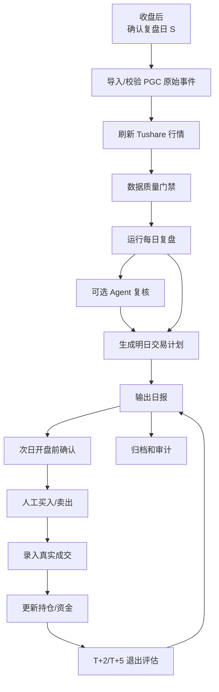
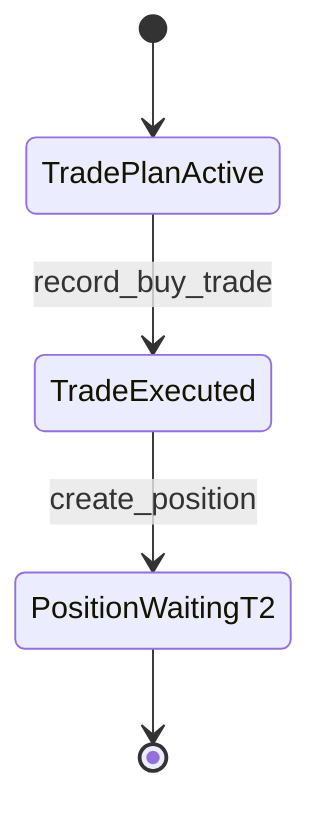

# PGC 实盘运营 Runbook 设计

日期：2026-05-03

## 1. 设计目标

Runbook 解决的是系统上线后每天怎么稳定执行的问题。

系统可以有策略、数据库、Agent 和 Dashboard，但实盘真正容易出错的地方通常是：

1. 收盘后行情没更新完整就跑复盘；
2. 把策略信号当成已经买入；
3. 次日买了但忘记录入成交；
4. T+2/T+5 到期但没有生成卖出计划；
5. Agent 说了“风险高”，但系统和人工没有明确处理规则；
6. 回测账户、模拟账户、实盘账户混查；
7. 手工改错没有留痕。

本 Runbook 的目标是把这些动作标准化。

核心原则：

- 每天只认一个复盘日 `S`。
- 所有交易日计算都来自交易日历，不用自然日心算。
- 策略只生成信号，交易计划只生成计划，成交录入后才生成持仓。
- 实盘账户所有成交必须人工确认或券商导入，不能用模型价格代替。
- Agent 首版只做复核意见，不自动阻断交易。
- 任何取消、跳过、修正、冲销都必须写入事件。

## 2. 角色与职责

| 角色 | 职责 | 允许动作 |
| --- | --- | --- |
| 操盘者 | 每日复盘、确认计划、录入成交、处理退出 | `daily-close`、`paper-readiness`、`record-buy`、`record-sell`、`exits-evaluate` |
| 研究者 | 策略分析、参数实验、失败案例归档 | 回测、研究报告、Agent 效果分析 |
| 审计者 | 检查数据血缘、账户隔离、未来函数、操作留痕 | 只读查询、数据质量报告 |
| 管理员 | 账户配置、策略版本启停、权限配置 | 创建账户、启停策略部署 |

首版本地单人使用时，用户可以同时扮演操盘者、研究者和管理员，但系统记录中仍要保存 `operator`。

## 3. 每日运营总流程



## 4. 时间窗口

### 收盘后窗口

建议时间：A 股收盘后 15:30 到 18:00。

目标：

- 行情刷新到复盘日 `S`；
- 策略运行完成；
- 明日交易计划生成；
- 持仓 T+2/T+5 动作生成；
- 日报归档。

### 次日开盘前窗口

建议时间：9:00 到 9:25。

目标：

- 确认今日有效计划；
- 确认没有停牌、重大公告、明显异常高开风险；
- 发布计划；
- 开盘后人工执行。

### 开盘后成交录入窗口

建议时间：成交后 5 分钟内。

目标：

- 录入真实买入或卖出成交；
- 自动创建或更新持仓；
- 自动更新资金快照；
- 避免计划和真实账户脱节。

### 收盘退出评估窗口

建议时间：15:00 到 18:00。

目标：

- 对到达 T+2 的持仓做止盈/止损/持有到 T+5 判断；
- 对到达 T+5 的持仓生成退出计划；
- 生成下一交易日卖出计划，或按尾盘人工卖出后录入成交。

## 5. 收盘后标准流程

### Step 1: 确认复盘日

复盘日 `S` 必须是最近一个已收盘交易日。

检查项：

- `S` 在 `trade_calendar` 中 `is_open = 1`；
- `market_bars` 覆盖 `S`；
- 系统时间不早于当日收盘；
- 不使用未来交易日。

阻断条件：

- `S` 不是交易日；
- 行情未覆盖 `S`；
- 传入数据包含 `S` 之后行情。

### Step 2: 导入 PGC 原始事件

命令契约：

```bash
pgc raw import \
  --file data/pgc_raw_events.json \
  --source pgc_pool \
  --operator azboo
```

成功标准：

- 返回 `raw_import_batch_id`；
- `dirty_count = 0` 或脏数据已明确标记；
- 无新增非法字段；
- 不出现 `bull_prob`、`bull_reason`、`latest_ret`、`max_high`、`status` 等未来表现字段。

如果发现脏数据：

- 不直接物理删除历史记录；
- 标记 `is_valid = 0`；
- 写入 `data_quality_events`；
- 报告中显示被剔除原因。

### Step 3: 刷新 Tushare 行情

命令契约：

```bash
pgc market refresh \
  --scope raw-events \
  --end-date S \
  --provider tushare
```

成功标准：

- 返回 `market_fetch_run_id`；
- 有效入池股票行情覆盖到 `S`；
- `trade_calendar` 覆盖 `S+1`、潜在 T+2、潜在 T+5；
- 缺失股票被列出。

阻断条件：

- daily 行情缺失候选股票；
- `trade_calendar` 缺失；
- Tushare 返回失败但系统静默继续。

非阻断警告：

- 非候选股票个别行情缺失；
- `daily_basic` 缺失但首版策略不依赖；
- Agent 外部资讯不可用。

M14B 允许通过显式 `provider=yfinance` 做实验性历史日线 OHLCV 诊断，但它不能作为 Step 3 的生产替代路径：

- 不写 fake `daily_basic`，不提供成交额等价字段；
- 日线 OHLCV 只写 `market_diagnostic_bars`，不覆盖生产 `market_bars`；
- 不刷新 `trade_calendar`，T+2/T+5 推导仍必须来自 Tushare 日历；
- Yahoo/yfinance 网络失败必须作为行情 provider 错误显式暴露，不能静默继续；
- yfinance 数据仅用于研究对账或备用诊断，不进入生产 readiness gate。

### Step 4: 数据质量门禁

运行每日复盘前必须检查：

- 原始事件有效数量大于 0；
- 行情覆盖所有有效 raw events 的观察窗口；
- `S` 之后行情没有进入特征计算；
- 当前策略版本存在；
- 当前账户存在；
- 当前账户类型明确为 `paper` 或 `live`。

结果分级：

| 结果 | 处理 |
| --- | --- |
| `pass` | 继续复盘 |
| `warning` | 继续复盘，但日报显示 |
| `blocker` | 停止复盘，人工处理 |

### Step 5: 运行每日运营流水线

M28 之后，收盘后主入口是 `daily-pipeline`，不再手工串联 daily-close、TradingAgents review、退出评估和日报刷新。默认先做 dry-run：

```bash
./scripts/run_daily_pipeline.sh --date S --account paper-main --operator azboo --dry-run
```

M42 之后，带全市场复盘的收盘后主入口增加显式开关，先 dry-run 确认 `market_review_would_write=true`，再决定是否 apply：

```bash
./scripts/run_daily_pipeline.sh --date S --account paper-main --operator azboo --include-market-review --dry-run
```

确认数据质量、候选、计划、Agent 复核、退出评估和报告结果后，再显式持久化：

```bash
./scripts/run_daily_pipeline.sh --date S --account paper-main --operator azboo --include-market-review --apply
```

`daily-pipeline` 每次执行必须完成同一组动作：

1. ledger audit；
2. daily close；
3. TradingAgents review 或复用/跳过已有复核；
4. market review；
5. plan-context linking；
6. exit evaluation；
7. Markdown and JSON report refresh；
8. backup before non-dry writes。

dry-run 不写 `market_review_runs`、`market_plan_contexts` 或日报文件；命令输出必须包含 `market_review_would_write=true` 和 `report_would_write=true`。非 dry-run 写入必须带 `operator`。`--apply` 模式会在写入前备份数据库，并在输出中记录 `backup_path`；没有备份不得继续写入。market review 按 `as_of_date` 幂等，plan context 按 `market_review_run_id + trade_plan_id` 幂等。默认策略版本是当前 paper 部署版本；需要回放或验证其他版本时，才在底层 `ops daily-pipeline` 命令显式追加 `--strategy-version`。

日报必须同时输出 `## 全市场复盘` 和 `## 全市场复盘与明日计划关系`。前者记录 market regime summary、top 5 sectors、sector persistence、external evidence coverage 和 strategy hypotheses generated；后者只提供管理建议，不自动创建、取消或执行交易计划。

`pgc daily-close` 仍可用于诊断单步复盘，但日常运营验收、纸面盘推进和生产运行记录必须以 `scripts/run_daily_pipeline.sh` 为准。

如果已经有 `daily_pick`，只需要单独预览或补生成买入计划，可以走规划服务命令：

```bash
pgc plan --date S --db-path data/pgc_trading.db --account paper-main --daily-pick-id DAILY_PICK_ID
```

默认不写库；确认后才显式持久化：

```bash
pgc plan --date S --db-path data/pgc_trading.db --account paper-main --daily-pick-id DAILY_PICK_ID --apply --operator azboo
```

该命令调用 `PortfolioPlanningService.generate_buy_plan`，不会录入成交，也不会创建持仓。

成功标准：

- 返回 `workflow_status`；
- 返回 `readiness`；
- 返回候选信号数量；
- 每日最多一只 `daily_pick`；
- `--apply` 时生成 `trade_plan`，或明确 `skip`/blocked 原因。

没有信号时：

- 生成 `skip_no_signal` 计划或日报状态；
- 不创建成交；
- 不创建持仓。

仓位满时：

- 生成 `skip_max_positions`；
- 不覆盖策略信号；
- 不删除 daily pick；
- 日报中显示“有信号但账户无空闲仓位”。

### Step 6: 可选 Agent 复核

命令契约：

```bash
pgc agent review \
  --daily-pick-id DAILY_PICK_ID \
  --agent-system tradingagents \
  --mode local_snapshot_mode
```

成功标准：

- 生成 `input_snapshot_id`；
- 生成 `agent_run_id`；
- 生成 `agent_decision_id`；
- artifact 文件落入受控目录；
- Agent 只读取 input snapshot。

M14C 外部资料增强规则：

- `local_snapshot_mode` 可以读取已落库的 `agent_external_items` 新闻、公告、基本面、情绪或风险摘要；
- 可以读取 `market_diagnostic_bars` 中的 yfinance 等诊断行情作为外部交叉检查；
- 只允许进入 `published_date/trade_date <= review_date` 的资料；
- 未落库的实时网页、社媒、公告或新闻不能由 Agent 自行补写；
- 外部资料只进入 `input_snapshots.payload_json` 和 `source_refs_json`，不写策略、计划、成交或持仓表；
- yfinance 诊断行情不得替代 Tushare 生产行情、交易日历或 readiness gate。

Agent 输出处理规则：

| Agent action | 首版处理 |
| --- | --- |
| `support` | 日报显示支持，不改变计划 |
| `caution` | 日报显示谨慎，要求人工确认 |
| `review_required` | 日报显示必须复核，人工确认 |
| `reject` | 首版不自动跳过，但必须人工确认是否取消 |
| `no_opinion` | 按确定性策略继续，提示无有效意见 |

Agent 失败时：

- 不阻断确定性交易计划；
- 写入 `agent_runs.status = failed`；
- 日报显示“Agent 复核失败”；
- 操盘者按确定性策略和人工检查处理。

### Step 7: 生成日报

命令契约：

```bash
pgc report daily \
  --as-of-date S \
  --account paper-main \
  --format markdown
```

日报必须包含：

- 复盘日 `S`；
- 最新行情日；
- 策略版本；
- 账户；
- 数据质量状态；
- 今日 daily pick；
- 明日交易计划；
- Agent 复核意见；
- 当前持仓；
- T+2/T+5 待处理动作；
- 数据血缘 ID。

日报禁止包含：

- 未录入成交却显示“已买入”；
- 用回测收益冒充真实收益；
- 把 Agent 意见显示成交易指令；
- 混合展示 backtest、paper、live 账户收益。

## 6. 次日开盘前流程

### Step 1: 查询今日有效计划

检查项：

- `trade_plan.status = draft` 或 `active`；
- `planned_trade_date` 或 `planned_buy_date` 等于今日交易日；
- `account_id` 是当前操作账户；
- 账户空闲仓位仍然满足；
- 无未处理的数据质量 blocker。

### Step 2: 人工开盘前检查

买入前必须人工确认：

- 股票未停牌；
- 没有重大利空公告；
- 开盘竞价没有极端高开；
- 当前账户现金充足；
- 当前持仓数量小于 3；
- 交易计划对应的是今日，不是过期计划；
- Agent 如为 `reject` 或 `review_required`，已人工确认。

建议高开处理规则：

- 若开盘价相对计划基准价高开过大，记录 `manual_review`；
- 是否跳过由人工决定；
- 跳过必须写 `cancel_reason` 或 `skip_manual`。

CLI 取消安全阀：

```bash
pgc plan-cancel \
  --plan-id TRADE_PLAN_ID \
  --reason 高开过大 \
  --account paper-main \
  --db-path data/pgc_trading.db \
  --operator azboo
```

该命令必须走 `PortfolioPlanningService.cancel_plan`，不能手工更新 `trade_plans`。数据库文件不存在时命令返回非 0，且不会创建新库；`--reason` 必填，输出需包含计划 id、取消后状态和取消原因。

### Step 3: 发布计划

当前 CLI v0 中，`daily-close --apply` 和 `plan --apply` 生成的买入计划状态为 `active`，不需要额外发布步骤。

如果未来恢复 `draft -> active` 发布流，发布仍必须走 `PortfolioPlanningService.publish_plan` 或同等 API 入口；不能手工改表。

有效计划确认后：

- `trade_plan.status` 应为 `active`；
- 仍不是成交；
- 仍不能生成持仓。

### Step 4: 人工执行买入

执行方式：

- 首版不自动下单；
- 操盘者在券商软件手动买入；
- 买入价格和股数以券商实际成交为准。

买入约束：

- 不超过账户可用现金；
- 不超过最大持仓 3 只；
- 单仓按等仓位规则；
- A 股买入股数符合 100 股整数倍。

## 7. 成交录入流程

### 买入成交录入

命令契约：

```bash
pgc record-buy \
  --plan-id TRADE_PLAN_ID \
  --account paper-main \
  --date YYYY-MM-DD \
  --price PRICE \
  --shares SHARES \
  --fee FEE \
  --source manual \
  --db-path data/pgc_trading.db \
  --operator azboo
```

成功后必须生成：

- `trade_id`；
- `position_id`；
- `planned_t2_date`；
- `planned_t5_date`；
- `equity_snapshot_id`；
- `domain_event = trade_recorded`；
- `domain_event = position_opened`。

买入成交录入后状态变化：



禁止：

- 没有真实成交价就录入 live 成交；
- 没有成交就创建持仓；
- 重复录入同一 `trade_plan_id` 的完整买入；
- 用策略计划价替代真实成交价。

### 卖出成交录入

命令契约：

```bash
pgc record-sell \
  --position-id POSITION_ID \
  --account paper-main \
  --date YYYY-MM-DD \
  --price PRICE \
  --shares SHARES \
  --fee FEE \
  --tax TAX \
  --source manual \
  --db-path data/pgc_trading.db \
  --operator azboo
```

成功后必须生成：

- 卖出 `trade_id`；
- 更新 `position.status`；
- 更新 `exit_decision`；
- 更新 `equity_snapshot`；
- 写入平仓收益；
- 写入 domain event。

## 8. T+2 退出判断流程

### 到期判断

每日收盘后运行：

```bash
pgc exits-evaluate \
  --date S \
  --account paper-main \
  --db-path data/pgc_trading.db \
  --operator azboo
```

系统查找：

- `positions.status in ('waiting_t2', 'open')`；
- `planned_t2_date = S`；
- 当前收盘价存在；
- 买入成交价存在。

### T+2 判断规则

收益计算：

```text
ret = (S_close - buy_price) / buy_price
```

决策：

| T+2 收益 | 决策 | 动作 |
| --- | --- | --- |
| `ret >= +3%` | `take_profit` | 生成卖出计划 |
| `ret <= -3%` | `stop_loss` | 生成卖出计划 |
| `-3% < ret < +3%` | `hold_to_t5` | 持有到 T+5 |

注意：

- T+2 是买入日 T 之后的第 2 个交易日；
- 不是自然日；
- 节假日顺延；
- 收益基于真实或模拟成交价，不基于回测价。

### T+2 卖出计划

如果触发止盈或止损：

- 生成 `exit_decision`；
- 生成 `trade_plan.action = sell_t2_take_profit` 或 `sell_t2_stop_loss`；
- 是否当日尾盘卖出还是次日卖出，由执行策略配置决定；
- 首版建议保守处理：收盘评估后生成下一交易日卖出计划，若人工已在尾盘执行，则直接录入卖出成交。

## 9. T+5 退出流程

触发条件：

- T+2 决策为 `hold_to_t5`；
- `planned_t5_date = S`；
- 持仓仍未平仓。

动作：

- 生成 `exit_decision.decision = timeout_exit`；
- 生成 `trade_plan.action = sell_t5_timeout`；
- 人工执行卖出；
- 录入卖出成交；
- 持仓变为 `closed`。

禁止：

- T+5 到期后继续自动展期；
- 没有新策略版本和新计划就延长持仓；
- 用人工口头决定替代系统事件。

## 10. 异常处理 Runbook

### 行情缺失

症状：

- `MARKET_DATA_NOT_READY`；
- 候选股票缺少 `S` 日行情；
- `trade_calendar` 缺失。

处理：

1. 重新运行行情刷新；
2. 若 Tushare 仍失败，检查是否停牌或接口异常；
3. 写入 `data_quality_events`；
4. blocker 未解决前不生成实盘新买入计划。

### PGC 原始数据异常

症状：

- 新导入文件 hash 变化异常；
- 入池价格为空或为 0；
- 股票代码无法映射为 Tushare `ts_code`；
- 出现未来表现字段。

处理：

1. 标记对应 raw event `is_valid = 0`；
2. 记录 `invalid_reason`；
3. 重新运行复盘；
4. 报告中显示剔除原因。

### Agent 失败

症状：

- Agent 工具不可用；
- 输出 JSON 不合法；
- A 股 ticker 识别失败。

处理：

1. `agent_runs.status = failed`；
2. 保存错误信息；
3. 不阻断确定性计划；
4. 日报显示“Agent 复核失败，需人工复核”；
5. 不重试到覆盖旧 agent run，应创建新的 agent run。

### 开盘未成交

症状：

- 计划已发布；
- 当日未执行买入；
- 没有成交记录。

处理：

1. 当日结束前将计划标记为 `expired` 或 `cancelled`；
2. 写明原因：未成交、人工放弃、价格异常、仓位变化；
3. 不创建持仓；
4. 不在次日继续沿用旧计划，除非重新生成计划。

### 部分成交

症状：

- 买入或卖出只成交部分股数。

处理：

1. 记录 `trades.status = partial`；
2. 持仓按实际成交股数创建或减少；
3. 剩余部分可取消或继续挂单；
4. 取消剩余部分必须写事件。

### 成交录错

症状：

- 价格、股数、日期、费用录错。

处理：

1. 不直接覆盖原成交；
2. 创建 correction trade；
3. 原成交标记 `corrected` 或创建冲销事件；
4. 重算 position 和 equity snapshot；
5. 写入 `domain_events`。

### 账户不一致

症状：

- `paper-main` 的计划被录入到 `live-main`；
- 查询持仓时混入回测账户。

处理：

1. 阻断写入；
2. 返回 `ACCOUNT_TYPE_MISMATCH`；
3. 写入 data quality 事件；
4. 人工确认后重新录入正确账户。

## 11. 人工覆盖规则

人工可以覆盖系统计划，但必须留痕。

允许覆盖：

- 取消买入计划；
- 跳过高开过大的买入；
- 因公告风险跳过；
- 因流动性不足跳过；
- 提前卖出；
- 部分卖出；
- 手工冲销错误成交。

不允许覆盖：

- 修改 raw event 入池价格来让策略命中；
- 修改行情数据来改变收益；
- 修改策略信号评分；
- 删除历史成交；
- 删除失败的 Agent run；
- 用回测收益替代实盘收益。

人工覆盖必须记录：

- 操作者；
- 时间；
- 原计划；
- 覆盖动作；
- 原因；
- 影响的账户；
- 关联的 `trade_plan_id`、`position_id` 或 `trade_id`。

## 12. 每日检查清单

### 收盘后检查清单

| 检查项 | 通过标准 |
| --- | --- |
| 复盘日 | `S` 是已收盘交易日 |
| 原始事件 | 无未处理 blocker |
| 行情 | 有效股票覆盖到 `S` |
| 交易日历 | 覆盖 S+1、T+2、T+5 |
| 策略版本 | `cpb_6157@2026-05-03` 存在且状态允许运行 |
| 账户 | 当前账户明确 |
| 每日 pick | 最多一只 |
| 交易计划 | 有明确 action 和 status |
| 持仓处理 | T+2/T+5 动作已评估 |
| 日报 | 已生成并归档 |

### 开盘前检查清单

| 检查项 | 通过标准 |
| --- | --- |
| 今日计划 | `planned_trade_date` 等于今日 |
| 仓位 | 未超过最大 3 只 |
| 现金 | 可用现金充足 |
| 停牌 | 候选未停牌 |
| 公告 | 无重大利空或已人工确认 |
| Agent | `caution/reject/review_required` 已人工确认 |
| 计划状态 | 已发布为 `active` |

### 成交后检查清单

| 检查项 | 通过标准 |
| --- | --- |
| 成交价 | 与券商成交一致 |
| 股数 | 与券商成交一致 |
| 费用 | 已录入或可后补 |
| 持仓 | 买入成交后生成 position |
| T+2/T+5 | 日期由交易日历生成 |
| 资金 | equity snapshot 已更新 |
| 状态 | trade plan 变为 executed |

## 13. 日报归档规则

每个复盘日必须保留：

- Markdown 日报；
- JSON 日报；
- strategy run id；
- feature run id；
- market fetch run id；
- trade plan id；
- agent run id；
- data quality 结果。

建议目录：

```text
reports/daily/
  20260430/
    daily_review.md
    daily_review.json
    data_quality.json
    trade_plan.json
    agent_review.json
```

报告不是事实源。事实源仍然是数据库表。

## 14. 周度复盘流程

每周最后一个交易日收盘后执行。

检查内容：

- 本周生成多少 daily pick；
- 实际执行多少笔；
- 跳过多少笔；
- 跳过原因分布；
- T+2 止盈、止损、持有到 T+5 的比例；
- 当前持仓状态是否全部可解释；
- 实盘收益和模型计划收益差异；
- Agent 复核是否有实际帮助；
- 数据质量事件是否有重复问题。

输出：

- 周报；
- 失败案例清单；
- 数据质量问题清单；
- 是否需要调整策略版本的建议。

注意：

- 周度复盘不能直接修改当前 live 策略参数；
- 参数调整必须进入策略版本治理流程；
- 新参数必须重新回测和验证。

### 14.1 M40 策略演化假设治理

市场复盘只能生成策略演化假设，不能直接改变 paper/live 的当前执行参数。收盘后如需把市场环境、板块持续性、个股负面新闻或计划冲突转成研究事项，使用：

```bash
PYTHONPATH=src python3 -m pgc_trading.cli.main strategy-evolution propose \
  --date 20260508 \
  --db-path data/pgc_trading.db \
  --operator azboo \
  --apply
PYTHONPATH=src python3 -m pgc_trading.cli.main strategy-evolution list --status proposed
PYTHONPATH=src python3 -m pgc_trading.cli.main strategy-evolution mark --hypothesis-id 1 --status testing --review-note "进入回放/回测验证" --operator azboo
PYTHONPATH=src python3 -m pgc_trading.cli.main strategy-evolution mark --hypothesis-id 1 --status rejected --operator azboo
```

M40 policy:

- hypothesis must pass replay/backtest before accepted；
- accepted hypothesis creates a separate strategy-version task；
- active paper/live strategy params are not mutated by reports；
- `strategy-evolution propose` 只写 `strategy_hypotheses`，不写 `src/pgc_trading/strategies/params/*.json`；
- `accepted` 只代表研究结论进入下一步治理，不代表当前策略立即生效。

### 14.2 M50 策略假设验证 / 回测闭环

M50 把 M40/M44 串成受控验证链路：`proposed -> testing -> accepted/rejected`。`accepted` 之前必须已经有验证 evidence id 和 `strategy_hypothesis_backtest_request` artifact；`accepted` 只代表研究结论，不改变当前 paper/live 策略参数，也不改变交易行为。

推荐流程：

```bash
PYTHONPATH=src python3 -m pgc_trading.cli.main strategy-evolution mark \
  --hypothesis-id 1 \
  --status testing \
  --review-note "进入回放/回测验证" \
  --operator azboo \
  --db-path data/pgc_trading.db

PYTHONPATH=src python3 -m pgc_trading.cli.main strategy-evolution backtest \
  --hypothesis-id 1 \
  --operator azboo \
  --apply \
  --db-path data/pgc_trading.db

PYTHONPATH=src python3 -m pgc_trading.cli.main strategy-evolution mark \
  --hypothesis-id 1 \
  --status accepted \
  --evidence-id market_review_run:RUN_ID \
  --backtest-artifact reports/strategy_hypothesis_backtests/hypothesis_1_backtest_request.json \
  --review-note "回测工单和验证证据齐备；仅进入后续策略版本任务" \
  --operator azboo \
  --db-path data/pgc_trading.db
```

M50 gates:

- `accepted` requires validation evidence ids；
- `accepted` requires a readable backtest request artifact whose hypothesis id matches；
- accepted hypotheses create a separate future strategy-version task only；
- no active strategy or trading behavior mutation is allowed in this loop；
- 参数文件 `src/pgc_trading/strategies/params/*.json`、`strategy_versions`、`trades`、`positions` 不能被这个闭环修改。

## 15. 月度审计流程

每月最后一个交易日后执行。

审计问题：

1. 有没有成交没有对应计划？
2. 有没有持仓没有买入成交？
3. 有没有平仓没有卖出成交？
4. 有没有 T+2/T+5 到期未处理？
5. 有没有 Agent 输出写入 Signal 层？
6. 有没有 live 账户读取 backtest 账户数据？
7. 有没有 raw event 被改写？
8. 有没有数据质量 blocker 被忽略？
9. 有没有策略版本参数发生静默变化？

审计输出：

- 月度审计报告；
- 需要修正的 domain events；
- 需要冻结或暂停的策略版本；
- 下月运行建议。

## 16. 首次实盘启用 Runbook

在从 `paper-main` 进入 `live-main` 前，必须完成：

- `paper-main` 至少 10 笔模拟盘；
- 成交录入流程稳定；
- T+2/T+5 流程稳定；
- 无连续重大数据质量错误；
- 当前策略版本状态允许 live candidate；
- 账户最大持仓、初始资金、单仓规则配置明确；
- 操盘者接受首版不自动下单；
- Agent 仍为 advisory，不自动跳过。

进入 live 准备前先运行纸面验收门禁：

```bash
pgc paper-readiness --date S --db-path data/pgc_trading.db --account paper-main --min-trades 10
```

启用当天：

1. 创建或确认 `live-main`；
2. 创建 strategy deployment；
3. 确认最大持仓 3 只；
4. 确认初始资金；
5. 运行 dry run；
6. 人工批准 live；
7. 从下一复盘日开始生成 live 计划。

`live-main` 首次演练只能使用 dry-run，不记录为已批准的 live 落库路径：

```bash
pgc daily-close --date S --db-path data/pgc_trading.db --account live-main --run-type live
```

不要在 M10 阶段记录或执行 `live-main --apply`。实盘落库必须等纸面门禁、人工批准和后续 live enablement 任务全部完成。

### M11 真实成交闭环启用口径

M11 只启用人工确认后的 live 账本闭环，不启用自动下单。进入此模式前必须已经通过 `paper-readiness`，并完成人工批准。

默认行为仍然安全阻断：

- `live-main` 非 dry-run 计划写入没有显式授权时返回 `LIVE_PLAN_APPLY_DISABLED`；
- live 成交录入没有显式授权时返回 `LIVE_EXECUTION_DISABLED`；
- live 退出评估写入没有显式授权时返回 `LIVE_EXIT_EVALUATION_DISABLED`；
- live 成交来源只能是 `manual` 或 `broker_import`，不能使用 `model` 或 `paper_model`。

CLI live 写入必须显式附加 `--allow-live-writes`，且仍然只是记录真实成交事实：

```bash
pgc daily-close --date S --db-path data/pgc_trading.db --account live-main --run-type live --apply --operator azboo --allow-live-writes
pgc record-buy --plan-id PLAN_ID --date T --price PRICE --shares SHARES --db-path data/pgc_trading.db --account live-main --source broker_import --operator azboo --allow-live-writes
pgc exits-evaluate --date S --db-path data/pgc_trading.db --account live-main --operator azboo --allow-live-writes
pgc record-sell --position-id POSITION_ID --date T --price PRICE --shares SHARES --db-path data/pgc_trading.db --account live-main --source broker_import --operator azboo --allow-live-writes
```

API live 写入必须同时满足：

- 服务启动时 `PGC_API_ENABLE_WRITES=1`；
- 请求体包含 `operator` 和 `idempotency_key`；
- 请求体包含 `"allow_live_writes": true`。

M11 不改变成交事实边界：成交价、股数、手续费、印花税必须来自人工确认或券商导入；系统可以计算并记录相对计划参考价的滑点，但不能用策略计划价替代真实成交价。

## 17. M15A 在线写入安全网与回滚

在首次真实非 dry-run 纸面成交写入前，必须先完成本节。目标不是执行成交，而是确认远端备份、恢复、健康检查和回滚路径可以被重复执行。

固定远端路径：

| 项目 | 路径 |
| --- | --- |
| 服务主机 | `root@150.158.121.150` |
| API 服务 | `pgc-api.service` |
| SQLite 数据库 | `/opt/pgc/data/pgc_trading.db` |
| 备份目录 | `/opt/pgc/backups` |
| 备份文件模式 | `/opt/pgc/backups/pgc_trading-YYYYMMDD-HHMMSS.db` |
| 健康检查 | `http://127.0.0.1:8020/api/health`，对外等价 `/api/health` |

### 写入前检查清单

每次执行真实非 dry-run 写入前，逐项确认：

1. 服务状态正常：

```bash
ssh root@150.158.121.150 'systemctl status --no-pager pgc-api.service'
```

2. 远端数据库迁移已应用，至少能看到当前最新迁移版本：

```bash
ssh root@150.158.121.150 'sqlite3 /opt/pgc/data/pgc_trading.db "SELECT version || char(9) || name FROM schema_migrations ORDER BY version;"'
```

3. API 写入开关已显式开启，健康检查返回 `writes_enabled=true`：

```bash
curl -fsS http://150.158.121.150:8020/api/health
```

4. 运行备份脚本并保存输出路径：

```bash
BACKUP_PATH="$(scripts/backup_remote_pgc_db.sh)"
printf '%s\n' "$BACKUP_PATH"
```

5. 先跑 dry-run trade smoke，确认请求体、计划 ID、账户、成交日期、价格、股数和服务校验一致；dry-run 通过前不得发起真实写入。

6. 请求里必须包含明确的 `operator`，API 写入环境必须是 `PGC_API_ENABLE_WRITES=1`，并且每次写请求必须带新的 `idempotency_key`。

### 备份序列

备份脚本只复制远端 `/opt/pgc/data/pgc_trading.db`，不会停止服务，也不会修改数据库：

```bash
scripts/backup_remote_pgc_db.sh --dry-run
BACKUP_PATH="$(scripts/backup_remote_pgc_db.sh)"
printf 'backup=%s\n' "$BACKUP_PATH"
```

预期输出是一个绝对远端路径，例如：

```text
/opt/pgc/backups/pgc_trading-YYYYMMDD-HHMMSS.db
```

拿到路径后立即确认文件存在且非空：

```bash
ssh root@150.158.121.150 "test -s '$BACKUP_PATH' && ls -lh '$BACKUP_PATH'"
```

### 恢复序列

恢复必须显式传入备份路径。脚本会先为当前数据库创建一份 `pgc_trading-prerestore-YYYYMMDD-HHMMSS.db`，再停止服务、复制备份、执行 `systemctl restart pgc-api.service`，最后验证 `/api/health`：

```bash
scripts/restore_remote_pgc_db.sh --dry-run "$BACKUP_PATH"
scripts/restore_remote_pgc_db.sh "$BACKUP_PATH"
curl -fsS http://150.158.121.150:8020/api/health
```

只在以下情况使用恢复：

- 真实写入插入了非预期成交、持仓或资金快照；
- 写入后 Dashboard/API 状态无法解释；
- 服务重启后 `/api/health` 无法恢复；
- supervisor 明确要求回滚到写入前状态。

恢复完成后必须重新执行服务状态、迁移状态、`writes_enabled=true`、账户持仓和最近交易查询。恢复不会替代审计记录；回滚原因、使用的 `BACKUP_PATH`、恢复时间和验证结果都要写入当日运行记录。

## 18. M20 部署运维标准化

M20 的目标是把部署、迁移、备份、健康检查和版本标记固定成同一条可重复流程。任何线上变更都不再靠临时命令记忆，而是走 `pgc ops ...` 和 `scripts/deploy_remote.sh`。

### 标准版本标记

版本标记格式：

```text
pgc-v<package_version>-YYYYMMDD[-g<short_sha>]
```

生成当前 release tag：

```bash
PYTHONPATH=src python3 -m pgc_trading.cli.main ops version --date 2026-05-08 --git-sha "$(git rev-parse --short=12 HEAD)"
```

预期输出必须包含：

- `package_version`
- `api_version`
- `release_tag`

如需把 tag 写入 Git，必须显式使用部署脚本的 `--create-git-tag`，不得手工创造不同命名规则。

### 本地迁移与备份入口

迁移前先查看 pending migrations，dry-run 不得创建数据库：

```bash
PYTHONPATH=src python3 -m pgc_trading.cli.main ops migrate --dry-run --db-path data/pgc_trading.db
```

对已有数据库执行非 dry-run 迁移时，必须先创建 timestamped backup：

```bash
PYTHONPATH=src python3 -m pgc_trading.cli.main ops migrate \
  --db-path data/pgc_trading.db \
  --backup \
  --backup-label before_m20_migrate
```

只做手动备份时：

```bash
PYTHONPATH=src python3 -m pgc_trading.cli.main ops backup \
  --db-path data/pgc_trading.db \
  --label before_manual_write
```

输出中的 `backup_path` 必须进入当日运行记录。

### 健康检查入口

本地数据库和迁移状态检查：

```bash
PYTHONPATH=src python3 -m pgc_trading.cli.main ops health \
  --db-path data/pgc_trading.db \
  --require-current-migrations
```

远端 API 同步检查：

```bash
PYTHONPATH=src python3 -m pgc_trading.cli.main ops health \
  --db-path data/pgc_trading.db \
  --health-url http://127.0.0.1:8020/api/health \
  --require-current-migrations
```

发布门禁要求：

- `status=ok`；
- `database_exists=true`；
- `pending_migrations=none`；
- 如果传了 `--health-url`，必须 `api_health_ok=true`；
- API payload 仍必须暴露 `api_version`、`writes_enabled`、`database_configured`，且不泄露数据库路径。

### 远端部署脚本

部署前必须先 dry-run：

```bash
scripts/deploy_remote.sh --dry-run --release-tag pgc-v0.1.0-20260508-gabc1234
```

真实部署执行固定序列：

1. 生成或校验 `release_tag`；
2. 检查 worktree 是否干净；如需部署未提交内容，必须显式 `--allow-dirty` 并在运行记录写明原因；
3. 运行本地测试，除非显式 `--skip-tests`；
4. 调用 `scripts/backup_remote_pgc_db.sh` 创建远端 `/opt/pgc/backups/pgc_trading-YYYYMMDD-HHMMSS.db`；
5. 用 `git archive` 生成 release artifact；
6. 上传到 `/opt/pgc/releases/<release_tag>.tar.gz`；
7. 在远端 release 目录执行 `python3 -m pgc_trading.storage.migrate --db-path /opt/pgc/data/pgc_trading.db`；
8. 更新 `/opt/pgc/app` symlink；
9. 写入 systemd drop-in，显式设置 `WorkingDirectory=/opt/pgc/app`、`PYTHONPATH=/opt/pgc/app/src`、`PGC_DB_PATH=/opt/pgc/data/pgc_trading.db`；
10. `systemctl daemon-reload`；
11. `systemctl restart pgc-api.service`；
12. 重试 `/api/health`，通过后更新 `/opt/pgc/.deployed-revision` 与 `/opt/pgc/.deployed-release`，并输出 `release_tag`、`backup_path`、`artifact_path`。

命令：

```bash
scripts/deploy_remote.sh --release-tag pgc-v0.1.0-20260508-gabc1234
```

如需要在部署时创建 Git tag：

```bash
scripts/deploy_remote.sh --release-tag pgc-v0.1.0-20260508-gabc1234 --create-git-tag
```

部署失败处理：

- 如果失败发生在远端迁移或服务重启前，保留 artifact 和 backup，先诊断，不立即恢复；
- 如果失败发生在迁移后且 `/api/health` 不能恢复，使用本次输出的 `backup_path` 走 M15A 恢复序列；
- 不允许手工覆盖 `/opt/pgc/data/pgc_trading.db`；
- 不允许跳过备份直接迁移线上库。

### M20 验收标准

M20 通过条件：

1. `pgc ops version` 能稳定输出 release tag。
2. `pgc ops migrate --dry-run` 不创建数据库。
3. `pgc ops migrate --backup` 对已有库先备份再迁移。
4. `pgc ops health --require-current-migrations` 能阻断缺库、坏库和 pending migrations。
5. `scripts/deploy_remote.sh --dry-run` 能列出版本、备份、上传、远端迁移、重启和健康检查计划。
6. `scripts/deploy_remote.sh` 通过 shell parse 检查，且不包含破坏性 `rm -rf` 或 `rm -f`。
7. Runbook 和 README 均记录同一套 M20 命令。

## 19. M28 验收门禁

M28 的目标是把 M24-M27 的线上行为冻结为同一套可重复验收门禁。通过本节前，不进入后续纸面盘晋级或自动化调度。

本地验收命令：

```bash
PYTHONPATH=src:. pytest -q
git diff --check
PYTHONPATH=src python3 -m pgc_trading.cli.main ops ledger-audit --account paper-main --date 20260508 --db-path data/pgc_trading.db
./scripts/run_daily_pipeline.sh --date 20260508 --account paper-main --operator azboo --dry-run
```

远端 API 验收命令：

```bash
curl -fsS http://150.158.121.150:8020/api/health
curl -fsS 'http://150.158.121.150:8020/api/daily-reviews/20260508?account_key=paper-main'
```

预期结果：

```text
tests pass
ledger_audit_status=pass
pipeline_status=pass
health status ok
daily review API returns 200
```

验收解释：

- `ops ledger-audit` 必须在 pipeline 前返回 `ledger_audit_status=pass`；
- `scripts/run_daily_pipeline.sh` 必须一条命令完成 ledger audit、daily close、TradingAgents review、exit evaluation、Markdown and JSON report refresh；
- dry-run 不写库，`--apply` 必须在所有 non-dry writes 前生成备份，也就是 backup before non-dry writes；
- `operator` 必须进入运行记录和写入上下文；
- `/api/health` 必须可用，且 daily review API `/api/daily-reviews/20260508` 对 `paper-main` 返回 200；
- 验收通过后，当日运行记录必须保存命令、输出摘要、`backup_path`（如有）和操作者。

## 20. M43 全市场复盘生产数据源策略

M43 的目标是把全市场复盘的数据源边界写进生产 Runbook，避免把测试 fixture 伪装成真实数据源。详细策略见 `reports/market_review_data_source_design.md`。

必须遵守的生产不变量：

- Fixture imports are for tests only.
- Tushare/official cached data is preferred for market and sector facts.
- Manual news/sentiment imports must include provider, title, date, summary, and source hash.
- Missing evidence is acceptable but must be explicit.
- No live web fetch inside daily trading path.

生产全市场复盘的数据进入顺序：

1. 先刷新 Tushare 或官方缓存，确认 `market_bars`、`trade_calendar` 和候选股票行情覆盖复盘日 `S`；
2. 板块成分只从生产 provider 的缓存文件导入，先 dry-run `market-review import-sectors`，再按需 apply；
3. 新闻、公告、政策、情绪等外部证据只允许导入已审核缓存，先 dry-run `market-review external-data import`；
4. `market_review_runs.provider_manifest_json` 必须能说明市场、板块、外部证据的 provider；
5. `coverage_summary` 或日报必须显式显示 `available`、`partial`、`missing` 或 `unknown`；
6. `scripts/run_daily_pipeline.sh` 不允许在交易路径里实时抓取网页、新闻、社媒或搜索结果。

缺失新闻/情绪证据时，可以继续确定性策略流程，但报告必须写明“未接入/证据不足”。缺失行情、交易日历或候选股票必要市场事实时，不能静默继续，必须按数据质量门禁处理为 warning 或 blocker。

`manual_fixture` 不是生产 provider。`tests/fixtures/market_review` 下的文件只能用于单元测试、CLI contract test、golden replay 或演练库，不得写入 `data/pgc_trading.db` 或远端 `/opt/pgc/data/pgc_trading.db`。

## 21. M47 数据证据闭环

M47 把外部证据导入从“能落库”升级为“可审计、可复算、可判断新鲜度”。它仍然只服务全市场复盘、明日计划关系、TradingAgents 输入和报告展示，不允许自动修改 `trades`、`positions` 或活跃策略参数。

外部证据导入文件必须满足：

1. 每条记录都有 `provider`、`published_date`、`scope_type`、`scope_key`、`item_type`、`sentiment`、`importance`、`title`、`summary` 和 `source_hash`；
2. `source_hash` 必须由 provider、scope、published date、title 和 summary 复算一致，不能由导入命令静默替操作者补齐；
3. `published_date` 不能晚于复盘日，未来资料必须被拒绝；
4. dry-run 是默认模式，apply 必须带 operator 和既有写入上下文；
5. 生产路径仍然禁止 live web fetch，所有新闻、公告、政策、情绪和 research-note evidence 都必须提前缓存或人工审核。

导入输出里的 `coverage_json` 必须至少保留这些状态：

- `market`、`sector`、`stock`：显示 scope 覆盖，缺失为 `missing`，部分覆盖为 `partial`；
- `sentiment`、`news`：显示情绪和新闻类证据是否可用；
- `freshness`：按 market/sector/stock 分别输出 `fresh`、`stale`、`partial` 或 `missing`；
- `duplicates`：重复 provider/source hash 必须显示为 `duplicate`，不能被当成新证据。

API 读取 `market-review external-items` 时，也必须暴露 scope coverage、freshness 和 source hash coverage。报告或 Dashboard 可以继续用摘要展示，但不能把 `stale`、`missing` 或 `partial` 渲染成“无风险”。

## 22. M54 生产证据导入运营化

M54 把生产 evidence import 从“能手工导入”升级为“可重复 dry-run、可核验契约、可解释覆盖状态”的运营动作。导入仍然只写缓存证据表，不允许改写交易计划、持仓、成交、活跃策略参数，也不允许在 daily-close、open-execution、report rendering 或 Dashboard request handling 中 live web fetch。

生产 provider 文件契约：

1. 全市场复盘证据文件使用 `provider_file_contract=market_external_v1`，顶层必须能说明 `as_of_date`、`provider` 和 `items`；每条 item 必须包含 `scope_type`（`market`、`sector`、`stock`）、`scope_key`、`item_type`、`published_date`、`title`、`summary`、`sentiment`、`importance` 和可复算的 `source_hash`。
2. Agent 外部缓存文件使用 `provider_file_contract=agent_external_v1`，可使用 normalized `records/items` 或结构化 provider cache（fundamental、announcement、news、sentiment）；如果操作者提供 `source_hash`，导入服务必须复算一致，不能静默接受错配。
3. `published_date` 晚于选定 as-of date 的记录必须拒绝；缺少证据允许继续，但必须在输出里表现为 `missing`、`stale`、`partial` 或 `unknown`。

标准运营顺序：

1. 先 dry-run 市场证据：`market-review external-data import --date YYYYMMDD --input PROVIDER_FILE --db-path data/pgc_trading.db`。
2. 检查输出里的 `provider_file_contract`、`coverage_json` 和 `coverage_details_json`；重点看 `missing_scopes`、`stale_scopes`、`duplicate_count`、`stale_count`、`freshness` 和 `duplicates`。
3. 再 dry-run Agent 外部缓存：`agent external-data import --date YYYYMMDD --source PROVIDER --input PROVIDER_FILE --db-path data/pgc_trading.db`。
4. 检查 Agent 输出里的 `coverage_json`；重点看 `missing_item_types`、`duplicate_count`、`stale_count`、`stock_count` 和 `freshness`。
5. 只有 dry-run 覆盖状态被操作者接受后，才追加 `--apply --operator OPERATOR`；重复导入必须按 provider/source hash 走 duplicate/update 路径，而不是制造新证据。

`manual_fixture`、`tests/fixtures/market_review` 和 `tests/fixtures/agent_external` 仍然只能用于测试、演练库或 golden replay，不能作为生产 provider 写入正式库。

## 23. M55 历史证据回补和覆盖率 QA

M55 把 M54 的单日 evidence import 扩展为历史批量回补。回补仍然只消费已经审核的 provider 文件，只写 `market_external_items` 和 `agent_external_items` 缓存表；不得在 daily-close、open-execution、report rendering 或 Dashboard request handling 中 live web fetch，也不得改写交易计划、持仓、成交或活跃策略参数。

历史回补标准顺序：

1. 先 dry-run 市场证据批量回补：

```bash
market-review external-data backfill --input PROVIDER_FILE_YYYYMMDD.json PROVIDER_FILE_YYYYMMDD.json --db-path data/pgc_trading.db
```

2. 检查输出里的 `backfill_totals`、`coverage_qa_json`、`backfill_dates` 和每个日期的 `coverage_details_json`；重点看 `ready_dates`、`blocking_dates`、`missing_scope_dates`、`stale_scope_dates`、`duplicate_dates`、`missing_scopes`、`stale_scopes`、`duplicate_count` 和 `stale_count`。
3. 再 dry-run Agent 外部缓存批量回补：

```bash
agent external-data backfill --input AGENT_FILE_YYYYMMDD.json AGENT_FILE_YYYYMMDD.json --source PROVIDER --db-path data/pgc_trading.db
```

4. 检查 Agent 输出里的 `coverage_qa_json`；重点看 `ready_dates`、`blocking_dates`、`missing_item_type_dates`、`stale_dates`、`duplicate_dates`、`stock_count_by_date` 和每个日期的 `coverage_json`。
5. 只有所有历史日期的 coverage QA 被操作者接受后，才追加 `--apply --operator OPERATOR`。任一 provider 文件合同错误、未来发布日期、source hash 错配或缺少 backfill as-of date，整批 apply 必须拒绝并保持无部分写入。

`coverage_qa_json.ready_dates` 只表示缓存证据对人工复核足够完整；`blocking_dates` 表示需要补文件或接受缺失风险。缺失、陈旧或重复证据不能渲染成“无风险”，也不能触发自动策略调参。

### M68 证据包自动化

当需要把已审核的 market/Agent provider 文件重新打包成可复算的缓存输入时，使用 ops-only 命令：

```bash
pgc ops evidence-pack \
  --market-input MARKET_FILE.json [MARKET_FILE_2.json ...] \
  --agent-input AGENT_FILE.json [AGENT_FILE_2.json ...] \
  --output-dir /tmp/evidence-pack \
  --dry-run
```

成功标准：

- `dry-run` 是默认值，先确认 `evidence_pack_status`、`provider_file_contracts`、`ready_date_count`、`blocking_date_count` 和 `manifest_json`；
- manifest contract 是 `evidence_provider_pack_v1`，每个 group 都要保留 `source_file_sha256`、`ready_dates`、`blocking_dates` 和 `unavailable_sources`；
- `--apply` 只会写 `manifest.json` 并复制 reviewed provider 文件到 `output_dir/market_external/` 和 `output_dir/agent_external/`；
- 该命令只复用既有 market/Agent backfill 校验，不允许 live fetch，也不允许把 pack 流量带进 daily-close、open-execution、report 或 Dashboard 请求路径。

## 24. M72 全市场复盘空状态诊断

M72 要求全市场 Dashboard 的空面板必须解释原因，而不是只显示“暂无”。API 的 `GET /api/market-reviews/{YYYYMMDD}` 必须返回 `diagnostics`，至少覆盖 selected market date、latest market-review date、source DB freshness、missing downstream tables 和 empty-state reasons；Dashboard 同时显示当前 API Base，并标明是否由 `localStorage` 固定了旧的全市场日期。

空状态排查顺序：

1. 先看 Dashboard 全市场页的诊断带：确认 `API Base`、选中日期、最新全市场日期、source DB freshness 和各下游表计数。
2. 如果选中日期早于最新日期，先点“最新全市场”或“跟随复盘日”，避免 localStorage 固定旧日期造成误判。
3. 如果 source DB 为 `stale`、`old` 或 `missing`，先确认本地/远端 DB 同步，再看业务表。
4. 如果 `market_review_runs` 存在但 `sector_daily_snapshots`、`market_external_items`、`market_plan_contexts` 或 `strategy_hypotheses` 为空，按对应 producer/import/link-plan/strategy-evolution 步骤补齐；不能把缺失证据渲染成无风险。

本地/远端 market-review parity 检查使用只读 ops 命令。远端库需先按既有备份/下载流程复制到本地临时路径，再对比：

```bash
pgc ops market-review-parity \
  --date YYYYMMDD \
  --db-path data/pgc_trading.db \
  --remote-db-path /tmp/remote-pgc-trading.db
```

检查范围固定为 `market_review_runs`、`sector_daily_snapshots`、`market_external_items`、`market_plan_contexts` 和 `strategy_hypotheses`。输出 `parity_status=match` 才表示全市场复盘核心链路本地/远端一致；任何 `mismatch` 都必须先定位是日期选择、API base、DB 同步还是下游 producer 缺口。

## 25. M75 20260512+ 日常复盘与股票池摄入闭环

M75 之后，每个 `20260512+` 收盘后运营日都先形成可审计输入，再进入 `daily-pipeline --apply`。标准顺序如下：

1. 保存已审核的新股票池来源文件，例如 `data/daily_review_S_intake_source.json`，必须包含 `source`、`reason`、`entry_date`、股票代码、名称、入池时间和入池价。
2. 先 dry-run 股票池摄入，输出审计摘要：

```bash
PYTHONPATH=src:. python3 -m pgc_trading.cli.main ops pool-intake \
  --file data/daily_review_S_intake_source.json \
  --pool-file data/pgc_pool.json \
  --raw-events-file data/pgc_raw_events.json \
  --output data/daily_review_S_intake_dry_run.json \
  --dry-run
```

3. 确认 `invalid_count=0`、`added_count` 和 `duplicate_count` 可解释后，才 apply：

```bash
PYTHONPATH=src:. python3 -m pgc_trading.cli.main ops pool-intake \
  --file data/daily_review_S_intake_source.json \
  --pool-file data/pgc_pool.json \
  --raw-events-file data/pgc_raw_events.json \
  --output data/daily_review_S_intake_apply.json \
  --apply \
  --operator azboo
```

4. 刷新行情和交易日历到复盘日 `S`，保存 market refresh 输出，例如 `data/daily_review_S_market_refresh_apply.json`；缺行情或交易日历时不得继续 apply。
5. 进入 apply 前运行只读预检：

```bash
PYTHONPATH=src:. python3 -m pgc_trading.cli.main ops daily-preflight \
  --date S \
  --account paper-main \
  --db-path data/pgc_trading.db \
  --include-market-review \
  --pool-intake-summary data/daily_review_S_intake_apply.json \
  --require-pool-intake
```

`ops daily-preflight` 必须输出 `daily_preflight_status`、`missing_steps`、`duplicate_apply_count` 和逐项 `daily_step=... status=...`。`missing_steps=none` 才能进入 apply；如果出现 `pool_intake`、`raw_events`、`market_data`、`trading_day`、`account`、`migrations` 或 `duplicate_apply`，先修复对应步骤。若当日没有新股票池来源文件，只能在操作者运行记录中说明“无新增 intake”，并不传 `--require-pool-intake`；不能伪造空 apply 摘要。

6. 先跑完整 dry-run：

```bash
./scripts/run_daily_pipeline.sh --date S --account paper-main --operator azboo --include-market-review --dry-run
```

7. dry-run 确认 `pipeline_status=pass`、`duplicate_write_guard=dry_run`、`market_review_would_write=true` 和 `report_would_write=true` 后，才执行 apply：

```bash
./scripts/run_daily_pipeline.sh --date S --account paper-main --operator azboo --include-market-review --apply
```

运行记录必须保存：intake source、intake dry-run/apply summary、market refresh 输出、`ops daily-preflight` 输出、`.pgc-runs/daily-pipeline-S.log`、`backup_path`、`reports/daily_review_S.md` 和 `reports/daily_review_S.json`。Agent 和外部 evidence 状态必须在日报中显示为 available、missing、partial、unavailable 或 skipped；不得把缺失新闻、情绪、公告或 Agent review 渲染成安全通过。

重复 apply 保护规则：

- `duplicate_apply_count=0` 是默认 apply 前置条件；
- 出现 `duplicate_apply` 时不得静默重跑；
- 只有人工核对日报、operation history、备份路径和失败原因后，才允许在脚本侧显式使用 `--allow-rerun`；
- M75 不启用生产 timer，不调用 `scripts/install_remote_daily_pipeline_timer.sh --enable`，也不执行 broker 下单或修改活跃策略参数。

### M102 每日数据与股票池摄入统一状态机

M102 之后，子会话执行每日运营时只认一条闭环：backup/保护、fetch/import、preflight、dry-run、apply、report、health。`scripts/run_daily_pipeline.sh` 会先解析日期、检查重复 apply、运行 `ops daily-preflight`，再进入 `ops daily-pipeline`；输出必须保留可解析的 key=value 字段。

标准命令序列：

```bash
scripts/backup_remote_pgc_db.sh
python3 scripts/fetch_tushare_market_data.py --end-date S
PYTHONPATH=src:. python3 -m pgc_trading.cli.main ops pool-intake --file data/daily_review_S_intake_source.json --output data/daily_review_S_intake_dry_run.json --dry-run
PYTHONPATH=src:. python3 -m pgc_trading.cli.main ops pool-intake --file data/daily_review_S_intake_source.json --output data/daily_review_S_intake_apply.json --apply --operator azboo
PYTHONPATH=src:. python3 -m pgc_trading.cli.main ops daily-preflight --date S --account paper-main --include-market-review --pool-intake-summary data/daily_review_S_intake_apply.json --require-pool-intake
./scripts/run_daily_pipeline.sh --date S --account paper-main --operator azboo --include-market-review --pool-intake-summary data/daily_review_S_intake_apply.json --require-pool-intake --dry-run
./scripts/run_daily_pipeline.sh --date S --account paper-main --operator azboo --include-market-review --pool-intake-summary data/daily_review_S_intake_apply.json --require-pool-intake --apply
PYTHONPATH=src:. python3 -m pgc_trading.cli.main ops health --db-path data/pgc_trading.db --require-current-migrations
```

`daily-pipeline` 输出的状态机字段必须包含 `daily_operating_state`、`can_run_today`、`missing_requirements`、`next_command`、`write_intent` 和 `operating_summary_zh`。合法运营状态包括 `data_refresh_needed`、`evidence_pack_needed`、`pool_intake_pending`、`dry_run_ready`、`apply_blocked`、`apply_complete`、`duplicate_apply_blocked`。中文摘要要回答：今天是否能跑、缺什么、下一步命令、是否会写库。

股票池摄入联动字段必须在 pipeline 输出中显式展示：`pool_intake_status`、`pool_intake_mode`、`pool_intake_input_count`、`pool_intake_added_count`、`pool_intake_rejected_count`、`pool_intake_dedupe_count`、`pool_intake_audit_path`。`pool_intake_rejected_count>0`、summary 不可读、`--require-pool-intake` 但 summary 缺失、或 summary 仍是 `mode=dry_run` 时，状态必须是 `pool_intake_pending`，不得静默把股票加入池中。

非 dry-run 写库必须同时满足 operator、idempotency key、数据库备份和重复写入保护。`duplicate_apply_count>0` 时默认进入 `duplicate_apply_blocked`；只有人工核对 operation_requests、日报、`backup_path` 和失败原因后，才允许显式追加 `--allow-rerun`。故障恢复顺序是：保留 `.pgc-runs/daily-pipeline-S.log`，确认最近 `backup_path`，修复缺口，重跑 dry-run；只有 dry-run 回到 `dry_run_ready` 且 `missing_requirements=none`，才允许再次 apply。apply 完成后必须检查 `reports/daily_review_S.md`、`reports/daily_review_S.json` 和 `ops health`。

### M105 最新交易日生产执行手册

M105 把 M102 的状态机升级成子会话可直接执行的生产验收手册。执行者先确认当前复盘日 `S`：`./scripts/run_daily_pipeline.sh --date latest-closed ...` 会按 `Asia/Shanghai` 和 `PGC_DAILY_PIPELINE_CLOSE_TIME=153000` 解析 `resolved_date=YYYYMMDD`。如果收盘后解析到 `20260514` 但 `market_bars` 仍缺该日期，脚本必须输出 `market data missing for resolved_date=20260514` 并停止；这表示先做 market refresh，不允许用旧行情 apply。

生产顺序固定为：

```bash
scripts/backup_remote_pgc_db.sh --dry-run
scripts/backup_remote_pgc_db.sh
python3 scripts/fetch_tushare_market_data.py --end-date S
PYTHONPATH=src:. python3 -m pgc_trading.cli.main ops pool-intake --file data/daily_review_S_intake_source.json --output data/daily_review_S_intake_dry_run.json --dry-run
PYTHONPATH=src:. python3 -m pgc_trading.cli.main ops pool-intake --file data/daily_review_S_intake_source.json --output data/daily_review_S_intake_apply.json --apply --operator azboo
PYTHONPATH=src:. python3 -m pgc_trading.cli.main ops daily-preflight --date S --account paper-main --db-path data/pgc_trading.db --include-market-review --pool-intake-summary data/daily_review_S_intake_apply.json --require-pool-intake
./scripts/run_daily_pipeline.sh --date S --account paper-main --operator azboo --db-path data/pgc_trading.db --include-market-review --pool-intake-summary data/daily_review_S_intake_apply.json --require-pool-intake --dry-run
./scripts/run_daily_pipeline.sh --date S --account paper-main --operator azboo --db-path data/pgc_trading.db --backup-dir data/backups --include-market-review --pool-intake-summary data/daily_review_S_intake_apply.json --require-pool-intake --apply
./scripts/run_daily_pipeline.sh --date S --account paper-main --operator azboo --db-path data/pgc_trading.db --include-market-review --pool-intake-summary data/daily_review_S_intake_apply.json --require-pool-intake --dry-run
PYTHONPATH=src:. python3 -m pgc_trading.cli.main ops health --db-path data/pgc_trading.db --require-current-migrations
```

`ops daily-preflight` 与 `ops daily-pipeline` 都必须展示股票池审计字段：`pool_intake_status`、`pool_intake_mode`、`pool_intake_input_count`、`pool_intake_added_count`、`pool_intake_rejected_count`、`pool_intake_dedupe_count`、`pool_intake_audit_path`。如果当日没有新股票池来源，运行记录必须写明“无新增 intake”，并且不传 `--require-pool-intake`；不能伪造空 apply summary。

`--dry-run` 在 apply 后仍必须可用作复核。此时 `duplicate_apply_count>0` 是正常信号，脚本输出 `duplicate_write_guard=dry_run` 和 `post_apply_review=dry_run_allowed`，service 的 `next_command` 必须指向 `post-apply report review`、`reports/daily_review_S.md`、`backup_path`、`ops health` 和显式 `--allow-rerun` 人工复核边界。`--apply` 则保持默认阻断：同日已有非 dry-run 写入时输出 `duplicate_write_guard=blocked` / `duplicate_apply_blocked`，除非操作者已经核对 operation history、日报、备份路径和失败原因并显式传 `--allow-rerun`。

交付证据至少包括：远端或本地 `backup_path`、行情刷新输出、`data/daily_review_S_intake_dry_run.json`、`data/daily_review_S_intake_apply.json`、`ops daily-preflight` 输出、`.pgc-runs/daily-pipeline-S.log`、post-apply dry-run 输出、`reports/daily_review_S.md`、`reports/daily_review_S.json`、`ops health` 输出。生产验收不启用或修改 `pgc-daily-pipeline.timer`，不触发 broker 下单，不修改 active CPB 参数。

## 26. M82 影子策略可视化发布门禁

M82 的发布结论是：shadow visibility remains artifact-only。Shadow Lab、日报和 CLI 只能展示已有研究 artifact，不能把影子候选转成 active CPB 参数、strategy_version、trade plan、成交、持仓、paper/live 行为或 timer 操作。

发布前固定检查：

1. `reports/strategy_shadow_monitor_YYYYMMDD.json` 必须包含 `read_only_guard`，且 `trade_state_counts_unchanged=true`、`active_params_mutated=false`、`writes_trade_state=false`、`writes_paper_live_behavior=false`、`timer_mutated=false`。
2. `reports/strategy_shadow_promotion_preflight_YYYYMMDD.json` 必须包含 `release_gate`，且 `status=blocked`、`promotion_allowed=false`、`paper_observation_allowed=false`、`timer_mutated=false`。
3. 对外只允许展示 `strategy_shadow_monitor_YYYYMMDD.json`、`strategy_shadow_promotion_preflight_YYYYMMDD.json`、`shadow_strategy_snapshot API/CLI`、`Dashboard Shadow Lab` 和 `daily review shadow_strategy section`。
4. active CPB params/hash must remain unchanged；`trade_plans, trades, positions` 不得因 shadow visibility 增减或改状态；`pgc-daily-pipeline.timer` 不得启用、重载或修改。
5. 即使 20 日 walk-forward 已完整，promotion 仍保持 blocked；解除 blocker 必须由后续独立任务写明 operator approval、proposal review、paper observation lane 和回滚方案。

最小发布验证：

```bash
PYTHONPATH=src:. pytest -q tests/test_strategy_evolution_service.py tests/test_strategy_hypothesis_backtest_service.py tests/test_shadow_strategy_service.py tests/test_operational_runbook_static.py
PYTHONPATH=src:. pytest -q
git diff --check
```

## 27. M86 影子策略 promotion dossier 发布门禁

M86 的 promotion dossier 仍然是 review-only artifact。`shadow_promotion_dossier_YYYYMMDD.json`
使用 `shadow_promotion_dossier_v1` 合同；`review_ready is not approval`，只表示候选满足人工复核所需的展示条件，不表示允许写入 active strategy、paper observation lane 或交易状态。

固定 readiness checks：

- `minimum_sample`
- `positive_frozen_cpb_delta`
- `evidence_coverage`
- `drawdown_cap`
- `blocker_clearance`

发布门禁规则：

1. `future_strategy_version_task_required` 必须存在；任何推广都只能进入后续独立 strategy-version review task。
2. `manual_promotion_approval_required` 必须保持为人工门禁；没有 operator approval 不得继续。
3. `promotion_allowed=false` 是默认和发布状态。
4. active CPB params/hash must remain unchanged。
5. `strategy_versions, trade_plans, trades, positions` 不得因 dossier 生成而新增、删除或改状态。
6. `paper/live behavior` 不得变化。
7. `pgc-daily-pipeline.timer` 不得启用、重载或修改。

最小发布验证：

```bash
PYTHONPATH=src:. pytest -q tests/test_shadow_observation_service.py tests/test_strategy_evolution_service.py tests/test_operational_runbook_static.py
PYTHONPATH=src:. pytest -q
git diff --check
```

## 28. M89 影子策略 promotion review request package

M89 生成的 `shadow_promotion_review_request_YYYYMMDD.json` 使用 `shadow_promotion_review_request_v1` 合同；它只是人工复核请求包，不是批准，也不会让 active strategy 进入 paper/live。

固定内容：

- `source_dossier` linkage
- candidate readiness checks 和 unresolved blockers
- `required_human_decisions`
- `required_replay_backtest_evidence`
- `rollback_notes` 和 `safety_notes`

如果最新 dossier 里没有任何 `review_ready` 候选，`review_request_status` 必须是 `blocked`，并且明确写出 `no_review_ready_candidates`，不应继续任何 promotion review。

标准命令：

```bash
pgc strategy-evolution shadow-promotion-review-request --reports-dir reports --apply
```

发布门禁：

1. `manual_promotion_approval_required` 和 `future_strategy_version_task_required` 必须保留。
2. `promotion_allowed=false` 必须保持。
3. active CPB params/hash 不得变化。
4. `strategy_versions, trade_plans, trades, positions` 不得因 review request 生成而新增、删除或改状态。
5. `paper/live behavior` 和 `pgc-daily-pipeline.timer` 不得变化。

最小验证：

```bash
PYTHONPATH=src:. pytest -q tests/test_shadow_observation_service.py tests/test_strategy_evolution_service.py tests/test_operational_runbook_static.py
PYTHONPATH=src:. pytest -q tests/test_cli_main.py
git diff --check
```

## 29. M90 影子策略 replay/backtest evidence bridge

M90 使用 `shadow_replay_backtest_evidence_v1` provider-file 合同承接影子候选的 replay/backtest 结果。该 evidence 只用于清理 `replay_backtest_result_artifact_required` 这一类证据 blocker；即便 evidence 为 `accepted`，仍不代表 promotion approval，也不能创建 strategy version、paper/live plan、trade、position 或 timer。

provider-file 必须包含：

- `artifact_type=shadow_replay_backtest_evidence`
- `evidence_contract=shadow_replay_backtest_evidence_v1`
- `candidate_key`
- `date_range.start_date` 和 `date_range.end_date`
- `sample_size`
- `source_hash`
- `no_future_boundary`
- metrics：`t1_close_mean_pct`、`t1_close_win_rate_pct`、`t5_close_mean_pct`、`max_drawdown_pct`
- safety flags：`active_params_mutated=false`、`writes_trade_state=false`、`writes_paper_live_behavior=false`、`timer_mutated=false`、`promotion_allowed=false`

校验规则：

1. candidate key 必须匹配观察候选。
2. date range 必须是合法 `YYYYMMDD`，且 `end_date` 不得晚于 scorecard/dossier 的 `as_of_date`。
3. sample size 必须达到候选要求的 walk-forward 样本数。
4. `source_hash` 必须匹配 provider、candidate key、date range、sample size 和 metrics 的确定性指纹。
5. 缺失 metric、未来边界失败、安全标志显示 mutation/promotion permission，均为 rejected evidence。
6. rejected 或 missing evidence 必须保留 `replay_backtest_result_artifact_required` 或更具体 blocker。

最小验证：

```bash
PYTHONPATH=src:. pytest -q tests/test_shadow_observation_service.py tests/test_strategy_evolution_service.py tests/test_daily_report.py tests/test_shadow_strategy_monitor_script.py
PYTHONPATH=src:. pytest -q
git diff --check
```

## 30. M94 影子策略 threshold calibration sandbox

M94 生成 `shadow_threshold_calibration_YYYYMMDD.json` 和对应 Markdown 报告，使用
`shadow_threshold_calibration_v1` 合同。该 sandbox 只比较现有 shadow buckets、replay/backtest
evidence、M87/M90 观察上下文和 frozen CPB baseline；输出 `recommended_next_experiments`
和 `rejected_variants`，不得把任何 threshold variant 写回 active CPB params、strategy versions、paper/live
lane、trade state 或 timer。

provider artifact 必须包含：

- `artifact_type=shadow_threshold_calibration`
- `calibration_contract=shadow_threshold_calibration_v1`
- `threshold_variants`，至少包含 `current_shadow_review_gate`、`quality_tighten_candidate`、
  `exploratory_relaxed_sample`
- 每个 candidate/family 的 sample size、win rate、mean/median returns、drawdown proxy、
  frozen-CPB comparison 和 evidence coverage
- `recommended_next_experiments`
- `rejected_variants` 及 rejection reasons
- safety flags：`artifact_only=true`、`promotion_allowed=false`、`active_params_mutated=false`、
  `writes_trade_state=false`、`writes_paper_live_behavior=false`、`timer_mutated=false`

标准命令：

```bash
scripts/calibrate_shadow_thresholds.py --date YYYYMMDD --reports-dir reports --apply
```

发布门禁：

1. calibration artifact 只能作为后续研究输入，不得解除 `manual_promotion_approval_required`。
2. `promotion_allowed=false` 必须保持；任何 `passed` variant 也只是 next experiment，不是 approval。
3. active CPB params/hash must remain unchanged。
4. `strategy_versions, trade_plans, trades, positions` 不得因 calibration 生成而新增、删除或改状态。
5. `paper/live behavior` 和 `pgc-daily-pipeline.timer` 不得变化。
6. missing/rejected replay evidence 必须在 `rejected_variants` 中保留原因，不得静默视为通过。

最小验证：

```bash
PYTHONPATH=src:. pytest -q tests/test_strategy_evolution_service.py tests/test_shadow_threshold_calibration_script.py tests/test_operational_runbook_static.py
PYTHONPATH=src:. pytest -q
git diff --check
```

## 31. M97 影子策略 experiment registry

M97 生成 `shadow_strategy_experiment_registry_YYYYMMDD.json` 和对应 Markdown 报告，使用
`shadow_strategy_experiment_registry_v1` 合同。该 registry 只把 M94 的
`recommended_next_experiments` 转成可复核的实验登记表；它记录 candidate family、calibration
variant、replay evidence status、sample requirements、frozen-CPB comparison、required evidence、
stop rules、rollback rules 和 manual approval boundaries，不发布 strategy version，也不允许交易状态写入。

provider artifact 必须包含：

- `artifact_type=shadow_strategy_experiment_registry`
- `registry_contract=shadow_strategy_experiment_registry_v1`
- `source_calibration.calibration_contract=shadow_threshold_calibration_v1`
- 每个 experiment 的 `candidate_key`、`candidate_family`、`calibration_variant`、
  `replay_evidence`、`sample_requirements`、`frozen_cpb_comparison`
- `required_evidence`
- `stop_rules`
- `rollback_rules`
- `manual_approval_boundaries`
- safety flags：`artifact_only=true`、`promotion_allowed=false`、`active_params_mutated=false`、
  `writes_trade_state=false`、`writes_paper_live_behavior=false`、`timer_mutated=false`

标准命令：

```bash
python3 scripts/build_shadow_experiment_registry.py --date YYYYMMDD --reports-dir reports --compact
```

发布门禁：

1. registry 只能作为下一轮 shadow 实验输入，不得解除 `manual_promotion_approval_required`。
2. `promotion_allowed=false` 必须保持；任何 experiment 也不是 approval。
3. `strategy_version_publication_allowed=false` 必须保持，不能创建或发布 `strategy_versions`。
4. `strategy_versions, trade_plans, trades, positions` 不得因 registry 生成而新增、删除或改状态。
5. active CPB params/hash、paper/live behavior 和 `pgc-daily-pipeline.timer` 不得变化。
6. replay evidence missing/rejected、sample 不足、frozen-CPB comparison 缺失或 metric 缺失必须保留为 stop rule。

最小验证：

```bash
python3 scripts/build_shadow_experiment_registry.py --date YYYYMMDD --reports-dir reports --compact
PYTHONPATH=src:. pytest -q tests/test_strategy_evolution_service.py tests/test_shadow_experiment_registry_script.py tests/test_operational_runbook_static.py
PYTHONPATH=src:. pytest -q
git diff --check
```

## 24. M46 收盘后定时流水线

M46 把 M42 的全市场复盘流水线固化为远端 systemd timer。只在 M42 已验收、远端 API write token 由部署脚本保留、并且手工 dry-run 通过后启用 apply 定时任务。

标准手工命令：

```bash
./scripts/run_daily_pipeline.sh --date latest-closed --account paper-main --operator system-daily-pipeline --include-market-review --apply
```

`latest-closed` 必须从远端 `trade_calendar` 解析最近已收盘交易日，输出 `resolved_date=YYYYMMDD`，并在 `market_bars` 缺失该日期数据时拒绝继续。定时任务在 A 股收盘后运行，默认 `Mon..Fri *-*-* 16:20:00 Asia/Shanghai`。

安装前预览：

```bash
scripts/install_remote_daily_pipeline_timer.sh --dry-run
scripts/install_remote_daily_pipeline_timer.sh --operator system-daily-pipeline --mode dry-run
scripts/install_remote_daily_pipeline_timer.sh --dry-run --operator system-daily-pipeline --mode apply
```

预览输出必须包含 `manual_dry_run_command`、`manual_apply_command`、`health_command`、`status_command`、`journal_command`、`rollback_command` 和 `duplicate_write_guard`。脚本默认只预览，不启用 timer；真实启用必须显式传 `--enable`。

M52 apply-mode 启用检查清单：

1. `scripts/install_remote_daily_pipeline_timer.sh --dry-run --operator system-daily-pipeline --mode apply` 只打印计划，不写 systemd；
2. 远端 `/api/health` 返回 200；
3. `ops health --require-current-migrations` 返回 `pending_migrations=none`；
4. 手工 dry-run 命令完成，日志包含 `pipeline_status=pass`、`market_review_would_write=true` 和 `report_would_write=true`；
5. 没有已完成的同日 apply 写入；`run_daily_pipeline.sh` 必须输出 `duplicate_write_guard=pass`；
6. 如需人工修复重跑，必须先看 status/journal 和日报，再显式加 `--allow-rerun`，不能由 timer 自动重跑；
7. 操作者记录启用时间、release tag、`backup_path`、`log_file` 和后续监控结果。

手工 dry-run 和 apply 命令：

```bash
./scripts/run_daily_pipeline.sh --date latest-closed --account paper-main --operator system-daily-pipeline --include-market-review --dry-run
./scripts/run_daily_pipeline.sh --date latest-closed --account paper-main --operator system-daily-pipeline --include-market-review --apply
```

确认检查清单通过后，先进入 M58 启用决策；不得只因为 `--enable` 命令存在就启用 apply 版本：

```bash
scripts/install_remote_daily_pipeline_timer.sh --check-activation --operator system-daily-pipeline --mode apply --approval-id OPS-YYYYMMDD --dry-run-evidence .pgc-runs/daily-pipeline-YYYYMMDD-1.log --dry-run-evidence .pgc-runs/daily-pipeline-YYYYMMDD-2.log --dry-run-evidence .pgc-runs/daily-pipeline-YYYYMMDD-3.log
scripts/install_remote_daily_pipeline_timer.sh --enable --operator system-daily-pipeline --mode apply --approval-id OPS-YYYYMMDD --dry-run-evidence .pgc-runs/daily-pipeline-YYYYMMDD-1.log --dry-run-evidence .pgc-runs/daily-pipeline-YYYYMMDD-2.log --dry-run-evidence .pgc-runs/daily-pipeline-YYYYMMDD-3.log
```

M58 定时器启用决策：

1. 默认决策是 `activation_decision=blocked`，直到 operator 提供 `--approval-id OPS-YYYYMMDD`，并提供至少三份成功 dry-run evidence；脚本输出 `minimum_dry_run_evidence=3`。
2. 每份 evidence 必须来自 `run_daily_pipeline.sh --date latest-closed --account paper-main --operator system-daily-pipeline --include-market-review --dry-run --evidence-run RUN_ID` 的日志，且包含 `evidence_log_role=dry_run_activation_evidence`、`pipeline_status=pass`、`report_would_write=true`、`market_review_would_write=true`、`backup_path=none`、`changed=false`、`duplicate_apply_count=0` 和 `duplicate_write_guard=dry_run`。
3. 启用前必须先跑本地只读校验：

```bash
scripts/install_remote_daily_pipeline_timer.sh --check-activation --operator system-daily-pipeline --mode apply --approval-id OPS-YYYYMMDD --dry-run-evidence .pgc-runs/daily-pipeline-YYYYMMDD-1.log --dry-run-evidence .pgc-runs/daily-pipeline-YYYYMMDD-2.log --dry-run-evidence .pgc-runs/daily-pipeline-YYYYMMDD-3.log
```

只有输出 `activation_decision=ready` 后，才允许把同一组 `--approval-id` 和 `--dry-run-evidence` 参数传给 `--enable`。如果输出 `activation_decision=blocked`，必须继续手工 dry-run、修复证据缺口或保留 timer disabled。当前本地可见的单份 `.pgc-runs/daily-pipeline-20260508.log` 不满足 M58 的三份 evidence 门槛，因此截至 2026-05-10 的安全决策仍是 blocked；timer 不应启用。

M62 定时器 dry-run 证据采集：

M62 只负责采集 M58 启用门需要的重复 dry-run evidence，不代表批准启用 timer。每次采集必须给一个唯一 run id，建议按窗口顺序使用 `m62-1`、`m62-2`、`m62-3`；`run_daily_pipeline.sh` 会生成 `daily-pipeline-YYYYMMDD-m62-1.log` 这类编号日志，并拒绝覆盖已经存在的 evidence 日志。

远端采集命令：

```bash
PGC_TIMER_EVIDENCE_DIR=.pgc-runs/timer-evidence \
scripts/install_remote_daily_pipeline_timer.sh --collect-evidence --operator system-daily-pipeline --mode apply --evidence-run m62-1
```

该命令只执行远端 health、`ops health --require-current-migrations` 和 dry-run：

```bash
./scripts/run_daily_pipeline.sh --date latest-closed --account paper-main --operator system-daily-pipeline --include-market-review --dry-run --evidence-run m62-1
```

成功后输出 `remote_evidence_log_file`、`local_evidence_log_file`、`dry_run_evidence_arg=--dry-run-evidence ...`、`activation_decision=not_evaluated` 和 `timer_state=unchanged_disabled_until_enable_gate`。采集动作不会写 systemd service/timer，不会调用 `systemctl enable --now`，也不会把 `activation_decision` 直接变成 ready。

三份日志都采集到本地后，再用脚本打印出的 `dry_run_evidence_arg` 组合执行 M58 只读校验：

```bash
scripts/install_remote_daily_pipeline_timer.sh --check-activation --operator system-daily-pipeline --mode apply --approval-id OPS-YYYYMMDD --dry-run-evidence .pgc-runs/timer-evidence/daily-pipeline-YYYYMMDD-m62-1.log --dry-run-evidence .pgc-runs/timer-evidence/daily-pipeline-YYYYMMDD-m62-2.log --dry-run-evidence .pgc-runs/timer-evidence/daily-pipeline-YYYYMMDD-m62-3.log
```

只有 `activation_decision=ready` 加上 operator 明确批准后，才允许进入 `--enable`。如需中止或回滚，命令仍是 `systemctl disable --now pgc-daily-pipeline.timer`。

定时服务约束：

- `WorkingDirectory=/opt/pgc/app`；
- `PGC_DB_PATH=/opt/pgc/data/pgc_trading.db`；
- apply 前由 `daily-pipeline` 创建数据库备份，远端默认 `--backup-dir /opt/pgc/backups`；
- 日志写入 `/opt/pgc/logs`，本地手工运行可写入 `.pgc-runs`；
- `ExecStartPre` 必须检查 `/api/health`；
- 部署仍使用 `scripts/deploy_remote.sh`，并保留 `PGC_API_WRITE_TOKEN=<preserve-existing-if-present>`。

排查命令：

```bash
scripts/install_remote_daily_pipeline_timer.sh --status
systemctl list-timers --all pgc-daily-pipeline.timer --no-pager
systemctl status pgc-daily-pipeline.timer --no-pager
systemctl status pgc-daily-pipeline.service --no-pager
journalctl -u pgc-daily-pipeline.service -n 100 --no-pager
```

禁止用 status 或 journal 检查来触发业务流水线；timer 健康确认只看 systemd 状态、journal 和已存在日志，不得为了“确认健康”重复执行同日 `daily-close` apply。若 status 显示上次失败，先保留日志和备份路径，再用手工 dry-run 复现。

暂停或回滚定时任务：

```bash
systemctl disable --now pgc-daily-pipeline.timer
```

## 22. 停机与暂停规则

必须暂停新开仓的情况：

- 行情连续缺失；
- PGC 原始数据来源异常；
- 交易日历异常；
- 策略版本 hash 与登记不一致；
- 实盘成交多次录入错误；
- 最大亏损超过人工设定红线；
- 账户资金和系统资金差异无法解释；
- 出现疑似未来函数。

暂停后允许：

- 管理已有持仓；
- 执行 T+2/T+5 退出；
- 录入真实成交；
- 做数据修复；
- 做研究复盘。

暂停后禁止：

- 新开仓；
- 创建新的 live 买入计划；
- 临时修改策略参数继续运行。

## 23. Runbook 验收标准

Runbook 落地后必须满足：

1. 任意一天能明确复盘日 `S`、计划日、成交日。
2. 没有成交不会生成持仓。
3. 每个持仓都有 T+2/T+5 日期。
4. 每个卖出动作能追溯到 exit decision。
5. 每个交易计划都有状态。
6. 每个人工取消都有原因。
7. 每个 Agent 失败都不会污染策略信号。
8. 每个日报能追溯 run id。
9. 每个账户查询都带 account id。
10. 任意一次重复提交不会重复建仓。

## 23. ADR

### ADR-OPS-001: 首版实盘不自动下单

Context：当前系统的优势在于 PGC 原始数据研究、确定性策略、日内外短线流程和账本闭环，但自动下单会引入券商接口、风控、撤单、部分成交和盘中异常。

Options：

- 首版直接自动下单；
- 首版只生成计划，人工执行并录入成交；
- 首版只做研究，不进入实盘流程。

Decision：首版只生成计划，人工执行并录入成交。

Consequences：

- 好处：风险可控，账本边界清晰。
- 代价：操盘者必须及时录入成交。
- 风险：人工漏录会导致系统持仓不准，因此 Runbook 要求成交后 5 分钟内录入。

### ADR-OPS-002: Agent 失败不阻断确定性计划

Context：TradingAgents 是辅助研究层，可能因为网络、工具、模型输出格式等原因失败。

Options：

- Agent 失败则不交易；
- Agent 失败完全忽略；
- Agent 失败不阻断计划，但日报提示人工复核。

Decision：Agent 失败不阻断确定性计划，但必须提示人工复核。

Consequences：

- 好处：确定性策略流程稳定。
- 代价：人工要承担复核责任。
- 风险：未来若 Agent 进入 filter 模式，必须新建策略版本并重新回测。

### ADR-OPS-003: T+2/T+5 只按交易日历推进

Context：短线策略容易被节假日影响。自然日计算会导致错误卖出日期。

Options：

- 用自然日；
- 用交易日历；
- 人工手动填写。

Decision：只使用交易日历。

Consequences：

- 好处：节假日和停市不出错。
- 代价：必须保证 `trade_calendar` 完整。
- 风险：交易日历缺失时必须阻断退出评估或人工确认。
