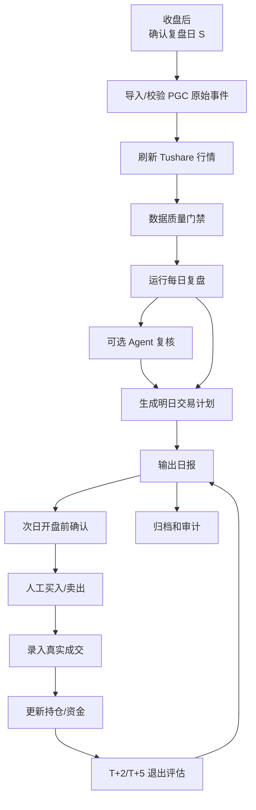
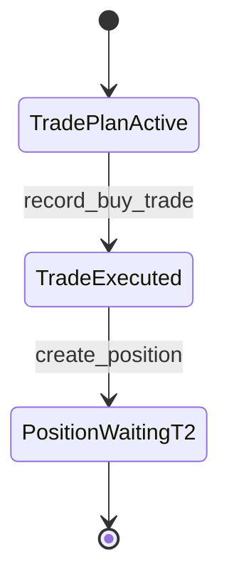

# PGC 实盘运营 Runbook 设计

日期：2026-05-03

## 1. 设计目标

Runbook 解决的是系统上线后每天怎么稳定执行的问题。

系统可以有策略、数据库、Agent 和 Dashboard，但实盘真正容易出错的地方通常是：

1. 收盘后行情没更新完整就跑复盘；
2. 把策略信号当成已经买入；
3. 次日买了但忘记录入成交；
4. T+2/T+5 到期但没有生成卖出计划；
5. Agent 说了“风险高”，但系统和人工没有明确处理规则；
6. 回测账户、模拟账户、实盘账户混查；
7. 手工改错没有留痕。

本 Runbook 的目标是把这些动作标准化。

核心原则：

- 每天只认一个复盘日 `S`。
- 所有交易日计算都来自交易日历，不用自然日心算。
- 策略只生成信号，交易计划只生成计划，成交录入后才生成持仓。
- 实盘账户所有成交必须人工确认或券商导入，不能用模型价格代替。
- Agent 首版只做复核意见，不自动阻断交易。
- 任何取消、跳过、修正、冲销都必须写入事件。

## 2. 角色与职责

| 角色 | 职责 | 允许动作 |
| --- | --- | --- |
| 操盘者 | 每日复盘、确认计划、录入成交、处理退出 | `review run`、`plan publish`、`trade record`、`exit evaluate` |
| 研究者 | 策略分析、参数实验、失败案例归档 | 回测、研究报告、Agent 效果分析 |
| 审计者 | 检查数据血缘、账户隔离、未来函数、操作留痕 | 只读查询、数据质量报告 |
| 管理员 | 账户配置、策略版本启停、权限配置 | 创建账户、启停策略部署 |

首版本地单人使用时，用户可以同时扮演操盘者、研究者和管理员，但系统记录中仍要保存 `operator`。

## 3. 每日运营总流程



## 4. 时间窗口

### 收盘后窗口

建议时间：A 股收盘后 15:30 到 18:00。

目标：

- 行情刷新到复盘日 `S`；
- 策略运行完成；
- 明日交易计划生成；
- 持仓 T+2/T+5 动作生成；
- 日报归档。

### 次日开盘前窗口

建议时间：9:00 到 9:25。

目标：

- 确认今日有效计划；
- 确认没有停牌、重大公告、明显异常高开风险；
- 发布计划；
- 开盘后人工执行。

### 开盘后成交录入窗口

建议时间：成交后 5 分钟内。

目标：

- 录入真实买入或卖出成交；
- 自动创建或更新持仓；
- 自动更新资金快照；
- 避免计划和真实账户脱节。

### 收盘退出评估窗口

建议时间：15:00 到 18:00。

目标：

- 对到达 T+2 的持仓做止盈/止损/持有到 T+5 判断；
- 对到达 T+5 的持仓生成退出计划；
- 生成下一交易日卖出计划，或按尾盘人工卖出后录入成交。

## 5. 收盘后标准流程

### Step 1: 确认复盘日

复盘日 `S` 必须是最近一个已收盘交易日。

检查项：

- `S` 在 `trade_calendar` 中 `is_open = 1`；
- `market_bars` 覆盖 `S`；
- 系统时间不早于当日收盘；
- 不使用未来交易日。

阻断条件：

- `S` 不是交易日；
- 行情未覆盖 `S`；
- 传入数据包含 `S` 之后行情。

### Step 2: 导入 PGC 原始事件

命令契约：

```bash
pgc raw import \
  --file data/pgc_raw_events.json \
  --source pgc_pool \
  --operator azboo
```

成功标准：

- 返回 `raw_import_batch_id`；
- `dirty_count = 0` 或脏数据已明确标记；
- 无新增非法字段；
- 不出现 `bull_prob`、`bull_reason`、`latest_ret`、`max_high`、`status` 等未来表现字段。

如果发现脏数据：

- 不直接物理删除历史记录；
- 标记 `is_valid = 0`；
- 写入 `data_quality_events`；
- 报告中显示被剔除原因。

### Step 3: 刷新 Tushare 行情

命令契约：

```bash
pgc market refresh \
  --scope raw-events \
  --end-date S \
  --provider tushare
```

成功标准：

- 返回 `market_fetch_run_id`；
- 有效入池股票行情覆盖到 `S`；
- `trade_calendar` 覆盖 `S+1`、潜在 T+2、潜在 T+5；
- 缺失股票被列出。

阻断条件：

- daily 行情缺失候选股票；
- `trade_calendar` 缺失；
- Tushare 返回失败但系统静默继续。

非阻断警告：

- 非候选股票个别行情缺失；
- `daily_basic` 缺失但首版策略不依赖；
- Agent 外部资讯不可用。

### Step 4: 数据质量门禁

运行每日复盘前必须检查：

- 原始事件有效数量大于 0；
- 行情覆盖所有有效 raw events 的观察窗口；
- `S` 之后行情没有进入特征计算；
- 当前策略版本存在；
- 当前账户存在；
- 当前账户类型明确为 `paper` 或 `live`。

结果分级：

| 结果 | 处理 |
| --- | --- |
| `pass` | 继续复盘 |
| `warning` | 继续复盘，但日报显示 |
| `blocker` | 停止复盘，人工处理 |

### Step 5: 运行每日复盘

当前 CLI v0 命令契约：

```bash
pgc daily-close \
  --date S \
  --db-path data/pgc_trading.db \
  --strategy-version cpb_6157@2026-05-03 \
  --account paper-main
```

默认不写库，只做 preview。确认数据质量、候选和计划结果后，再显式持久化：

```bash
pgc daily-close \
  --date S \
  --db-path data/pgc_trading.db \
  --strategy-version cpb_6157@2026-05-03 \
  --account paper-main \
  --apply \
  --operator azboo
```

成功标准：

- 返回 `workflow_status`；
- 返回 `readiness`；
- 返回候选信号数量；
- 每日最多一只 `daily_pick`；
- `--apply` 时生成 `trade_plan`，或明确 `skip`/blocked 原因。

没有信号时：

- 生成 `skip_no_signal` 计划或日报状态；
- 不创建成交；
- 不创建持仓。

仓位满时：

- 生成 `skip_max_positions`；
- 不覆盖策略信号；
- 不删除 daily pick；
- 日报中显示“有信号但账户无空闲仓位”。

### Step 6: 可选 Agent 复核

命令契约：

```bash
pgc agent review \
  --daily-pick-id DAILY_PICK_ID \
  --agent-system tradingagents \
  --mode local_snapshot_mode
```

成功标准：

- 生成 `input_snapshot_id`；
- 生成 `agent_run_id`；
- 生成 `agent_decision_id`；
- artifact 文件落入受控目录；
- Agent 只读取 input snapshot。

Agent 输出处理规则：

| Agent action | 首版处理 |
| --- | --- |
| `support` | 日报显示支持，不改变计划 |
| `caution` | 日报显示谨慎，要求人工确认 |
| `review_required` | 日报显示必须复核，人工确认 |
| `reject` | 首版不自动跳过，但必须人工确认是否取消 |
| `no_opinion` | 按确定性策略继续，提示无有效意见 |

Agent 失败时：

- 不阻断确定性交易计划；
- 写入 `agent_runs.status = failed`；
- 日报显示“Agent 复核失败”；
- 操盘者按确定性策略和人工检查处理。

### Step 7: 生成日报

命令契约：

```bash
pgc report daily \
  --as-of-date S \
  --account paper-main \
  --format markdown
```

日报必须包含：

- 复盘日 `S`；
- 最新行情日；
- 策略版本；
- 账户；
- 数据质量状态；
- 今日 daily pick；
- 明日交易计划；
- Agent 复核意见；
- 当前持仓；
- T+2/T+5 待处理动作；
- 数据血缘 ID。

日报禁止包含：

- 未录入成交却显示“已买入”；
- 用回测收益冒充真实收益；
- 把 Agent 意见显示成交易指令；
- 混合展示 backtest、paper、live 账户收益。

## 6. 次日开盘前流程

### Step 1: 查询今日有效计划

检查项：

- `trade_plan.status = draft` 或 `active`；
- `planned_trade_date` 或 `planned_buy_date` 等于今日交易日；
- `account_id` 是当前操作账户；
- 账户空闲仓位仍然满足；
- 无未处理的数据质量 blocker。

### Step 2: 人工开盘前检查

买入前必须人工确认：

- 股票未停牌；
- 没有重大利空公告；
- 开盘竞价没有极端高开；
- 当前账户现金充足；
- 当前持仓数量小于 3；
- 交易计划对应的是今日，不是过期计划；
- Agent 如为 `reject` 或 `review_required`，已人工确认。

建议高开处理规则：

- 若开盘价相对计划基准价高开过大，记录 `manual_review`；
- 是否跳过由人工决定；
- 跳过必须写 `cancel_reason` 或 `skip_manual`。

### Step 3: 发布计划

命令契约：

```bash
pgc plan publish \
  --trade-plan-id TRADE_PLAN_ID \
  --operator azboo
```

发布后：

- `trade_plan.status` 从 `draft` 变为 `active`；
- 仍不是成交；
- 仍不能生成持仓。

### Step 4: 人工执行买入

执行方式：

- 首版不自动下单；
- 操盘者在券商软件手动买入；
- 买入价格和股数以券商实际成交为准。

买入约束：

- 不超过账户可用现金；
- 不超过最大持仓 3 只；
- 单仓按等仓位规则；
- A 股买入股数符合 100 股整数倍。

## 7. 成交录入流程

### 买入成交录入

命令契约：

```bash
pgc trade record \
  --trade-plan-id TRADE_PLAN_ID \
  --account paper-main \
  --side buy \
  --executed-date YYYYMMDD \
  --executed-price PRICE \
  --shares SHARES \
  --fee FEE \
  --source manual \
  --operator azboo
```

成功后必须生成：

- `trade_id`；
- `position_id`；
- `planned_t2_date`；
- `planned_t5_date`；
- `equity_snapshot_id`；
- `domain_event = trade_recorded`；
- `domain_event = position_opened`。

买入成交录入后状态变化：



禁止：

- 没有真实成交价就录入 live 成交；
- 没有成交就创建持仓；
- 重复录入同一 `trade_plan_id` 的完整买入；
- 用策略计划价替代真实成交价。

### 卖出成交录入

命令契约：

```bash
pgc trade record \
  --trade-plan-id TRADE_PLAN_ID \
  --account paper-main \
  --side sell \
  --executed-date YYYYMMDD \
  --executed-price PRICE \
  --shares SHARES \
  --fee FEE \
  --tax TAX \
  --source manual \
  --operator azboo
```

成功后必须生成：

- 卖出 `trade_id`；
- 更新 `position.status`；
- 更新 `exit_decision`；
- 更新 `equity_snapshot`；
- 写入平仓收益；
- 写入 domain event。

## 8. T+2 退出判断流程

### 到期判断

每日收盘后运行：

```bash
pgc exit evaluate \
  --as-of-date S \
  --account paper-main
```

系统查找：

- `positions.status in ('waiting_t2', 'open')`；
- `planned_t2_date = S`；
- 当前收盘价存在；
- 买入成交价存在。

### T+2 判断规则

收益计算：

```text
ret = (S_close - buy_price) / buy_price
```

决策：

| T+2 收益 | 决策 | 动作 |
| --- | --- | --- |
| `ret >= +3%` | `take_profit` | 生成卖出计划 |
| `ret <= -3%` | `stop_loss` | 生成卖出计划 |
| `-3% < ret < +3%` | `hold_to_t5` | 持有到 T+5 |

注意：

- T+2 是买入日 T 之后的第 2 个交易日；
- 不是自然日；
- 节假日顺延；
- 收益基于真实或模拟成交价，不基于回测价。

### T+2 卖出计划

如果触发止盈或止损：

- 生成 `exit_decision`；
- 生成 `trade_plan.action = sell_t2_take_profit` 或 `sell_t2_stop_loss`；
- 是否当日尾盘卖出还是次日卖出，由执行策略配置决定；
- 首版建议保守处理：收盘评估后生成下一交易日卖出计划，若人工已在尾盘执行，则直接录入卖出成交。

## 9. T+5 退出流程

触发条件：

- T+2 决策为 `hold_to_t5`；
- `planned_t5_date = S`；
- 持仓仍未平仓。

动作：

- 生成 `exit_decision.decision = timeout_exit`；
- 生成 `trade_plan.action = sell_t5_timeout`；
- 人工执行卖出；
- 录入卖出成交；
- 持仓变为 `closed`。

禁止：

- T+5 到期后继续自动展期；
- 没有新策略版本和新计划就延长持仓；
- 用人工口头决定替代系统事件。

## 10. 异常处理 Runbook

### 行情缺失

症状：

- `MARKET_DATA_NOT_READY`；
- 候选股票缺少 `S` 日行情；
- `trade_calendar` 缺失。

处理：

1. 重新运行行情刷新；
2. 若 Tushare 仍失败，检查是否停牌或接口异常；
3. 写入 `data_quality_events`；
4. blocker 未解决前不生成实盘新买入计划。

### PGC 原始数据异常

症状：

- 新导入文件 hash 变化异常；
- 入池价格为空或为 0；
- 股票代码无法映射为 Tushare `ts_code`；
- 出现未来表现字段。

处理：

1. 标记对应 raw event `is_valid = 0`；
2. 记录 `invalid_reason`；
3. 重新运行复盘；
4. 报告中显示剔除原因。

### Agent 失败

症状：

- Agent 工具不可用；
- 输出 JSON 不合法；
- A 股 ticker 识别失败。

处理：

1. `agent_runs.status = failed`；
2. 保存错误信息；
3. 不阻断确定性计划；
4. 日报显示“Agent 复核失败，需人工复核”；
5. 不重试到覆盖旧 agent run，应创建新的 agent run。

### 开盘未成交

症状：

- 计划已发布；
- 当日未执行买入；
- 没有成交记录。

处理：

1. 当日结束前将计划标记为 `expired` 或 `cancelled`；
2. 写明原因：未成交、人工放弃、价格异常、仓位变化；
3. 不创建持仓；
4. 不在次日继续沿用旧计划，除非重新生成计划。

### 部分成交

症状：

- 买入或卖出只成交部分股数。

处理：

1. 记录 `trades.status = partial`；
2. 持仓按实际成交股数创建或减少；
3. 剩余部分可取消或继续挂单；
4. 取消剩余部分必须写事件。

### 成交录错

症状：

- 价格、股数、日期、费用录错。

处理：

1. 不直接覆盖原成交；
2. 创建 correction trade；
3. 原成交标记 `corrected` 或创建冲销事件；
4. 重算 position 和 equity snapshot；
5. 写入 `domain_events`。

### 账户不一致

症状：

- `paper-main` 的计划被录入到 `live-main`；
- 查询持仓时混入回测账户。

处理：

1. 阻断写入；
2. 返回 `ACCOUNT_TYPE_MISMATCH`；
3. 写入 data quality 事件；
4. 人工确认后重新录入正确账户。

## 11. 人工覆盖规则

人工可以覆盖系统计划，但必须留痕。

允许覆盖：

- 取消买入计划；
- 跳过高开过大的买入；
- 因公告风险跳过；
- 因流动性不足跳过；
- 提前卖出；
- 部分卖出；
- 手工冲销错误成交。

不允许覆盖：

- 修改 raw event 入池价格来让策略命中；
- 修改行情数据来改变收益；
- 修改策略信号评分；
- 删除历史成交；
- 删除失败的 Agent run；
- 用回测收益替代实盘收益。

人工覆盖必须记录：

- 操作者；
- 时间；
- 原计划；
- 覆盖动作；
- 原因；
- 影响的账户；
- 关联的 `trade_plan_id`、`position_id` 或 `trade_id`。

## 12. 每日检查清单

### 收盘后检查清单

| 检查项 | 通过标准 |
| --- | --- |
| 复盘日 | `S` 是已收盘交易日 |
| 原始事件 | 无未处理 blocker |
| 行情 | 有效股票覆盖到 `S` |
| 交易日历 | 覆盖 S+1、T+2、T+5 |
| 策略版本 | `cpb_6157@2026-05-03` 存在且状态允许运行 |
| 账户 | 当前账户明确 |
| 每日 pick | 最多一只 |
| 交易计划 | 有明确 action 和 status |
| 持仓处理 | T+2/T+5 动作已评估 |
| 日报 | 已生成并归档 |

### 开盘前检查清单

| 检查项 | 通过标准 |
| --- | --- |
| 今日计划 | `planned_trade_date` 等于今日 |
| 仓位 | 未超过最大 3 只 |
| 现金 | 可用现金充足 |
| 停牌 | 候选未停牌 |
| 公告 | 无重大利空或已人工确认 |
| Agent | `caution/reject/review_required` 已人工确认 |
| 计划状态 | 已发布为 `active` |

### 成交后检查清单

| 检查项 | 通过标准 |
| --- | --- |
| 成交价 | 与券商成交一致 |
| 股数 | 与券商成交一致 |
| 费用 | 已录入或可后补 |
| 持仓 | 买入成交后生成 position |
| T+2/T+5 | 日期由交易日历生成 |
| 资金 | equity snapshot 已更新 |
| 状态 | trade plan 变为 executed |

## 13. 日报归档规则

每个复盘日必须保留：

- Markdown 日报；
- JSON 日报；
- strategy run id；
- feature run id；
- market fetch run id；
- trade plan id；
- agent run id；
- data quality 结果。

建议目录：

```text
reports/daily/
  20260430/
    daily_review.md
    daily_review.json
    data_quality.json
    trade_plan.json
    agent_review.json
```

报告不是事实源。事实源仍然是数据库表。

## 14. 周度复盘流程

每周最后一个交易日收盘后执行。

检查内容：

- 本周生成多少 daily pick；
- 实际执行多少笔；
- 跳过多少笔；
- 跳过原因分布；
- T+2 止盈、止损、持有到 T+5 的比例；
- 当前持仓状态是否全部可解释；
- 实盘收益和模型计划收益差异；
- Agent 复核是否有实际帮助；
- 数据质量事件是否有重复问题。

输出：

- 周报；
- 失败案例清单；
- 数据质量问题清单；
- 是否需要调整策略版本的建议。

注意：

- 周度复盘不能直接修改当前 live 策略参数；
- 参数调整必须进入策略版本治理流程；
- 新参数必须重新回测和验证。

## 15. 月度审计流程

每月最后一个交易日后执行。

审计问题：

1. 有没有成交没有对应计划？
2. 有没有持仓没有买入成交？
3. 有没有平仓没有卖出成交？
4. 有没有 T+2/T+5 到期未处理？
5. 有没有 Agent 输出写入 Signal 层？
6. 有没有 live 账户读取 backtest 账户数据？
7. 有没有 raw event 被改写？
8. 有没有数据质量 blocker 被忽略？
9. 有没有策略版本参数发生静默变化？

审计输出：

- 月度审计报告；
- 需要修正的 domain events；
- 需要冻结或暂停的策略版本；
- 下月运行建议。

## 16. 首次实盘启用 Runbook

在从 `paper-main` 进入 `live-main` 前，必须完成：

- `paper-main` 至少 10 笔模拟盘；
- 成交录入流程稳定；
- T+2/T+5 流程稳定；
- 无连续重大数据质量错误；
- 当前策略版本状态允许 live candidate；
- 账户最大持仓、初始资金、单仓规则配置明确；
- 操盘者接受首版不自动下单；
- Agent 仍为 advisory，不自动跳过。

启用当天：

1. 创建或确认 `live-main`；
2. 创建 strategy deployment；
3. 确认最大持仓 3 只；
4. 确认初始资金；
5. 运行 dry run；
6. 人工批准 live；
7. 从下一复盘日开始生成 live 计划。

## 17. 停机与暂停规则

必须暂停新开仓的情况：

- 行情连续缺失；
- PGC 原始数据来源异常；
- 交易日历异常；
- 策略版本 hash 与登记不一致；
- 实盘成交多次录入错误；
- 最大亏损超过人工设定红线；
- 账户资金和系统资金差异无法解释；
- 出现疑似未来函数。

暂停后允许：

- 管理已有持仓；
- 执行 T+2/T+5 退出；
- 录入真实成交；
- 做数据修复；
- 做研究复盘。

暂停后禁止：

- 新开仓；
- 创建新的 live 买入计划；
- 临时修改策略参数继续运行。

## 18. Runbook 验收标准

Runbook 落地后必须满足：

1. 任意一天能明确复盘日 `S`、计划日、成交日。
2. 没有成交不会生成持仓。
3. 每个持仓都有 T+2/T+5 日期。
4. 每个卖出动作能追溯到 exit decision。
5. 每个交易计划都有状态。
6. 每个人工取消都有原因。
7. 每个 Agent 失败都不会污染策略信号。
8. 每个日报能追溯 run id。
9. 每个账户查询都带 account id。
10. 任意一次重复提交不会重复建仓。

## 19. ADR

### ADR-OPS-001: 首版实盘不自动下单

Context：当前系统的优势在于 PGC 原始数据研究、确定性策略、日内外短线流程和账本闭环，但自动下单会引入券商接口、风控、撤单、部分成交和盘中异常。

Options：

- 首版直接自动下单；
- 首版只生成计划，人工执行并录入成交；
- 首版只做研究，不进入实盘流程。

Decision：首版只生成计划，人工执行并录入成交。

Consequences：

- 好处：风险可控，账本边界清晰。
- 代价：操盘者必须及时录入成交。
- 风险：人工漏录会导致系统持仓不准，因此 Runbook 要求成交后 5 分钟内录入。

### ADR-OPS-002: Agent 失败不阻断确定性计划

Context：TradingAgents 是辅助研究层，可能因为网络、工具、模型输出格式等原因失败。

Options：

- Agent 失败则不交易；
- Agent 失败完全忽略；
- Agent 失败不阻断计划，但日报提示人工复核。

Decision：Agent 失败不阻断确定性计划，但必须提示人工复核。

Consequences：

- 好处：确定性策略流程稳定。
- 代价：人工要承担复核责任。
- 风险：未来若 Agent 进入 filter 模式，必须新建策略版本并重新回测。

### ADR-OPS-003: T+2/T+5 只按交易日历推进

Context：短线策略容易被节假日影响。自然日计算会导致错误卖出日期。

Options：

- 用自然日；
- 用交易日历；
- 人工手动填写。

Decision：只使用交易日历。

Consequences：

- 好处：节假日和停市不出错。
- 代价：必须保证 `trade_calendar` 完整。
- 风险：交易日历缺失时必须阻断退出评估或人工确认。
