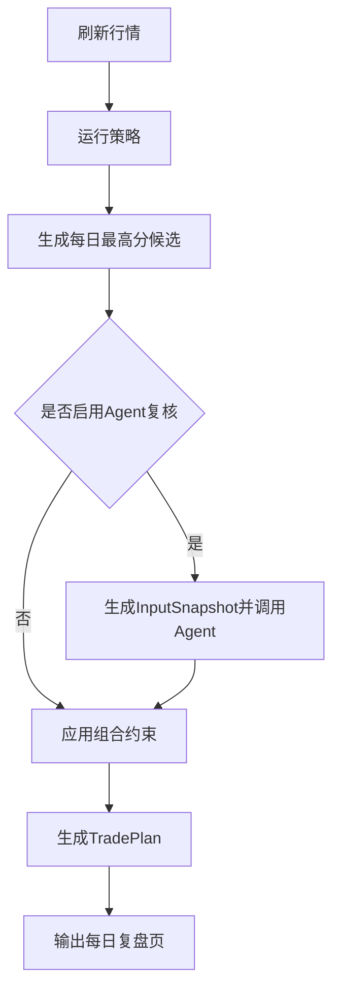
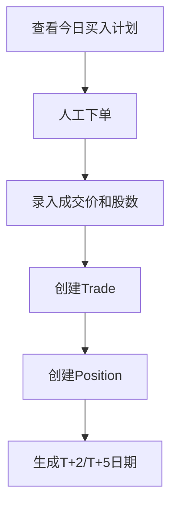
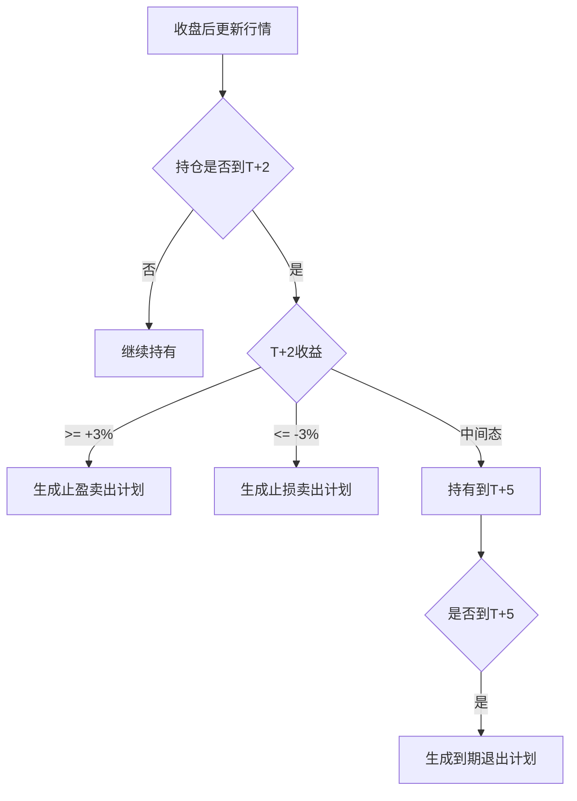

# PGC 量化选股系统产品与界面信息架构

日期：2026-05-03

## 1. 设计目标

这个系统不是资讯站，也不是炫技看板。它是一个每日复盘和交易执行辅助工具。

页面级字段、按钮状态和端到端操作流的详细拆解见 `reports/dashboard_interaction_detail_design.md`。视觉系统、组件规范、响应式和可访问性见 `reports/dashboard_visual_component_design.md`。本文件保留信息架构和页面边界，详细设计文件负责指导 Dashboard 开发实现。

界面目标：

1. 收盘后 3 分钟内知道明天是否要买。
2. 开盘前知道买哪只、为什么买、仓位是否允许。
3. T+2/T+5 知道手上票该卖、该持有还是等人工确认。
4. 始终区分“策略信号”“Agent意见”“交易计划”“真实成交”。
5. 所有展示都能追溯数据来源和运行版本。

核心防错原则：

- 不把 Agent 意见展示成交易指令。
- 不把模型计划收益展示成真实收益。
- 不把候选信号展示成已买入持仓。
- 不把回测账户、模拟账户、实盘账户混在一个资金曲线里。

## 2. 用户角色

### 研究者

关注：

- 策略表现；
- 参数稳定性；
- 样本明细；
- 失败案例；
- Agent 是否有过滤价值。

主要页面：

- 策略研究；
- 回测分析；
- 信号明细；
- Agent 复核记录。

### 操盘者

关注：

- 今天是否有信号；
- 明天买什么；
- 当前持仓怎么处理；
- 是否超过 3 只；
- 实盘成交是否记录。

主要页面：

- 每日复盘；
- 交易计划；
- 当前持仓；
- 成交录入。

### 审计者

关注：

- 数据来源；
- 运行版本；
- 是否使用未来数据；
- 真实成交和模型计划是否一致。

主要页面：

- 数据血缘；
- 运行日志；
- 账户账本；
- 数据质量。

## 3. 顶层导航

```text
PGC Trading
├── 每日复盘
├── 交易计划
├── 当前持仓
├── 账户资金
├── 策略研究
├── Agent 复核
├── 数据质量
└── 系统设置
```

默认首页：`每日复盘`

原因：

- 这是每日收盘后的主工作流。
- 用户首先需要知道“明天是否有动作”。
- 不应该先进入复杂研究页。

## 4. 首页：每日复盘

### 页面目的

回答四个问题：

1. 最新复盘日是哪天？
2. 今天有没有 `cpb_6157` 信号？
3. 明天是否可以买？
4. 当前持仓是否有 T+2/T+5 处理动作？

### 信息布局

```text
┌────────────────────────────────────────────┐
│ 顶部状态条                                  │
│ 最新行情日 / 策略版本 / 账户 / 数据质量       │
├────────────────────────────────────────────┤
│ 明日动作                                    │
│ 买入 / 跳过 / 无信号 / 人工复核              │
├────────────────────────────────────────────┤
│ 今日最高分候选                              │
│ 股票、评分、触发价、核心特征、买入计划         │
├────────────────────────────────────────────┤
│ 当前持仓处理                                │
│ T+2止盈、T+2止损、T+5退出、无动作             │
├────────────────────────────────────────────┤
│ Agent复核摘要                               │
│ 支持/谨慎/拒绝/需复核，显示为意见，不显示为指令 │
└────────────────────────────────────────────┘
```

### 数据来源

| 模块 | 数据源 |
| --- | --- |
| 顶部状态条 | `market_fetch_runs`、`strategy_runs`、`portfolio_accounts`、`data_quality_events` |
| 明日动作 | `trade_plans` |
| 今日最高分候选 | `daily_picks`、`strategy_signals`、`feature_snapshots` |
| 当前持仓处理 | `positions`、`exits`、`market_bars` |
| Agent复核摘要 | `agent_decisions` |

### 页面防串提示

- 候选卡片标题必须写“策略信号”，不能写“持仓”。
- Agent 卡片标题必须写“AI 复核意见”，不能写“买入建议”。
- 如果未录入成交，不能显示为“已买入”。
- 如果行情未更新到最新交易日，明日动作区域必须显示数据质量警告。

## 5. 页面：交易计划

### 页面目的

展示每一天模型计划生成了什么动作，以及动作是否执行。

### 核心列表字段

| 字段 | 说明 |
| --- | --- |
| `as_of_date` | 计划生成日期 |
| `planned_buy_date` | 计划买入日期 |
| `action` | 买入、跳过、卖出、持有 |
| `ts_code/name` | 股票 |
| `signal_id` | 策略信号 |
| `agent_decision_id` | 可选 AI 复核 |
| `account_id` | 账户 |
| `status` | active / executed / cancelled / expired |
| `reason` | 计划原因 |

### Action 展示规则

| action | UI 文案 | 颜色语义 |
| --- | --- | --- |
| `buy_next_open` | 次日开盘买入 | 主操作 |
| `skip_max_positions` | 仓位已满，跳过 | 中性 |
| `skip_no_signal` | 无信号 | 中性 |
| `sell_t2_take_profit` | T+2 止盈卖出 | 正向 |
| `sell_t2_stop_loss` | T+2 止损卖出 | 风险 |
| `sell_t5_timeout` | T+5 到期退出 | 中性 |
| `manual_review` | 人工复核 | 警示 |

### 防串规则

- `trade_plans` 是计划，不是成交。
- 只有存在 `trades.executed_date` 才能展示为已执行。
- 计划价格和成交价格分开展示。
- 如果计划被人工取消，必须保留取消原因，不删除原计划。

## 6. 页面：当前持仓

### 页面目的

回答：

- 当前持有什么？
- 买入依据是什么？
- 到了 T+2 还是 T+5？
- 当前收益是多少？
- 下一步动作是什么？

### 持仓卡片字段

| 字段 | 来源 |
| --- | --- |
| 股票 | `positions.ts_code/name` |
| 买入日 | `positions.buy_date` |
| 买入价 | `positions.buy_price` |
| 股数 | `positions.shares` |
| 成本 | `positions.cost` |
| 当前价 | `market_bars.close` |
| 当前收益 | 当前价相对买入价 |
| T+2日期 | `positions.planned_t2_date` |
| T+5日期 | `positions.planned_t5_date` |
| 退出计划 | `exits` / `trade_plans` |
| 原始信号 | `signal_id` 链接 |

### 状态

| 状态 | 含义 |
| --- | --- |
| `open_t0_t1` | 买入后未到 T+2 |
| `need_t2_decision` | 今日需要 T+2 判断 |
| `holding_to_t5` | T+2 中间态，持有到 T+5 |
| `need_t5_exit` | 今日需要 T+5 退出 |
| `planned_exit` | 已生成卖出计划 |
| `closed` | 已平仓 |

### 防串规则

- 当前收益是持仓收益，不是策略回测收益。
- 没有真实买入成交价时，不生成持仓。
- T+2/T+5 日期必须来自交易日历，不允许自然日硬算。

## 7. 页面：成交录入

### 页面目的

把人工交易执行结果录入系统，让账本从“计划”变成“事实”。

### 买入录入

字段：

- `trade_plan_id`
- `executed_date`
- `executed_price`
- `shares`
- `fee`
- `notes`

系统自动计算：

- `amount`
- `cost`
- `planned_t2_date`
- `planned_t5_date`
- `position`

### 卖出录入

字段：

- `position_id`
- `exit_plan_id`
- `executed_date`
- `executed_price`
- `shares`
- `fee`
- `tax`
- `notes`

系统自动计算：

- 实现盈亏；
- 持仓状态；
- 账户现金；
- 资金快照。

### 防错

- 卖出股数不能超过当前持仓股数。
- 实盘账户成交必须有价格和股数。
- 同一计划不能重复生成两笔买入，除非显式允许分批成交。

## 8. 页面：账户资金

### 页面目的

展示账户层面的真实表现。

### 账户切换

顶部必须有账户选择器：

- 回测账户；
- 模拟盘账户；
- 实盘账户。

不同账户的资金曲线不能叠在同一默认视图里。

### 核心指标

| 指标 | 说明 |
| --- | --- |
| 总资产 | cash + market_value |
| 可用现金 | account cash |
| 持仓市值 | open positions market value |
| 已实现盈亏 | closed trades |
| 未实现盈亏 | open positions |
| 最大回撤 | equity curve |
| 胜率 | closed positions |
| 平均盈利/亏损 | closed positions |

### 防串规则

- 回测收益不能放进实盘账户。
- 未录入成交的计划不能影响资金。
- Agent 意见不能直接影响资金曲线。

## 9. 页面：策略研究

### 页面目的

研究策略，不做实盘执行。

### 子页面

```text
策略研究
├── cpb_6157 参数
├── 信号级表现
├── 每日一只表现
├── T+1/T+2/T+5 对比
├── 失败案例
└── 样本明细
```

### 防串规则

- 研究页面展示的是历史统计，不是当前买入建议。
- 回测统计必须显示样本区间和数据截止日。
- 所有参数优化结果必须显示训练期和验证期。
- 样本内最优不能直接标记为实盘策略，必须有策略版本升级流程。

## 10. 页面：Agent 复核

### 页面目的

展示 TradingAgents 对候选票的研究意见，并保留可追溯原始结果。

### 信息布局

```text
Agent 复核
├── 输入快照
├── Agent运行配置
├── 最终意见
├── 支持因素
├── 风险因素
├── 人工检查项
├── 原始Artifacts
└── 与后续表现对比
```

### 标签

| action | 展示 |
| --- | --- |
| `support` | 支持原计划 |
| `caution` | 谨慎执行 |
| `reject` | 高风险，需人工确认 |
| `review_required` | 信息不足 |
| `no_opinion` | 无有效意见 |

### 防串规则

- 页面必须写明“Agent 复核不是交易指令”。
- Agent 结论不得自动改写 `daily_picks`。
- Agent 结论必须链接 `input_snapshot_id` 和 `agent_run_id`。
- Agent 后验表现分析必须单独页面展示，不能混入当日复核。

## 11. 页面：数据质量

### 页面目的

防止坏数据进入复盘。

### 检查项

| 检查 | 级别 |
| --- | --- |
| PGC 原始事件重复 | warning |
| 入池日期非交易日 | warning |
| 行情缺失 | blocker |
| 复权因子缺失 | blocker |
| 交易日历不足 | blocker |
| 当前持仓超过最大仓位 | blocker |
| 实盘成交缺少价格 | blocker |
| Agent 运行失败 | info/warning |

### 页面规则

- blocker 存在时，每日复盘页必须显示红色状态。
- blocker 不一定阻止查看历史，但应阻止生成新实盘计划。
- 数据修复需要记录，不应静默修改。

## 12. 页面：系统设置

### 配置项

策略配置：

- 当前策略：`cpb_6157`
- 策略版本；
- 参数 JSON；
- 是否启用 Agent 复核。

账户配置：

- 初始资金；
- 最大持仓数；
- 仓位模式；
- 账户类型。

数据配置：

- Tushare token 来源；
- 行情刷新区间；
- 交易日历刷新区间；
- TradingAgents 结果目录。

### 防错

- 修改策略参数必须生成新策略版本。
- 修改账户初始资金不能影响已有账户历史。
- 修改最大持仓数应从下一交易计划生效。

## 13. 关键操作流

### 收盘复盘流



### 开盘成交流



### 卖出判断流



## 14. UI 文案规范

为了防止误解，以下词汇必须严格使用：

| 概念 | 推荐文案 | 禁止文案 |
| --- | --- | --- |
| 策略候选 | 策略信号 | 必买 |
| Agent 结论 | AI复核意见 | AI指令 |
| 交易计划 | 计划买入/计划卖出 | 已买入 |
| 真实成交 | 已成交 | 模型成交 |
| 回测收益 | 回测收益 | 实盘收益 |
| 模拟账户 | 模拟盘 | 实盘 |

## 15. 首版页面优先级

P0：

- 每日复盘
- 交易计划
- 当前持仓
- 成交录入

P1：

- 账户资金
- 数据质量
- Agent 复核

P2：

- 策略研究
- 系统设置
- Dashboard 汇总页

## 16. 验收标准

界面设计完成后必须满足：

1. 用户能在首页看到明日是否买入。
2. 用户能区分候选、计划、成交、持仓。
3. 用户能看到当前持仓的 T+2/T+5 日期。
4. 用户能知道 Agent 只是复核意见。
5. 用户能切换账户，且不同账户资金不混。
6. 用户能从一笔交易追溯到策略信号和原始入池事件。
7. 数据质量异常不会被藏在报告角落。
