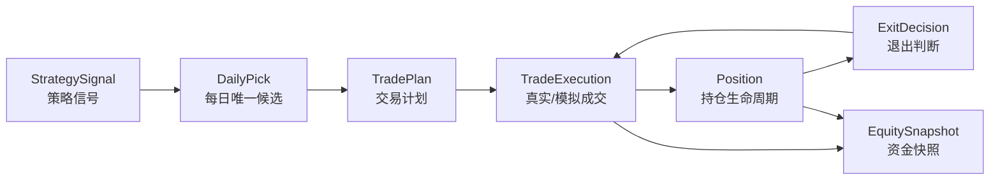
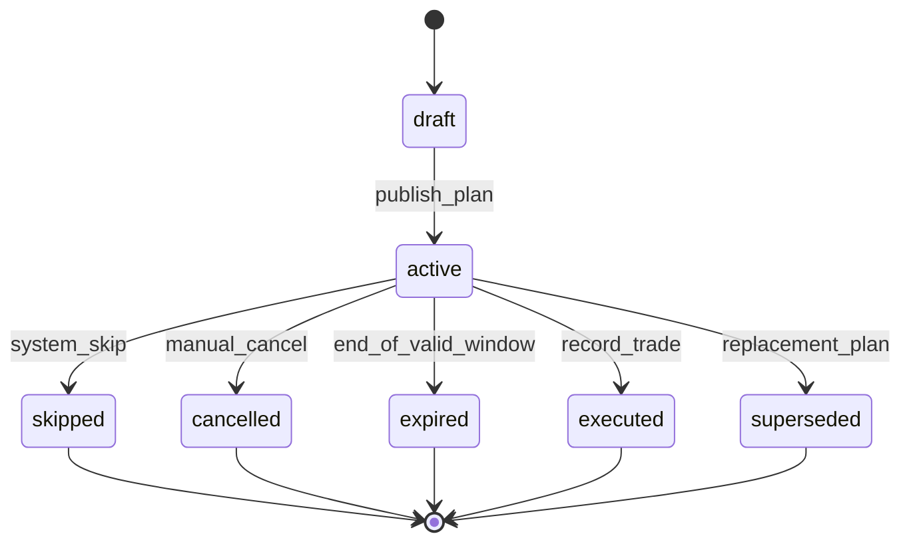
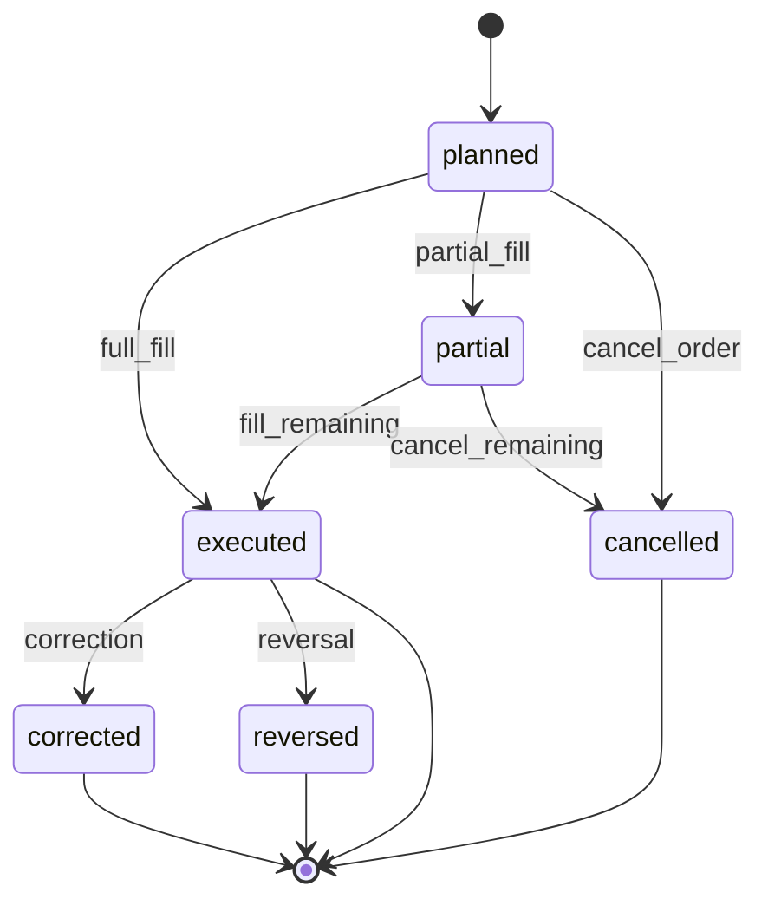
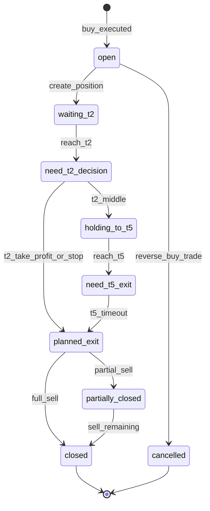
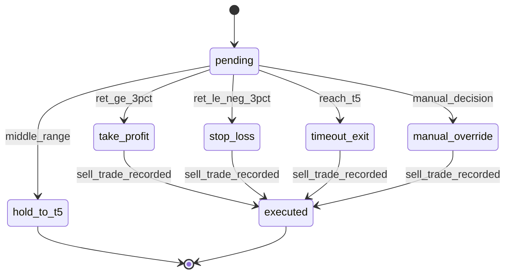

# PGC 交易状态机与事件流设计

日期：2026-05-03

## 1. 设计目标

状态机负责回答：

1. 策略信号如何变成交易计划？
2. 交易计划如何变成真实成交？
3. 成交如何变成持仓？
4. 持仓如何进入 T+2/T+5 退出判断？
5. 人工取消、漏买、成交偏差、部分成交如何记录？
6. 如何保证回测、模拟盘、实盘不串账？

核心原则：

- 策略信号不能直接创建持仓。
- 交易计划不能当作成交。
- 成交必须产生账户影响。
- 持仓状态变化必须有事件。
- 人工修正必须留痕，不允许静默覆盖。

## 2. 总生命周期



关键约束：

- `StrategySignal` 属于策略层。
- `TradePlan` 属于组合计划层。
- `TradeExecution` 属于成交事实层。
- `Position` 属于持仓状态层。
- `EquitySnapshot` 属于账户估值层。

## 3. TradePlan 状态机

### 状态

| 状态 | 含义 |
| --- | --- |
| `draft` | 系统生成但尚未确认 |
| `active` | 当日有效计划 |
| `executed` | 已有成交记录 |
| `skipped` | 系统规则跳过 |
| `cancelled` | 人工取消 |
| `expired` | 过期未执行 |
| `superseded` | 被后续计划替代 |

### 状态图



### 允许动作

| 当前状态 | 允许动作 |
| --- | --- |
| `draft` | 发布、取消 |
| `active` | 录入成交、跳过、取消、过期 |
| `executed` | 只读 |
| `skipped` | 只读 |
| `cancelled` | 只读 |
| `expired` | 只读 |
| `superseded` | 只读 |

### 关键规则

- 一个 `buy_next_open` 计划只在 `planned_buy_date` 有效。
- 未在有效窗口录入成交，应转为 `expired`，不是删除。
- 因最大持仓跳过，应记录 `skipped` 和原因 `max_positions`。
- 人工取消必须写 `cancel_reason`。

## 4. TradeExecution 状态机

### 状态

| 状态 | 含义 |
| --- | --- |
| `planned` | 计划内但未成交 |
| `executed` | 已成交 |
| `partial` | 部分成交 |
| `cancelled` | 已取消 |
| `corrected` | 已被修正 |
| `reversed` | 已冲销 |

### 状态图



### 关键规则

- 实盘成交必须有 `executed_date`、`executed_price`、`shares`。
- 模拟盘成交可以使用模型价格，但 `source` 必须为 `model` 或 `paper_model`。
- 实盘成交来源必须为 `manual` 或 `broker_import`。
- 修正成交不能覆盖旧记录，应创建 correction event。
- 冲销用于错误录入，必须记录原因。

## 5. Position 状态机

### 状态

| 状态 | 含义 |
| --- | --- |
| `open` | 正常持仓 |
| `waiting_t2` | 未到 T+2 |
| `need_t2_decision` | 今日需要 T+2 判断 |
| `holding_to_t5` | T+2 中间态，继续持有 |
| `need_t5_exit` | 今日需要 T+5 退出 |
| `planned_exit` | 已生成卖出计划 |
| `partially_closed` | 部分卖出 |
| `closed` | 已全部平仓 |
| `cancelled` | 持仓因成交冲销而取消 |

### 状态图



### 关键规则

- `Position` 只能由买入成交创建。
- `planned_t2_date` 和 `planned_t5_date` 必须来自交易日历。
- 到 T+2 必须创建 `ExitDecision`。
- T+2 中间态不能直接变 closed，必须等卖出成交。
- 平仓必须引用卖出 `trade_id`。

## 6. ExitDecision 状态机

### 状态

| 状态 | 含义 |
| --- | --- |
| `pending` | 待判断 |
| `take_profit` | T+2 止盈 |
| `stop_loss` | T+2 止损 |
| `hold_to_t5` | T+2 中间态 |
| `timeout_exit` | T+5 到期退出 |
| `manual_override` | 人工覆盖 |
| `executed` | 对应卖出已成交 |

### 状态图



### 关键规则

- `ret` 必须基于真实买入价或模拟成交价计算。
- 不能用回测收益替代真实持仓收益。
- `manual_override` 必须记录操作者、原因和时间。

## 7. EquitySnapshot 状态机

资金快照不是交易状态，而是账户估值。

### 触发条件

- 买入成交后；
- 卖出成交后；
- 每日收盘估值；
- 手工资金调整；
- 成交修正或冲销后。

### 快照字段

- `cash`
- `market_value`
- `total_equity`
- `realized_pnl`
- `unrealized_pnl`
- `as_of_date`
- `account_id`

### 关键规则

- 每个账户每天最多一个最终收盘快照。
- 盘中临时快照可以有 `snapshot_type = intraday`。
- 资金快照不能由策略信号直接触发，必须来自交易或估值。

## 8. 事件类型

系统应记录事件，便于审计和回放。

### 事件表建议

`domain_events`

关键字段：

- `id`
- `event_type`
- `entity_type`
- `entity_id`
- `account_id`
- `occurred_at`
- `payload_json`
- `source`
- `created_at`

### 事件枚举

| 事件 | 触发 |
| --- | --- |
| `raw_events_imported` | PGC 数据导入 |
| `market_data_fetched` | 行情刷新 |
| `feature_run_completed` | 特征计算完成 |
| `strategy_run_completed` | 策略运行完成 |
| `daily_pick_selected` | 每日唯一候选生成 |
| `agent_review_requested` | 请求 Agent 复核 |
| `agent_review_completed` | Agent 完成 |
| `trade_plan_created` | 交易计划生成 |
| `trade_plan_cancelled` | 计划取消 |
| `trade_executed` | 成交录入 |
| `position_opened` | 持仓创建 |
| `exit_decision_created` | 退出判断生成 |
| `position_closed` | 持仓关闭 |
| `equity_snapshot_created` | 资金快照生成 |
| `manual_correction_created` | 人工修正 |

## 9. 典型事件流

### 买入流

```text
strategy_run_completed
  -> daily_pick_selected
  -> trade_plan_created
  -> trade_executed
  -> position_opened
  -> equity_snapshot_created
```

### T+2 止盈流

```text
market_data_fetched
  -> exit_decision_created(reason=take_profit_ge3)
  -> trade_plan_created(action=sell_t2_take_profit)
  -> trade_executed(side=sell)
  -> position_closed
  -> equity_snapshot_created
```

### T+2 中间态到 T+5 流

```text
market_data_fetched
  -> exit_decision_created(reason=hold_middle_to_t5)
  -> position_status_changed(holding_to_t5)
  -> exit_decision_created(reason=timeout_t5)
  -> trade_plan_created(action=sell_t5_timeout)
  -> trade_executed(side=sell)
  -> position_closed
  -> equity_snapshot_created
```

### Agent 复核流

```text
daily_pick_selected
  -> input_snapshot_created
  -> agent_review_requested
  -> agent_review_completed
  -> trade_plan_created(agent_decision_id=...)
```

Agent 失败时：

```text
daily_pick_selected
  -> input_snapshot_created
  -> agent_review_requested
  -> agent_review_failed
  -> trade_plan_created(agent_decision_id=null)
```

## 10. 人工修正流程

### 允许修正的内容

- 成交价格；
- 成交股数；
- 手续费；
- 税费；
- 成交日期；
- 人工取消计划；
- 人工覆盖退出判断。

### 不允许修正的内容

- 原始入池价格；
- 原始入池日期；
- 历史行情；
- 策略特征；
- 策略评分；
- Agent 原始输出。

如果原始数据确实错误：

- 创建 `data_quality_event`；
- 标记原记录无效；
- 新增修正记录；
- 不覆盖历史事实。

### 修正事件

每次修正写入：

- `manual_correction_created`
- `old_value_json`
- `new_value_json`
- `reason`
- `operator`
- `occurred_at`

## 11. 异常场景

### 开盘未买

场景：系统生成买入计划，但用户未执行。

处理：

- `trade_plan.status = expired` 或 `cancelled`
- 不创建 `trade`
- 不创建 `position`
- 资金不变

### 买入价格偏离模型开盘价

场景：真实成交价与模型买入价不同。

处理：

- 真实持仓按 `executed_price` 计算。
- 模型偏差写入 `slippage`。
- 不修改策略回测收益。

### 部分成交

场景：只买到部分股数。

处理：

- `trade.status = partial`
- `position.shares = filled_shares`
- 仓位成本按实际成交计算。
- 未成交部分可取消或继续补单，但必须另有事件。

### T+2 当天未卖

场景：生成止盈/止损卖出计划，但用户未卖。

处理：

- 卖出计划过期或人工延迟。
- 持仓状态转 `manual_override_required` 或保持 `planned_exit`。
- 后续收益单独归为人工偏离，不计入模型执行表现。

### 停牌或无行情

处理：

- 数据质量 blocker。
- 不生成新买入计划。
- 对已有持仓标记 `exit_blocked_no_market_data`。

### Agent 失败

处理：

- `agent_run.status = failed`
- 记录错误。
- 不阻断确定性交易计划。
- 日报显示“AI复核失败”。

## 12. 状态与页面映射

| 状态来源 | 页面展示 |
| --- | --- |
| `trade_plan.active` | 交易计划页、每日复盘页 |
| `trade_plan.expired` | 交易计划历史 |
| `trade.executed` | 成交记录 |
| `position.open` | 当前持仓 |
| `position.need_t2_decision` | 每日复盘的待处理事项 |
| `position.holding_to_t5` | 当前持仓 |
| `position.closed` | 历史交易 |
| `agent_run.failed` | 数据质量/Agent复核页 |

## 13. 权限与确认

首版可以不做多用户权限，但必须区分动作类型：

| 动作 | 是否需要确认 |
| --- | --- |
| 生成策略信号 | 否 |
| 生成交易计划 | 否 |
| 录入实盘买入 | 是 |
| 录入实盘卖出 | 是 |
| 取消计划 | 是 |
| 人工覆盖退出 | 是 |
| 修改策略参数 | 是，新版本 |
| 删除历史交易 | 禁止 |

## 14. 验收标准

状态机实现后必须满足：

1. 没有成交就不会出现持仓。
2. 没有持仓就不会出现退出判断。
3. Agent 失败不影响交易计划生成。
4. 计划取消不会删除历史计划。
5. 成交修正保留旧值和原因。
6. 实盘收益永远基于真实成交价。
7. 回测账户和实盘账户互不影响。
8. 每次状态变化都有事件记录。
