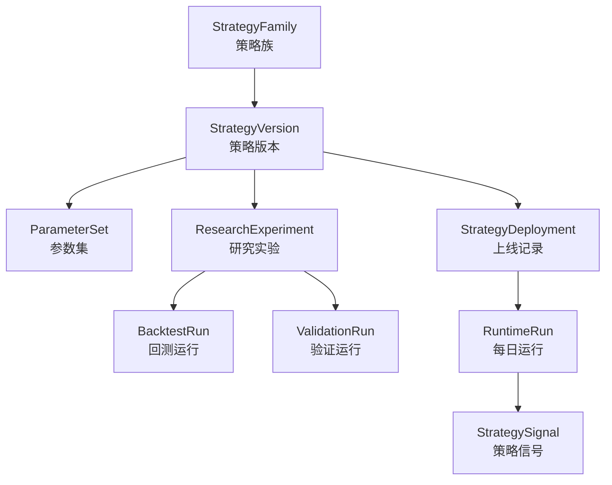
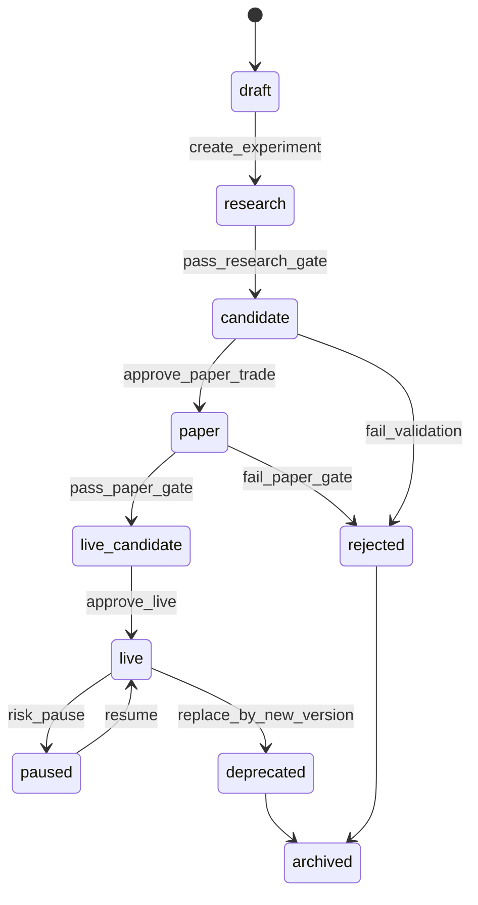
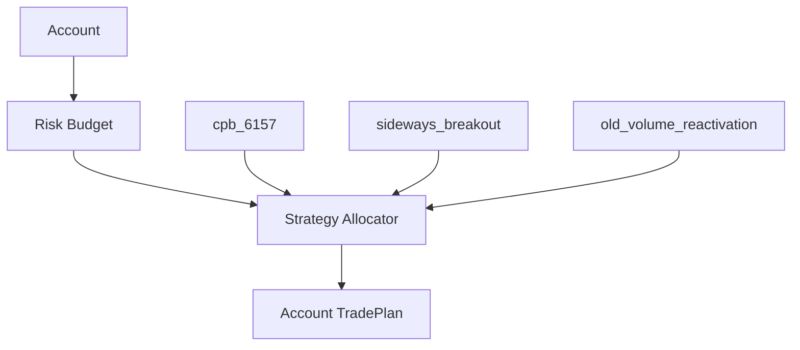

# PGC 策略扩展与版本治理设计

日期：2026-05-03

## 1. 设计目标

策略治理要解决四个问题：

1. 当前实盘到底使用哪套策略？
2. 参数变化后，历史回测和实盘记录是否仍能复现？
3. 新策略如何从研究进入模拟盘，再进入实盘？
4. 多策略并存时，如何避免信号、资金、绩效串在一起？

核心原则：

- 策略名不是版本，参数集也不是版本，必须有独立 `strategy_version`。
- 实盘运行中的策略版本不可修改，只能新建版本。
- 每次回测、模拟、实盘运行都必须绑定策略版本、参数 hash、数据快照。
- Agent 过滤、横盘突破、老票放量都算独立策略版本或策略族，不允许混入 `cpb_6157` 原版结果。
- 策略上线必须经过研究、验证、模拟盘门禁。

## 2. 概念模型



## 3. 策略族

`StrategyFamily` 表示一类方法，不等于具体可运行版本。

示例：

| strategy_family_id | 说明 |
| --- | --- |
| `contracting_pullback` | 缩量回调后一根阳线 |
| `sideways_breakout` | 横盘震荡突破 |
| `old_volume_reactivation` | 老票放量再激活 |
| `agent_filtered_cpb` | Agent 风险过滤版缩量回调 |

字段：

- `id`
- `family_key`
- `name`
- `description`
- `owner`
- `created_at`
- `status`

状态：

- `researching`
- `active`
- `paused`
- `retired`

## 4. 策略版本

`StrategyVersion` 是系统真正运行的单位。

示例：

| strategy_version | 含义 |
| --- | --- |
| `cpb_6157@2026-05-03` | 当前最优缩量回调阳线版本 |
| `cpb_6157_t1_exit@2026-05-03` | 同信号但 T+1 退出实验版 |
| `cpb_6157_agent_filter_v1@2026-06-01` | Agent 风险过滤版 |
| `sideways_breakout_v1@2026-06-15` | 横盘突破第一版 |

字段：

- `id`
- `strategy_family_id`
- `strategy_key`
- `strategy_version`
- `code_version`
- `params_hash`
- `entry_policy_id`
- `exit_policy_id`
- `position_policy_id`
- `status`
- `created_at`
- `promoted_at`
- `deprecated_at`

关键规则：

- 修改任何参数，新建版本。
- 修改入场逻辑，新建版本。
- 修改退出逻辑，新建版本。
- 修改仓位逻辑，新建版本。
- 修改 Agent 是否参与，新建版本。
- 同一个 `strategy_version` 的结果必须永远可复现。

## 5. 参数集

`ParameterSet` 独立保存，避免参数散落在脚本里。

当前 `cpb_6157` 参数：

```json
{
  "variant_id": "cpb_6157",
  "contract_max": 0.95,
  "avg_amount_max": 0.95,
  "min_drawdown": 0.025,
  "max_drawdown": 0.14,
  "bull_body_min": 0.012,
  "close_recover_min": 0.0,
  "pct_chg_min": 0.0,
  "trigger_amount_max": 1.3,
  "max_entry_runup": 0.18,
  "max_age_trading_days": 20,
  "min_entry_price": 10.0
}
```

字段：

- `id`
- `strategy_version_id`
- `params_json`
- `params_hash`
- `created_at`

hash 规则：

- JSON key 排序；
- 数值精度固定；
- UTF-8 编码；
- SHA-256。

## 6. 策略生命周期



状态说明：

| 状态 | 含义 |
| --- | --- |
| `draft` | 只定义想法，还未系统研究 |
| `research` | 参数搜索、样本内分析 |
| `candidate` | 通过初筛，进入走前验证 |
| `paper` | 模拟盘运行 |
| `live_candidate` | 准备实盘，等待人工批准 |
| `live` | 实盘可用 |
| `paused` | 暂停新开仓 |
| `deprecated` | 被新版本替代，只处理旧持仓 |
| `rejected` | 未通过验证 |
| `archived` | 归档只读 |

## 7. 上线门禁

### Research Gate

从 `research` 到 `candidate` 必须满足：

- 明确原始数据边界；
- 无未来函数；
- 有参数 JSON 和 hash；
- 有信号级回测；
- 有每日一只回测；
- 有训练期和验证期拆分；
- 有失败案例清单。

### Validation Gate

从 `candidate` 到 `paper` 必须满足：

- 验证期表现不明显劣化；
- 样本数达到最低要求；
- P25 风险可接受；
- 最大亏损可解释；
- 交易频率符合账户容量；
- 数据质量检查通过。

建议首版阈值：

| 指标 | 要求 |
| --- | --- |
| 验证期样本 | `>= 10` |
| 验证期胜率 | `>= 55%` |
| 验证期中位收益 | `> 0` |
| 验证期 P25 | `>-5%` |
| 单笔最大亏损 | 可解释，且不超过策略风险上限 |

### Paper Gate

从 `paper` 到 `live_candidate` 必须满足：

- 至少 10 笔模拟盘；
- 模拟盘执行偏差可接受；
- 无连续重大数据质量错误；
- 手工流程能执行；
- 每日计划和持仓状态稳定。

### Live Gate

从 `live_candidate` 到 `live` 必须人工批准：

- 账户；
- 最大仓位；
- 单仓金额；
- 启用日期；
- 是否启用 Agent 复核；
- 是否只提示不自动跳过。

## 8. 运行记录

每次运行必须生成 `RuntimeRun`。

字段：

- `id`
- `strategy_version_id`
- `run_type`
- `as_of_date`
- `raw_import_batch_id`
- `market_fetch_run_id`
- `feature_run_id`
- `account_id`
- `status`
- `created_at`

`run_type`：

- `research`
- `backtest`
- `validation`
- `paper`
- `live`

关键规则：

- 回测运行不能写入实盘账户。
- 实盘运行不能读取回测账户作为当前持仓。
- 同一天多次运行保留多条记录，以最后发布的 `trade_plan` 为 active。

## 9. 回测与验证

### BacktestRun

字段：

- `id`
- `strategy_version_id`
- `runtime_run_id`
- `sample_start_date`
- `sample_end_date`
- `train_end_date`
- `validation_start_date`
- `validation_end_date`
- `metrics_json`
- `report_path`
- `created_at`

必须记录：

- 样本范围；
- 行情数据截止日；
- raw event 数据版本；
- 是否每日最多一只；
- 是否最多 3 仓；
- 是否计手续费/滑点；
- 退出规则。

### ValidationRun

独立于参数搜索，不允许用验证结果继续调参后仍称同一验证。

规则：

- 如果看了验证结果后改参数，新版本重新开始。
- 验证期不能和训练期混用。
- 4 月验证结果必须标记为 `validation_202604`，不能混入全样本标签。

## 10. Agent 过滤版本治理

TradingAgents 如果参与交易决策，有两种模式：

### Advisory Mode

只显示意见，不改变交易计划。

策略版本仍为：

- `cpb_6157@2026-05-03`

Agent 运行单独进入：

- `agent_runs`
- `agent_decisions`

### Filter Mode

Agent 结果影响跳过、降仓或排序。

必须创建新策略版本：

- `cpb_6157_agent_filter_v1@YYYY-MM-DD`

并且必须重新回测：

- 有 Agent 输出的历史样本；
- 无未来数据；
- 保存 input snapshot；
- 保存 agent config hash；
- 对比 baseline。

禁止：

- 在原 `cpb_6157` 实盘版本里悄悄加入 Agent 过滤。
- 用 Agent 后验结论重写历史 signal。

## 11. 多策略扩展

未来可能并存：

- `cpb_6157`
- `sideways_breakout_v1`
- `old_volume_reactivation_v1`
- `cpb_6157_agent_filter_v1`

### 多策略信号冲突

冲突情况：

- 同一天多个策略都出信号；
- 同一只股票被多个策略命中；
- 账户只有一个空仓位；
- 某策略信号和已有持仓重叠。

解决方式：

1. 每个策略先生成自己的 `daily_pick`。
2. `StrategyAllocator` 再跨策略排序。
3. 最终生成账户级 `trade_plan`。

### 跨策略排序字段

- 策略优先级；
- 信号 score；
- 策略近期表现；
- 风险预算；
- 是否已有同股票持仓；
- 是否同板块过度集中；
- Agent 风险备注。

首版建议：

- 只启用一个 live 策略；
- 多策略先只在 paper 账户跑；
- 等样本足够再做资金分配。

## 12. 资金分配治理

首版：

- 最大持仓 3；
- 等仓；
- 单策略 `cpb_6157`。

未来多策略：



资金分配字段：

- `strategy_version_id`
- `account_id`
- `max_slots`
- `max_capital_pct`
- `priority`
- `enabled`
- `effective_from`
- `effective_to`

规则：

- 改资金分配不改策略版本，但必须生成 allocation version。
- 资金分配变化只影响未来计划。
- 不回写历史交易。

## 13. 策略表现归因

绩效必须按层拆：

| 维度 | 说明 |
| --- | --- |
| 信号表现 | 买点本身是否有效 |
| 组合表现 | 最多 3 仓、跳过冲突后的表现 |
| 执行表现 | 真实成交相对模型价格的滑点 |
| Agent 表现 | Agent 支持/谨慎/拒绝后的后验收益 |
| 账户表现 | 真实资金曲线 |

禁止：

- 用账户收益反推信号胜率。
- 用回测收益冒充实盘收益。
- 用 Agent 后验表现覆盖策略原始表现。

## 14. 策略报告标准

每个策略版本必须有报告：

```text
reports/strategies/
  cpb_6157@2026-05-03/
    spec.md
    params.json
    research_report.md
    backtest_report.md
    validation_report.md
    paper_report.md
    promotion_decision.md
```

报告必须包含：

- 策略定义；
- 参数；
- 数据范围；
- 样本数；
- 训练/验证拆分；
- 回测口径；
- 组合约束；
- 是否使用 Agent；
- 上线状态；
- 风险提示。

## 15. 策略版本不变量

系统必须长期满足：

1. live 策略版本不可变。
2. 参数变化必须新建版本。
3. 退出规则变化必须新建版本。
4. 入场规则变化必须新建版本。
5. Agent 从 advisory 变 filter 必须新建版本。
6. 每个 signal 必须引用 strategy version。
7. 每个 trade plan 必须引用 signal。
8. 每个账户资金曲线必须能归因到策略版本和实际成交。
9. rejected 策略不能生成 live trade plan。
10. deprecated 策略不能开新仓，只能处理旧持仓。

## 16. 当前建议

当前系统应保持：

- live/paper 主策略：`cpb_6157@2026-05-03`
- Agent 模式：`advisory`
- 账户：`paper_200k`
- 最大持仓：3
- 仓位：等仓
- 退出：T+2 判断，T+5 兜底

下一批研究可以作为新策略族或新版本：

- `sideways_breakout_v1`
- `cpb_6157_t1_exit_v1`
- `cpb_6157_agent_filter_v1`
- `old_volume_reactivation_v1`

这些都不应覆盖当前 `cpb_6157@2026-05-03`。
