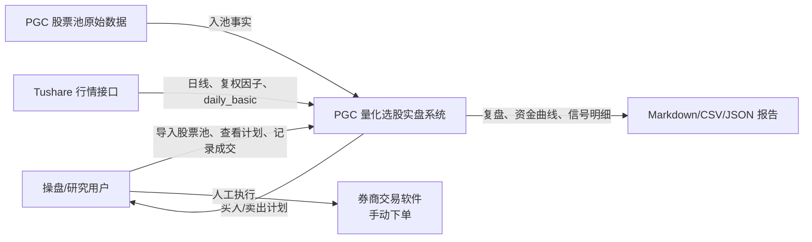
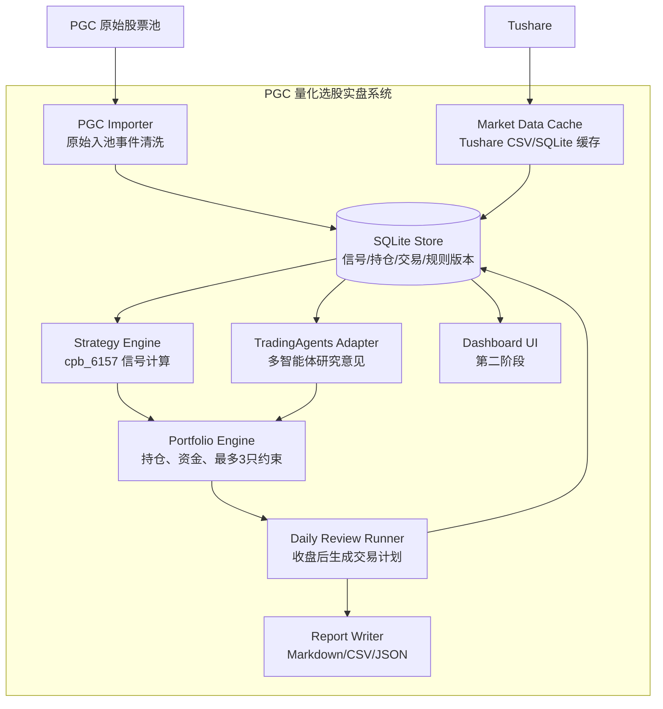
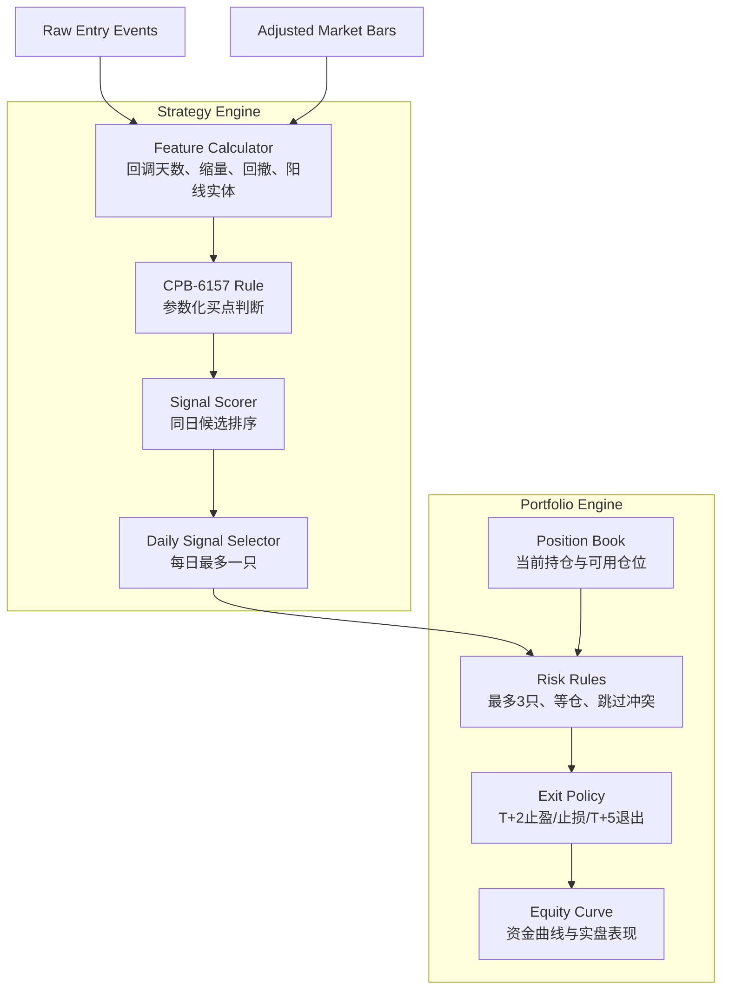
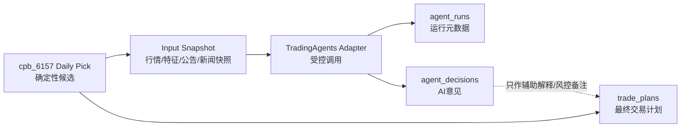
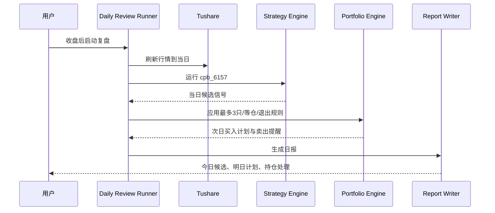

# PGC 量化选股实盘系统设计

日期：2026-05-03

## 1. 当前定位

当前项目已经从“PGC 入池事件研究”推进到第一版可模拟实盘的短线策略：

- 原始事实只使用 `ts_code`、`code`、`name`、`entry_date`、`entry_time`、`entry_price`。
- 行情、复权、成交额等全部通过 Tushare 缓存重算。
- 不使用 `bull_prob`、`bull_reason`、`latest_ret`、`max_high` 等可能带未来信息或派生信息的字段作为信号。
- 当前实盘策略采用 `cpb_6157`：PGC 入池后 20 个交易日内，缩量回调后一根阳线确认，次日开盘买入。
- 组合规则：初始资金可配置，最多同时 3 只，等仓，T+2 尾盘判断，未触发止盈止损则持有到 T+5。

系统目标不是自动下单，而是每日收盘后给出可审计、可复盘、可追踪的交易计划。

## 2. 第一版系统目标

1. 每日导入或更新 PGC 股票池原始入池事件。
2. 每日收盘后刷新 PGC 股票池内股票的 Tushare 行情缓存。
3. 基于 `cpb_6157` 计算当日候选信号。
4. 每个复盘日最多输出一只买入候选。
5. 结合账户、持仓、最多 3 只约束，生成次日交易计划。
6. 跟踪买入、T+2 判断、T+5 退出、实盘盈亏。
7. 持续生成回测、模拟盘、实盘三套结果，避免混淆。

非目标：

- 首版不自动下单。
- 首版不做分钟线或盘中盯盘。
- 首版不做多策略自动优化。
- 首版不引入微服务。

## 3. 核心交易规则

### cpb_6157 买点参数

| 条件 | 参数 |
| --- | --- |
| 入池后观察期 | 20 个交易日内 |
| 入池价格过滤 | `entry_price >= 10` |
| 回调天数 | 2 到 6 天 |
| 回调缩量 | 回调末日成交额 / 回调首日成交额 `<= 0.95` |
| 回调均量 | 回调均额 / 10 日均额 `<= 0.95` |
| 从入池后高点回撤 | `2.5%` 到 `14%` |
| 阳线实体 | `>= 1.2%` |
| 阳线涨跌幅 | `>= 0%` |
| 阳线收复前收 | `>= 0%` |
| 阳线成交额 | `<= 1.3 * 10 日均额` |
| 入池后触发日前涨幅 | `<= 18%` |

### 组合规则

| 项目 | 规则 |
| --- | --- |
| 初始资金 | 可配置，当前示例为 200000 |
| 最大持仓数 | 3 |
| 仓位 | 等仓三份，空闲仓位才允许买新票 |
| 买入 | 复盘日 S 收盘确认，S+1 开盘买入 |
| T+2 止盈 | 相对买入开盘价 `>= +3%`，T+2 尾盘卖出 |
| T+2 止损 | 相对买入开盘价 `<= -3%`，T+2 尾盘卖出 |
| 中间态 | `-3% < T+2收益 < +3%`，持有到 T+5 尾盘退出 |
| 信号冲突 | 同一复盘日只保留评分最高的一只 |
| 仓位冲突 | 开盘前若已有 3 只未退出，跳过新信号 |

## 4. C4 Level 1 - System Context



## 5. C4 Level 2 - Container



## 6. C4 Level 3 - Strategy/Portfolio Components



## 7. TradingAgents 集成边界

TradingAgents 是外部多智能体 LLM 金融交易框架。根据官方仓库，它包含 analyst、researcher、trader、risk management、portfolio manager 等角色，并通过 `TradingAgentsGraph` 运行分析。它支持 CLI 和包内调用，示例入口为：

```python
from tradingagents.graph.trading_graph import TradingAgentsGraph
from tradingagents.default_config import DEFAULT_CONFIG

ta = TradingAgentsGraph(debug=True, config=DEFAULT_CONFIG.copy())
_, decision = ta.propagate("NVDA", "2026-01-15")
```

系统集成时必须遵守以下边界：

1. TradingAgents 只作为“AI 研究意见层”，不作为确定性买点信号源。
2. `cpb_6157`、行情特征、回测、仓位和交易账本仍由本系统掌控。
3. TradingAgents 的输出只能写入 `agent_runs`、`agent_artifacts`、`agent_decisions`，不能直接覆盖 `signals`、`positions`、`trades`。
4. TradingAgents 对某个股票的建议必须带上 `agent_run_id`、`model_config_hash`、`input_snapshot_id`、`as_of_date`，否则不可进入交易计划。
5. TradingAgents 的 results/cache/memory 必须放入项目内受控目录，不能默认散落到用户 Home。

建议的环境变量：

```bash
TRADINGAGENTS_RESULTS_DIR=/Users/azboo/Desktop/Person/pgc/data/agents/tradingagents/results
TRADINGAGENTS_CACHE_DIR=/Users/azboo/Desktop/Person/pgc/data/agents/tradingagents/cache
TRADINGAGENTS_MEMORY_LOG_PATH=/Users/azboo/Desktop/Person/pgc/data/agents/tradingagents/memory/trading_memory.md
```

### 集成分层



### 两阶段使用策略

第一阶段：只对“每日最高分候选”调用 TradingAgents，输出风险摘要、支持/反对理由、是否建议人工复核。最终买卖仍按 `cpb_6157 + T+2` 执行。

第二阶段：当样本积累足够后，研究 TradingAgents 输出是否能作为过滤器，例如：

- AI 风险评分过高时跳过；
- AI 只用于降低仓位；
- AI 只在多个候选分数接近时辅助排序。

禁止事项：

- 禁止让 LLM 直接生成买入名单覆盖 `cpb_6157`。
- 禁止把 LLM 的自然语言理由写进原始事件表。
- 禁止在没有 run/version/input snapshot 的情况下引用 agent 结果。
- 禁止把 TradingAgents 自带 memory 当作本系统唯一历史记录。

## 8. 数据组织原则

为了避免“串数据”，系统数据分为六层，每层只能向下一层引用，不能反向污染：

| 层级 | 目录/表 | 内容 | 是否可改写 |
| --- | --- | --- | --- |
| Raw | `raw_events`、`data/pgc_pool.json` | PGC 入池事实 | 不改写，只追加/去重 |
| Market | `market_bars`、`data/tushare/*` | 行情、复权、成交额 | 可刷新，但必须按来源和日期覆盖 |
| Feature | `features_json` | 由 Raw + Market 计算出的特征 | 可按 run 复算 |
| Signal | `signals` | 策略命中、评分、每日 pick | 不手改，随 strategy_run 生成 |
| Agent | `agent_runs`、`agent_decisions` | TradingAgents 输出 | 独立保存，只能引用 signal |
| Portfolio | `trades`、`positions`、`exits`、`equity_snapshots` | 模拟盘/实盘交易状态 | 只由交易流程写入 |

关键约束：

- 每次策略运行必须有 `strategy_run_id`。
- 每次 TradingAgents 运行必须有 `agent_run_id`。
- 每次交易计划必须引用 `signal_id`，可选引用 `agent_decision_id`。
- 实盘成交必须单独记录 `executed_price`、`executed_date`、`shares`，不能用模型价格覆盖真实成交。
- 回测、模拟盘、实盘必须通过 `portfolio_accounts.account_type` 区分。

## 9. 推荐数据模型

首版建议使用 SQLite，保留 CSV 作为导出物，不再让 CSV 成为唯一状态源。

### raw_events

原始入池事实。

- `id`
- `ts_code`
- `code`
- `name`
- `entry_date`
- `entry_time`
- `entry_price`
- `source`
- `created_at`

### market_bars

复权后的日线行情缓存。

- `ts_code`
- `trade_date`
- `open`
- `high`
- `low`
- `close`
- `amount`
- `adj_factor`
- `adj_open`
- `adj_high`
- `adj_low`
- `adj_close`

### strategy_runs

每次策略运行。

- `id`
- `strategy_id`
- `strategy_version`
- `as_of_date`
- `params_json`
- `created_at`

### signals

策略信号。

- `id`
- `run_id`
- `event_id`
- `ts_code`
- `review_date`
- `buy_date`
- `score`
- `features_json`
- `is_daily_pick`
- `created_at`

### input_snapshots

传给策略或 TradingAgents 的输入快照。用于保证后续复现“当时看到了什么”。

- `id`
- `as_of_date`
- `snapshot_type`
- `source_refs_json`
- `content_hash`
- `created_at`

### agent_runs

TradingAgents 或后续其他智能体的一次运行。

- `id`
- `agent_system`
- `agent_version`
- `signal_id`
- `input_snapshot_id`
- `as_of_date`
- `config_json`
- `config_hash`
- `status`
- `started_at`
- `finished_at`

### agent_artifacts

智能体运行产生的报告、日志、完整 state、checkpoint 路径等。

- `id`
- `agent_run_id`
- `artifact_type`
- `path`
- `content_hash`
- `created_at`

### agent_decisions

智能体最终意见，结构化保存，避免只剩自然语言。

- `id`
- `agent_run_id`
- `signal_id`
- `action`
- `confidence`
- `risk_level`
- `summary`
- `raw_decision_json`
- `created_at`

### portfolio_accounts

账户配置。

- `id`
- `name`
- `initial_cash`
- `max_positions`
- `position_sizing`
- `created_at`

### trades

模拟盘或实盘交易记录。

- `id`
- `account_id`
- `signal_id`
- `agent_decision_id`
- `ts_code`
- `name`
- `side`
- `planned_date`
- `executed_date`
- `price`
- `amount`
- `shares`
- `status`
- `source`

### trade_plans

每日交易计划。计划可以引用 agent 意见，但最终动作仍由组合规则确认。

- `id`
- `account_id`
- `signal_id`
- `agent_decision_id`
- `as_of_date`
- `planned_buy_date`
- `action`
- `reason`
- `plan_json`
- `status`

### positions

当前持仓。

- `id`
- `account_id`
- `ts_code`
- `name`
- `buy_date`
- `buy_price`
- `shares`
- `cost`
- `planned_t2_date`
- `planned_t5_date`
- `status`

### exits

卖出判断和执行结果。

- `id`
- `position_id`
- `decision_date`
- `decision_stage`
- `ret`
- `reason`
- `planned_exit_date`
- `executed_exit_date`
- `executed_price`

### equity_snapshots

每日资金快照。

- `id`
- `account_id`
- `as_of_date`
- `cash`
- `market_value`
- `total_equity`
- `realized_pnl`
- `unrealized_pnl`

## 8. 每日运行流程



## 9. ADR-001 - 使用模块化单体

### Context

当前系统主要复杂度在数据边界、策略可追溯、组合约束和每日复盘流程，不在高并发或服务隔离。

### Options

- 继续纯脚本和 CSV。
- 模块化单体。
- 微服务。

### Decision

采用模块化单体。脚本可以保留，但核心逻辑逐步迁移到 `src/` 模块。

### Consequences

正向：本地运行简单，便于快速实盘验证，后续可拆 API/UI。  
负向：需要一次模块边界整理，不能继续让每个研究脚本复制一份逻辑。

## 10. ADR-002 - SQLite 作为首版状态库

### Context

实盘系统必须记录账户、持仓、计划、执行和资金曲线。CSV 不适合做状态源。

### Options

- 继续 CSV。
- SQLite。
- PostgreSQL。

### Decision

首版采用 SQLite，文件放在 `data/pgc_trading.db`。CSV/Markdown 作为导出和查看层。

### Consequences

正向：部署成本低，事务一致性比 CSV 好，便于本地备份。  
负向：多人协作或远程部署时需要迁移 PostgreSQL。

## 11. ADR-003 - 实盘与回测分账

### Context

回测收益、模拟盘收益、真实成交收益不能混在同一张表，否则后续复盘会失真。

### Options

- 共用一套交易表，用字段区分。
- 拆成完全不同的数据模型。
- 共用交易模型，但通过 `account.type` 和 `trade.source` 区分。

### Decision

共用交易模型，通过账户类型和交易来源区分：`backtest`、`paper`、`live`。

### Consequences

正向：同一套资金曲线逻辑可复用。  
负向：查询时必须显式过滤账户类型。

## 12. ADR-004 - TradingAgents 作为外部研究层接入

### Context

TradingAgents 提供多智能体研究、辩论、交易和风险管理流程，适合扩展系统的解释能力和人工复核能力。但它是 LLM 驱动，存在非确定性、外部 API、缓存和 memory 副作用，不适合作为首版确定性买点核心。

### Options

- 直接让 TradingAgents 生成买卖信号。
- 完全不接入 TradingAgents。
- 作为独立研究意见层接入，只引用、不覆盖核心策略。

### Decision

采用第三种。TradingAgents 运行结果只写入 agent 专用表，最终交易计划仍由确定性策略和组合规则生成。

### Consequences

正向：能扩展新闻、基本面、情绪和多智能体风险讨论，同时保护回测和实盘账本的可追溯性。  
负向：需要维护 adapter、输入快照、结果解析和模型配置版本。

## 13. 推荐目录结构

```text
src/
  pgc_trading/
    config.py
    cli.py
    ingestion/
      pgc_importer.py
      tushare_cache.py
    market/
      repository.py
      calendar.py
    strategies/
      cpb_6157.py
      scoring.py
    agents/
      tradingagents_adapter.py
      input_snapshot.py
      decision_parser.py
    portfolio/
      account.py
      positions.py
      exits.py
      equity.py
    storage/
      schema.sql
      database.py
      repositories.py
    reporting/
      daily_review.py
      trade_plan.py
tests/
  test_cpb_6157.py
  test_tradingagents_adapter.py
  test_portfolio_engine.py
  test_daily_review.py
scripts/
  run_daily_review.py
  run_agent_review.py
  init_trading_db.py
data/
  pgc_trading.db
  agents/
    tradingagents/
      cache/
      results/
      memory/
  exports/
reports/
```

## 14. MVP 实施路线

### Milestone 1 - 系统化当前策略

- 把 `cpb_6157` 从研究脚本抽成独立策略模块。
- 增加统一配置：初始资金、最多持仓、止盈止损、T+5 退出。
- 增加每日运行入口：输出明日买入计划和当前持仓卖出提醒。

### Milestone 2 - SQLite 状态库

- 建 schema。
- 导入 raw events 和 Tushare 缓存元数据。
- 建账户、持仓、交易、资金快照表。

### Milestone 3 - 模拟盘闭环

- 支持记录“计划买入”和“实际成交”。
- 每日收盘后自动更新持仓状态。
- 输出资金曲线和未完成动作。

### Milestone 4 - 实盘辅助

- 每日生成 `live_trade_plan.md`。
- 记录人工买入/卖出价格。
- 对比模型计划收益与真实成交收益。

### Milestone 5 - Dashboard

- 本地 Web 看板展示：今日候选、当前持仓、退出计划、资金曲线、历史交易。

### Milestone 6 - TradingAgents 接入

- 用独立虚拟环境或可选依赖安装 TradingAgents。
- 新增 `run_agent_review.py`，只对每日最高分候选运行。
- 固定 `TRADINGAGENTS_RESULTS_DIR`、`TRADINGAGENTS_CACHE_DIR`、`TRADINGAGENTS_MEMORY_LOG_PATH`。
- 解析 TradingAgents 输出并写入 `agent_runs`、`agent_artifacts`、`agent_decisions`。
- 在日报中显示 AI 风险意见，但不自动改变交易动作。

## 15. 当前下一步

建议先做最小实盘系统，不急着做完整 UI：

1. 新增 `src/pgc_trading` 模块结构。
2. 新增 SQLite schema 和初始化脚本。
3. 把 `cpb_6157` 策略固化成可复用函数。
4. 新增 `run_daily_review.py`，每天收盘后一键输出：
   - 明日是否买入；
   - 买哪一只；
   - 当前持仓 T+2/T+5 应如何处理；
   - 当前账户资金和仓位；
   - 被跳过信号及原因。
5. 再接 TradingAgents adapter，先只做候选复核，不做信号源。
