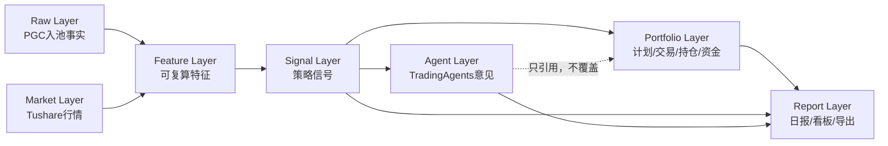
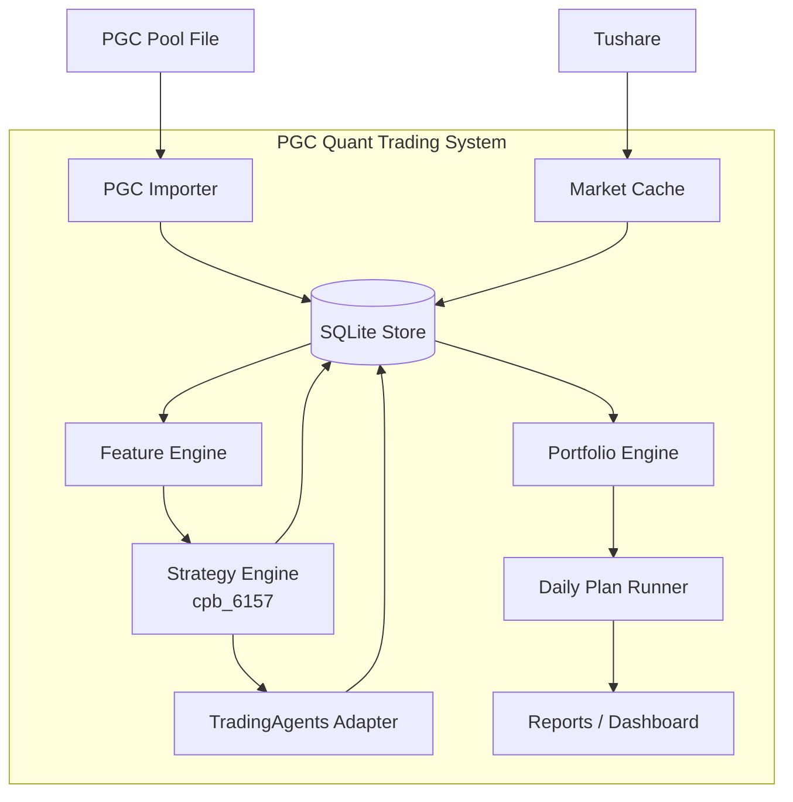
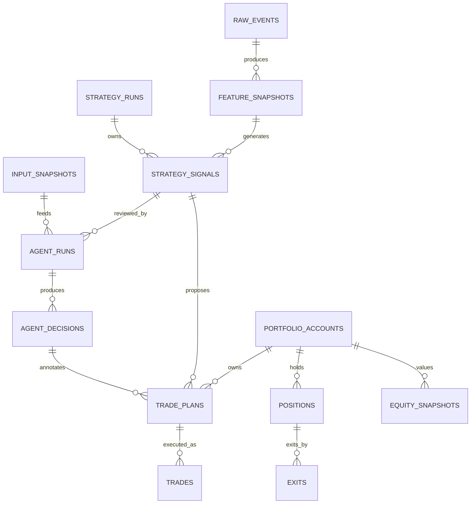

# PGC 量化选股系统设计 Superpower 版

日期：2026-05-03

## 0. 设计结论

系统采用“确定性策略内核 + Agent 研究辅助 + 独立组合账本”的架构。

核心原则：

- PGC 原始入池事实永远不被策略、Agent、交易结果反写。
- 行情数据、特征数据、策略信号、Agent 意见、交易账本分层存储。
- `cpb_6157` 是第一版确定性买点策略。
- TradingAgents 只作为研究和风控辅助，不直接产生最终买卖动作。
- 回测、模拟盘、实盘必须分账户、分账本、分结果。
- 每个结果都必须能追溯到 `raw_event_id`、`strategy_run_id`、`input_snapshot_id`、`agent_run_id`、`account_id`。

## 1. 系统边界

### 系统要做

1. 导入 PGC 股票池原始事件。
2. 拉取并缓存 Tushare 行情。
3. 计算入池后的技术结构和买点特征。
4. 运行 `cpb_6157` 策略，生成候选信号。
5. 每日最多选一只。
6. 根据账户资金和最多 3 只持仓约束生成交易计划。
7. T+2 尾盘判断止盈/止损，中间态持有到 T+5。
8. 可选调用 TradingAgents，对候选票做研究复核。
9. 记录回测、模拟盘、实盘表现。
10. 输出日报、交易计划、持仓处理、资金曲线。

### 系统不做

1. 首版不自动下单。
2. 首版不做分钟线盘中交易。
3. 首版不让 LLM 直接覆盖策略信号。
4. 首版不把研究数据、实盘成交和回测收益混在同一张结果表里。

## 2. 数据分层

系统数据按不可逆方向流动：



### 分层规则

| 层 | 数据 | 写入者 | 是否允许被下游反写 |
| --- | --- | --- | --- |
| Raw | PGC 入池事实 | Importer | 不允许 |
| Market | 日线、复权、成交额 | Market Adapter | 不允许被策略改写 |
| Feature | 回调、缩量、阳线、回撤等 | Feature Engine | 可按版本复算 |
| Signal | 策略命中、评分、每日 pick | Strategy Engine | 不允许手工改 |
| Agent | TradingAgents 研究意见 | Agent Adapter | 不允许覆盖 Signal |
| Portfolio | 交易计划、成交、持仓、资金 | Portfolio Engine / 人工成交录入 | 不允许写回 Signal |
| Report | Markdown/JSON/UI | Reporting | 只读展示 |

## 3. 领域对象

### RawEvent

PGC 入池事实，是所有研究的起点。

关键字段：

- `raw_event_id`
- `ts_code`
- `code`
- `name`
- `entry_date`
- `entry_time`
- `entry_price`
- `source_file`
- `imported_at`

禁止字段：

- `bull_prob`
- `bull_reason`
- `latest_ret`
- `max_high`
- `status`
- 任何未来表现字段

### MarketBar

交易日行情。

关键字段：

- `ts_code`
- `trade_date`
- `open`
- `high`
- `low`
- `close`
- `amount`
- `adj_factor`
- `adj_open`
- `adj_high`
- `adj_low`
- `adj_close`
- `source`
- `fetched_at`

### FeatureSnapshot

某次运行中，针对某个入池事件和某个复盘日计算出的特征。

关键字段：

- `feature_snapshot_id`
- `raw_event_id`
- `ts_code`
- `review_date`
- `strategy_version`
- `features_json`
- `input_hash`

### StrategySignal

确定性策略产生的买点信号。

关键字段：

- `signal_id`
- `strategy_run_id`
- `raw_event_id`
- `feature_snapshot_id`
- `strategy_id`
- `strategy_version`
- `review_date`
- `planned_buy_date`
- `score`
- `is_daily_pick`
- `signal_status`

### AgentOpinion

TradingAgents 或未来其他 Agent 给出的研究意见。

关键字段：

- `agent_decision_id`
- `agent_run_id`
- `signal_id`
- `input_snapshot_id`
- `action`
- `confidence`
- `risk_level`
- `summary`
- `raw_output_path`

### TradePlan

每日交易计划。

关键字段：

- `trade_plan_id`
- `account_id`
- `signal_id`
- `agent_decision_id`
- `as_of_date`
- `planned_buy_date`
- `action`
- `reason`
- `plan_json`
- `status`

### TradeExecution

真实或模拟成交。

关键字段：

- `trade_id`
- `account_id`
- `trade_plan_id`
- `signal_id`
- `side`
- `planned_date`
- `executed_date`
- `executed_price`
- `shares`
- `amount`
- `source`

### Position

账户当前持仓。

关键字段：

- `position_id`
- `account_id`
- `signal_id`
- `ts_code`
- `buy_date`
- `buy_price`
- `shares`
- `cost`
- `planned_t2_date`
- `planned_t5_date`
- `status`

### EquitySnapshot

账户每日资产。

关键字段：

- `account_id`
- `as_of_date`
- `cash`
- `market_value`
- `total_equity`
- `realized_pnl`
- `unrealized_pnl`

## 4. 策略内核

首版策略：`cpb_6157`

### 买点参数

| 条件 | 参数 |
| --- | --- |
| 入池后观察期 | 20 个交易日内 |
| 入池价格 | `entry_price >= 10` |
| 回调天数 | 2 到 6 天 |
| 回调缩量 | 末日成交额 / 首日成交额 `<= 0.95` |
| 回调均量 | 回调均额 / 10 日均额 `<= 0.95` |
| 高点回撤 | `2.5%` 到 `14%` |
| 阳线实体 | `>= 1.2%` |
| 阳线涨跌幅 | `>= 0%` |
| 阳线收复前收 | `>= 0%` |
| 阳线成交额 | `<= 1.3 * 10日均额` |
| 入池后触发日前涨幅 | `<= 18%` |

### 策略输出

策略只输出：

- 候选信号；
- 信号评分；
- 每日最高分 pick；
- 特征解释；
- 计划买入日期。

策略不输出：

- 实盘成交；
- 持仓；
- 资金；
- Agent 意见；
- 人工判断。

## 5. 组合规则

账户配置：

- 初始资金可配置，当前模拟账户 200000。
- 最多同时持有 3 只。
- 每个空闲仓位等仓买入。
- 开盘前若无空闲仓位，跳过新信号。

退出规则：

- 买入日记为 T。
- T+2 尾盘收益 `>= +3%`，止盈卖出。
- T+2 尾盘收益 `<= -3%`，止损卖出。
- `-3% < T+2收益 < +3%`，持有到 T+5 尾盘退出。

## 6. TradingAgents 集成设计

TradingAgents 定位为“研究助理”，不是“交易决策主引擎”。

### 输入边界

TradingAgents 只接收受控的 `InputSnapshot`：

- 候选股票；
- 复盘日期；
- 策略特征；
- 历史行情摘要；
- 可选公告/新闻/财务摘要；
- 当前组合状态摘要。

禁止直接把整个数据库、实盘交易账本、历史错误字段丢给 Agent。

### 输出边界

TradingAgents 输出结构化保存：

- `action`: `support` / `caution` / `reject` / `review_required`
- `confidence`
- `risk_level`
- `summary`
- `supporting_points`
- `risk_points`
- `raw_decision_json`
- `artifact_paths`

Agent 输出只影响“人工复核提示”和“未来研究过滤器”，首版不自动改变交易动作。

### Agent 目录隔离

```text
data/agents/tradingagents/
  cache/
  results/
  memory/
```

禁止 TradingAgents 默认结果散落到用户 Home 或项目外目录。

## 7. 系统容器



## 8. 每日流程

### 收盘后

1. 刷新 PGC 原始入池事件。
2. 刷新 Tushare 行情到最新交易日。
3. 运行 Feature Engine。
4. 运行 `cpb_6157`。
5. 生成当日候选。
6. 每日只保留最高分一只。
7. 可选调用 TradingAgents 做研究复核。
8. 应用账户约束，生成明日交易计划。
9. 更新持仓 T+2/T+5 提醒。
10. 输出日报。

### 次日开盘后

1. 人工执行买入。
2. 录入真实成交价格和股数。
3. 系统生成持仓记录。
4. 系统生成 T+2/T+5 计划日期。

### T+2 收盘后

1. 计算持仓收益。
2. 判断止盈/止损/继续持有。
3. 生成卖出计划或继续持有计划。

### T+5 收盘后

1. 对中间态持仓执行退出。
2. 记录成交。
3. 更新资金曲线。

## 9. 数据库设计概要



## 10. 防串数据规则

### ID 规则

- `raw_event_id`：原始入池事件。
- `strategy_run_id`：一次策略运行。
- `feature_snapshot_id`：一次特征快照。
- `signal_id`：一个策略信号。
- `input_snapshot_id`：传给 Agent 的输入快照。
- `agent_run_id`：一次 Agent 运行。
- `agent_decision_id`：一次 Agent 结论。
- `trade_plan_id`：一条交易计划。
- `trade_id`：一笔真实或模拟成交。
- `position_id`：一个持仓生命周期。
- `account_id`：一个回测/模拟/实盘账户。

### 写入规则

- Raw 层只追加、不更新策略结果。
- Market 层只由行情适配器更新。
- Feature 层只由 Feature Engine 写入。
- Signal 层只由 Strategy Engine 写入。
- Agent 层只由 Agent Adapter 写入。
- Portfolio 层只由 Portfolio Engine 或人工成交录入写入。
- Report 层只读，不作为事实源。

### 账户隔离

账户类型必须显式区分：

- `backtest`: 回测账户
- `paper`: 模拟盘账户
- `live`: 实盘账户

所有资金曲线、交易记录、持仓查询必须带 `account_id`。

## 11. 文件组织

```text
data/
  raw/
    pgc_pool.json
  tushare/
    daily/
    adj_factor/
    daily_basic/
    trade_cal.csv
  agents/
    tradingagents/
      cache/
      results/
      memory/
  pgc_trading.db
  exports/

src/
  pgc_trading/
    ingestion/
    market/
    features/
    strategies/
      cpb_6157.py
    agents/
      tradingagents_adapter.py
    portfolio/
    storage/
    reporting/
    cli/

scripts/
  init_db.py
  run_daily_review.py
  run_agent_review.py
  record_trade.py

reports/
  live_trade_plan.md
  daily_review.md
  equity_curve.md
  agent_review.md
```

## 12. ADR

### ADR-001: 模块化单体

决定：首版采用模块化单体。

理由：当前复杂度来自策略、数据和账本边界，不来自并发。模块化单体足够清晰，也方便后续拆 API 和 UI。

### ADR-002: SQLite 首版状态库

决定：首版使用 SQLite。

理由：本地部署简单，事务比 CSV 可靠。后续多人协作或远程部署时迁移 PostgreSQL。

### ADR-003: TradingAgents 只做辅助研究层

决定：TradingAgents 不作为买卖信号主源。

理由：LLM 非确定性强，结果依赖 prompt、模型、外部数据和缓存。它可以做复核和解释，但不能污染确定性策略回测。

### ADR-004: 回测/模拟/实盘分账

决定：通过 `portfolio_accounts` 区分账户类型。

理由：同一策略在不同账户下结果不同，必须独立记录，不能混算。

## 13. MVP 顺序

### M1: 数据边界

- 定义 SQLite schema。
- 导入 raw events。
- 同步 Tushare 行情元数据。

### M2: 策略内核

- 抽出 `cpb_6157` 策略模块。
- 生成 feature snapshots。
- 生成 signals 和 daily pick。

### M3: 组合与计划

- 建 paper account。
- 支持最多 3 只、等仓、空仓位判断。
- 生成 `trade_plans`。

### M4: 成交与持仓

- 支持录入买入成交。
- 自动创建 position。
- T+2/T+5 生成卖出计划。

### M5: TradingAgents 复核

- 只对 daily pick 生成 input snapshot。
- 调用 TradingAgents。
- 保存 agent run、artifact、decision。
- 在日报展示 AI 风险备注。

### M6: Dashboard

- 当前信号。
- 当前持仓。
- 待执行动作。
- 资金曲线。
- 历史交易。
- Agent 风险复核。

## 14. 当前版本的关键保护线

1. LLM 不碰 Raw、Market、Signal 的确定性计算。
2. LLM 不直接下单。
3. 实盘成交不覆盖模型计划。
4. 交易计划不覆盖策略信号。
5. 报告不作为事实源。
6. 所有输出必须能追溯到输入快照和运行版本。

## 15. 详细设计文档

本设计稿是总蓝图，细节拆到多份子文档：

- `reports/database_lineage_design.md`：数据库、表职责、数据血缘、防串规则、迁移策略。
- `reports/tradingagents_protocol_design.md`：TradingAgents 输入快照、输出结构、运行状态、Artifact、Prompt 和安全边界。
- `reports/product_information_architecture.md`：产品导航、页面职责、操作流、UI 文案和界面防串规则。
- `reports/state_machine_event_flow_design.md`：交易计划、成交、持仓、退出、资金快照的状态机和事件流。
- `reports/strategy_version_governance_design.md`：策略族、策略版本、参数集、上线门禁、多策略扩展和资金分配治理。
- `reports/api_cli_contract_design.md`：CLI、HTTP API、Application Service、幂等、错误码和运行入口契约。
- `reports/database_schema_ddl_design.md`：目标 SQLite DDL、索引、约束、视图、迁移顺序和原型表迁移映射。
- `reports/operational_runbook_design.md`：收盘复盘、开盘执行、成交录入、T+2/T+5、异常处理和实盘启停 Runbook。
- `reports/testing_validation_design.md`：未来函数检测、策略回放、账户隔离、状态机、Agent 隔离和发布门禁测试体系。
- `reports/dashboard_interaction_detail_design.md`：Dashboard 页面字段、按钮状态、详情抽屉和端到端操作流。
- `reports/dashboard_visual_component_design.md`：Dashboard 视觉语义、组件规范、响应式、权限按钮和可访问性设计。
- `reports/development_implementation_roadmap.md`：从当前原型到生产系统的模块拆分、阶段计划、依赖顺序、验收矩阵和实施 ADR。
- `reports/implementation_ticket_breakdown_design.md`：M0-M10 工程票据拆解、依赖关系、验收标准、测试要求、回滚方式和开发红线。
- `reports/database_migration_execution_design.md`：M1 数据库迁移执行方案、legacy freeze、SQL migration 顺序、旧数据搬迁、invariant 验证和回滚策略。
- `reports/application_service_interface_design.md`：Application Service 方法签名、DTO、幂等协议、事务边界、repository 规则、CLI/API 映射和服务层 ADR。
- `reports/implementation_baseline_20260504.md`：开发实施前的 M0 基线记录、数据库备份、脚本归类、数据资产、策略参数 hash 和敏感信息规则。
- `docs/plans/2026-05-04-pgc-parallel-task-supervision.md`：多子对话并行实施分包、文件所有权、质量门禁、监督清单、集成顺序和子对话提示模板。
