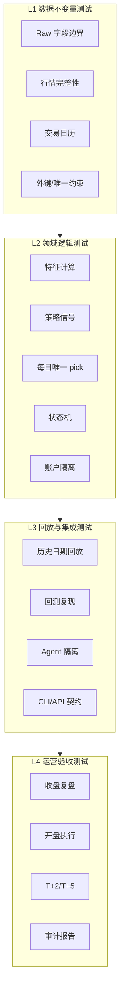

# PGC 测试与验证体系设计

日期：2026-05-03

## 1. 设计目标

测试体系的目标不是简单追求覆盖率，而是证明系统在关键交易风险上不会犯错。

必须重点证明：

1. 策略没有使用未来函数；
2. 原始 PGC 入池事实没有被污染；
3. 行情、特征、信号、Agent、计划、成交、持仓、资金没有串层；
4. 回测、模拟盘、实盘没有串账户；
5. 交易计划不会被误当成成交；
6. 成交录入前不会生成持仓；
7. T+2/T+5 严格按交易日历推进；
8. Agent 失败或输出异常不会污染确定性策略；
9. 策略版本、参数 hash、输入快照可以复现；
10. 重复执行不会重复建仓。

核心原则：

- 先测不变量，再测收益表现。
- 先测数据边界，再测策略效果。
- 先证明“不会串”，再证明“能赚钱”。
- 回测指标必须绑定样本、参数、数据快照和策略版本。
- 所有测试都必须可以离线复跑，不依赖当天外部服务。

## 2. 测试分层



验收顺序：

1. L1 不通过，不能跑策略。
2. L2 不通过，不能生成计划。
3. L3 不通过，不能进入模拟盘。
4. L4 不通过，不能进入实盘。

## 3. 测试数据组织

### Fixture 目录

建议结构：

```text
tests/fixtures/
  raw/
    pgc_events_clean.json
    pgc_events_dirty_future_fields.json
    pgc_events_duplicate.json
  market/
    trade_calendar_202604.csv
    daily_bars_minimal/
    daily_bars_missing_candidate/
    daily_bars_with_future_leak/
  strategy/
    cpb_6157_positive_case.json
    cpb_6157_negative_cases.json
    cpb_6157_expected_signals.json
  portfolio/
    account_empty.json
    account_full_positions.json
    account_with_t2_due.json
    account_with_t5_due.json
  agent/
    input_snapshot_valid.json
    input_snapshot_with_future_ret.json
    agent_decision_support.json
    agent_decision_invalid_json.txt
```

### Golden 数据

Golden 数据用于保证策略和回测结果可复现。

建议保留：

- `cpb_6157@2026-05-03` 参数 JSON；
- 固定 raw events 子集；
- 固定 market bars 子集；
- 固定 trade calendar；
- 预期 feature snapshots；
- 预期 strategy signals；
- 预期 daily picks；
- 预期 T+2/T+5 退出结果。

Golden 数据不得包含：

- Tushare token；
- 券商账号；
- 真实账户敏感流水；
- 未来收益字段作为策略输入。

## 4. 未来函数检测

未来函数测试是最高优先级。

### 特征输入边界测试

目标：任意 `review_date = S` 的特征只能读取 `<= S` 的行情。

测试场景：

| 场景 | 构造 | 预期 |
| --- | --- | --- |
| 正常 | 行情只到 `S` | 特征计算成功 |
| 未来行情存在 | 行情含 `S+1`，但 as_of 为 `S` | 特征输入 hash 不包含 `S+1` |
| 缺少 S 行情 | 候选股票无 `S` | 阻断或 invalid_insufficient_data |
| T+2 结果列混入 | raw 或 features 含未来收益 | 阻断并写 data quality |

### 数据快照 hash 测试

每次特征计算必须生成 `input_hash`。

断言：

- 同一 raw event、同一 market bars、同一 feature version，hash 一致；
- 添加 `S+1` 行情不会改变 `review_date = S` 的 hash；
- 修改 `S` 当日 close 或 amount 会改变 hash；
- 修改 feature version 会改变 hash。

### Agent 输入未来字段测试

Agent input snapshot 禁止包含：

- `future_ret`
- `t2_ret`
- `t5_ret`
- `max_future_high`
- `backtest_result`
- `win_label`
- 任何 `review_date` 之后的表现字段。

测试结果：

- 出现上述字段时拒绝创建 `input_snapshot`；
- 写入 `data_quality_events`；
- 不调用 TradingAgents。

## 5. Raw Layer 测试

### 原始事件字段白名单

允许字段：

- `ts_code`
- `code`
- `name`
- `entry_date`
- `entry_time`
- `entry_price`
- `source`

禁止字段：

- `bull_prob`
- `bull_reason`
- `latest_ret`
- `max_high`
- `status`
- 未来收益；
- 策略评分；
- 交易状态；
- Agent 意见。

断言：

- clean 文件导入成功；
- 含未来字段文件导入失败或标记 blocker；
- 重复事件不重复导入；
- 脏数据标记为 `is_valid = 0`，不参与策略。

### 隆化科技脏数据回归测试

目标：确保已识别脏数据不会重新进入研究样本。

断言：

- 该条事件如果再次出现在 raw 文件中，必须被标记 invalid；
- 不生成 feature snapshot；
- 不生成 strategy signal；
- 不进入 backtest 样本；
- data quality 报告显示原因。

## 6. Market Layer 测试

### 行情完整性测试

检查：

- 有效 raw events 的观察窗口行情完整；
- `market_bars` 中 `high >= low`；
- `high >= open/close`；
- `low <= open/close`；
- `amount >= 0`；
- `trade_date` 存在于 `trade_calendar`。

阻断：

- 候选股票缺少 `review_date` 行情；
- 交易日历缺少 S+1、T+2、T+5；
- close 为 0 或空。

### 交易日历测试

必须覆盖：

- 普通连续交易日；
- 周末；
- 法定节假日；
- 长假前后；
- 买入日 T 到 T+2；
- T+2 中间态到 T+5。

断言：

- T+2 是买入后第 2 个交易日；
- T+5 是买入后第 5 个交易日；
- 不使用自然日；
- 交易日历缺失时阻断退出评估。

## 7. Feature 与 Strategy 测试

### `cpb_6157` 参数锁定测试

当前参数：

```json
{
  "variant_id": "cpb_6157",
  "contract_max": 0.95,
  "avg_amount_max": 0.95,
  "min_drawdown": 0.025,
  "max_drawdown": 0.14,
  "bull_body_min": 0.012,
  "close_recover_min": 0.0,
  "pct_chg_min": 0.0,
  "trigger_amount_max": 1.3,
  "max_entry_runup": 0.18,
  "max_age_trading_days": 20,
  "min_entry_price": 10.0
}
```

断言：

- 参数 JSON 排序后 hash 固定；
- 修改任一参数必须生成新 hash；
- hash 变化必须对应新 `strategy_version`；
- 旧回测结果不能被新参数覆盖。

### 策略命中测试

构造固定 K 线样本：

| 样本 | 条件 | 预期 |
| --- | --- | --- |
| positive_pullback_bull | 缩量回调后一根阳线 | 命中 |
| too_old_after_entry | 入池超过 20 个交易日 | 不命中 |
| no_contract_volume | 回调不缩量 | 不命中 |
| drawdown_too_small | 回撤小于 2.5% | 不命中 |
| drawdown_too_large | 回撤大于 14% | 不命中 |
| bull_body_too_small | 阳线实体不足 1.2% | 不命中 |
| trigger_volume_too_high | 阳线成交额过大 | 不命中 |
| entry_price_too_low | 入池价小于 10 | 不命中 |
| entry_runup_too_high | 入池后涨幅超过 18% | 不命中 |

断言：

- 每个样本输出明确 `signal_status`；
- 不命中必须有 reason；
- 命中特征值和预期值一致；
- 分数排序稳定。

### 每日唯一 pick 测试

场景：

- 同日 0 个信号；
- 同日 1 个信号；
- 同日多个信号；
- 同一股票多次入池；
- 同一 raw event 重复运行。

断言：

- 同一 `strategy_run_id + review_date` 最多一条 daily pick；
- 多信号时选最高分；
- 平分时使用稳定 tie-breaker；
- 重复运行不会覆盖旧 run；
- 报告引用具体 `strategy_run_id`，不引用“最新”。

## 8. 回测与复现测试

### 回测复现测试

固定数据集下，`cpb_6157@2026-05-03` 必须复现已知结果。

断言：

- 信号级样本数一致；
- 每日一只样本数一致；
- 每笔明细的 `review_date`、`planned_buy_date`、`ts_code` 一致；
- T+2/T+5 日期一致；
- 收益计算一致；
- 指标中位数、胜率在精度范围内一致。

### 训练期与验证期隔离测试

断言：

- 参数搜索只能读取训练期；
- 验证期只用于评估；
- 验证期结果不能反写参数；
- 新参数必须生成新策略版本；
- 研究报告必须标记 sample type。

### 回测账户隔离测试

断言：

- 回测交易写入 `backtest_trades`；
- 回测交易不写入 `trades`；
- 回测账户不出现在 live 持仓查询；
- live 账户不读取 backtest equity。

## 9. Portfolio 与状态机测试

### TradePlan 测试

状态转移：

| 当前状态 | 动作 | 预期 |
| --- | --- | --- |
| `draft` | publish | `active` |
| `active` | record trade | `executed` |
| `active` | manual cancel | `cancelled` |
| `active` | expire | `expired` |
| `executed` | cancel | 拒绝 |
| `expired` | record trade | 拒绝 |

断言：

- 计划不是成交；
- 计划不能创建持仓；
- 取消必须有原因；
- 过期计划不能次日继续使用。

### TradeExecution 测试

断言：

- live 成交必须有 `executed_date`、`executed_price`、`shares`；
- paper model 成交必须标记 `source = paper_model`；
- 重复提交同一幂等键不会重复创建 trade；
- 修正成交不覆盖原成交；
- 冲销成交写入 domain event。

### Position 测试

断言：

- 买入成交后才创建 position；
- position 必须有 `entry_trade_id`；
- 没有卖出成交不能 closed；
- 部分卖出变 `partially_closed`；
- 卖出全部后变 `closed`；
- 冲销买入后变 `cancelled`。

### ExitDecision 测试

场景：

| 场景 | T+2 收益 | 预期 |
| --- | --- | --- |
| take profit | `>= +3%` | 生成止盈卖出计划 |
| stop loss | `<= -3%` | 生成止损卖出计划 |
| middle | `-3% < ret < +3%` | 持有到 T+5 |
| t5 due | 到 T+5 未平仓 | 生成到期退出 |
| manual override | 人工提前卖出 | 记录覆盖事件 |

断言：

- ret 基于真实或模拟买入价；
- 不基于计划价；
- 不基于回测价；
- T+2/T+5 来自交易日历；
- 每个 exit decision 都引用 position。

## 10. Account 隔离测试

测试矩阵：

| 操作 | backtest | paper | live |
| --- | --- | --- | --- |
| strategy run | 允许 | 允许 | 允许 |
| trade plan | 研究可选 | 允许 | 允许 |
| model trade | 允许写 backtest_trades | 允许 paper_model | 禁止 |
| manual trade | 禁止 | 允许 | 允许 |
| broker import | 禁止 | 可选 | 允许 |
| current positions | 独立 | 独立 | 独立 |
| equity curve | 独立 | 独立 | 独立 |

断言：

- 查询持仓必须带 `account_id`；
- 资金曲线必须带 `account_id`；
- paper 计划不能录入 live 成交；
- live 成交不能引用 backtest trade；
- daily report 必须显示账户类型。

## 11. Agent 隔离测试

### InputSnapshot 测试

断言：

- Agent 只能读取 `payload_json`；
- `payload_json` 有 source refs；
- 不含未来收益；
- 不含 Tushare token；
- 不含券商账户；
- 不含全库 dump。

### AgentDecision 测试

断言：

- `action` 只能是合法枚举；
- `confidence` 在 0 到 1；
- `risk_level` 合法；
- 输出无效 JSON 时 agent run 失败；
- Agent 失败不影响 daily pick；
- Agent 失败不影响 trade plan 生成；
- Agent decision 不能更新 `strategy_signals`。

### Agent filter 测试

首版 `agent_policy = advisory`。

断言：

- `agent_decision.action = reject` 时不自动跳过；
- 只有 `strategy_versions.agent_policy = filter` 才允许 Agent 改变计划；
- filter 模式必须是新策略版本；
- filter 模式必须有独立回测。

## 12. CLI/API 契约测试

### 通用响应测试

所有写操作响应必须包含：

- `status`
- `request_id`
- `created_ids`
- `warnings`
- `errors`
- `lineage`

失败响应必须包含：

- `error_code`
- `error_message`
- 可定位的 entity refs。

### 幂等测试

场景：

- 重复 raw import；
- 重复 market refresh；
- 重复 daily review；
- 重复 plan generate；
- 重复 trade record；
- 重复 exit evaluate。

断言：

- 相同 `idempotency_key` 返回同一结果或明确 skipped；
- 不重复创建 active trade plan；
- 不重复创建 position；
- 不重复创建 exit decision。

### Dry Run 测试

断言：

- `dry_run = true` 不写事实表；
- 仍返回将创建的计划预览；
- 仍执行数据质量检查；
- dry run 结果不能被 Dashboard 当成事实。

## 13. 日常运营场景测试

### 正常交易日

流程：

1. 导入 raw events；
2. 刷新行情；
3. 运行复盘；
4. 生成 daily pick；
5. 生成买入计划；
6. 发布计划；
7. 录入买入成交；
8. 自动创建 position；
9. 到 T+2 生成退出判断；
10. 录入卖出成交；
11. 更新 equity。

断言：

- 每一步都有 domain event；
- 日报能追溯全部 run id；
- 资金和持仓正确。

### 无信号交易日

断言：

- 不生成 daily pick；
- 不生成买入成交；
- 不生成持仓；
- 日报显示无信号；
- 不影响已有持仓 T+2/T+5。

### 仓位已满

断言：

- 仍生成策略信号；
- 生成 `skip_max_positions`；
- 不创建成交；
- 不创建新持仓；
- 日报显示跳过原因。

### 开盘未成交

断言：

- active plan 可转 expired 或 cancelled；
- 不创建持仓；
- 次日不能沿用旧计划；
- 人工原因写入 domain event。

### 数据质量 blocker

断言：

- 阻断 daily review 或 live plan；
- 写入 data quality event；
- 日报显示 blocker；
- 解决后可以重跑。

## 14. 数据库不变量测试

必须定期运行 SQL invariant checks。

### 示例检查

```sql
-- 持仓必须有买入成交
SELECT p.id
FROM positions p
LEFT JOIN trades t ON t.id = p.entry_trade_id
WHERE t.id IS NULL OR t.side <> 'buy';
```

```sql
-- 已关闭持仓必须有卖出成交
SELECT p.id
FROM positions p
LEFT JOIN trades t ON t.id = p.exit_trade_id
WHERE p.status = 'closed'
  AND (t.id IS NULL OR t.side <> 'sell');
```

```sql
-- Agent 决策不得写入策略信号
SELECT name
FROM pragma_table_info('strategy_signals')
WHERE name LIKE 'agent_%'
   OR name IN ('bull_prob', 'bull_reason');
```

```sql
-- live trades 不能来自 model
SELECT t.id
FROM trades t
JOIN portfolio_accounts a ON a.id = t.account_id
WHERE a.account_type = 'live'
  AND t.source IN ('model', 'paper_model');
```

```sql
-- daily pick 每个 strategy_run + review_date 最多一条
SELECT strategy_run_id, review_date, COUNT(*) AS n
FROM daily_picks
GROUP BY strategy_run_id, review_date
HAVING n > 1;
```

所有 invariant query 必须返回 0 行才算通过。

## 15. 发布门禁

### 开发提交门禁

必须通过：

- schema migration 测试；
- raw import 测试；
- feature no-future 测试；
- cpb_6157 golden signal 测试；
- state machine 测试；
- account isolation 测试；
- Agent isolation 测试。

### 策略版本门禁

必须通过：

- 参数 hash 固定；
- 训练期回测；
- 验证期回测；
- 每日一只回测；
- 失败案例清单；
- 无未来函数检测；
- 数据质量报告。

### 模拟盘门禁

必须通过：

- 至少 10 笔 paper trades；
- 无重复建仓；
- T+2/T+5 正常推进；
- 资金曲线和成交流水一致；
- 手工取消和异常处理有事件。

### 实盘门禁

必须通过：

- paper gate；
- live account dry run；
- 账户隔离测试；
- broker/manual 成交流程测试；
- 停机与暂停 Runbook 演练；
- 人工批准。

## 16. 测试运行建议

首版建议命令结构：

```bash
pytest tests/unit
pytest tests/integration
pytest tests/replay
pytest tests/invariants
```

建议测试目录：

```text
tests/
  unit/
    test_raw_import.py
    test_trade_calendar.py
    test_cpb_6157_features.py
    test_state_machines.py
  integration/
    test_daily_review_flow.py
    test_trade_record_flow.py
    test_exit_evaluate_flow.py
    test_agent_isolation.py
  replay/
    test_cpb_6157_golden_replay.py
    test_daily_one_pick_backtest.py
  invariants/
    test_database_invariants.py
  fixtures/
```

## 17. 失败处理策略

### 测试失败分级

| 级别 | 含义 | 处理 |
| --- | --- | --- |
| P0 | 未来函数、账户串、真实成交错误 | 立即阻断 |
| P1 | 状态机错误、幂等错误、T+2/T+5 错误 | 阻断发布 |
| P2 | 报表展示错误、Agent 失败处理不完整 | 阻断 Dashboard 发布 |
| P3 | 文案、非关键导出问题 | 排期修复 |

### P0 失败示例

- feature 读取了 `review_date` 之后行情；
- live 账户写入 model trade；
- 持仓没有 entry trade；
- Agent reject 自动取消计划但策略版本仍是 advisory；
- 回测交易进入 `trades`。

P0 必须：

1. 暂停新开仓；
2. 保留现场数据；
3. 生成 domain event；
4. 修复并补测试；
5. 重新跑 replay；
6. 人工确认恢复。

## 18. ADR

### ADR-TEST-001: 未来函数测试优先于收益测试

Context：短线策略最容易在回测阶段无意使用未来信息。收益再漂亮，只要有未来函数就不能交易。

Options：

- 先看收益指标；
- 先做未来函数和数据边界测试；
- 只靠人工检查代码。

Decision：未来函数和数据边界测试优先于收益测试。

Consequences：

- 好处：避免虚假高胜率进入实盘。
- 代价：需要维护 input hash、fixture 和 replay。
- 风险：测试数据不充分时仍可能漏检，所以需要结合代码审查。

### ADR-TEST-002: 回测交易和实盘交易分开验证

Context：回测交易是模型成交，实盘交易是真实成交。混在一起会导致账本和收益误判。

Options：

- 共用一套 trades 测试；
- 分别测试 `backtest_trades` 和 `trades`；
- 只测聚合收益。

Decision：分别测试回测交易和真实/模拟成交。

Consequences：

- 好处：账户边界清晰。
- 代价：测试用例更多。
- 风险：统一绩效页需要额外测试合并视图。

### ADR-TEST-003: Agent 必须有隔离测试

Context：TradingAgents 是非确定性外部系统，可能输出异常 JSON 或带有强主观结论。

Options：

- Agent 输出不测；
- 只测正常输出；
- 测正常、失败、越权字段和 filter 权限。

Decision：Agent 必须测试正常、失败、越权字段和 filter 权限。

Consequences：

- 好处：Agent 不会污染确定性策略和账本。
- 代价：需要 mock Agent 输出。
- 风险：真实外部工具行为仍需手工观察和 artifact 归档。

## 19. 验收标准

测试体系落地后必须满足：

1. 可以离线复跑 `cpb_6157@2026-05-03` golden replay。
2. 所有未来函数测试通过。
3. 所有数据库 invariant query 返回 0 行。
4. 重复运行每日复盘不会重复生成 active 计划。
5. 重复录入成交不会重复建仓。
6. live 账户不会出现 model trade。
7. Agent 失败不会影响策略信号和交易计划。
8. T+2/T+5 日期全部来自交易日历。
9. 回测结果可以追溯参数 hash 和输入 hash。
10. 实盘启用前必须通过 paper gate 和 live dry run。
