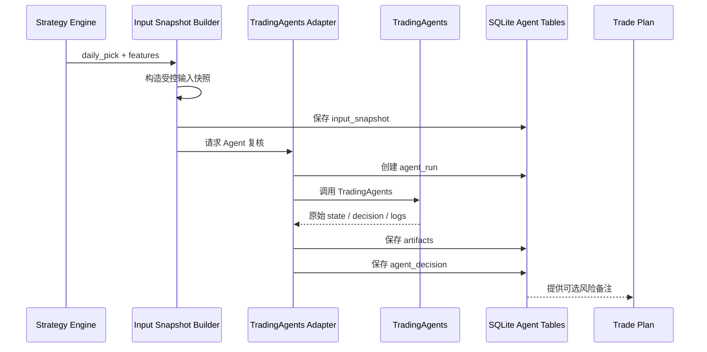
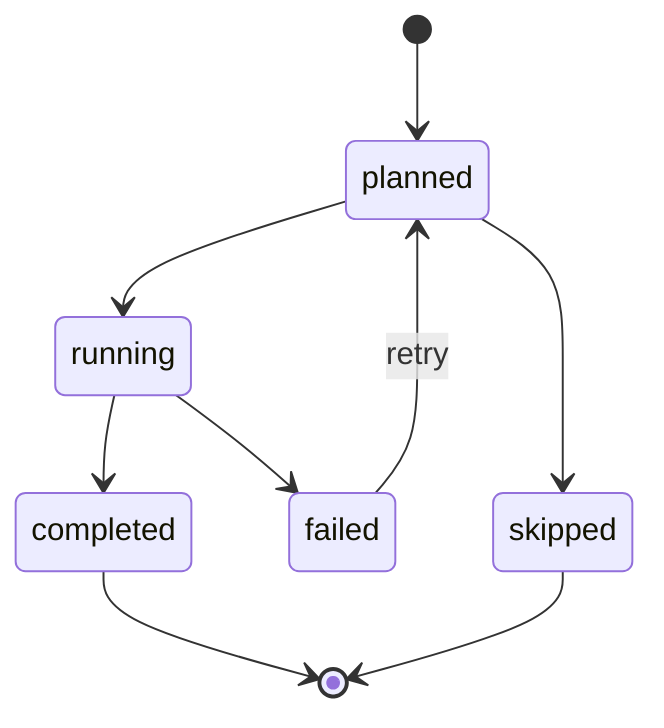

# TradingAgents 集成协议设计

日期：2026-05-03

## 1. 集成定位

TradingAgents 是外部多智能体研究系统，在本系统中定位为：

- 候选票研究复核；
- 新闻/公告/基本面/风险摘要；
- 多视角反方意见；
- 人工复盘辅助。

它不是：

- 确定性信号源；
- 回测收益来源；
- 持仓账本；
- 自动下单模块。

首版调用范围：

- 只对 `daily_pick` 调用；
- 每个复盘日最多调用一次；
- 输出只写入 Agent Layer；
- 交易计划可引用 Agent 意见，但不被 Agent 自动覆盖。

## 2. 集成模式



## 3. 输入快照协议

TradingAgents 不能直接读取整个数据库，只能读取 `InputSnapshot`。

### InputSnapshot JSON

```json
{
  "schema_version": "1.0",
  "snapshot_type": "tradingagents_candidate_review",
  "as_of_date": "20260430",
  "candidate": {
    "signal_id": 123,
    "strategy_id": "cpb_6157",
    "strategy_version": "2026-05-03",
    "ts_code": "300077.SZ",
    "name": "国民技术",
    "review_date": "20260430",
    "planned_buy_date": "20260506",
    "score": 130.5935
  },
  "raw_event": {
    "raw_event_id": 207,
    "entry_date": "20260422",
    "entry_time": null,
    "entry_price": 22.25
  },
  "features": {
    "pullback_days": 3,
    "amount_contract_ratio": 0.667,
    "avg_amount_to_ma10": 0.7899,
    "pullback_close_ret": -0.0399,
    "drawdown_from_peak": -0.0955,
    "bull_body": 0.0327,
    "close_recover": 0.0402,
    "trigger_pct_chg": 0.0402,
    "trigger_amount_to_ma10": 1.1055,
    "entry_runup": 0.0222
  },
  "market_summary": {
    "last_trade_date": "20260430",
    "last_close": 23.05,
    "recent_5d_ret": null,
    "recent_10d_ret": null,
    "volume_context": "contracting_pullback_then_bullish"
  },
  "portfolio_context": {
    "account_id": 1,
    "account_type": "paper",
    "max_positions": 3,
    "open_positions": 0,
    "free_slots": 3
  },
  "source_refs": [
    "raw_events:207",
    "strategy_signals:123",
    "market_bars:300077.SZ:20260430"
  ]
}
```

### 输入字段规则

必须包含：

- `schema_version`
- `snapshot_type`
- `as_of_date`
- `candidate`
- `features`
- `source_refs`

禁止包含：

- 未来收益；
- 已知回测结果；
- 未来 T+2/T+5 表现；
- 其他候选的未来表现；
- 实盘账户敏感信息；
- 未经清洗的原始大段 JSON。

可选包含：

- 公告摘要；
- 新闻摘要；
- 行业摘要；
- 财务摘要；
- 当前组合风险摘要。

## 4. A 股代码适配

TradingAgents 默认示例偏向美股 ticker。A 股接入必须经过 adapter，不直接假设 `300077.SZ` 能被默认工具正确识别。

适配策略：

1. 内部主键仍使用 Tushare `ts_code`，例如 `300077.SZ`。
2. Agent 展示名使用 `股票名 + ts_code`，例如 `国民技术 300077.SZ`。
3. 如果 TradingAgents 默认工具不支持 A 股，进入 `local_snapshot_mode`：
   - 不让 Agent 自行拉行情；
   - 只使用我们提供的行情摘要；
   - 可选接入中文公告/新闻工具。
4. Agent 输出必须回写原始 `ts_code`，不能用模糊 ticker。

## 5. AgentRun 配置协议

每次运行保存配置。

```json
{
  "agent_system": "TradingAgents",
  "agent_version": "external",
  "mode": "local_snapshot_mode",
  "online_tools": false,
  "deep_think_llm": "o4-mini",
  "quick_think_llm": "gpt-4o-mini",
  "max_debate_rounds": 1,
  "max_risk_discuss_rounds": 1,
  "results_dir": "data/agents/tradingagents/results",
  "cache_dir": "data/agents/tradingagents/cache",
  "memory_log_path": "data/agents/tradingagents/memory/trading_memory.md"
}
```

`config_hash` 计算规则：

- JSON 按 key 排序；
- UTF-8 编码；
- SHA-256。

用途：

- 同一候选不同模型配置可对比；
- 后续复盘可知道 Agent 当时怎么运行。

## 6. 输出协议

### AgentDecision JSON

```json
{
  "schema_version": "1.0",
  "agent_system": "TradingAgents",
  "signal_id": 123,
  "ts_code": "300077.SZ",
  "as_of_date": "20260430",
  "action": "caution",
  "confidence": 0.62,
  "risk_level": "medium",
  "summary": "技术形态符合策略，但节后跳空和公告扰动需要人工复核。",
  "supporting_points": [
    "缩量回调后阳线实体强",
    "入池后涨幅未过热",
    "成交额未明显放大到失控区间"
  ],
  "risk_points": [
    "节假日后开盘跳空风险",
    "创业板波动较高",
    "公告信息可能影响短线情绪"
  ],
  "suggested_human_checks": [
    "确认是否停牌或临停风险",
    "确认开盘是否大幅高开超过可接受滑点",
    "确认是否出现重大利空公告"
  ],
  "raw_output_ref": "agent_artifacts:456"
}
```

### 字段枚举

`action`：

- `support`: 支持执行原计划；
- `caution`: 可以执行，但需人工复核；
- `reject`: 强风险，不建议执行；
- `review_required`: 信息不足，必须人工判断；
- `no_opinion`: Agent 无有效意见。

`risk_level`：

- `low`
- `medium`
- `high`
- `unknown`

## 7. 交易计划如何引用 Agent

首版规则：

- `agent_decision.action = support`：日报显示支持，不改变买入计划。
- `agent_decision.action = caution`：日报显示黄色风险，不改变买入计划。
- `agent_decision.action = review_required`：日报提示人工复核，不改变买入计划。
- `agent_decision.action = reject`：首版不自动跳过，只要求人工确认。

后续如果要让 Agent 影响交易，必须先做独立回测：

- 比较有 Agent 过滤与无 Agent 过滤；
- 使用未来不可见数据隔离；
- 至少有走前验证样本；
- 新增策略版本号，例如 `cpb_6157_agent_filter_v1`。

## 8. Artifact 存储协议

目录：

```text
data/agents/tradingagents/
  results/
    20260430/
      300077.SZ/
        agent_run_000123_state.json
        agent_run_000123_decision.json
        agent_run_000123_report.md
        agent_run_000123_trace.log
  cache/
  memory/
    trading_memory.md
```

每个 artifact 入库：

- `agent_run_id`
- `artifact_type`
- `path`
- `content_hash`
- `created_at`

文件命名必须带：

- `as_of_date`
- `ts_code`
- `agent_run_id`

禁止：

- 覆盖旧文件；
- 只保存最终自然语言，不保存原始 state；
- 把 memory 当作唯一记录。

## 9. 运行状态机



失败处理：

- Agent 失败不影响确定性交易计划生成。
- 失败记录到 `agent_runs.error_message`。
- 日报显示“Agent 复核失败，按确定性策略执行/人工复核”。

## 10. Prompt 边界

Agent prompt 必须声明：

1. 你不是最终交易系统。
2. 你不能改变策略信号。
3. 你只能基于输入快照发表风险意见。
4. 不得编造未知行情或公告。
5. 不得引用未来表现。
6. 输出必须符合 JSON schema。

建议系统提示核心：

```text
你是 PGC 量化选股系统的研究复核 Agent。
你只能使用输入快照和显式提供的资料。
你不能生成最终买卖指令。
你的任务是指出支持因素、风险因素、人工复核项，并输出结构化 JSON。
```

## 11. 安全边界

禁止给 Agent：

- Tushare token；
- 券商账号；
- 实盘资金全量细节；
- 未脱敏日志；
- 全库 dump；
- 未来收益列；
- 其他策略未公开参数。

允许给 Agent：

- 候选票；
- 策略特征；
- 当日行情摘要；
- 组合空闲仓位数量；
- 非敏感公告/新闻摘要。

## 12. 验收标准

TradingAgents 接入完成后，必须满足：

1. 删除 Agent 输出后，确定性策略仍可完整运行。
2. Agent 失败后，交易计划仍可生成。
3. 每个 Agent 结论都能回查输入快照。
4. 每个 Agent 结论都有原始 artifact。
5. `signals` 表没有任何 Agent 写入字段。
6. `trades` 表不会因为 Agent 输出自动产生成交。
7. 日报明确区分“模型策略信号”和“AI 复核意见”。

## 13. 后续扩展

可以逐步增加：

- 公告抓取器；
- 新闻摘要器；
- 行业热度摘要；
- Agent 多轮辩论深度配置；
- Agent 风险评分回测；
- Agent 作为仓位调节器。

但每个扩展都必须新建输入快照和运行版本，不能直接改历史结论。
